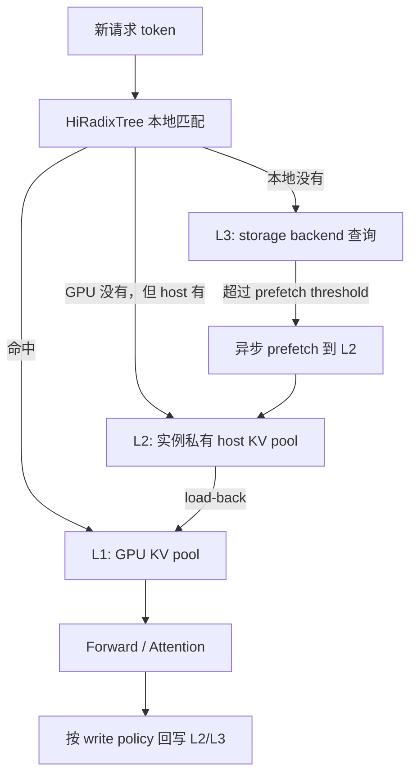
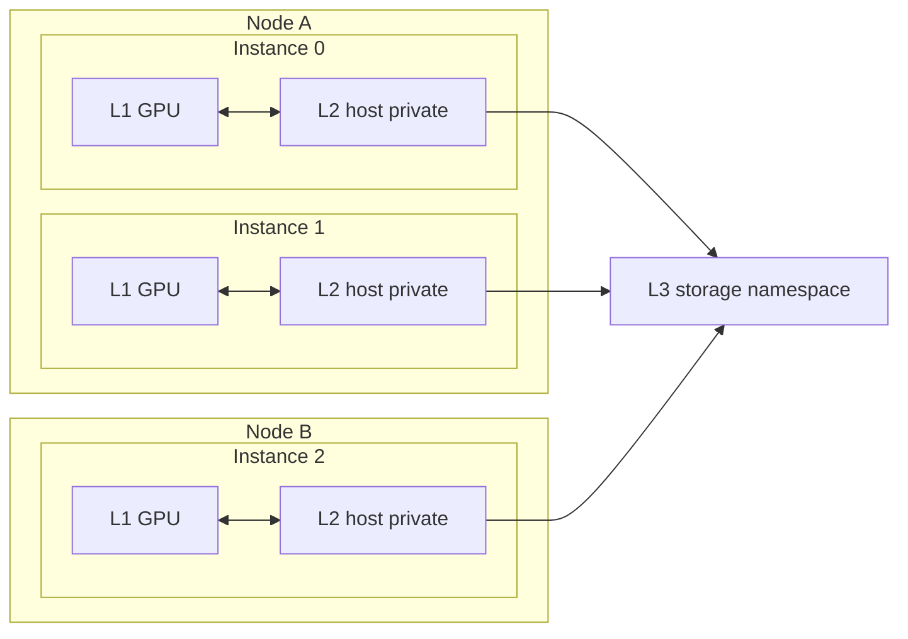
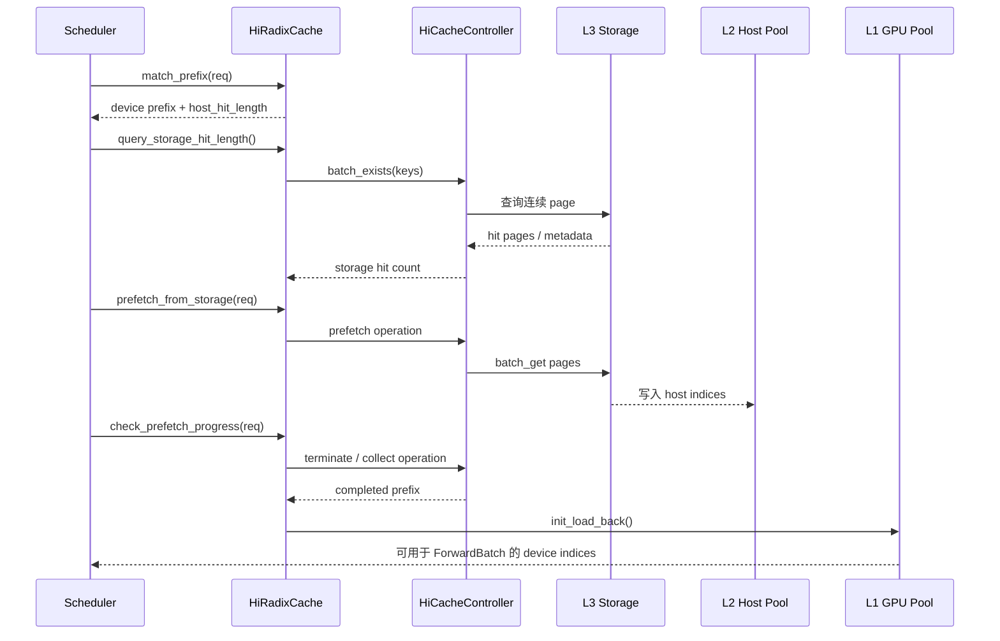
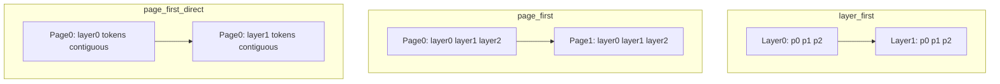
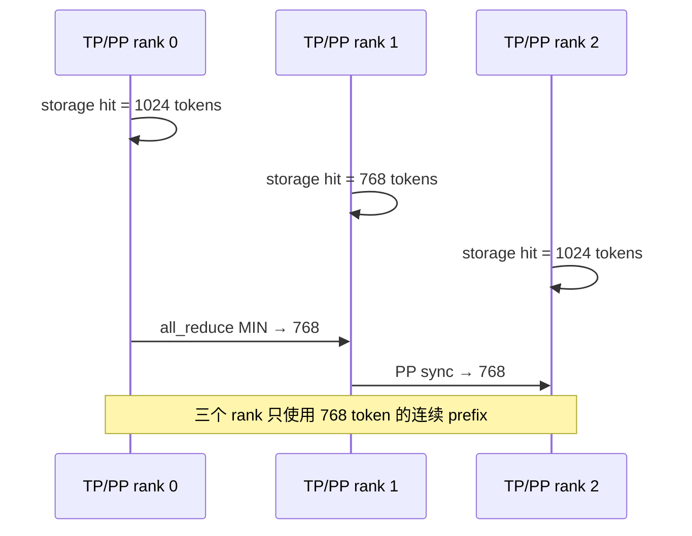
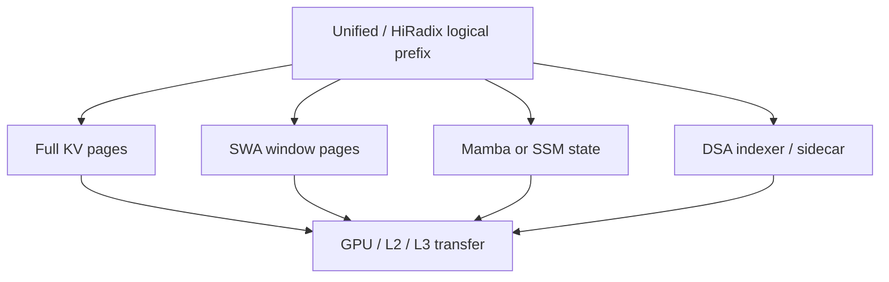
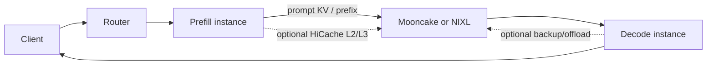

> 版本说明：本文基于 2026-09-11 拉取的 SGLang upstream，固定 commit 为 [`a4ff5634b82546679704c42c984d7f950203922e`](https://github.com/sgl-project/sglang/commit/a4ff5634b82546679704c42c984d7f950203922e)。文中的类名、函数名和参数只对这个版本负责。本文重点讨论 `HiRadixCache`、GPU/host 两级内存池和可选 L3 storage backend；统一缓存、Mamba/SSM、DSA 与 PD 分离会在对应章节标出额外边界。

## 1. 先把结论说清楚

HiCache 针对的是一个常见的容量问题：RadixAttention 会把共享前缀留在 GPU KV pool 里，但长上下文和多轮对话很快就能把显存占满。HiCache 在 radix cache 下面再接两层存储：CPU host memory 作为 L2，文件、Mooncake、HF3FS、NIXL 或 AIBrix 等 backend 作为 L3。



读代码时，可以先记住六个事实：

1. L1 是 GPU KV；L2 是一个 inference instance 私有的 host pool；L3 是否共享，取决于 backend 的部署和 namespace。
2. HiRadixTree 保存的是 token 段、树关系和每个节点所在介质的索引。L3 的详细位置通常不长期镜像在树里，查询时由 backend 返回。
3. 一次命中可能是混合的：前半段在 GPU，后半段在 host。`device_indices`、`host_hit_length` 和 `last_host_node` 要分开看。
4. L3 命中不会立刻变成 GPU prefix。先查询连续存在的 page，再把数据搬到 L2，最后按 GPU 容量 load-back。
5. prefetch 的收益要和等待、PCIe/NVLink、存储网络成本比较。`best_effort`、`wait_complete` 和 `timeout` 是不同的延迟策略。
6. write-through、selective write-through、write-back 决定的是数据什么时候从快层复制到慢层，不改变 radix tree 的 token 匹配规则。

这也是 HiCache 和“把 KV dump 到磁盘”之间的差别。它把匹配、容量、复制、并发和 scheduler admission 放在一条路径里处理。

## 2. 为什么单层 GPU prefix cache 不够

对一个生成请求，prompt 的每个 token 都会产生 K/V。decode 阶段每生成一个新 token，都要读取已有上下文的 K/V。假设模型有 $L$ 层，每层每 token 的 K/V 总宽度为 $D_{kv}$，数据类型占 $b$ 字节，那么单个 token 的 KV 大小近似为：

$$
\mathrm{KVBytesPerToken} = L \times D_{kv} \times b
$$

以 32 层、每 token 合计 4096 个 bf16 K/V 数值为例：

$$
32 \times 4096 \times 2 = 262144\ \text{bytes}
$$

16k token 的上下文大约需要 4 GiB KV。GQA、MLA、TP 分片和量化会改变这个数，但容量随 token 线性增长这一点不会变。

单层 GPU cache 的行为通常是：

```text
新请求到达
  ├─ GPU radix tree 命中 → 复用 prefix KV
  └─ GPU 没命中 → 重新 prefill

GPU KV pool 满了
  └─ 驱逐冷节点，后续请求只能重新计算
```

这个策略在短 prompt、低并发场景下足够。长上下文 agent、带固定 system prompt 的多轮对话、批量问答和重复文档检索则不同：被驱逐的前缀很可能过一会儿还会回来。HiCache 把“驱逐”拆成两个动作：

- 从 L1 驱逐到当前实例的 L2，保留可快速恢复的副本；
- 视 write policy 决定是否再写入 L3，让其他实例也有机会复用。

L2 和 L3 会带来额外成本：host memory、CPU/GPU copy，以及文件或网络 I/O。是否值得开启，要看 prefix reuse 能不能覆盖这些成本。

## 3. 三层的所有权和共享范围

官方设计把层次类比为 CPU cache，但工程上的共享边界更容易被误读：

| 层 | 介质 | 典型对象 | 共享范围 | 命中后的动作 |
| --- | --- | --- | --- | --- |
| L1 | GPU HBM | `TokenToKVPool`、device indices | 单个 inference instance | 直接把索引交给 attention |
| L2 | CPU DRAM / pinned host memory | `HostKVCache`、host indices | 单个 instance，通常是一个进程 | load-back 到 L1 |
| L3 | 文件、Mooncake、HF3FS、NIXL、AIBrix | `HiCacheStorage` backend | 由 backend namespace 和部署决定 | 先 prefetch 到 L2，再进入本地树 |



L2 不会因为两个 instance 在同一台机器上就自动共享。每个 instance 创建自己的 host pool，`--hicache-ratio` 或 `--hicache-size` 增大的是这个 instance 的私有容量。如果希望 Instance 0 写出的 prefix 被 Instance 1 读到，需要把数据送到 L3，并让两个实例使用相同的 backend 配置和命名空间。

文件 backend 默认使用 node-local 目录时，多个实例可能共享同一目录，但这不等于安全的跨实例协议。需要确认并发写入、文件锁、模型 namespace 和清理策略。Mooncake、HF3FS、NIXL 等 backend 是否跨节点共享，也取决于它们的服务和配置。

这条边界对排障很重要：同机实例 B 的 L2 miss，并不能证明 HiCache 没有缓存；它可能只是在等 L3，或者两个实例根本没有使用同一个 storage namespace。

## 4. HiRadixTree：树里到底存了什么

RadixAttention 的 radix tree 把连续 token 段组织成节点。根节点到某个节点的路径代表一个前缀；多个请求共享同一路径，就能共享对应的 KV。

HiCache 在这个结构上增加了介质状态。可以把节点简化成下面这样：

```python
class ConceptualHiNode:
    key                 # 一段 token / page 对齐后的 RadixKey
    parent, children    # 树关系
    value               # L1 device KV indices，可能为空
    host_value          # L2 host KV indices，可能为空
    evicted              # L1 是否已被驱逐
    backuped             # 是否有可恢复的 host 副本
    host_ref_counter     # host 数据是否仍被请求或异步操作引用
    lock_ref             # radix 节点是否被请求保护
```

实际字段分布在 `TreeNode`、`RadixCache` 和 `HiRadixCache`，这里的类只是帮助理解。L1 和 L2 的索引由各自 allocator 管理，树节点不会把 K/V 数值本身存成 Python 对象。

L3 的状态不完全复制到每个树节点。原因很实际：远端存储可能有很多对象，实时变化也可能很快。HiCache 在需要时把 token page 转成 backend key，然后通过 `HiCacheStorage.batch_exists_v2()` 之类的接口查询。

树里的状态大致分为三类：

| 节点状态 | `value` | `host_value` | 含义 |
| --- | --- | --- | --- |
| L1 resident | 有 | 可有可无 | GPU 可直接读 |
| L2 resident | 空或部分有 | 有 | GPU 已驱逐，host 仍有副本 |
| L3 only / unknown | 空 | 空或未加载 | 需要查询 backend |
| in-flight | 可能有 | 可能有 | write、load 或 prefetch 尚未完成 |

“L3 only / unknown”表示本地树没有完整的远端元数据，并不表示 L3 一定没有数据。scheduler 需要先问 backend，才能决定是否继续 prefetch。

### 4.1 page 对齐是树和存储的共同边界

`HiRadixCache.match_prefix()` 会先对 `RadixKey` 做 `page_aligned(page_size)`。这意味着命中和 I/O 通常以完整 page 为单位。

假设 `page_size=4`：

```text
已有 prefix: [p0 p1 p2 p3 p4 p5 p6 p7]
新请求:     [p0 p1 p2 p3 p4 p5 p6 p7 x0]
```

如果 scheduler 为 next-token logits 保留最后一个位置，传给 cache 的 key limit 可能只有 8 个 token；如果最后一个位置还没有形成完整 page，实际可复用边界可能落在 `p0..p3`。page 越大，索引和 I/O 越规整，短前缀的命中机会也越少。

在 L3 中，page 还是批量读写和 zero-copy 的单位。把 page size 当成纯 scheduler 参数，会漏掉存储布局和 DMA 代价。

## 5. 一次请求如何走完 L1/L2/L3 命中路径

下面用一个简化请求说明状态变化。假设：

```text
page_size = 4
请求 token = [a0 ... a31 b0 ... b15]
GPU L1 命中 a0 ... a15
host L2 命中 a16 ... a31
L3 可能存在 b0 ... b15
```

### 5.1 本地匹配

请求进入 scheduler 后，`Req.init_next_round_input()` 会调用 cache 的 prefix match。`HiRadixCache.match_prefix()` 返回的信息可以抽象为：

```python
MatchResult(
    device_indices = [slot_a0, ..., slot_a15],
    last_device_node = node_a15,
    last_host_node = node_a31,
    best_match_node = node_a31,
    host_hit_length = 16,
)
```

此时：

- `prefix_indices` 只包含 L1 的 device slots；
- `host_hit_length` 表示 L2 还有多少连续 token；
- `best_match_node` 是 load-back 或 storage prefetch 的锚点；
- GPU attention 还不能直接读取 `a16..a31`。

这就是“host 命中”和“设备前缀”必须分开记录的原因。文章前一篇 runtime 解析里提到的 `ReqKvInfo` 仍然适用，但 HiCache 会额外影响 request 的 host hit 和 load-back 预算。

### 5.2 从 L2 load-back 到 L1

`HiRadixCache.init_load_back()` 负责把被驱逐的 host 节点恢复到 GPU：

1. 从 `best_match_node` 向上找到仍在设备树中的 ancestor。
2. 对需要恢复的连续 host nodes 增加 lock，避免它们在复制期间被 host eviction。
3. 检查 `load_back_threshold` 和本轮 GPU memory quota。
4. 调用 `cache_controller.load()`，把 host indices 对应的数据搬到新的 device slots。
5. 把每个节点的 `value` 更新为新的 device indices，并记录 GPU store event。
6. 复制完成后释放 host protection，重新把终止节点加入保护路径。

如果 GPU 没有足够空间，代码会先尝试驱逐其他可回收 L1 节点，再重新 load。仍然失败时，`init_load_back()` 返回空结果，scheduler 会按重新 prefill 或延后请求处理。

小于 `load_back_threshold` 的 host span 可能被跳过。为几个 token 做一次 host-to-device 搬运，常常比直接重算更慢。

### 5.3 L3 storage prefetch

如果本地 L1/L2 的连续命中长度之后还有足够长的 suffix，`HiRadixCache.query_storage_hit_length()` 会先构造 page-aligned key，并调用 storage backend 查询命中长度。默认 `prefetch_threshold` 是 256 token；实际值可以放在 storage backend extra config 中调整。

预取流程可以画成这样：



`prefetch_from_storage()` 不会盲目为整个 suffix 分配 host 空间。当前实现会先查询命中的 page 数，再按实际命中量分配和提交，这样能减少 storage miss 带来的 host pool 浪费。

当 prefetch 正在进行时，scheduler 在下一轮 admission 中调用 `check_prefetch_progress(req_id)`。请求可能暂时跳过本轮，直到策略允许结束：

- `best_effort`：GPU 可以继续计算时就结束等待，已经取到的部分继续使用；
- `wait_complete`：等预取全部完成，命中率优先；
- `timeout`：按时间上限等待，适合有 TTFT SLO 的线上服务。

`timeout` 的默认线性公式是：

$$
\mathrm{timeout} = \min\left(\mathrm{max},\ \mathrm{base} + \mathrm{per\_ki\_token} \times \frac{N}{1024}\right)
$$

源码默认值是 `base=2s`、`per_ki_token=0.1s`、`max=30s`。它只规定 scheduler 最多等多久，不承诺实际吞吐。

### 5.4 prefetch 完成后才算“命中可用”

L3 backend 返回存在，不等于数据已经可以进入 attention。HiCache 还要处理：

- 多 rank 是否都拿到了相同的连续 prefix；
- Full KV 和 Mamba/SWA/DSA sidecar 是否同时存在；
- host pool 是否真的分配成功；
- backend 返回的是完整 page 还是中途失败；
- 取消的请求是否释放了临时 host reservation。

在 `HiRadixCache._handle_prefetch_result()` 中，最终可用 token 数会按 page 和 sidecar 的最小值裁剪。某个 rank 少一个 page，其他 rank 不能擅自使用更长的 prefix。

## 6. write-back：数据什么时候离开 GPU

HiCache 还要把 L1 里的 KV 放到 L2 或 L3。复制不会在每次 attention 后同步完成，而是由 cache 生命周期、写策略和异步队列共同决定。

### 6.1 L1 → L2

当 radix 节点因为 GPU 容量被驱逐时，`HiRadixCache.evict()` 根据 write policy 处理节点：

```text
节点仍被 request lock 引用？
  └─ 是：不能驱逐
节点没有 host 副本？
  ├─ write_back：需要驱逐时才复制到 L2
  └─ write_through：节点形成或访问时就可能已有 L2 副本
节点已有 host 副本？
  └─ 只释放 L1 value，保留 host_value
```

L2 host pool 保存的是 K/V 的 host indices，不是 Python tensor 的随意副本。`HostKVCache` 负责实际内存和索引分配，`HiCacheController.write()` 把 device indices 和 host indices 放入异步写队列。

### 6.2 L2 → L3

如果启用了 storage backend，`write_storage()` 把 host page 交给 `HiCacheStorage`。接口分为单项和批量版本，当前实现重点使用 page 批量接口：

```python
storage.batch_set_v2(
    transfers=[
        PoolTransfer(
            name=PoolName.KV,
            host_indices=host_indices,
            keys=page_keys,
        )
    ],
    extra_info=HiCacheStorageExtraInfo(...),
)
```

backend 层只需要实现查询、读、写和必要的释放/统计协议。上层不应该把 Mooncake、文件或 NIXL 的连接细节散落到 scheduler 中。

### 6.3 三种 write policy

| 策略 | 什么时候向慢层写 | 好处 | 代价 |
| --- | --- | --- | --- |
| `write_through` | 命中/插入后尽快写下一层 | L2/L3 副本新，跨实例复用快 | 写放大，带宽压力大 |
| `write_through_selective` | 达到访问次数阈值后写 | 只备份较热 prefix | 首次访问不会马上出现在慢层 |
| `write_back` | 上层驱逐时再写 | I/O 少，适合容量有限的 backend | 冷节点可能还没备份，跨实例命中滞后 |

这三种策略影响的是复制时机，不是 cache key 的匹配。`write_back` 下，节点从 L1 消失前如果没有成功写入 L2/L3，下一次请求仍可能只能重新 prefill。

## 7. 内存布局：为什么有 `layer_first` 和 `page_first`

GPU attention 通常按 layer 计算：先处理 layer 0，再处理 layer 1。最自然的 host 排布是 `layer_first`。但 L3 的 I/O 更适合一次拿到同一 page 的所有 layer 数据，于是 HiCache 提供了 page-oriented 布局。

### 7.1 三种布局

| 布局 | 组织方式 | 适合什么 | 注意点 |
| --- | --- | --- | --- |
| `layer_first` | 先 layer，再 token/page | 与 GPU 计算布局接近 | L3 一页数据可能分散在多段 |
| `page_first` | 先 page，再组织 layer 数据 | page 批量读写 | GPU load-back 需要按 layer 拆分 |
| `page_first_direct` | page 内按 layer 聚合 | L3 zero-copy 与 L2→GPU 聚合 | 需要 direct I/O 路径配合 |



`page_first` 便于把一个 page 作为连续对象交给 L3，但从 host 恢复到 GPU 时仍要拆成 layer 级传输。`page_first_direct` 在 page 内把同一 layer 的 token 聚在一起，适合把一次 page-layer 传输合并起来。

布局和 I/O backend 有兼容约束。源码的参数归一化会处理一些组合：

- `page_first_direct + kernel` 不兼容时，切回 `direct`；
- `page_first + direct` 会调整到 `page_first_direct`；
- Mooncake 不支持 `layer_first` 时，会根据 I/O backend 调整到 page-oriented 布局。

不要只看启动命令里写了什么。启动日志中的 normalized config 才是实际生效值。

### 7.2 zero-copy 和 compute-transfer overlap

从 L2 写到 L3 时，如果 backend 能直接使用 host buffer 的地址和长度，就可以减少中间 tensor copy。对 L2→L1，HiCache 还会利用 layer-wise transfer：计算 layer $N$ 的同时准备 layer $N+1$ 的 K/V。

```text
Forward layer 0: 计算 attention
同时：        搬运 layer 1 的 host KV
Forward layer 1: 计算 attention
同时：        搬运 layer 2 的 host KV
```

这种 overlap 只有在以下条件都满足时才有意义：

- host buffer 是可异步访问的 pinned memory；
- transfer stream 和 compute stream 的 event 顺序正确；
- batch 的下一层确实会读取已加载的数据；
- storage/backend 没有把请求卡在更早的阶段。

否则，增加一条 copy stream 只会增加同步点。

## 8. 多 rank 为什么要 all-reduce

TP、CP 和 PP 下，每个 rank 看到的 KV 分片不一定相同。HiCache 不能让 rank 0 认为命中了 1024 token、rank 1 只命中了 768 token，然后把两个结果拼成一个 prefix。attention 的输入必须有一致的可用边界。

`HiRadixCache` 的同步主要分两类：

1. attention group 内对命中长度取 `MIN`，确保所有 rank 采用同一个可用 prefix；
2. PP pipeline 用小的 P2P 消息把 rank 0 的决定传给后续 stage，避免每次同步大 tensor。



DSA、Mamba、SWA 等额外状态会让规则更严格。`HiCacheStorage.batch_exists_v2()` 使用 `PoolTransfer` 描述 sidecar pool，并为不同 pool 指定命中策略：

- `ALL_PAGES`：Full KV 的每个 page 都必须存在；
- `TRAILING_PAGES`：只要求 prefix 尾部的若干 page 存在，适合窗口或 state 类型的数据。

最终可用长度取主 KV 与必需 sidecar 的共同前缀。只恢复 Full KV 而漏掉 sidecar，模型的状态就不完整。

## 9. Scheduler 如何把 HiCache 接进 admission

HiCache 不是独立的后台线程，scheduler 会在选择新 prefill 前检查它的状态。当前 `scheduler.py` 的 prefill 路径可以简化成：

```python
if enable_hierarchical_cache:
    tree_cache.check_hicache_events()
    retry_missed_storage_prefetches()

for req in waiting_queue:
    if enable_hicache_storage:
        if not tree_cache.check_prefetch_progress(req.rid):
            continue

    req.init_next_round_input(tree_cache)
    # 计算 device hit、host hit、storage hit 和本轮 extend token
    if not prefill_adder.add_one_req(req):
        break
```

这段顺序很重要：

- `check_hicache_events()` 回收上一轮已经完成的异步 write/load/backup；
- `check_prefetch_progress()` 决定请求现在能否被 admission；
- `init_next_round_input()` 重新计算设备前缀和 host 命中；
- `PrefillAdder` 把 host hit、SWA window、Mamba state 和新 token 一起计入预算。

如果把 HiCache 当成“命中后自动加 prefix length”，就会漏掉 host load-back 的 GPU 空间。`host_hit_length` 只是候选缓存长度；`host_loaded_length` 或实际拼接结果才代表本轮能拿来构造 `ForwardBatch` 的部分。

### 9.1 三个长度别混用

在调试日志中，至少分开打印：

| 字段 | 说明 |
| --- | --- |
| `prefix_len` / `len(prefix_indices)` | 当前已经在 L1 的 token |
| `host_hit_length` | L2 或 staged host 中可匹配的 token |
| `host_loaded_length` | 已经 load-back 并拼到本轮输入的 token |
| `storage_hit_length` | L3 实际预取到的 token |
| `extend_len` | 本轮真正需要计算的新 token |

举个数字例子：

```text
prompt 总长                 = 4096
L1 prefix_indices            = 1024
L2 host_hit_length            = 2048
L3 prefetch 命中              = 1024
GPU 预算只允许 load-back 1536
本轮 host_loaded_length      = 1536
本轮 extend_len               = 1536
```

日志里看到 host hit 3072，不代表本轮 attention 已经拿到了 3072 个历史 KV。剩余部分要么下轮再加载，要么直接重算。

## 10. 配置参数怎么理解

基础开关和容量参数：

```bash
python -m sglang.launch_server \
  --model-path <model> \
  --enable-hierarchical-cache \
  --hicache-ratio 2 \
  --page-size 64
```

- `--enable-hierarchical-cache`：启用 HiCache；它与某些外部 unified cache linker 路径互斥。
- `--hicache-ratio 2`：host KV pool 的目标容量约为 device KV pool 的两倍，具体由 allocator 和 rank 配置决定。
- `--hicache-size 100`：按 GB 指定 host pool，设置后覆盖 ratio；多 rank 时要按每 rank 的配置计算总内存。
- `--page-size`：KV 匹配、分配和 storage I/O 的共同粒度。

I/O 和策略参数：

```bash
  --hicache-write-policy write_through_selective \
  --hicache-storage-prefetch-policy timeout \
  --hicache-io-backend direct \
  --hicache-mem-layout page_first_direct \
  --hicache-storage-backend mooncake
```

选择时可以这样想：

| 工作负载 | 起点 | 原因 |
| --- | --- | --- |
| 单实例、重复长 prompt、host DRAM 足够 | L1 + L2，`write_through_selective` | 先减少 GPU 重算，控制 host 写放大 |
| 多实例跨节点共享 prefix | L1 + L2 + Mooncake/NIXL/HF3FS | L3 才能跨 instance 复用 |
| TTFT 很敏感、存储不稳定 | `best_effort` 或较短 `timeout` | 避免 prefill 被远端 I/O 卡住 |
| 命中率优先、请求可等待 | `wait_complete` | 尽量吃满 L3 prefix |
| storage 带宽有限 | `write_back` 或 selective | 少写冷数据 |

`--hicache-ratio` 不是越大越好。host pool 超过热 prefix 集合后，额外空间只增加内存占用；如果线上 prefix 分布很分散，L3 的写和读也可能成为新的瓶颈。

### 10.1 常见参数冲突

当前版本的参数归一化包含几类约束：

- HiCache 和 `--disable-radix-cache` 不能同时使用；
- `page_first_direct` 需要 direct I/O 路径；
- Mooncake storage 会要求 page-oriented layout；
- DCP + L3 storage 需要额外的 rank-aware key/index 支持，当前路径可能直接拒绝；
- `buffer_only` host mode 需要 storage backend，且不支持 `write_back`；
- decode 端的 HiCache/retraction backup 路径和普通 prefill instance 的 host cache 不是同一套生命周期。

启动时报错时，先读 `hicache_hook.py` 的参数解析和 normalization，再看 scheduler；很多问题在 server 尚未启动模型前就已经被拒绝了。

## 11. L3 backend 的抽象边界

`HiCacheStorage` 是 storage 层的统一接口。上层主要使用这几个操作：

```python
class HiCacheStorage(ABC):
    def batch_exists_v2(self, keys, pool_transfers=None, extra_info=None): ...
    def batch_get_v2(self, transfers, extra_info=None): ...
    def batch_set_v2(self, transfers, extra_info=None): ...
```

`batch_exists_v2()` 不只返回一个 bool。它要回答“从 prefix 开始连续有多少 page”，并且要处理 extra pool 的共同存在性。

### 11.1 file backend

file backend 适合本机实验和功能验证。它能把 host page 写成文件，也能验证 key、page 对齐、清理和重启后的恢复，但通常不提供集群级共享语义。默认目录和进程权限要明确配置。

### 11.2 Mooncake

Mooncake 适合需要远端共享和高速网络传输的部署。工程关注点包括 master/store 服务、namespace、RDMA/NIC 配置、page-first layout 和 direct I/O。文章不把某台机器的 benchmark 数字当成通用结论，实际吞吐必须按 NIC、page size、TP 和并发测量。

### 11.3 HF3FS、NIXL、AIBrix

这些 backend 连接的存储形态不同，但都通过 `HiCacheStorage` 向上提供存在性查询、批量读取和批量写入。NIXL 还可以接入不同 I/O plugin；AIBrix 更偏向跨引擎的 KV offload。选择 backend 时，先看它能否满足你的共享范围和恢复语义，再看峰值带宽。

### 11.4 动态挂载

当前代码还支持运行时 attach/detach storage backend。生产环境要把它当成状态变更处理：已有 prefetch、write、load 任务需要完成或取消，storage metrics 和 namespace 也要同步。有大量 in-flight operation 时，不能直接替换 Python 对象。

## 12. Hybrid 模型：Full、SWA、Mamba 和 DSA

普通 MHA 可以把每个 token 的 K/V 当作同一种 page。Hybrid 模型会同时维护不同类型的状态：

- Full attention：完整历史 K/V；
- SWA：固定窗口或 ring buffer；
- Mamba/SSM：递归 state，不是简单的 token KV；
- DSA/MLA 等模型：可能有额外 indexer、compressed state 或 sidecar pool。

因此 unified cache 里的“一个 prefix”可能对应多个 pool。`PoolTransfer` 会把这些 pool 描述给 storage controller，最终使用共同可恢复的 prefix。



这会带来两个后果：

1. Full KV 命中不代表整个模型状态可恢复；sidecar 缺失时，usable prefix 要缩短。
2. SWA/Mamba 的状态可能只覆盖 prefix 尾部，所以它们使用 `TRAILING_PAGES` 之类的命中规则，而不是要求所有历史 page 都存在。

读 hybrid bug 时，先问“哪个 pool 缺了”，再问“radix key 是否匹配”。只看 Full KV 的命中率会掩盖状态池容量不足。

## 13. HiCache 和 PD 分离如何衔接

PD disaggregation 把 prefill 和 decode 放到不同实例。prefill 端可以用 HiCache 提高长 prompt 重用，decode 端也可能启用 host backup 或相关 offload，但两端的 cache 所有权不同。



在 prefill 端，要判断 prefix 是否值得搬运，以及搬运后能省掉多少 prefill token。decode 端更关心 retraction 时如何保存请求 KV、之后如何恢复。两边的 `cache_finished_req()`、L3 key 和释放顺序不能直接视为一套流程。

PD 下还要额外观察 bootstrap queue、transfer queue、目标端 prealloc 和 KV ready event。否则 TTFT 变慢时，无法判断是本地 L3 miss、跨节点传输，还是 decode 端排队。

## 14. 观测指标：不要只看 cache hit rate

建议至少记录这些维度：

| 指标 | 说明 |
| --- | --- |
| L1 matched tokens | GPU radix tree 直接命中的 token |
| L2 host hit tokens | 本地 host tree 里可恢复的 token |
| L3 queried tokens | 向 backend 查询的 page 范围 |
| L3 loaded tokens | 实际从 backend 读回的 token |
| host loaded tokens | 本轮真正 load-back 到 GPU 的 token |
| prefetch wait time | scheduler 因预取等待了多久 |
| H2D / storage bandwidth | 搬运是否成了瓶颈 |
| write-through / backup bytes | 每个请求产生的写放大 |
| evicted L1 / L2 pages | 两层淘汰频率 |
| TTFT / TPOT | 用户可见延迟 |

一个很容易误判的情况是：L3 hit rate 很高，但 TTFT 变差。可能原因包括：

- L3 命中的 prefix 太短，搬运成本高于重算；
- `wait_complete` 把 scheduler 卡在慢请求上；
- host→GPU 的布局转换没有和 layer compute 重叠；
- page 太小，metadata 和 kernel launch 开销变大；
- write-through 产生大量后台写，争抢 PCIe/NIC；
- 实际 GPU budget 不够，host hit 只能部分 load-back。

所以 benchmark 至少要比较三组：关闭 HiCache、只开 L2、开 L2+L3。每组使用同一批真实 prefix 分布，并分别报告首 token、生成速度、命中长度和搬运字节数。

## 15. 调试路径

### 15.1 先定位命中层级

```text
请求已进入 scheduler？
  ├─ 否：HTTP / tokenizer / IPC
  └─ 是
      ├─ prefix_indices 为 0：L1 没命中，继续看 host_hit_length
      ├─ host_hit_length > 0：检查 init_load_back 与 GPU quota
      ├─ storage_hit_length > 0：检查 prefetch completion 与 page clamp
      └─ 所有 hit 都为 0：检查 RadixKey、salt、extra_key、namespace、page_size
```

建议一起打印：

```text
rid
page_size
prefix_len
host_hit_length
host_loaded_length
storage_hit_length
extend_range
last_device_node
last_host_node
prefetch policy
write policy
```

### 15.2 L2 命中但没有 load-back

按以下顺序查：

1. host span 是否小于 `load_back_threshold`；
2. `mem_quota` 是否被本轮 prefill 或 decode 预留吃掉；
3. GPU allocator 是否还有可驱逐的 L1 node；
4. 节点是否被 lock 或 host protection 持有；
5. `cache_controller.load()` 是否返回 None；
6. H2D event 是否完成，`host_loaded_length` 是否更新。

不要只看 `host_hit_length`。它表示树上有可用 host prefix，不保证本轮一定会搬回 GPU。

### 15.3 L3 查询命中但 prefill 没复用

重点看：

- prefetch 是否达到了 threshold；
- `check_prefetch_progress()` 选择了提前结束还是等待完成；
- storage backend 返回的 page 是否连续；
- Full 和 sidecar pool 的命中长度是否一致；
- all-reduce MIN 后是否被最慢 rank 截断；
- 预取完成后是否被 request abort 或 retraction 释放；
- backend key 是否包含正确的 model、tenant、salt 和 prefix namespace。

### 15.4 关闭 HiCache 后性能反而更好

先不要立刻认定 HiCache 有 bug。把时间拆成：

```text
TTFT
= scheduler wait
+ L3 query
+ L3 → L2
+ L2 → L1
+ prefill compute
+ sampling / result copy
```

如果关闭 HiCache 后 prefill compute 增加，但总 TTFT 下降，说明搬运或等待成本超过了省下来的计算。此时可以先尝试 `best_effort`、提高 prefetch threshold、改成 selective write-through 或缩短 L3 prefix，而不是单纯增加 host pool。

## 16. 一个可复现的实验矩阵

没有 GPU 集群时，可以先做逻辑和配置验证。性能实验则应固定模型、TP、page size、并发和请求顺序。

### 16.1 请求集合

```text
A: 相同 system prompt + 不同问题，观察短共享前缀
B: 相同长文档 + 多轮追问，观察 L1/L2 命中
C: 交替访问两组长文档，观察 L1 驱逐后 L2 恢复
D: 多实例访问同一文档，观察 L3 跨实例共享
E: 低复用随机 prompt，验证 HiCache 的额外成本
```

### 16.2 配置矩阵

| 组 | HiCache | storage | prefetch | write |
| --- | --- | --- | --- | --- |
| 0 | 关闭 | 无 | 无 | 无 |
| 1 | L2 | 无 | 无 | `write_back` |
| 2 | L2 | 无 | 无 | `write_through_selective` |
| 3 | L2+L3 | file/Mooncake | `best_effort` | selective |
| 4 | L2+L3 | file/Mooncake | `wait_complete` | write-through |
| 5 | L2+L3 | file/Mooncake | timeout 多个值 | selective |

每组至少记录两轮：第一轮建立 cache，第二轮观察复用。只测第一轮，会把 HiCache 的写开销误认为收益；只测完全相同的 prompt，又会高估线上效果。

## 17. 常见误读

### “L2 是整台机器共享的 CPU cache”

不是。L2 属于单个 inference instance。跨实例复用需要 L3 backend。

### “L3 命中就等于 GPU 命中”

不是。L3 先返回存在性和 page 信息，再经过 prefetch、host allocation、rank 对齐和 load-back，才能变成 GPU prefix。

### “把 `hicache-ratio` 调大，TTFT 一定下降”

不一定。热 prefix 已经覆盖后，额外容量收益很小；大 host pool 还会增加内存占用和后台管理成本。

### “write-through 一定比 write-back 快”

它可能提高后续命中，却会把写带宽和同步压力提前支付。低复用工作负载通常不适合无条件 write-through。

### “page size 越小越好”

小 page 提高匹配精度，但增加 page table、metadata 和 I/O 操作数。最终要结合 prompt 分布和 backend 带宽测试。

### “Full KV 命中了，Hybrid 模型就能恢复”

Full、SWA、Mamba、DSA 等状态池需要共同满足恢复条件。sidecar 缺失时，usable prefix 会按最短连续状态裁剪。

## 18. 什么时候应该使用 HiCache

比较适合：

- 多轮对话共享较长 system/context 前缀；
- agent 反复携带工作区、代码库或工具结果；
- 长上下文请求导致 GPU radix cache 频繁驱逐；
- 多实例服务希望共享一批稳定的 prefix；
- host DRAM 或高速远端存储比 GPU HBM 便宜且充足。

需要谨慎：

- prompt 几乎都是随机字符串，prefix reuse 很低；
- 所有请求都只生成很短输出，搬运成本占比很高；
- host memory 紧张，模型权重和 HiCache 会争抢 DRAM；
- L3 backend 的网络、RDMA 或文件系统没有稳定带宽；
- 需要严格、可预测的 TTFT，而远端 prefetch 延迟波动很大。

建议从 L1+L2 开始，先测真实 workload 的 host hit 和 H2D 成本，再决定是否增加 L3。L3 是容量和共享层，不是免费的低延迟内存。

## 19. 代码索引

| 关注点 | 文件 | 入口 |
| --- | --- | --- |
| HiRadixTree 与 L1/L2 生命周期 | `python/sglang/srt/mem_cache/hiradix_cache.py` | `match_prefix`、`init_load_back`、`evict` |
| L2/L3 控制器 | `python/sglang/srt/mem_cache/hybrid_cache/hybrid_cache_controller.py` | `write`、`load`、`prefetch`、`write_storage` |
| storage 抽象 | `python/sglang/srt/mem_cache/hicache_storage.py` | `batch_exists_v2`、`batch_get_v2`、`batch_set_v2` |
| scheduler 接入 | `python/sglang/srt/managers/scheduler.py` | `check_hicache_events`、`check_prefetch_progress` |
| admission 预算 | `python/sglang/srt/managers/schedule_policy.py` | host hit、SWA/Mamba 预算计算 |
| 参数校验 | `python/sglang/srt/arg_groups/hicache_hook.py` | layout、DCP、host mode 兼容性 |
| unified cache | `python/sglang/srt/mem_cache/unified_radix_cache.py` | tree core 与 component action |

## 20. 小结

HiCache 的设计重点不在于把 KV “再复制一份”，而在于把 prefix cache 变成一个有层次、有所有权、有并发边界的系统：

- HiRadixTree 决定 token 前缀如何匹配，以及每段数据在哪一层；
- L1 负责 attention 的低延迟读取，L2 提供本实例的容量缓冲，L3 提供可选的持久化或跨实例共享；
- prefetch 和 load-back 让远端命中逐步变成 GPU 可读的 prefix；
- write policy、page layout 和 all-reduce 决定搬运成本、数据一致性和可用边界；
- scheduler 需要把每一种 hit length 和异步事件纳入 admission，而不是把 HiCache 当成一个旁路线程。

理解“命中在哪一层”和“本轮实际加载了多少”这两个问题，基本就能读懂 HiCache 大部分日志。剩下的性能差异，通常来自 page 粒度、传输路径、prefetch 等待策略和真实 prefix 复用率。

## 参考

- [SGLang HiCache 设计文档](https://docs.sglang.ai/advanced_features/hicache_design.html)
- [SGLang HiCache 最佳实践](https://docs.sglang.ai/advanced_features/hicache_best_practices.html)
- [SGLang HiCache 使用文档](https://docs.sglang.ai/advanced_features/hicache.html)
- [SGLang HiCache runtime attach/detach](https://docs.sglang.ai/advanced_features/hicache_storage_runtime_attach_detach.html)
- [SGLang 固定 commit `a4ff5634`](https://github.com/sgl-project/sglang/commit/a4ff5634b82546679704c42c984d7f950203922e)
- [`hiradix_cache.py`](https://github.com/sgl-project/sglang/blob/a4ff5634b82546679704c42c984d7f950203922e/python/sglang/srt/mem_cache/hiradix_cache.py)
- [`hybrid_cache_controller.py`](https://github.com/sgl-project/sglang/blob/a4ff5634b82546679704c42c984d7f950203922e/python/sglang/srt/mem_cache/hybrid_cache/hybrid_cache_controller.py)
- [`hicache_storage.py`](https://github.com/sgl-project/sglang/blob/a4ff5634b82546679704c42c984d7f950203922e/python/sglang/srt/mem_cache/hicache_storage.py)
- [`scheduler.py`](https://github.com/sgl-project/sglang/blob/a4ff5634b82546679704c42c984d7f950203922e/python/sglang/srt/managers/scheduler.py)
- [`schedule_policy.py`](https://github.com/sgl-project/sglang/blob/a4ff5634b82546679704c42c984d7f950203922e/python/sglang/srt/managers/schedule_policy.py)
- [`hicache_hook.py`](https://github.com/sgl-project/sglang/blob/a4ff5634b82546679704c42c984d7f950203922e/python/sglang/srt/arg_groups/hicache_hook.py)
