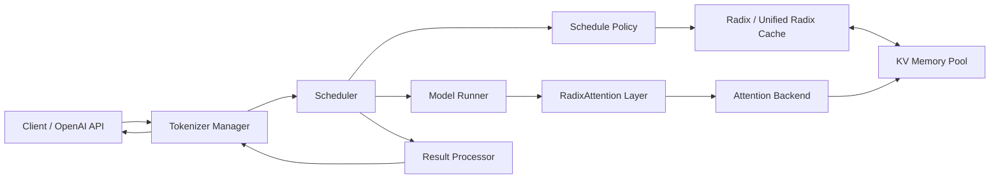
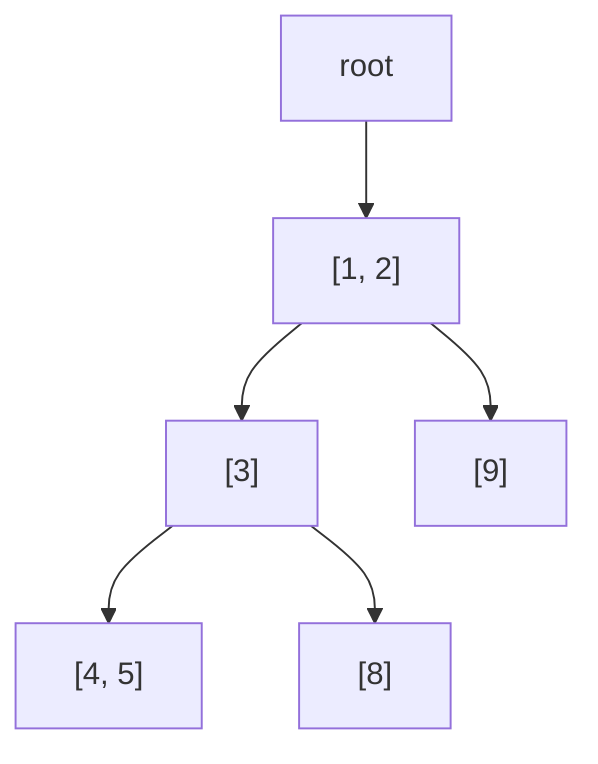
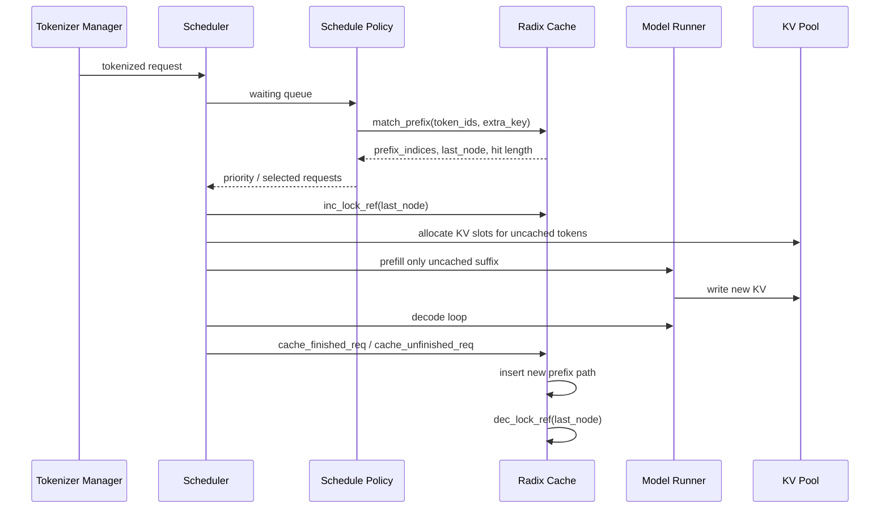

> 本文基于SGLang官方文档、2024年NeurIPS论文、LMSYS官方博客，以及2026-06-04拉取的SGLang源码`e4191708c9d6`整理。SGLang更新很快，具体实现细节应以当前源码为准。

# 1 先说结论

SGLang可以理解为两个部分：

- 上层是面向LLM应用的编程接口，支持多轮对话、并行分支、约束解码、工具调用、结构化输出等常见工作流。
- 下层是高性能推理runtime，负责把请求排队、批处理、prefix cache、KV cache管理、attention kernel、并行策略、speculative decoding、PD分离等能力组合起来。

RadixAttention是SGLang早期最有辨识度的runtime设计。它的关键不是发明一种新的Transformer注意力公式，而是把“多个请求共享前缀时，前缀的KV cache可以复用”这件事做成系统级机制：用radix tree组织token前缀，用KV pool保存实际KV位置，用scheduler优先调度能命中缓存的请求，并在请求运行期间锁住被复用的节点防止被驱逐。

这里有一个容易混淆的命名点：源码里的`python/sglang/srt/layers/radix_attention.py`是模型层attention模块的统一封装，它会把`q/k/v`交给具体attention backend执行；而“RadixAttention论文里说的前缀缓存机制”主要落在`python/sglang/srt/mem_cache/radix_cache.py`、`unified_radix_cache.py`、`schedule_policy.py`和KV memory pool相关代码里。换句话说，RadixAttention更像是一套围绕attention KV cache的运行时缓存系统，而不是一个单独的CUDA kernel。

# 2 SGLang解决什么问题

LLM推理服务真正难的地方不只是“跑一次模型forward”。线上服务通常有这些特点：

- 请求长短差异很大，有些是短问答，有些是长上下文。
- 很多请求共享系统提示词、few-shot examples、RAG模板、工具说明、多轮历史。
- prefill阶段吞吐高但延迟大，decode阶段每次只生成少量token但会反复访问全部历史KV。
- 需要连续批处理，让新请求随时进入，而不是等一批请求全部结束。
- 需要结构化输出、约束解码、多模态、LoRA、量化、speculative decoding、PD分离等功能同时存在。

如果每个请求都从头计算完整prompt，就会浪费大量prefill算力。比如有100个请求都以同一段2000 token系统提示词开头，那么这2000 token的KV理论上只需要算一次，后续请求可以直接复用。问题是：复用不能只做成一个简单的字符串缓存，因为真实服务里有分支、部分前缀命中、KV显存不足、请求并发、LoRA隔离、page size、chunked prefill和驱逐策略。

SGLang的runtime就是围绕这些约束设计的。

# 3 SGLang整体架构

一个典型请求从HTTP/OpenAI兼容接口进入后，会经过tokenizer manager、scheduler、model runner和memory/cache组件。简化之后如下：



几个核心模块的职责：

- `tokenizer_manager.py`：接收请求、做tokenize、把请求发送给scheduler，并把输出流式返回给客户端。
- `scheduler.py`：维护waiting/running请求，执行prefill/decode调度，处理chunked prefill、retraction、abort、缓存写回和结果处理。
- `schedule_policy.py`：实现调度策略，包括FCFS、longest prefix match、DFS-weight等。它会调用prefix cache为请求计算已命中的前缀长度。
- `schedule_batch.py`：保存请求和批次的运行状态，例如`prefix_indices`、`extend_input_len`、`last_node`、`fill_ids`。
- `mem_cache/radix_cache.py`与`mem_cache/unified_radix_cache.py`：维护前缀树，负责match、insert、evict、lock/unlock。
- `mem_cache/memory_pool.py`：维护请求到token位置、token位置到KV cache的映射。
- `layers/radix_attention.py`：模型中的attention层封装，把forward调用交给具体backend，如FlashInfer、Triton、Torch native、TRT-LLM等。

所以SGLang的性能不是某一个点带来的，而是“调度 + prefix cache + KV pool + attention backend”共同作用。

# 4 KV cache为什么重要

Transformer decoder在生成第$t$个token时，需要关注前面所有token。为了避免每一步都重新计算历史token的Key/Value，推理系统会把历史token每一层的K/V存下来，这就是KV cache。

对一个请求来说：

- prefill：输入prompt，一次性计算prompt中每个token的KV。
- decode：每生成一个新token，只计算这个新token的KV，同时读取已有KV做attention。

如果两个请求共享前缀：

```text
请求A: [system prompt][few-shot][用户问题A]
请求B: [system prompt][few-shot][用户问题B]
```

那么`[system prompt][few-shot]`这段token在同一模型、同一LoRA/adapter、同一缓存命名空间下产生的KV是一样的。RadixAttention要做的就是让请求B直接复用请求A已经算好的这一段KV，而不是重新prefill。

一个朴素的哈希缓存只能处理“完整prompt完全相同”。但LLM服务更常见的是“前缀相同、后缀不同”，甚至多个分支共享不同长度的前缀，因此需要前缀树。

# 5 Radix tree如何组织前缀

Radix tree又叫压缩前缀树。普通trie每条边通常存一个字符或token；radix tree会把连续且没有分叉的token压缩成一段。SGLang的一个树节点大致表示：

- `key`：这一段token。
- `value`：这一段token对应的KV pool索引。
- `children`：下一段token到子节点的映射。
- `lock_ref`：当前有多少请求正在依赖这个节点。
- `last_access_time`、`hit_count`、`priority`：用于驱逐或调度。

假设有三条请求历史：

```text
A = [1, 2, 3, 4, 5]
B = [1, 2, 3, 8]
C = [1, 2, 9]
```

树大致会长成：



如果新请求是`[1, 2, 3, 7]`，它能命中`[1, 2, 3]`，只需要继续计算`[7]`。如果新请求是`[1, 2, 6]`，它能命中`[1, 2]`。

源码中传统`RadixCache.match_prefix()`会先把key按`page_size`对齐，然后从root开始逐段匹配。如果匹配停在某个节点的中间，就会split node，把共享前缀切成独立节点，方便后续复用。`insert()`也是同样逻辑：一路找到已有公共前缀，必要时分裂节点，最后为剩余token创建新叶子。对于EAGLE speculative decoding，`RadixKey`还支持bigram视图；对于LoRA、cache salt等隔离需求，`extra_key`会参与命名空间区分。

# 6 一次请求的缓存生命周期

可以用一个请求的生命周期看清RadixAttention如何和scheduler配合：



其中几个字段很关键：

- `prefix_indices`：已经命中的前缀token对应的KV pool索引。
- `extend_input_len`：还需要模型实际prefill的token数量，通常等于`len(fill_ids) - len(prefix_indices)`。
- `last_node`：prefix cache命中的最后一个树节点，用于锁定和后续释放。
- `cache_protected_len`：page size大于1或chunked prefill时，用来避免部分页KV泄漏。

在`Req.init_next_round_input()`中，SGLang会把`origin_input_ids + output_ids`组成`fill_ids`，然后用`tree_cache.match_prefix()`找最长可复用前缀。命中后，`extend_input_len`会缩短，后续prefill只处理未命中的suffix。

`cache_finished_req()`用于请求结束后把已提交KV插入树；`cache_unfinished_req()`则服务于chunked prefill：一个长prompt可能分多轮prefill，前一轮已经算出的部分KV会先进入树，下一轮继续匹配并扩展，避免长请求内部重复处理。

# 7 调度策略为什么要关心缓存

只做缓存还不够，因为请求进入GPU的顺序会影响命中率。SGLang在`SchedulePolicy`里提供了cache-aware策略：

- `lpm`：longest prefix match，优先调度命中前缀更长的请求。
- `dfs-weight`：按radix tree上的请求聚集情况做深度优先调度，让共享同一段前缀的一组请求更容易连续执行。
- `fcfs`、`lof`、`random`、`routing-key`等则是不直接依赖tree cache的策略。

为什么这有意义？假设waiting queue里有以下请求：

```text
R1: [A, B, C, x]
R2: [A, B, C, y]
R3: [P, Q, z]
```

如果先运行R1，`[A, B, C]`会进入cache；接着运行R2时可以直接命中。若调度顺序完全随机，可能错过局部性。SGLang还维护一个临时的`waiting_queue_radix_tree`做in-batch prefix caching：当多个等待中的请求互相共享前缀，但还没有进入全局cache时，调度器会避免把它们一次性全塞进同一个prefill批次里，从而让先执行的请求为后续请求创造缓存命中。

这也是RadixAttention和普通KV cache的差异：它不是“请求结束后放进缓存”这么简单，而是调度器主动利用缓存结构来改变执行顺序。

# 8 内存管理：KV pool与树节点的关系

Radix tree本身不保存完整KV张量，它保存的是KV pool里的索引。实际KV cache在显存池里，由attention backend读写。

可以粗略理解为两层映射：

```text
req_to_token_pool:
  req_id + token_position -> kv_slot_index

token_to_kv_pool:
  kv_slot_index -> 每层K/V张量的实际位置
```

Radix tree节点的`value`保存一段`kv_slot_index`。当新请求命中前缀时，SGLang把这些slot index填入请求的`prefix_indices`，后续attention就能把它们当作历史上下文的一部分。

内存不足时，系统不能随便释放这些slot。它要区分：

- 正在被运行中请求使用的节点：`lock_ref > 0`，不能驱逐。
- 缓存中但暂时没人使用的叶子：可以按LRU、LFU或priority策略驱逐。
- page size未对齐的尾部：可能不能进入prefix cache，需要单独释放或保留到下一轮。

传统`RadixCache.evict()`会从可驱逐叶子集合中选节点，释放其`value`对应的KV slot，再从树上删除叶子。`inc_lock_ref()`会从命中节点一路向root增加引用计数，把这些token从evictable转成protected；`dec_lock_ref()`则在请求结束后反向释放保护。

# 9 page size的权衡

SGLang现在支持paged attention和prefix cache配合。官方文档特别提醒：prefix cache匹配需要至少填满一个完整page。

如果`page_size = 64`：

- prompt只有32 token：没有完整page，不能进入prefix cache。
- prompt有65 token：只有前64 token能缓存和匹配，剩下1 token作为未对齐尾部处理。
- `page_size = 1`：token级别匹配最细，prefix复用最好，但attention kernel和内存访问未必最优。

所以page size是一个典型系统权衡：

- 小page：缓存命中更细，适合共享前缀多、prompt变化细碎的场景。
- 大page：kernel和paged attention访问可能更高效，但prefix cache粒度变粗。

做benchmark时如果只看单请求吞吐，可能会低估prefix cache的价值；如果只构造大量完全相同prompt，又会高估收益。更合理的测试应该包含共享系统prompt、不同用户后缀、多轮对话、不同长度分布和显存压力。

# 10 UnifiedRadixCache：从纯KV到混合状态

当前SGLang已经不只有传统`RadixCache`。在源码和文档里可以看到`UnifiedRadixCache`，它把Full attention、Sliding Window Attention和Mamba/SSM状态放进同一棵逻辑radix tree，通过component机制管理不同类型的缓存资源。

这个变化背后的原因是模型结构变复杂了：

- 普通decoder-only Transformer需要缓存完整KV。
- SWA模型只需要窗口内KV，但窗口边界和树节点边界不一定一致。
- Mamba/SSM类模型缓存的不是传统KV，而是状态；状态可能需要copy-on-write。
- HiCache还会把KV扩展到GPU、CPU、外部存储多级缓存。

UnifiedRadixCache的设计目标是：树结构只负责token前缀和节点关系；不同缓存资源由component负责。一个节点可以同时有Full component、SWA component、Mamba component的数据、锁和host备份信息。

这说明RadixAttention的抽象已经从“GPU空闲KV缓存”扩展成了“以token前缀为索引的多组件状态缓存”。

# 11 HiCache：把前缀缓存扩展到分层存储

HiCache是SGLang在RadixAttention之上的分层缓存扩展。传统RadixAttention主要利用GPU空闲显存缓存前缀KV；HiCache进一步引入：

- L1：GPU KV cache。
- L2：CPU/host memory。
- L3：外部或分布式存储后端。

这样做的动机很直接：长上下文和多轮对话会迅速吃掉GPU KV容量。只靠GPU显存，cache hit rate容易受限；把冷KV下沉到host或外部存储，可以提高长上下文场景的复用机会。

但代价也明显：

- L2/L3命中需要load back，延迟高于GPU本地命中。
- 需要维护host/device位置元数据。
- 需要异步prefetch、写回、引用计数和驱逐协同。
- 如果命中长度不够长，搬运成本可能抵消复用收益。

所以HiCache适合长prompt、多轮会话、共享上下文很长的服务；对于短prompt、低复用、强延迟敏感的服务，普通GPU radix cache甚至禁用prefix cache做可重复benchmark都可能更简单。

# 12 RadixAttention的收益来自哪里

可以把收益拆成三类：

## 12.1 少算prefill

如果请求总长度为$T$，命中前缀长度为$P$，那么实际需要prefill的新token从$T$变成$T-P$。长系统prompt、few-shot模板、RAG公共上下文越多，收益越明显。

## 12.2 提高批处理效率

cache-aware scheduling会让共享前缀的请求更容易连续执行，减少重复prefill，同时保持continuous batching。它优化的是服务整体吞吐和尾延迟，而不是单个请求的一次forward。

## 12.3 更好利用显存

显存里的KV不只是“某个请求私有的历史”，还可以成为多个请求共享的缓存对象。Radix tree、引用计数和驱逐策略让这些KV在请求之间流动。

不过收益不是无条件的。以下场景收益有限：

- 请求几乎没有共享前缀。
- prompt很短，prefill本来就不是瓶颈。
- page size太大导致细粒度前缀无法命中。
- 显存压力过大，刚缓存就被驱逐。
- 多LoRA、多adapter或不同`extra_key`把缓存命名空间切开。
- 多模态embedding override等场景不能只按token id复用KV。

# 13 与vLLM prefix caching的关系

vLLM也有prefix caching和paged KV cache。二者不是“谁有KV cache谁没有”的差别，而是系统设计重心不同：

- vLLM最早以PagedAttention和高吞吐serving闻名，把KV cache分页管理做成核心能力。
- SGLang强调LLM程序执行、结构化生成和多调用模式，RadixAttention从一开始就和程序中的共享前缀、分支、调度策略绑定在一起。
- SGLang当前也支持paged attention、多backend、PD分离、speculative decoding等现代serving能力，因此和vLLM的功能边界越来越接近。

工程上选择哪个系统，应该看工作负载：

- 如果主要是标准OpenAI兼容serving，两者都值得benchmark。
- 如果有复杂结构化输出、多分支prompt程序、约束解码、agent工作流，SGLang的上层接口会更有吸引力。
- 如果已有生态、部署脚本、监控和模型适配都围绕某个系统，迁移成本往往比单项benchmark更重要。

# 14 常见误解

## 14.1 RadixAttention不是改变attention数学

Transformer attention仍然是用Q和历史K/V计算注意力。RadixAttention改变的是历史K/V如何缓存、查找、复用和驱逐。

## 14.2 prefix cache不能跨所有请求共享

只有在模型权重、adapter/LoRA、token序列、相关额外key、位置编码语义等条件一致时，KV才可复用。源码里的`RadixKey`包含`extra_key`，就是为了隔离这些命名空间。

## 14.3 命中越多不一定整体越快

如果命中发生在CPU或外部存储，load back成本可能很高。如果为了命中缓存牺牲了调度公平性，也可能影响尾延迟。因此应该看端到端指标：TTFT、ITL、吞吐、GPU利用率、cache hit rate、eviction次数、显存占用。

## 14.4 benchmark时禁用radix cache不代表生产也应禁用

官方示例里有时会用`--disable-radix-cache`做可重复benchmark，这是为了减少变量；生产里是否禁用要看请求共享前缀和延迟目标。

# 15 实践建议

如果要评估SGLang和RadixAttention，我会按这个顺序做：

1. 先用真实请求日志估计共享前缀分布，而不是只跑随机prompt。
2. 分别测`--disable-radix-cache`和默认开启时的TTFT、吞吐、P95/P99延迟。
3. 对长系统prompt、few-shot、RAG模板、多轮对话单独建压测集。
4. 调整`page_size`，观察prefix hit rate和attention backend吞吐的平衡。
5. 如果显存压力高，关注evictable/protected tokens、eviction次数和命中后又被驱逐的比例。
6. 多LoRA或多租户场景要确认`extra_key`隔离策略，否则可能错误共享或完全无法共享。
7. 长上下文场景再考虑HiCache，不要一开始就引入L2/L3复杂性。

# 16 小结

SGLang的核心价值是把LLM应用层的复杂调用模式和底层推理runtime连在一起。RadixAttention则是其中很典型的例子：应用层产生大量共享前缀，runtime用radix tree识别这些前缀，用KV pool复用显存中的K/V，用scheduler改变请求执行顺序，用引用计数和驱逐策略保证并发安全。

从当前源码看，SGLang已经把这个思路进一步推广到UnifiedRadixCache和HiCache：不再只是“GPU里有一棵KV前缀树”，而是“围绕token前缀组织不同类型的模型状态，并在GPU、CPU、存储之间调度”。这也是现代LLM serving系统的一个趋势：性能优化越来越少是单个kernel的问题，越来越多是缓存、调度、内存层级和工作负载结构之间的系统问题。

# 参考

- SGLang GitHub仓库：https://github.com/sgl-project/sglang
- 本文参考的SGLang源码提交：https://github.com/sgl-project/sglang/tree/e4191708c9d6510f9c3e5178db3b261abbde7065
- SGLang官方文档：https://docs.sglang.io/
- SGLang attention backend文档：https://docs.sglang.io/docs/advanced_features/attention_backend
- LMSYS官方博客《SGLang: Efficient Execution of Structured Language Model Programs》：https://www.lmsys.org/blog/2024-01-17-sglang/
- 论文《SGLang: Efficient Execution of Structured Language Model Programs》：https://arxiv.org/abs/2312.07104
- `radix_cache.py`源码：https://github.com/sgl-project/sglang/blob/e4191708c9d6510f9c3e5178db3b261abbde7065/python/sglang/srt/mem_cache/radix_cache.py
- `unified_radix_cache.py`源码：https://github.com/sgl-project/sglang/blob/e4191708c9d6510f9c3e5178db3b261abbde7065/python/sglang/srt/mem_cache/unified_radix_cache.py
- `schedule_policy.py`源码：https://github.com/sgl-project/sglang/blob/e4191708c9d6510f9c3e5178db3b261abbde7065/python/sglang/srt/managers/schedule_policy.py
- `schedule_batch.py`源码：https://github.com/sgl-project/sglang/blob/e4191708c9d6510f9c3e5178db3b261abbde7065/python/sglang/srt/managers/schedule_batch.py
- Unified Radix Cache组件说明：https://github.com/sgl-project/sglang/blob/e4191708c9d6510f9c3e5178db3b261abbde7065/python/sglang/srt/mem_cache/unified_cache_components/README.md
- HiCache设计文档：https://docs.sglang.io/docs/advanced_features/hicache_design
