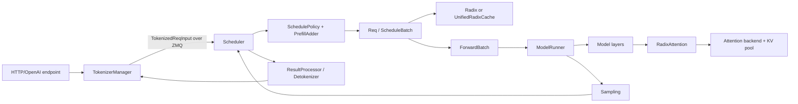
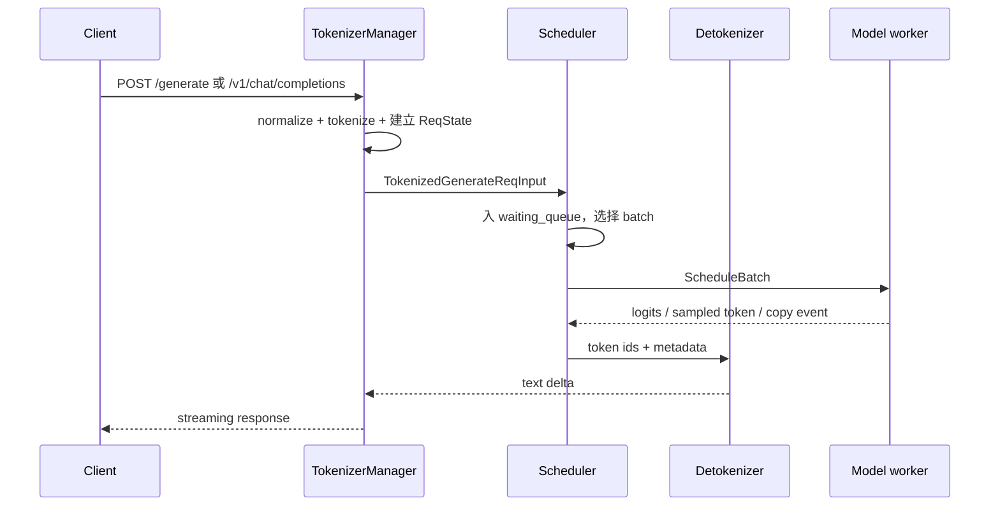
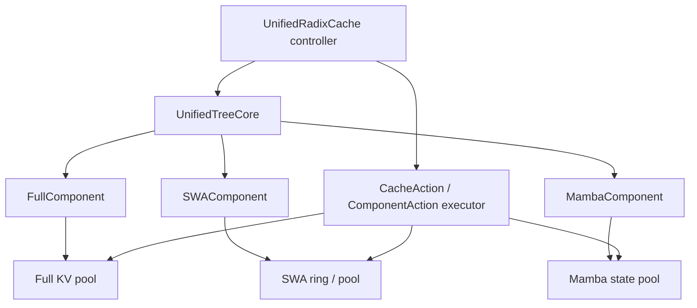
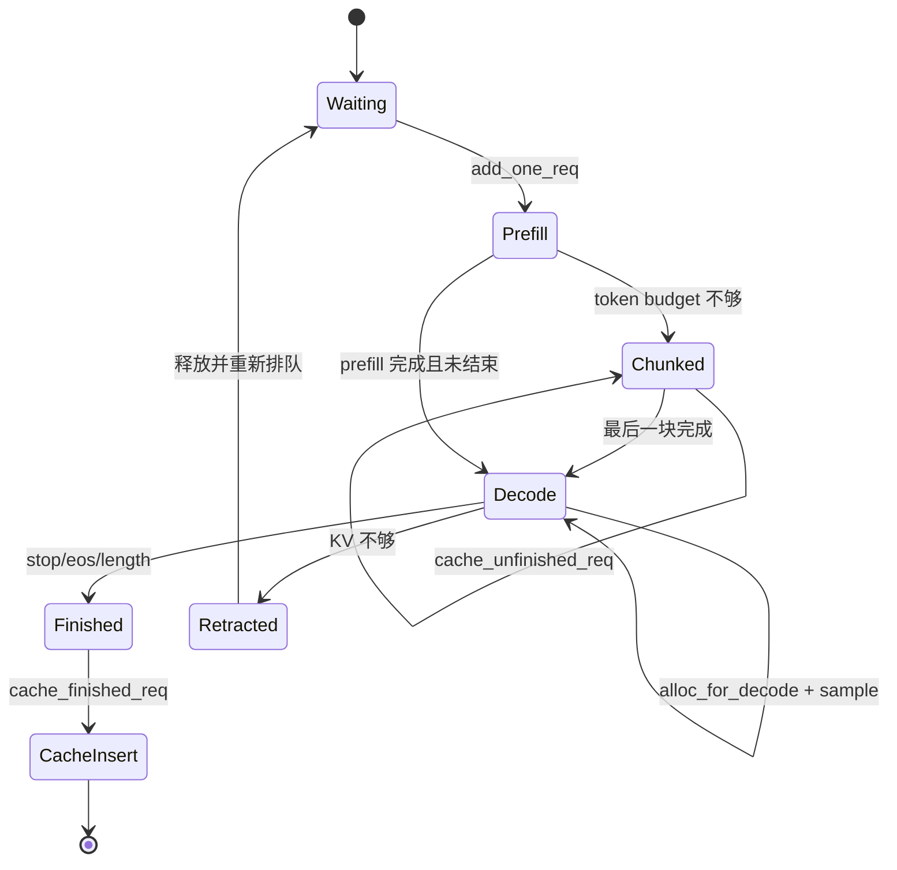
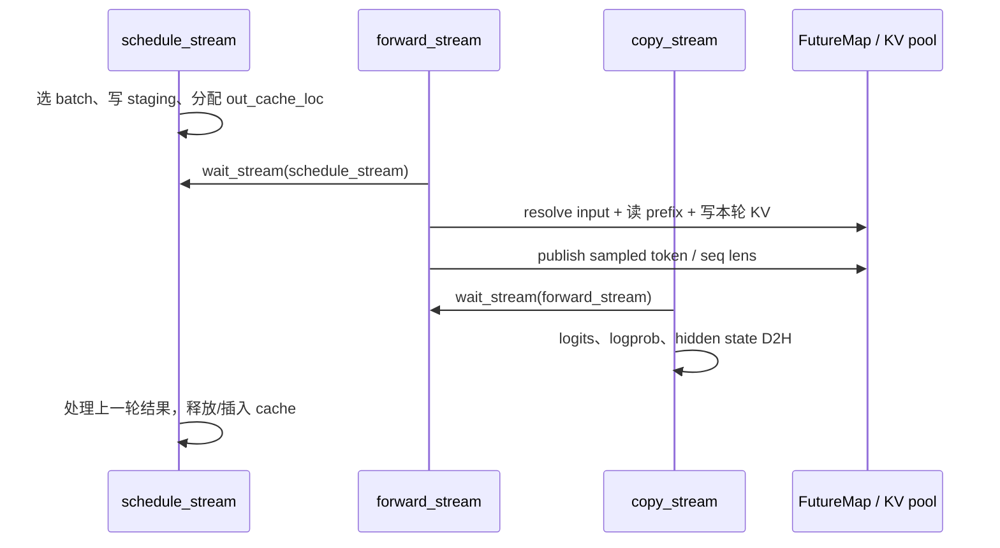
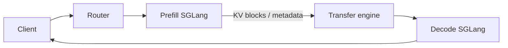

> 版本说明：本文基于 2026-09-11 拉取的 SGLang upstream `main`，固定 commit 为 [`a4ff5634b82546679704c42c984d7f950203922e`](https://github.com/sgl-project/sglang/commit/a4ff5634b82546679704c42c984d7f950203922e)。源码更新很快，文中的函数名和调用关系只对这个 commit 负责。示例默认讨论生成模型、单个 scheduler、常规 CUDA 路径；LoRA、speculative decoding、DP attention、NPU、MLX 和 PD 分离会在相应章节单独标出分叉。

## 1. 先把主线摆出来

读 SGLang runtime，最有效的入口不是从某个 attention kernel 开始，而是跟着一个请求走完一轮 scheduler tick。主链可以压缩成下面几步：



沿着这条链读代码，有四件事需要先记住：

1. **Scheduler 管的是预算和状态，不负责做矩阵计算。** 它决定本轮处理哪些请求、每个请求要扩展多少 token，并把结果整理成 `ScheduleBatch`。
2. **`Req` 同时保存逻辑序列和 KV 所有权。** `origin_input_ids + output_ids` 是逻辑文本；`prefix_indices`、`req_pool_idx` 和 `ReqKvInfo` 则描述这段文本对应哪些物理槽位。
3. **Radix tree 只解决“哪些 token 前缀相同”。** 真正的 K/V 张量在 `TokenToKVPool`；树节点保存的是索引和组件状态。当前默认工厂通常构造 `UnifiedRadixCache`，它把 Full、SWA 和 Mamba/SSM 状态放在一棵树上管理。
4. **overlap 模式下，调度 stream、forward stream 和 copy stream 同时前进。** `FutureMap`、事件和短期引用环负责保证上一轮的 token、KV 读写和下一轮输入不会互相踩踏。

这篇文章沿着这条主链读代码，解释每个边界为什么存在，再给一个可以用于排查问题的观测方法。它不会把 SGLang 的所有模型和硬件后端逐个列一遍，那样得到的是索引，而不是调用链。

## 2. 先建立两个坐标系：逻辑 token 与物理 KV

Transformer 的第 $t$ 个生成 token 需要读取前面 $0..t-1$ 的 K/V。对一个普通 MHA 层，若序列长度为 $T$、层数为 $L$、每个 token 的 K/V 维度分别为 $D_k,D_v$，未考虑量化和 TP 时，KV 大小近似为：

$$
\mathrm{KVBytes} = T \times L \times (D_k + D_v) \times \mathrm{bytes(dtype)}
$$

例如 32 层、每层每 token 的 K/V 合计 4096 个 bf16 数值，单个 token 大约占 $32 \times 4096 \times 2=262144$ 字节。上下文到 16k token 时，单请求 KV 接近 4 GiB。GQA、MLA、TP 分片、page size 和量化布局会改变具体数值，但 KV 随 token 累积、decode 主要读取 KV，这个判断仍然成立。

SGLang 把它拆成两张表：

| 层次 | 典型对象 | 保存的内容 | 生命周期 |
| --- | --- | --- | --- |
| 逻辑请求 | `Req.origin_input_ids`、`Req.output_ids` | token 序列和采样状态 | 从请求进入到结束 |
| 请求行 | `ReqToTokenPool.req_to_token[req_pool_idx, pos]` | 逻辑位置到 KV 槽位的映射 | 请求持有 KV 期间 |
| KV 池 | `TokenToKVPool` 的 K/V buffer | 各层实际 K/V 张量 | 由请求或前缀树引用 |
| 前缀树 | `UnifiedTreeNode` / `TreeNode` | token 段、KV 索引、锁和组件元数据 | 缓存节点可跨请求复用 |

树节点被驱逐时，释放的是 `value` 指向的 KV 槽位。请求被 retraction 时，可能只释放请求私有部分，树中共享的部分还要保留或备份。只看 token 字符串，判断不了一次释放是否安全。

## 3. 进程边界：HTTP 线程不是 scheduler

`TokenizerManager` 在主进程里接收 HTTP 或 Python API 请求。`Engine` 启动时，scheduler 和 detokenizer 通常各自位于子进程；rank 0 的 scheduler 通过 ZeroMQ 通道接收 tokenized 请求。`SchedulerIpcChannels.create()` 明确区分了：

- `recv_from_tokenizer`：PULL，收请求。
- `send_to_tokenizer`：PUSH，回传无需 detokenize 的结果和控制消息。
- `send_to_detokenizer`：PUSH，把 token 结果交给 detokenizer 子进程。

请求入口在 [`tokenizer_manager.py` 的 `generate_request`][tokenizer-generate]。它先标准化输入、建立 `ReqState`，再调用 `_tokenize_one_request`，随后 `_send_one_request` 把 `TokenizedGenerateReqInput` 发给 scheduler。流式响应由 `_stream_one_response` 等待 `ReqState.event`，并把 scheduler 回传的增量结果交给客户端。



这里有一个排错提示：如果请求已经在 HTTP 层收到，但 scheduler 没有出现对应 `rid`，问题在 tokenize、IPC 或 dispatch；如果 scheduler 有 `rid` 却没有 output，才进入调度、显存或 worker 路径排查。

## 4. `Req`：请求状态机的实际载体

`Req` 定义在 [`schedule_batch.py` 的 `Req`][schedule-req]。它的字段很多，可以按用途分组：

| 字段 | 含义 | 什么时候变化 |
| --- | --- | --- |
| `origin_input_ids` | 原始 prompt token | 初始化后基本不变；abort stub 是例外 |
| `output_ids` | 已接受的生成 token | decode 或 prefill 完成时追加 |
| `full_untruncated_fill_ids` | prompt 加输出的连续视图 | `_refresh_fill_ids()` 追加同步 |
| `extend_range` | 本次 prefill 要处理的 `[start,end)` | `PrefillAdder` 接纳请求时设置 |
| `prefix_indices` | 当前已命中的设备 KV 槽位 | `init_next_round_input()` 匹配后更新 |
| `last_node` / `best_match_node` | 树节点句柄 | 匹配、插入、load-back 后更新 |
| `kv` | `ReqKvInfo`，记录请求行和 KV 长度 | 分配、提交、释放时更新 |
| `is_retracted`、`inflight_middle_chunks` | 影响输出提交和 chunk 生命周期 | retraction/chunked prefill 时变化 |

`ReqKvInfo` 里有三个长度，不能混用：

- `cache_protected_len`：前缀树拥有的部分，请求不能直接释放。
- `kv_allocated_len`：请求行已经分配到的长度。
- `kv_committed_len`：结果处理允许对外视为已经提交的长度。

当前 `alloc_for_extend()` 在分配并写入请求行后，会把本轮目标 `seq_len` 写入 `kv_allocated_len` 和 `kv_committed_len`。这表示 scheduler 已经为 forward 准备好写入位置，并不表示每一层 kernel 都跑完了。异步 load、overlap 和 retraction 仍要靠 stream/event 保证读写顺序。

`init_next_round_input()` 做的是“为下一次 prefill 计算缓存命中”，不是构造 GPU 输入。它先刷新 `full_untruncated_fill_ids`，然后计算 `key_limit`。通常 `key_limit = input_len - 1`，因为最后一个 token 要留下来计算 next-token logits；如果请求要返回 prompt logprob，还会进一步受 `logprob_start_len` 限制。

## 5. Scheduler 每一轮到底做什么

普通事件循环在 [`scheduler.py`][scheduler-file] 的 `event_loop_normal()` 中一眼就能看懂：

```python
while not gracefully_exit:
    ingest_requests()
    plan = get_next_batch_to_run(running_batch, last_batch)
    running_batch = plan.running_batch
    batch = plan.batch_to_run
    if batch:
        result = run_batch(batch)
        process_batch_result(batch, result)
    else:
        on_idle()
    last_batch = batch
```

`event_loop_overlap()` 的外层结构相同，但它维护 `result_queue`：上一批的 CPU 结果处理可以和下一批的 GPU forward 重叠。两种循环最终都进入 `get_next_batch_to_run()`。

### 5.1 先合并上轮状态，再决定 prefill

`get_next_batch_to_run()` 先处理 chunked request、上一个 extend batch 和可能的 DP attention 转换。然后调用 `get_new_batch_prefill()`：

1. 检查 HiCache 事件和 storage prefetch 进度。
2. 根据 waiting queue 和缓存策略计算优先级。
3. 构造 `PrefillAdder`，把 token、请求数和显存容量转成可比较的预算。
4. 逐个尝试 `add_one_req()`。
5. 如果本轮已有 prefill，剩余 decode 请求通常留在 `running_batch`，下一轮再混合或单独 decode。

当没有可执行的新 prefill，且 running batch 非空时，scheduler 调用 `update_running_batch()`，其中可能做 decode 内存检查和 retraction，然后 `prepare_for_decode()`。

### 5.2 PrefillAdder 不是简单的 batch size 计数器

`PrefillAdder` 的 `rem_total_tokens` 大致是：

```text
可用 KV 槽位 + 可驱逐缓存槽位 - running 请求的未来输出预算
```

对于 hybrid SWA、Mamba/SSM，它还要扣除滑动窗口和共享 state slot 的成本。`add_one_req()` 至少会检查：

- `max_running_requests`、`prefill_max_requests`。
- 本轮输入 token 和 `max_new_tokens` 的联合预算。
- page 对齐产生的额外槽位。
- 已经 lock 的前缀不能被驱逐。
- SWA ring 或 Mamba state 是否有自己的容量。
- `prefill_delayer` 和 DP rank 是否都同意执行。

它在拿到临时 lock 后会再检查一次 `rem_total_tokens`。这是必要的：两个 scheduler 操作之间可能已经改变了可驱逐节点集合。

举个简化数字例子。假设池里有 1000 个可回收槽位，其中 700 个被当前 batch 的前缀锁住，候选请求需要 400 个新 token，且预留 100 个输出 token。调度器只能使用约 300 个槽位，候选应该留在 waiting queue；若直接按“池总量 1000”判断，后面的 `alloc_for_extend()` 会在 forward 前失败。

### 5.3 调度策略也会读取缓存

`SchedulePolicy.calc_priority()` 支持 `fcfs`、`lpm`、`dfs-weight`、`hrrn` 等策略。缓存感知策略会调用 `match_prefix_for_req()`，把命中长度写进 request，再按最长命中或树上的聚集权重排序。

waiting queue 还有一棵临时 radix tree。多个请求可能只命中一个很短的旧前缀，却彼此拥有更长的共同前缀。如果一次把它们都塞进同一批 prefill，第二个请求就没有机会复用第一个请求刚算出的结果。临时树会把一部分请求延后，让共享前缀先进入真正的缓存。

当 waiting queue 超过 128 个请求时，当前策略会把开销较大的最长前缀排序切回 FCFS。缓存命中有收益，计算命中和排序也要花时间，策略不能一直选最复杂的那种。

## 6. 一次具体的 prefill：从 token 到 `ScheduleBatch`

假设全局缓存里已经有 6 个 token 的前缀，两个请求分别是：

```text
A = [p0 p1 p2 p3 p4 p5 a0 a1]
B = [p0 p1 p2 p3 p4 p5 b0 b1 b2 b3]
```

`Req.init_next_round_input()` 会得到：

```text
A.prefix_indices = [slot_p0 ... slot_p5]
A.extend_range   = [6, 8)
B.prefix_indices = [slot_p0 ... slot_p5]
B.extend_range   = [6, 10)
```

`ScheduleBatch.prepare_for_extend()` 接着做四件事：

1. `input_ids` 只收集 `[a0,a1,b0,b1,b2,b3]`，而不是重复传入 12 个 token。
2. `prefix_lens=[6,6]`、`extend_lens=[2,4]`、`seq_lens=[8,10]` 写进 batch。
3. `alloc_for_extend()` 为两个请求申请新的 KV 位置，并把它们写入 `req_to_token_pool`。
4. 输入 token 先留在 pinned CPU buffer，稍后由 forward stream 的 `resolve_forward_inputs()` 异步搬到 GPU。

这时 batch 的 `extend_num_tokens=6`，但 attention 看到的上下文长度仍然分别是 8 和 10。`prefix_indices` 只是省掉了重复的 Q/K/V 计算，不能把历史上下文从 attention 语义里删掉。

## 7. `RadixKey` 和 page 对齐：为什么“全命中”经常不是全命中

基础 `RadixCache.match_prefix()` 的步骤是：

1. 接受 token 序列、`extra_key`、`cache_salt`。
2. 按 `page_size` 截断到完整页。
3. 沿树节点比较 token 段。
4. 如果匹配停在节点中间，split 一次节点，留下精确边界。
5. 返回拼接后的 device KV 索引和终止节点。

假设 `page_size=4`，缓存里有 8 个 token，新请求也是 8 个 token。`Req` 为了计算最后一个 token 的 logits，传给 cache 的 `key_limit` 通常是 7；树又按完整 page 对齐，所以可复用的 prefix 只有前 4 个 token。若请求返回 prompt logprob，命中长度还可能进一步缩短。

这是两个约束叠加的结果：最后一个位置需要一次 query，page cache 也不保存半页。调 benchmark 时，如果 prompt 长度只比 page size 多一个 token，hit rate 低于直觉很正常。

`extra_key` 用于把 LoRA、检索上下文或调用者定义的命名空间分开；`cache_salt` 另外参与本地 radix tree 和 KV event 的命名。源码注释特别提醒：salt 不自动成为外部 L3 存储 key 的隔离协议。要做到跨实例隔离，外部后端也必须把租户或版本纳入自己的 key。

## 8. 从 `RadixCache` 到 `UnifiedRadixCache`

当前 registry 的默认选择链在 [`mem_cache/registry.py`][registry-file]。启用 unified cache external linker、HiCache，或普通 hybrid 模型时，通常会构造 `UnifiedRadixCache`；实验性的 C++ radix tree、LMCache、FlexKV 和纯 SWA 还有各自的分支。

`UnifiedRadixCache` 把职责拆成 controller、tree core 和 component：



树只处理逻辑结构和节点遍历，组件负责物理数据：

- `FullComponent`：普通全量 attention KV。
- `SWAComponent`：滑动窗口的环形 KV，树节点可能只有 tombstone。
- `MambaComponent`：递归 state，分支请求需要 copy-on-write。

`match_prefix()` 先由 tree core 遍历，再由每个 component 的 validator 判断节点是否可用。HiCache 开启时，代码会同时记录“设备上可直接使用的边界”和“设备或 host 可以命中的边界”，所以 `best_match_node` 和 `last_device_node` 可能不同。

`insert()` 也不是一次简单的 `dict[key] = value`。tree core 可能返回一组延迟 `CacheAction`，controller 在每个 action barrier 执行 pool copy/free，再继续可恢复的 insert walk。这样做的目的，是让树结构决策和物理内存操作有明确的边界，避免半完成的 split 或 eviction 把 allocator 留在不一致状态。

## 9. 缓存生命周期：finished、unfinished 和 lock

请求完成时，`release_kv_cache()` 调用 `cache_finished_req()`；chunked prefill 中间轮调用 `cache_unfinished_req()`。两者都会把请求的 token 和 KV 索引交给树，但处理尾部的方式不同：



基础 radix cache 的 lock 是沿 root 到终止节点增加的引用计数：从 0 变成 1 时，节点从 evictable 集合移到 protected 集合；最后一个引用释放时才重新可驱逐。Unified cache 为不同 component 维护独立的 lock 和 LRU，但仍要求共享 token 路径的一致性。

`cache_unfinished_req()` 还必须处理 page 尾巴。比如 page size 为 4，本轮已经算到 token 6，树只能收下前 4 个；token 4、5 的 KV 仍由 request 持有，下一轮要继续使用或在结束时释放。源码里的 `cache_protected_len` 就是为此存在的，不能简单用 `len(prefix_indices)` 代替。

## 10. Decode 内存不足时发生什么

decode 每轮通常为每个请求增加一个 token。`prepare_for_decode()` 调用 `alloc_for_decode()`，按 page size 写入新位置，并把 `kv_allocated_len`、`kv_committed_len` 各增加 `token_per_req`。

如果内存检查失败，`retract_decode()` 按配置的 length 或 priority 顺序移除请求。普通请求会尝试释放 KV 并重新放回 waiting queue；beam group 不能只撤回一个成员，代码会选择整组 abort；host retraction pool 也不足时，已释放的请求无法恢复，只能返回错误。

日志里出现“KV cache full”不一定代表物理池没有空闲字节，也可能是剩余槽位不足以满足某个请求的 page、输出预留或 hybrid state 预算。排查时一起看 `available_size()`、`evictable_size()`、protected size 和请求的 `extend_range`。

## 11. `ForwardBatch` 是 scheduler 与模型之间的窄接口

`ScheduleBatch` 属于 scheduler，里面可以有 Python 的 `Req` 对象、CPU 镜像和调度统计；模型执行需要的是设备 tensor 和固定的 forward flags。`ForwardBatch.init_new()` 将前者转换为后者。

它会携带：

- `forward_mode`：`EXTEND`、`DECODE`、`IDLE`、split prefill 以及 speculative 变体。
- `input_ids`、`positions`、`seq_lens`、`req_pool_indices`。
- `out_cache_loc`：本轮写 KV 的目标位置。
- `prefix_lens`、`extend_lens`：extend 计算所需的 ragged geometry。
- 采样、grammar、logprob、LoRA 和多模态的 per-request 信息。

源码注释要求 `init_new()` 尽量不修改输入 `ScheduleBatch`。overlap 下 scheduler 可能在 GPU forward 期间准备下一批，worker 因此需要自己的 forward snapshot。当前代码还保留 `seq_lens_sum` 的兼容性回填，这是迁移到 `kv_committed_len` 时留下的过渡点。

## 12. 以 Qwen2 为例：模型层如何接入 RadixAttention

[`qwen2.py`][qwen-file] 的 `Qwen2Attention.forward()` 适合用来对照模型层和 runtime 的接口：

```python
qkv, _ = self.qkv_proj(hidden_states)
q, k, v = qkv.split([self.q_size, self.kv_size, self.kv_size], dim=-1)
q, k = self.rotary_emb(positions, q, k)
attn_output = self.attn(q, k, v, forward_batch)
output, _ = self.o_proj(attn_output)
return output
```

模型类只负责投影、RoPE 和输出投影。`self.attn` 是 `RadixAttention`，它会把 Q/K/V reshape 成 backend 需要的形状，再从当前 `ForwardContext` 取得 attention backend。

`RadixAttention.forward()` 有两个容易漏掉的行为：

1. `save_kv_cache=True` 时，backend 先用 `forward_batch.out_cache_loc` 把当前 token 的 K/V 写进 pool。
2. extend 场景如果处在 piecewise 或 breakable CUDA graph 上，可能走 split op；带 `score_mod`、`aux_tensors`、`return_lse` 等额外参数时，改走 eager extra-kwargs 路径。

“attention 输出正确”和“KV 已经可供下一轮读取”是两件需要同时满足的事。自定义 layer 如果绕过 `RadixAttention` 直接读写 pool，也要遵守相同的位置和事件约定。

## 13. Attention backend：从 ragged metadata 到 Triton kernel

`AttentionBackend` 的抽象把 per-forward metadata 分成两段：

- `init_forward_metadata_out_graph()`：每轮动态 shape 和 host-side 准备。
- `init_forward_metadata_in_graph()`：可以录入 CUDA graph 的静态 shape GPU 操作。

Triton backend 对 decode 维护 `kv_indptr` 和 `kv_indices`。对于 batch 中第 `i` 个请求，`kv_indptr[i:i+2]` 给出它在扁平 `kv_indices` 中的区间；区间里是 `ReqToTokenPool` 映射出的物理 page/slot。attention kernel 不需要知道请求对象，只需要这些数组和 K/V buffer。

decode kernel 通常分两阶段：

1. stage 1 按 KV split 读取 K/V，在线维护 `e_max`、`e_sum` 和累加向量，得到每个 split 的局部输出及 log-sum-exp。
2. stage 2 重新组合 split。对每个局部结果先按新的最大值缩放，再累加，最后除以总和。

组合公式可以写成：

$$
M = \max_i m_i,
\qquad
O = \frac{\sum_i e^{m_i-M} \cdot o_i}{\sum_i e^{m_i-M} \cdot s_i}
$$

其中 $m_i$ 是 split 的局部最大 logit，$s_i$ 是局部指数和，$o_i$ 是局部加权 value。这样既能分片长上下文，也避免直接对很长的 logits 做一次性 softmax。

MHA、GQA、MLA 会走不同的 backend 分支；ROCm 上还可能根据序列长度启用 Lean persistent-CTA kernel。是否调用 Triton 取决于 `ModelRunner.init_attention_backends()`、模型 attention arch、设备和 batch geometry。

## 14. `ModelRunner` 与 worker 的控制流

TP worker 的 `forward_batch_generation()` 先调用 `ForwardBatch.init_new()`，再交给 `ModelRunner.forward()`。最后一个 PP rank 负责 logits 和 sampling，其他 rank 返回 pipeline proxy tensor。

`ModelRunner._forward_raw()` 的主分支是：

```text
可用 decode CUDA graph？
  ├─ 是：decode_cuda_graph_runner.execute()
  └─ 否：准备 eager batch
          ├─ split prefill → forward_split_prefill()
          ├─ 可用 prefill graph → prefill_cuda_graph_runner.execute()
          └─ 其他 → eager_runner.execute()
```

进入模型前，runner 会设置 `ForwardContext(attn_backend=...)`。模型层深处的 `get_attn_backend()` 因而不需要把 backend 作为每一层的显式参数传递。

对于 prefill，`forward_split_prefill()` 可以只跑一部分层，再在下一次调用继续；对于 decode，CUDA graph 要求 batch shape 和 metadata 地址满足 capture 条件。不能把“启用了 CUDA graph”理解成所有请求都走同一条路径。

## 15. overlap：三条 stream 如何避免互相覆盖

开启 overlap 时，`Scheduler.run_batch()` 会在 forward stream 上执行 worker，同时把采样 token 或 speculative draft 数据写入 `FutureMap`，下一轮 `resolve_forward_inputs()` 再从 relay buffer gather。非 speculative 的 decode 输入大致是：

```python
batch.input_ids = future_map.output_tokens_buf[batch.req_pool_indices]
```

prefill 则从 pinned CPU staging H2D；混合 batch 会拼接 prefill GPU tensor 和 decode relay tensor。



有三类依赖：

- **RAW（读后写）**：下一轮 scheduler 不能在上一轮 attention 仍读取共享 pool 时重写同一位置。代码用 `shared_read_done_event` 和 WAR barrier 处理。
- **WAW（写后写）**：新 forward 不能覆盖仍被上一轮 worker 引用的 `ScheduleBatch` tensor；`batch_record_buf` 会把 snapshot 保留约两轮。
- **结果生命周期**：CPU 结果复制完成前，`process_batch_result_*()` 不能读取 host mirror；`copy_done.synchronize()` 是明确的边界。

`FutureMap` 还会在 CI 下把已 gather 的 token buffer 标成 `-1`，用异步 assert 抓“没有 stash 就 gather”的 bug。这个检查很适合解释为什么 overlap bug 常常只在压力或特定 batch 顺序下出现。

## 16. sampling 与结果提交的时机

worker 在 last PP rank 上拿到 logits 后调用 `ModelRunner.sample()`。prefill-only 请求会生成 dummy token id，但可选地计算 prompt logprob；普通 prefill 会把第一个 next token 交给结果处理器。

`process_batch_result_prefill()` 和 `process_batch_result_decode()` 都先等待 D2H copy，再逐个请求执行 finish 判断：

- 追加 `next_token_id`，更新 reasoning/stop string/grammar 状态。
- chunked 中间轮减少 `inflight_middle_chunks`，不向客户端发送未完成 chunk。
- 请求结束时调用 `release_kv_cache()`，可能插入 prefix tree，也可能因为 abort 跳过 insert。
- 未结束且不在 mixed decode tail 中时，调用 `cache_unfinished_req()`，让下一轮继续使用刚刚算出的 KV。

模型已经产出 token，也不表示 scheduler 能马上释放这一轮的请求行。要先确认 token 对应的 KV 是否留在树里、是否还有 overlap snapshot 引用，以及 host write-back 是否结束。

## 17. HiCache 与普通 radix cache 的边界

HiCache 把 KV 存储分成 GPU L1、实例私有 host L2 和可选的共享 L3。SGLang 官方设计文档强调，L2 不会自动在同机多个实例之间共享；跨实例复用要依赖配置好的 L3 backend。

| 层 | 介质 | 谁能看到 | 命中后的动作 |
| --- | --- | --- | --- |
| L1 | GPU KV pool | 一个 inference instance | 直接把物理索引交给 attention |
| L2 | host memory | 同一 instance | load-back 到 GPU，再执行 prefill |
| L3 | Mooncake、NIXL、文件或其他 backend | 由 backend 配置决定 | 先 prefetch 到 L2，再进入本地匹配 |

在 scheduler 里，HiCache 的事件处理发生在 prefill admission 前。`tree_cache.check_hicache_events()` 更新本地节点和传输状态；`check_prefetch_progress()` 未完成时会暂缓请求。命中长度太短时，搬运成本可能超过重新计算，prefetch threshold 和 `best_effort/wait_complete/timeout` 策略需要根据 TTFT 与 hit rate 测量。

HiCache 还有一个容易误读的点：`host_hit_length` 表示 host 有可用缓存，不等于这些 token 已经在当前请求的 GPU `prefix_indices` 里。`init_load_back()` 完成以后，scheduler 才会更新请求的设备前缀和 `cache_protected_len`。

## 18. PD 分离是另一条调度分支

PD disaggregation 把 prefill 和 decode 放到不同实例。prefill worker 计算 prompt KV，通过 Mooncake 或 NIXL 等 transfer engine 发送；decode worker 在本地请求到达前要完成 bootstrap、预分配和传输队列处理。



它解决的是 unified scheduler 中 prefill 抢占 decode、以及 DP attention 负载不平衡的问题，但也引入了新的状态：bootstrap queue、transfer queue、目标端 prealloc、KV ready event。文章主链里的 `run_batch()` 在 PD 模式会提前发送 cached prefix chunk，之后走 disaggregation mixin 的 result processor；不能把这条路径和单实例 `cache_finished_req()` 直接画等号。

实践上，先把单实例 L1 cache 的命中和释放顺序跑通，再测 PD。否则看到 decode 端的首 token 延迟变化，很难分辨是传输、远端排队还是本地 radix 命中造成的。

## 19. 代码阅读和调试建议

### 19.1 固定版本和路径

```bash
git clone --depth 1 https://github.com/sgl-project/sglang.git /tmp/sglang-src
git -C /tmp/sglang-src checkout a4ff5634b82546679704c42c984d7f950203922e

rg -n "def get_next_batch_to_run|def run_batch" \
  python/sglang/srt/managers/scheduler.py
rg -n "def init_next_round_input|def prepare_for_extend|def prepare_for_decode" \
  python/sglang/srt/managers/schedule_batch.py
```

调试时先打印 `rid`、`forward_mode`、`prefix_len`、`extend_range`、`kv_allocated_len` 和 `kv_committed_len`。这些字段能把“调度没选中”“缓存没命中”“分配失败”“forward 没返回”区分开。

### 19.2 构造能看出 cache 价值的请求

不要只压测完全不同的随机 prompt。至少准备三组：

1. 相同 system prompt、不同用户问题，用来观察 prefix hit。
2. 长 prompt 分块进入，用来观察 chunked prefill 中间轮。
3. 大量不同长度 decode 请求，用来观察 retraction 和输出预算。

同一组请求分别比较 `--schedule-policy fcfs` 与 `--schedule-policy lpm`，记录 `cached_tokens`、TTFT、TPOT、prefill token 数和 GPU KV 使用量。若只看总吞吐，可能漏掉首 token 延迟和缓存搬运代价。

### 19.3 出现异常输出时的最短检查路径

```text
HTTP request 到达？
  ├─ 否：endpoint / tokenizer / client
  └─ 是：scheduler 是否收到 rid？
          ├─ 否：ZMQ dispatch / 输入校验
          └─ 是：prefix 与 extend_range 是否合理？
                  ├─ 否：RadixKey / page 对齐 / host load-back
                  └─ 是：out_cache_loc 与 stream event 是否匹配？
                          ├─ 否：allocator / overlap / HiCache transfer
                          └─ 是：attention backend metadata / model layer / sampling
```

如果关闭 overlap 后问题消失，优先比较 `FutureMap` relay、`copy_done`、`shared_read_done_event` 和 batch snapshot，而不是先怀疑模型权重。若只有启用 HiCache 后出现，检查 `host_hit_length`、`ready_to_load_host_cache()` 和每层 `layer_transfer_counter.wait_until()`。

## 20. 常见误读和边界

### “RadixAttention 是一种新的 attention 公式”

`RadixAttention` 是模型层到 backend 的统一封装；前缀复用来自 radix tree、KV pool 和 scheduler 的协同。真正的注意力公式仍由具体 backend kernel 执行。

### “cache hit 以后就不需要 forward”

命中的只是已有 token 的 K/V。新请求仍需要对未命中的 suffix 做 prefill，并用最后一个位置产生 logits。SWA、LoRA、position override 和外部 cache namespace 还可能缩短或禁用匹配。

### “`kv_committed_len` 增加就代表 GPU 写完了”

它是 scheduler 的所有权记账。真实完成顺序还取决于 forward stream、layer transfer counter、copy event 和结果处理边界。

### “统一 cache 就只有一份物理缓存”

Unified 指的是一棵逻辑树和组件协议；Full、SWA、Mamba 可以各自有池、LRU 和 lock。组件数据缺失时，树节点可能保留为 tombstone。

### “把 page size 调小一定更快”

小 page 让前缀匹配更细，但会增加 page table、索引和 kernel 调度开销；大 page 可能提高访问连续性，却让短共享前缀无法命中。应按真实 prompt 分布测，不要用一个完全相同的长 prompt 推断线上收益。

## 21. 什么时候该读哪一层

| 现象 | 首先读的文件 | 重点字段/函数 |
| --- | --- | --- |
| 请求排队久 | `managers/scheduler.py`、`schedule_policy.py` | `calc_priority`、`get_new_batch_prefill` |
| 命中率低 | `schedule_batch.py`、`mem_cache/radix_cache.py` | `init_next_round_input`、`key_limit`、`page_size` |
| KV OOM | `schedule_policy.py`、`mem_cache/allocation.py` | `rem_total_tokens`、`alloc_for_extend`、`retract_decode` |
| overlap 下乱码 | `managers/overlap_utils.py`、`scheduler.py` | `FutureMap`、`_relay_forward_payload`、WAR barrier |
| HiCache 首 token 变慢 | `unified_radix_cache.py`、memory pool | host hit、prefetch、`layer_transfer_counter` |
| attention kernel 性能异常 | `layers/radix_attention.py`、backend 和 `kernels/ops/attention` | metadata、`kv_indptr`、split 数、graph eligibility |

先沿一条请求读通，再看具体模型或硬件分支，通常比从六千行 `scheduler.py` 开头顺读更快。SGLang 难读的地方在于边界状态会互相组合；把 token 逻辑、KV 所有权和 stream 时序分开记录，代码结构就清楚了。

## 22. 读完之后留下的几条线索

SGLang runtime 的性能来自一组互相咬合的决定：scheduler 用 token 和 KV 预算选择 batch，`Req` 把逻辑序列和物理所有权绑定起来，radix cache 复用前缀，`ScheduleBatch` 把未命中 suffix 打包，`ModelRunner` 选择 eager 或 CUDA graph，attention backend 用 page table 读取 KV，结果处理器再决定 token 和 cache 何时提交。

当前版本有两条边界值得单独记下来：

- `UnifiedRadixCache` 的 tree core 只做逻辑树决策，Full/SWA/Mamba 组件各自管理资源；
- overlap 下“本轮 forward 返回”与“所有共享 tensor 都可以被下一轮改写”之间隔着 event、relay 和 snapshot。

理解这两条边界，再去看 HiCache、PD 分离、speculative decoding 或新硬件 backend，遇到陌生字段时会更容易判断它属于哪一种状态：token 序列、请求行、KV 池、树节点，还是 stream 生命周期。

## 参考

- [SGLang commit `a4ff5634`](https://github.com/sgl-project/sglang/commit/a4ff5634b82546679704c42c984d7f950203922e)
- [SGLang `scheduler.py`][scheduler-file]
- [SGLang `schedule_batch.py`][schedule-file]
- [SGLang `schedule_policy.py`][policy-file]
- [SGLang `tokenizer_manager.py`][tokenizer-file]
- [SGLang `overlap_utils.py`][overlap-file]
- [SGLang `allocation.py`][allocation-file]
- [SGLang `radix_cache.py`][radix-file]
- [SGLang `unified_radix_cache.py`][unified-file]
- [SGLang `registry.py`][registry-file]
- [SGLang `model_runner.py`][runner-file]
- [SGLang `forward_batch_info.py`][forward-batch-file]
- [SGLang `radix_attention.py`][radix-attention-file]
- [SGLang `qwen2.py`][qwen-file]
- [SGLang `triton_backend.py`][triton-file]
- [SGLang `decode_attention.py`][decode-kernel-file]
- [SGLang 官方 HiCache 设计文档](https://docs.sglang.ai/advanced_features/hicache_design.html)
- [SGLang 官方 PD Disaggregation 文档](https://docs.sglang.ai/advanced_features/pd_disaggregation.html)

[scheduler-file]: https://github.com/sgl-project/sglang/blob/a4ff5634b82546679704c42c984d7f950203922e/python/sglang/srt/managers/scheduler.py
[schedule-file]: https://github.com/sgl-project/sglang/blob/a4ff5634b82546679704c42c984d7f950203922e/python/sglang/srt/managers/schedule_batch.py
[schedule-req]: https://github.com/sgl-project/sglang/blob/a4ff5634b82546679704c42c984d7f950203922e/python/sglang/srt/managers/schedule_batch.py#L926
[policy-file]: https://github.com/sgl-project/sglang/blob/a4ff5634b82546679704c42c984d7f950203922e/python/sglang/srt/managers/schedule_policy.py
[tokenizer-file]: https://github.com/sgl-project/sglang/blob/a4ff5634b82546679704c42c984d7f950203922e/python/sglang/srt/managers/tokenizer_manager.py
[tokenizer-generate]: https://github.com/sgl-project/sglang/blob/a4ff5634b82546679704c42c984d7f950203922e/python/sglang/srt/managers/tokenizer_manager.py#L776
[overlap-file]: https://github.com/sgl-project/sglang/blob/a4ff5634b82546679704c42c984d7f950203922e/python/sglang/srt/managers/overlap_utils.py
[allocation-file]: https://github.com/sgl-project/sglang/blob/a4ff5634b82546679704c42c984d7f950203922e/python/sglang/srt/mem_cache/allocation.py
[radix-file]: https://github.com/sgl-project/sglang/blob/a4ff5634b82546679704c42c984d7f950203922e/python/sglang/srt/mem_cache/radix_cache.py
[unified-file]: https://github.com/sgl-project/sglang/blob/a4ff5634b82546679704c42c984d7f950203922e/python/sglang/srt/mem_cache/unified_radix_cache.py
[registry-file]: https://github.com/sgl-project/sglang/blob/a4ff5634b82546679704c42c984d7f950203922e/python/sglang/srt/mem_cache/registry.py
[runner-file]: https://github.com/sgl-project/sglang/blob/a4ff5634b82546679704c42c984d7f950203922e/python/sglang/srt/model_executor/model_runner.py
[forward-batch-file]: https://github.com/sgl-project/sglang/blob/a4ff5634b82546679704c42c984d7f950203922e/python/sglang/srt/model_executor/forward_batch_info.py
[radix-attention-file]: https://github.com/sgl-project/sglang/blob/a4ff5634b82546679704c42c984d7f950203922e/python/sglang/srt/layers/radix_attention.py
[qwen-file]: https://github.com/sgl-project/sglang/blob/a4ff5634b82546679704c42c984d7f950203922e/python/sglang/srt/models/qwen2.py
[triton-file]: https://github.com/sgl-project/sglang/blob/a4ff5634b82546679704c42c984d7f950203922e/python/sglang/srt/layers/attention/triton_backend.py
[decode-kernel-file]: https://github.com/sgl-project/sglang/blob/a4ff5634b82546679704c42c984d7f950203922e/python/sglang/kernels/ops/attention/decode_attention.py
