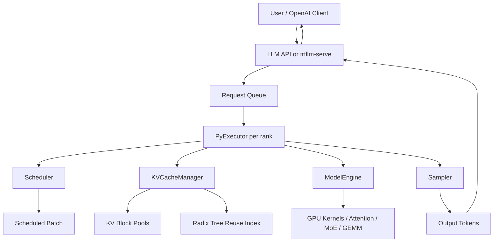
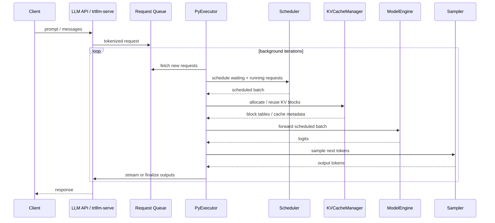
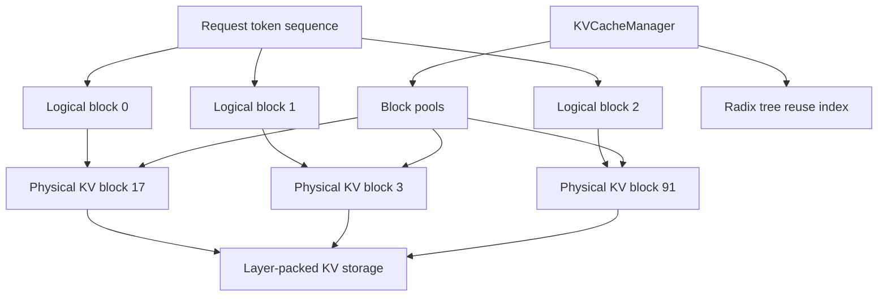
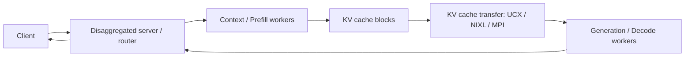
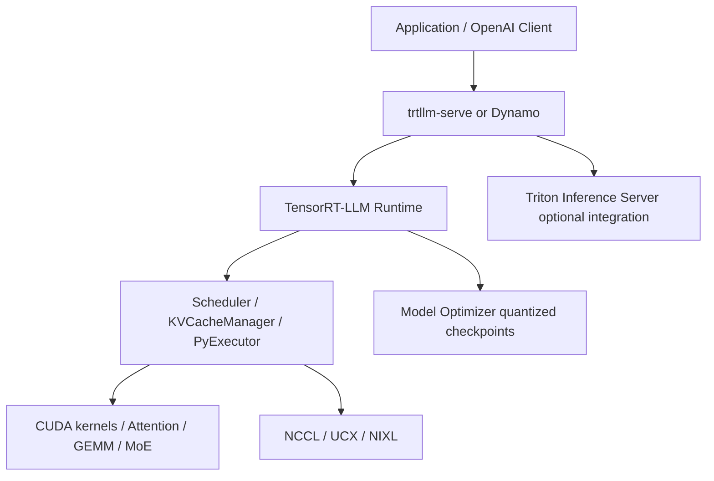

> 版本说明：本文基于2026-06-04访问的NVIDIA TensorRT-LLM官方文档、GitHub README、GitHub Releases API和功能文档整理。TensorRT-LLM更新很快，尤其是PyTorch backend、KV cache、量化、disaggregated serving和模型支持矩阵。写作时main分支README标注`release-1.3.0rc18`，GitHub Releases列表最新可见tag是`v1.3.0rc17`，发布时间为2026-06-02，且为pre-release。生产使用时应以具体版本的release note、容器镜像和部署指南为准。

## 1. 先说结论

TensorRT-LLM可以理解成NVIDIA面向大模型推理服务的一套高性能runtime和开发框架。它不是单纯的一个CUDA kernel，也不是只把PyTorch模型导出成TensorRT engine的脚本集合，而是一套覆盖模型加载、请求调度、KV cache管理、采样、量化、多GPU并行、OpenAI兼容服务和分离式prefill/decode的推理系统。

一句话概括：

**TensorRT-LLM的核心价值，是把NVIDIA GPU上的底层算子、通信、内存管理和服务调度组织成一个可部署的LLM inference runtime，让用户用`LLM` API或`trtllm-serve`启动模型，同时在底层使用paged KV cache、in-flight batching、CUDA Graph、speculative decoding、FP8/FP4量化、多GPU并行和KV cache传输等优化。**

截至1.x文档，TensorRT-LLM有几个很值得注意的变化：

1. 官方强调PyTorch-based / PyTorch-native architecture。上层`LLM` API可以直接接收Hugging Face模型名或本地checkpoint，由框架负责加载、优化和推理。
2. 在线服务入口是`trtllm-serve`，提供OpenAI兼容接口，如`/v1/chat/completions`。
3. 核心执行单元是`PyExecutor`。每个rank上有worker进程，后台循环不断取请求、调度、分配KV、跑模型、采样、返回结果。
4. KV cache是系统的中心资源。TensorRT-LLM使用block pool和radix tree做跨请求KV复用，支持优先级驱逐、host offload、cache salt、多模态UUID和partial reuse。
5. In-flight batching把prefill/context阶段和decode/generation阶段混在同一个迭代里调度，避免传统静态batch里“短请求等长请求”的浪费。
6. Chunked prefill把长prompt切块，让长上下文请求不会长期占住`max_num_tokens`预算，也能和decode请求交错执行。
7. 量化支持覆盖FP8、FP4、KV cache量化、AWQ/GPTQ等多种路径，但具体模型和GPU架构支持要看矩阵，不能只看一个“支持量化”的笼统说法。
8. Disaggregated serving把prefill和decode拆到不同GPU池，通过UCX/NIXL/MPI等传输KV cache，用于独立优化TTFT和TPOT。

如果你熟悉vLLM、SGLang、TGI这类系统，可以把TensorRT-LLM放在同一类问题域里看：它们都在解决LLM serving里“如何把GPU算力、HBM、KV cache和请求调度吃满”的问题。区别在于TensorRT-LLM更深地绑定NVIDIA全栈：GPU架构、TensorRT/CUDA/CUTLASS/FlashInfer/NCCL/NIXL/Dynamo/Triton Inference Server等生态都可以成为它的优化入口。

## 2. TensorRT-LLM要解决什么问题

LLM推理不是“调用一次模型forward”这么简单。真实服务有几个特征：

1. 请求长度差异很大。有人问一句短问题，也有人塞进几十万token的长上下文。
2. prefill和decode的计算形态不同。prefill一次处理大量prompt token，矩阵乘更大；decode每步通常只追加少量token，但要反复读历史KV cache。
3. 服务端需要持续接收新请求。不能等一个batch里所有请求都生成结束后再开下一批。
4. KV cache占用巨大。长上下文、多并发、多层Transformer会快速吃光HBM。
5. 多GPU部署涉及tensor parallel、pipeline parallel、expert parallel、attention data parallel、跨节点通信和拓扑差异。
6. 线上还要支持采样策略、流式输出、OpenAI兼容API、LoRA、多模态、量化、监控、benchmark、故障处理等。

一个普通decoder-only Transformer请求大致分两段：

```text
prefill/context:
  输入prompt tokens
  一次性计算这些tokens在每层attention里的K/V
  生成第一个输出token

decode/generation:
  每轮输入上一步生成的token
  读取全部历史KV cache做attention
  写入新token的KV
  生成下一个token
```

如果系统没有连续批处理，GPU利用率会很差。比如一个batch里有16个请求，其中15个很快结束，只剩1个请求继续生成。静态batch会让后面的新请求等待，GPU上大量计算槽位空着。TensorRT-LLM的in-flight batching就是要解决这个问题：每个迭代都重新看哪些请求可以跑，把正在decode的请求、新进来的prefill请求、被切块的长prompt请求组合到一起。

## 3. 从上层入口看：LLM API与trtllm-serve

TensorRT-LLM有两个最常见入口。

第一个是Python里的`LLM` API：

```python
from tensorrt_llm import LLM

llm = LLM(model="TinyLlama/TinyLlama-1.1B-Chat-v1.0")
output = llm.generate("Hello, my name is")
```

这个接口的目标是让离线推理和实验更直接。用户给一个Hugging Face模型名或本地路径，`LLM`实例负责tokenization、detokenization、模型加载、runtime初始化和推理执行。它的使用体验接近“高层Python inference API”，但内部不是普通的单请求PyTorch eager forward，而是会创建executor和worker来跑高性能推理循环。

第二个是在线服务命令`trtllm-serve`：

```bash
trtllm-serve "TinyLlama/TinyLlama-1.1B-Chat-v1.0"
```

服务启动后，可以用OpenAI兼容接口访问：

```bash
curl -X POST http://localhost:8000/v1/chat/completions \
  -H "Content-Type: application/json" \
  -H "Accept: application/json" \
  -d '{
    "model": "TinyLlama/TinyLlama-1.1B-Chat-v1.0",
    "messages": [
      {"role": "system", "content": "You are a helpful assistant."},
      {"role": "user", "content": "Where is New York? Tell me in a single sentence."}
    ],
    "max_tokens": 32,
    "temperature": 0
  }'
```

这个入口适合线上服务、压测和与已有OpenAI SDK风格应用集成。官方还提供`trtllm-bench`做性能基准，`trtllm-eval`做准确率评测。

## 4. 整体架构：LLM、PyExecutor、Scheduler、KVCacheManager

官方架构文档里，`LLM`类是核心入口。它内部会在每个rank上创建`PyExecutor(Worker)`进程。`PyExecutor`不是只跑一次请求，而是在后台持续循环，异步处理推理请求。

可以简化成下面这张图：



几个模块的职责：

1. `Scheduler`：决定当前迭代跑哪些请求。它要同时考虑请求状态、`max_batch_size`、`max_num_tokens`、KV cache可用空间、prefill/decode优先级、chunked prefill等约束。
2. `KVCacheManager`：分配、释放、复用和驱逐KV cache blocks。它是长上下文和高并发服务的关键。
3. `ModelEngine`：负责模型加载和GPU执行。具体会触发attention、GEMM、MoE、norm、sampling相关kernel。
4. `Sampler`：处理logits，执行greedy、top-k、top-p、beam search等采样策略，产出最终token。
5. `PyExecutor`：把这些模块串成一个持续运行的执行循环。

一次迭代大致是：

```text
1. 从请求队列取新请求。
2. Scheduler选出本轮可以执行的请求。
3. KVCacheManager为这些请求准备KV blocks，处理复用、分配和驱逐。
4. ModelEngine执行forward。
5. Sampler从logits里选出token。
6. 更新请求状态，完成的请求返回，未完成的请求进入下一轮。
```

用sequence diagram看更直观：



这个架构说明了一个重点：TensorRT-LLM的性能不是某个单独kernel决定的，而是“调度 + KV cache + GPU执行 + 采样 + 通信”共同决定的。

## 5. PyTorch backend与传统TensorRT思路的差异

很多人第一次听到TensorRT-LLM，会自然联想到传统TensorRT流程：

```text
PyTorch / ONNX模型 -> 构建TensorRT engine -> 加载engine推理
```

这个理解有历史原因，但放到1.x文档里已经不完整。当前官方介绍强调TensorRT-LLM是PyTorch-based架构，提供高层Python `LLM` API，并且默认PyTorch backend支持最新Hopper、Blackwell GPU上的FP8/FP4量化能力。

这背后的取舍是：

1. 纯engine化路线适合静态图、确定shape、强编译优化，但LLM serving的请求形状、batch组成、KV状态和模型变体都很动态。
2. PyTorch-native路线更容易接入Hugging Face模型、扩展新模型结构、调试runtime逻辑和适配快速变化的模型生态。
3. TensorRT-LLM并不是放弃底层优化，而是把优化放在专用kernel、CUDA Graph、attention backend、量化kernel、MoE通信、KV cache布局和executor调度里。

所以更准确的说法是：TensorRT-LLM正在从“构建TensorRT engine跑LLM”的窄工具，演进成“NVIDIA GPU上的LLM推理runtime”。它仍然继承TensorRT/CUDA生态的优化能力，但用户入口更像一个现代LLM serving框架。

## 6. In-flight batching：为什么能提升吞吐

In-flight batching也叫continuous batching或iteration-level batching。它的关键是：每个推理迭代都可以重新组batch，而不是把一批请求固定到结束。

传统静态batch像这样：

```text
batch开始: R1 R2 R3 R4
R1结束了，但R2/R3/R4还在生成
新来的R5必须等整个batch结束
```

In-flight batching像这样：

```text
iteration 1: R1 prefill, R2 prefill
iteration 2: R1 decode, R2 decode, R3 prefill chunk, R4 prefill chunk
iteration 3: R2 decode, R3 decode, R4 decode, R5 prefill chunk
```

TensorRT-LLM文档里明确提到，in-flight batching允许context phase序列和generation phase序列一起处理。这样做的原因是decode阶段每个请求通常只消耗一个或少量token预算，如果本轮只有decode请求，GPU矩阵规模可能太小；把新的prefill token也塞进来，可以提高GPU利用率。

但它也带来输入布局约束。官方文档指出，为了效率，IFB要求input tensor是packed的，也就是移除padding；并且当前实现里context phase序列要排在generation phase序列之前。这个细节很重要，因为它解释了为什么服务层调度不是简单把请求列表拼起来，而要生成满足kernel和runtime约束的紧凑输入布局。

## 7. 三个核心调度参数：max_batch_size、max_seq_len、max_num_tokens

TensorRT-LLM调度里经常见到三个参数：

1. `max_batch_size`：最多同时调度多少个请求。
2. `max_seq_len`：单个请求最大序列长度。
3. `max_num_tokens`：移除padding后，一个batch里最多处理多少个输入token。

这三个参数不是越大越好。

`max_batch_size`太小，会限制并发请求数；太大则可能带来过大的资源预留和调度压力。`max_seq_len`决定单请求能支持多长上下文，如果设置到模型最大位置长度，最通用，但在显存紧张时可能导致KV cache容量不足。`max_num_tokens`更微妙：它影响workspace buffer，也影响某些矩阵乘维度。设置大一些可以提高GPU math utilization；但太大时会挤压KV cache可用显存，也可能拉高TTFT和端到端延迟。

可以用一个简化例子理解：

```text
max_batch_size = 4
max_num_tokens = 12

等待队列:
R1 prompt 5 tokens
R2 prompt 5 tokens
R3 prompt 8 tokens
R4 prompt 2 tokens
```

如果先调度R1和R2，已经用了10个token预算，只剩2个token。R3进不来，R4可以进来。下一轮R1/R2进入decode，每个只消耗约1个token预算，于是更多prefill请求可以混进来。这就是iteration-level scheduling的基本逻辑。

## 8. Chunked prefill：长上下文服务的关键

如果没有chunked prefill，一个长prompt要在一次context phase里全部处理。假设一个请求有64K prompt，而`max_num_tokens`只有8192，这个请求就没法直接调度；如果把`max_num_tokens`调到64K，又会占用大量workspace并挤压KV cache。

Chunked prefill的思路是把长prompt切成多个chunk：

```text
长prompt:  [0 ... 8191][8192 ... 16383][16384 ...]
调度方式:  chunk 1 -> chunk 2 -> chunk 3 -> ...
```

除了最后一个chunk，chunk大小通常需要是KV cache block size的整数倍。这样做有三个好处：

1. 长prompt不需要一次性占满`max_num_tokens`。
2. 长prompt的prefill可以和其他请求的decode交错，降低队列阻塞。
3. 已经处理完的chunk可以产生KV cache，后续chunk继续追加。

官方文档还提到，chunked context可以降低大多数请求的平均TTFT，尤其缓解生产负载里的排队效应和最坏TTFT。不过它也可能让少数本来能一次性prefill完的小并发请求TTFT略增，因为这些请求不再“幸运地”独占一整轮大prefill。

## 9. KV cache系统：TensorRT-LLM真正的中心资源

KV cache是LLM serving里最重要的内存对象。每个Transformer层都要保存历史token的Key和Value，decode每一步都要读取这些历史KV。

最朴素的KV cache是连续大tensor：

```text
[max_batch_size * max_beam_width, 2, num_heads, max_seq_len, head_dim]
```

问题是这会严重浪费显存。大多数请求不会都达到`max_seq_len`，但连续cache会按上限预留空间。TensorRT-LLM支持paged KV cache，把KV拆成固定token数量的blocks，由cache manager按需分配和回收。

简化结构如下：



官方KV cache文档里有几个关键信息：

1. KV cache是block pool。每个block能保存固定数量token的KV状态。
2. block size由用户创建engine或runtime时设置，必须是大于1的2的幂。
3. 多层可以打包在一个block内，但要求这些层有相同head数量和attention window size。
4. 如果模型有不同attention window size或不同KV head配置，会为不同组合创建多个pool。
5. 已填满的blocks会进入搜索结构，后续请求如果prefix匹配，可以直接复用。

这里的“搜索结构”就是radix tree。它让TensorRT-LLM能做跨请求prefix KV复用。

## 10. 跨请求KV复用：radix tree、priority、offload

跨请求KV复用解决的是这个问题：

```text
请求A: [system prompt][tool schema][user question A]
请求B: [system prompt][tool schema][user question B]
```

如果A已经计算过`[system prompt][tool schema]`的KV，B理论上可以直接复用这段KV，只计算自己的后缀。TensorRT-LLM会把已经填满的KV blocks放入radix search tree。新请求进入时，KVCacheManager查找匹配前缀，能命中的blocks会被复用。

复用不仅省计算，还能省内存。因为多个请求可以共享同一批blocks，而不是每个请求都复制一份相同前缀KV。

KV blocks不会永久保留。TensorRT-LLM使用prioritized LRU驱逐：

1. 每个block有0到100的priority，100最重要。
2. 系统先驱逐最低priority的blocks。
3. 同一priority内按LRU驱逐。
4. 如果启用了host offload，被GPU驱逐前可以复制到CPU host memory，仍然保留在搜索树里，后续命中时再拷回GPU。

用户还可以通过`KvCacheRetentionConfig`控制特定token范围的priority。例如系统提示词、工具schema、RAG模板这类高复用前缀可以给更高优先级；随机用户后缀和生成token可以给较低优先级。

这里还有两个生产上很关键的安全和正确性机制。

第一是`cache_salt`。如果不同租户之间不应该共享KV cache，可以给请求设置salt。只有salt相同的请求才能复用缓存，避免跨租户prompt信息泄漏。

第二是多模态UUID。对于图像、视频等多模态输入，TensorRT-LLM可以用用户提供的UUID参与缓存识别，同时也把内容纳入hash，保证“同UUID但内容不同”不会误命中。

## 11. Partial reuse与有限attention window

跨请求复用不总是完整block命中。可能出现一个block里只有部分token匹配：

```text
已有block: [A, B, C, D]
新请求:   [A, B, X, Y]
```

这就是partial reuse。TensorRT-LLM默认支持partial reuse，也可以通过配置关闭。`copy_on_partial_reuse`决定部分命中时是否复制block中匹配的token到新block。开启复制可以让多个请求同时部分复用同一个block，但会增加一次复制开销。

有限attention window也会改变KV管理。对于sliding window attention之类层，窗口外tokens不再参与后续attention。TensorRT-LLM可以利用这一点释放窗口外blocks，并把它们放到radix tree里供其他请求复用。

不过官方文档也指出当前代码有一个限制：只有radix tree里的leaf blocks可以被驱逐。这个设计对full attention层效果好，但对limited attention layers并不理想，未来版本会修复。这个细节提醒我们：KV cache管理不是一个已经完全静态定型的模块，实际部署要看版本。

## 12. CUDA Graph与Overlap Scheduler

TensorRT-LLM还利用CUDA Graph降低CPU launch overhead。LLM decode阶段每步计算小、迭代频繁，Python和driver侧开销会变得明显。CUDA Graph把一串CUDA操作捕获成图，后续用一次API调用重放，减少CPU-GPU同步和kernel launch成本。

问题是batch shape经常变化，CUDA Graph需要命中已捕获的shape。TensorRT-LLM使用CUDA Graph padding：如果当前batch大小没有完全匹配某个graph，就padding到最近的已支持大小。这样会计算少量“浪费token”，但通常比退回eager执行更划算。

Overlap Scheduler则关注CPU和GPU流水线。普通执行可能是：

```text
GPU跑第n步 -> CPU处理第n步输出 -> GPU跑第n+1步
```

Overlap Scheduler希望变成：

```text
GPU跑第n+1步
CPU同时处理第n步输出
```

也就是说，GPU不必等CPU完成stop criteria检查、响应更新、采样后处理等工作才启动下一步。官方文档说Overlap Scheduler默认启用。代价是流水线里会多一个decode step的延迟和更复杂的状态管理，但吞吐通常更好。

## 13. 量化：FP8、FP4与KV cache dtype

TensorRT-LLM的量化能力是它和NVIDIA硬件生态绑定最深的地方之一。官方量化文档列出的recipe包括：

1. FP4。
2. FP8 per tensor。
3. FP8 block scaling。
4. FP8 rowwise。
5. FP8 KV cache。
6. NVFP4 KV cache。
7. W4A16 GPTQ。
8. W4A8 GPTQ。
9. W4A16 AWQ。
10. W4A8 AWQ。

使用方式有两类。

第一类是直接加载已经量化好的checkpoint：

```python
from tensorrt_llm import LLM

llm = LLM(model="nvidia/Llama-3.1-8B-Instruct-FP8")
llm.generate("Hello, my name is")
```

第二类是用NVIDIA Model Optimizer离线量化，再让TensorRT-LLM加载。

KV cache也可以单独指定dtype。例如FP8 KV cache：

```python
from tensorrt_llm import LLM
from tensorrt_llm.llmapi import KvCacheConfig

llm = LLM(
    model="/path/to/model",
    kv_cache_config=KvCacheConfig(dtype="fp8"),
)
llm.generate("Hello, my name is")
```

NVFP4 KV cache则需要离线量化生成对应checkpoint：

```python
from tensorrt_llm import LLM
from tensorrt_llm.llmapi import KvCacheConfig

llm = LLM(
    model="/path/to/model",
    kv_cache_config=KvCacheConfig(dtype="nvfp4"),
)
llm.generate("Hello, my name is")
```

量化不是免费午餐。要同时看四件事：

1. 目标GPU是否支持。比如Hopper、Blackwell、Ada、Ampere的支持矩阵不同。
2. 目标模型是否支持。DeepSeek、Llama、Qwen、Gemma、Mixtral、视觉语言模型的支持范围不同。
3. 量化对象是什么。weight、activation、KV cache、MoE expert、attention kernel的约束并不相同。
4. 准确率和吞吐的目标。低精度可能提升吞吐、降低显存，但需要评估任务准确率、困惑度或业务指标。

一个常见误区是看到“支持FP8/FP4”就认为所有模型、所有GPU、所有backend都能直接跑。实际应该按具体模型、具体GPU架构、具体TensorRT-LLM版本查support matrix。

## 14. Speculative decoding：低batch延迟优化

Speculative decoding的目标是减少自回归生成里的串行forward次数。基本思想是：

```text
draft model / drafting method 先猜多个tokens
target model 一次forward验证这些tokens
接受匹配tokens，拒绝后回退
```

在低batch场景下，decode常被串行依赖限制。一次只生成一个token，GPU可能吃不满。Speculative decoding如果能一次接受多个token，就能降低每个输出token平均需要的target forward次数。

TensorRT-LLM支持多种speculation方式：

1. Draft/Target：用一个轻量draft模型生成候选tokens，target模型验证。
2. EAGLE 3：用训练出的draft模块预测候选token，可选dynamic tree模式提升接受率。
3. NGram：从prompt和历史生成文本里做pattern lookup，不依赖神经draft模型。
4. MTP：DeepSeek等模型自带next-token prediction模块时使用。
5. PARD：并行draft，用mask tokens一次性预测多个候选token。
6. DFlash：利用target中间层hidden states辅助draft。
7. Suffix Automaton增强：对重复内容用后缀自动机做模式匹配draft。

但speculative decoding也有明显边界：

1. draft和target tokenizer不一致时，接受率会很低，甚至变慢。
2. 高batch场景下GPU已经吃满，speculation收益可能不明显。
3. draft长度越大，验证开销、buffer预留和拒绝浪费也会增加。
4. 某些模式不支持sliding window attention或MLA等模型结构。

所以spec decoding应该通过`trtllm-bench`在目标负载上验证，而不是默认打开。

## 15. Disaggregated serving：拆开prefill和decode

LLM服务里prefill和decode的资源需求不同：

1. Prefill适合大batch、大矩阵、更高吞吐。
2. Decode是逐token生成，更关注TPOT和交互延迟。

如果二者在同一GPU池上运行，长prompt的prefill可能干扰decode，导致token-to-token latency抖动。Disaggregated serving把context/prefill和generation/decode拆到不同GPU或不同实例上：



这样可以独立优化TTFT和TPOT：

1. Prefill worker可以配置适合长prompt吞吐的并行策略。
2. Decode worker可以配置适合低TPOT的batch和并行策略。
3. 两个GPU池可以是不同规模，甚至在更大系统里动态扩缩容。

代价是KV cache必须从prefill worker传到decode worker。TensorRT-LLM把KV cache exchange从KV cache manager和底层通信库里模块化拆出来，支持MPI、UCX、NIXL等backend。官方目前推荐UCX和NIXL路线，因为它们更适合动态节点加入、离开和角色切换。NIXL还可以通过`TRTLLM_NIXL_KVCACHE_BACKEND`选择底层UCX或LIBFABRIC。

Disaggregated serving的性能关键不是“能不能传KV”，而是：

1. KV cache layout能否在不同并行策略之间正确转换。
2. 传输能否和其他请求计算重叠。
3. Prefill和decode worker的负载是否均衡。
4. Router是否能利用KV命中和队列状态做选择。
5. 网络、NVLink、PCIe、NUMA和多节点拓扑是否匹配。

对于长输入、中等输出、prefill干扰decode明显的负载，disaggregated serving很有价值。对于短prompt、短输出、单机小并发负载，它的传输和编排成本可能大于收益。

## 16. TensorRT-LLM与Dynamo、Triton、NIXL的关系

TensorRT-LLM不是孤立组件。它经常和NVIDIA推理生态里的其他系统一起出现：

1. Triton Inference Server：更通用的推理服务框架，可以托管多种模型backend。TensorRT-LLM可作为LLM推理backend或通过服务入口集成。
2. Dynamo：面向数据中心规模LLM serving的系统，关注路由、分离式服务、Kubernetes部署、监控和动态扩缩容。TensorRT-LLM可以作为Dynamo里的推理worker backend。
3. NIXL：面向推理数据搬运的数据面库，常用于disaggregated serving里的KV cache传输。
4. Model Optimizer：提供离线量化、生成预量化checkpoint，供TensorRT-LLM加载。

可以粗略分层：



TensorRT-LLM更像执行层和runtime层；Dynamo更偏集群级编排和路由；NIXL更偏数据传输层；Triton更偏通用模型服务容器。

## 17. 什么时候适合用TensorRT-LLM

适合优先考虑TensorRT-LLM的场景：

1. 主要部署在NVIDIA GPU，尤其是Hopper、Blackwell等新架构。
2. 需要高吞吐、低延迟，并愿意针对模型和硬件调优。
3. 需要FP8/FP4、KV cache量化、MoE优化、NVIDIA模型优化生态。
4. 需要多GPU、多节点、expert parallel、disaggregated serving等能力。
5. 希望使用OpenAI兼容接口，但底层获得NVIDIA专用优化。
6. 模型在官方支持矩阵或部署指南里，或者团队有能力适配模型结构。

不一定适合的场景：

1. 只是在单张消费级GPU上做原型，性能不是主要矛盾。
2. 模型结构非常特殊，且没有足够工程资源适配。
3. 部署环境不是NVIDIA GPU，或需要跨硬件厂商统一runtime。
4. 团队更看重极简安装和快速试错，而不是极限性能。
5. 业务负载很小，服务编排、量化和调参复杂度带来的成本超过收益。

TensorRT-LLM的优势通常在“规模起来以后”更明显：并发高、上下文长、GPU昂贵、吞吐和延迟都要压榨时，runtime层的优化才真正值钱。

## 18. 调优时应该看哪些指标

LLM serving性能不能只看tokens/s。至少要同时看：

1. TTFT：time to first token，用户看到第一个token的时间。长prompt、排队、prefill拥塞都会影响它。
2. TPOT：time per output token，decode阶段每个token间隔。交互体验很依赖它。
3. Output throughput：每秒输出tokens数，衡量整体吞吐。
4. Request throughput：每秒完成请求数，受请求长度分布影响很大。
5. GPU utilization：GPU是否被吃满，但单看利用率可能误导。
6. KV cache utilization：KV cache是否成为并发瓶颈。
7. Prefix cache hit rate：跨请求KV复用是否真的发生。
8. Queueing latency：请求排队时间，常常比单次forward更影响尾延迟。
9. P50/P90/P99 latency：平均值不能代表线上体验。
10. Accuracy / task metric：量化和speculative decoding必须验证输出质量。

调参时可以按这个顺序排查：

```text
1. 模型和GPU是否在支持矩阵内。
2. baseline是否能稳定跑通，输出正确。
3. max_batch_size是否限制并发。
4. max_num_tokens是否过小或过大。
5. KV cache显存是否不足，是否需要调free_gpu_memory_fraction。
6. 长prompt是否需要chunked prefill。
7. prefix复用是否需要retention policy和cache_salt策略。
8. 是否适合FP8/FP4或KV cache量化。
9. 低batch场景是否适合speculative decoding。
10. prefill/decode是否互相干扰，是否需要disaggregated serving。
```

## 19. 常见误区

误区一：TensorRT-LLM就是把模型编译成TensorRT engine。

更准确地说，当前TensorRT-LLM是一个LLM推理runtime。它有高层API、服务端、executor、scheduler、KV cache manager和多种优化机制。传统engine构建只是历史和生态中的一部分。

误区二：打开量化一定更快。

量化是否更快取决于GPU架构、模型结构、kernel支持、batch形态、KV cache压力和准确率约束。尤其是小模型、小batch或非匹配硬件上，收益可能不明显。

误区三：`max_num_tokens`越大越好。

太小会限制prefill吞吐，太大可能挤压KV cache并拉高TTFT。它应该按请求长度分布和SLO调，而不是按最大prompt盲目设置。

误区四：KV cache复用总是安全。

跨租户、跨用户、带隐私prompt的场景必须考虑`cache_salt`、retention policy和缓存隔离，否则可能产生信息泄漏风险。

误区五：Disaggregated serving总能提升性能。

它解决的是prefill和decode资源干扰问题，但引入KV传输、路由和运维复杂度。短请求或小规模服务可能不划算。

误区六：Speculative decoding适合所有场景。

它主要优化低batch下的串行decode。高并发下target模型已经吃满时，draft开销可能抵消收益。

## 20. 一个实践路线

如果从零开始评估TensorRT-LLM，我会按下面路线做：

1. 用`trtllm-serve`启动最小模型，确认OpenAI接口、流式输出和基本请求正常。
2. 换成目标模型的FP16/BF16版本，跑通准确率和功能。
3. 用`trtllm-bench`构造接近真实的输入/输出长度分布，而不是只跑固定短prompt。
4. 调`max_batch_size`和`max_num_tokens`，观察TTFT、TPOT、tokens/s和KV cache utilization。
5. 如果长prompt明显影响尾延迟，启用并调chunked prefill。
6. 如果系统prompt、工具schema或RAG模板高度重复，配置KV retention policy，并观察prefix hit。
7. 如果显存或吞吐成为瓶颈，再评估FP8/FP4、KV cache量化和预量化checkpoint。
8. 如果低batch TPOT仍然不理想，测试speculative decoding。
9. 如果prefill和decode互相干扰，测试disaggregated serving，并重点看KV传输耗时和overlap效果。
10. 最后再接入Dynamo、Triton、Kubernetes或更复杂的生产编排。

这条路线的原则是：先把功能和baseline稳定住，再逐层打开优化。TensorRT-LLM给的开关很多，一开始全开很容易不知道收益或问题来自哪里。

## 21. 总结

TensorRT-LLM是NVIDIA把LLM推理从“模型执行”推进到“服务runtime”的核心项目。它的重点不是某一个神奇算子，而是把LLM serving里的关键系统问题都纳入同一个runtime：连续批处理、paged KV cache、跨请求复用、长上下文切块、低精度量化、CUDA Graph、speculative decoding、多GPU并行、KV传输和OpenAI兼容服务。

理解TensorRT-LLM时，最重要的是抓住三条线：

1. 请求生命周期：请求如何进入队列、被scheduler选择、拿到KV blocks、执行forward、采样并返回。
2. KV cache生命周期：blocks如何分配、复用、优先级驱逐、offload和跨请求共享。
3. 资源权衡：`max_batch_size`、`max_num_tokens`、KV显存、量化、speculation、disaggregation如何共同影响TTFT、TPOT和吞吐。

如果你的目标是在NVIDIA GPU上做高性能LLM服务，TensorRT-LLM值得深入研究。但它不是“安装即自动最优”的工具。真正的效果来自理解负载、硬件、模型结构和runtime参数，然后用benchmark和线上指标逐步调出来。

## 参考

- TensorRT-LLM GitHub仓库：https://github.com/NVIDIA/TensorRT-LLM
- TensorRT-LLM官方文档首页：https://nvidia.github.io/TensorRT-LLM/
- TensorRT-LLM Overview：https://github.com/NVIDIA/TensorRT-LLM/blob/main/docs/source/overview.md
- Architecture Overview：https://github.com/NVIDIA/TensorRT-LLM/blob/main/docs/source/developer-guide/overview.md
- Quick Start Guide：https://github.com/NVIDIA/TensorRT-LLM/blob/main/docs/source/quick-start-guide.md
- KV Cache System：https://github.com/NVIDIA/TensorRT-LLM/blob/main/docs/source/features/kvcache.md
- Paged Attention, IFB, and Request Scheduling：https://github.com/NVIDIA/TensorRT-LLM/blob/main/docs/source/features/paged-attention-ifb-scheduler.md
- Quantization：https://github.com/NVIDIA/TensorRT-LLM/blob/main/docs/source/features/quantization.md
- Speculative Decoding：https://github.com/NVIDIA/TensorRT-LLM/blob/main/docs/source/features/speculative-decoding.md
- Disaggregated Serving：https://github.com/NVIDIA/TensorRT-LLM/blob/main/docs/source/features/disagg-serving.md
- GitHub Releases：https://github.com/NVIDIA/TensorRT-LLM/releases
