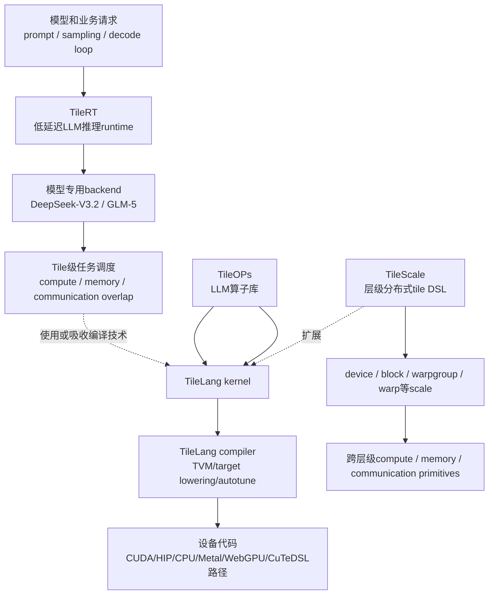
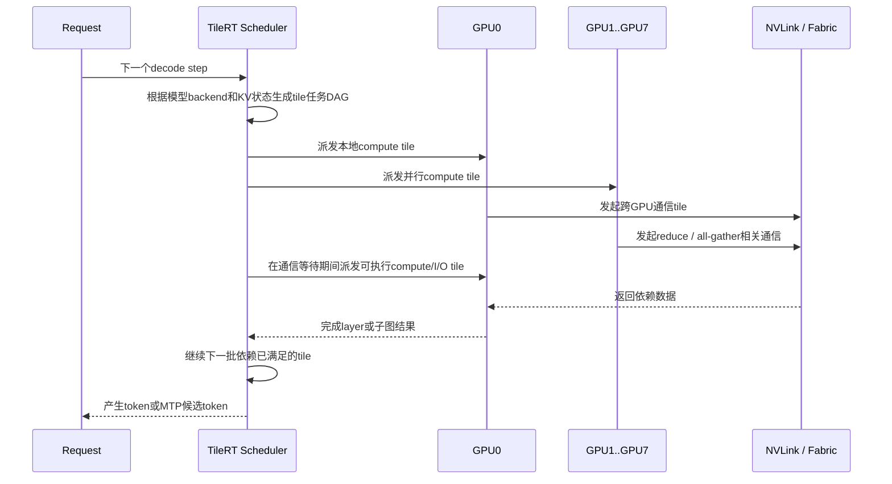
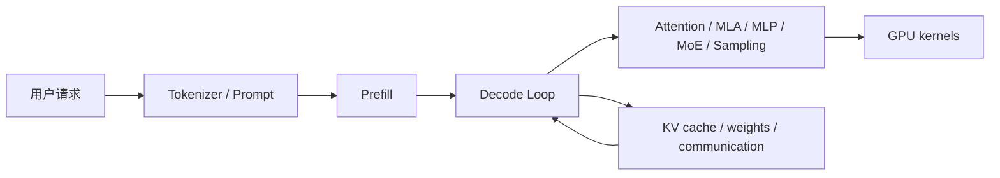

## 1. 先说结论

版本说明：本文参考的是2026-06-05访问的Tile-AI官方GitHub、PyPI、TileRT发布说明和TileLang论文。Tile生态还在快速演进，尤其是TileRT和TileScale，很多能力属于preview或实验阶段，生产使用要以具体release、wheel和硬件约束为准。

如果只用一句话理解Tile生态：

**TileLang负责写和编译tile级高性能kernel；TileOPs把常见LLM算子做成可复用库；TileScale把tile编程模型扩展到多GPU、多节点乃至层级分布式硬件；TileRT则是面向超低延迟LLM推理的runtime，把模型计算拆成更细的tile任务，在多GPU上重排、重叠计算、通信和I/O。**

这四个项目不是同一层东西：

| 项目 | 所在层级 | 主要目标 | 更像什么 | 当前状态要点 |
| --- | --- | --- | --- | --- |
| TileLang | kernel DSL / compiler | 用Pythonic DSL写高性能GPU/CPU/accelerator kernel | Triton/CUDA/TVM之间的一种tile级编程语言 | PyPI最新版0.1.10，已支持CUDA、ROCm、CPU、Metal、WebGPU等路径的一部分 |
| TileOPs | operator library | 把LLM常用算子封装成可调用、可验证、可调优的库 | 基于TileLang的FlashAttention/MLA/GEMM等算子集合 | PyPI仍是dev版本，GitHub README更强调spec-driven和agent生成 |
| TileScale | distributed DSL/compiler | 把tile级计算、内存和通信扩展到多GPU、多节点、chiplet/wafer等层级架构 | TileLang的分布式扩展和未来硬件抽象 | 早期实验项目，white paper还未公开 |
| TileRT | inference runtime | 让百B级LLM在单请求/小batch decode场景中达到极低TPOT | 专用低延迟推理runtime，不是写kernel的DSL | 0.1.4 preview，当前支持DeepSeek-V3.2、GLM-5，官方环境强绑定8x B200、Python 3.12、torch 2.11.0+cu130 |

最容易误解的是TileRT。它不是“TileLang的运行时后端”这么简单，也不是“另一个vLLM”。更准确地说，TileRT站在模型服务层，利用Tile-AI的tile级编译和调度思想，把一次decode step里的算子、数据搬运、跨GPU通信拆成细粒度任务，然后在runtime里重新排队和重叠执行，目标不是最大吞吐，而是把单个请求的每token延迟压到极低。

## 2. Tile生态的分层图

可以先用这张图把四个名字放到正确位置：



这里有三个边界要分清：

1. **语言 vs 库 vs runtime**：TileLang是语言和编译器；TileOPs是算子库；TileRT是服务大模型的runtime；TileScale是分布式编程模型。
2. **单kernel优化 vs 端到端decode优化**：TileLang让一个kernel更快、更可控；TileRT关心一次token生成过程中多层、多GPU、多算子之间如何组织。
3. **吞吐优先 vs 延迟优先**：很多推理系统默认优化high-throughput batch serving；TileRT公开定位是ultra-low-latency，即单请求响应速度优先。

## 3. 为什么都叫Tile

AI kernel的核心工作经常不是“对整个矩阵一次性做运算”，而是反复做这几件事：

1. 从HBM/DRAM拿一块数据tile到更近的内存，例如shared memory、register、LDS。
2. 在这块tile上做GEMM、attention、reduce、dequant、elementwise等计算。
3. 把中间结果留在片上继续用，或者写回全局内存。
4. 在多GPU或更复杂硬件上，还要把tile通过NVLink、InfiniBand、片上NoC等网络传到其他计算单元。

写高性能AI算子，本质上就是在安排这些tile的生命周期：

```text
global memory tile
    -> shared memory tile
    -> register / fragment tile
    -> tensor core / vector unit
    -> output tile
```

CUDA可以做到最细控制，但开发门槛高。Triton提高了可写性，但在一些复杂数据流、跨层级调度、特殊硬件指令和分布式抽象上仍会遇到表达力边界。TileLang论文的核心观点是：现代AI kernel的数据流模式相对清晰，但要写到峰值性能，需要处理线程绑定、layout、tensorize、pipeline等大量硬件相关调度。TileLang试图把“数据流”和“调度空间”拆开，让开发者用tile级primitive描述主要计算，再通过编译器和annotation补齐底层优化。

## 4. TileLang：生态的kernel语言底座

TileLang是一个面向高性能AI kernel的DSL。它的写法像Python，但底层有编译器基础设施，官方README明确说它构建在TVM之上。它可以用来实现GEMM、dequant GEMM、FlashAttention、LinearAttention、FlashMLA decoding、Native Sparse Attention等算子。

一个典型TileLang kernel会显式写出：

1. 输入输出tensor的shape和dtype。
2. kernel grid和线程数。
3. shared memory / fragment分配。
4. tile copy。
5. pipelined K-loop。
6. `T.gemm`、`T.copy`、`T.clear`、`T.Parallel`等tile primitive。

简化后大概是这样的精神：

```python
@tilelang.jit
def matmul_relu(A, B, block_M: int = 64, block_N: int = 64, block_K: int = 64):
    M, N, K = T.const("M, N, K")
    A: T.Tensor[[M, K], T.float16]
    B: T.Tensor[[K, N], T.float16]
    C = T.empty([M, N], T.float16)

    with T.Kernel(T.ceildiv(N, block_N), T.ceildiv(M, block_M), threads=128) as (bx, by):
        A_shared = T.alloc_shared((block_M, block_K), T.float16)
        B_shared = T.alloc_shared((block_K, block_N), T.float16)
        C_local = T.alloc_fragment((block_M, block_N), T.float32)

        T.clear(C_local)
        for ko in T.Pipelined(T.ceildiv(K, block_K), num_stages=3):
            T.copy(A[by * block_M, ko * block_K], A_shared)
            T.copy(B[ko * block_K, bx * block_N], B_shared)
            T.gemm(A_shared, B_shared, C_local)

        for i, j in T.Parallel(block_M, block_N):
            C_local[i, j] = T.max(C_local[i, j], 0)
        T.copy(C_local, C[by * block_M, bx * block_N])

    return C
```

这段代码体现了TileLang的核心取向：

1. 它不是自动把任意PyTorch模型编译快，而是让你写具体kernel。
2. 它比CUDA抽象更高，但仍然暴露tile、shared memory、fragment、pipeline等关键性能概念。
3. 它允许你拿到编译产物、profile latency、调整block size、做autotune。
4. 它对新硬件特性很敏感，例如TMA、WGMMA、Blackwell FP4/FP6/FP8相关路径、AMD MFMA/WMMA、Metal等。

截至2026-06-05，TileLang最新版GitHub release是v0.1.10，发布说明里重点包括AMD RDNA/CDNA支持、Blackwell MXFP8/FP4相关能力、TMA gather/scatter、`T.copy_cluster`、Metal GEMM、autotune改进、多backend重构、Python >= 3.10等。这说明TileLang已经不只是“写H100 CUDA kernel”，而是逐渐变成一个多后端tile compiler。

但要注意：多后端支持不等于所有后端都同等成熟。高性能AI kernel最终还是强依赖具体硬件、驱动、CUDA/ROCm版本、PyTorch ABI和编译链路。TileLang给的是更统一的表达和lowering框架，不是抹平所有硬件差异。

## 5. TileOPs：把TileLang kernel沉淀成算子库

如果TileLang是“语言”，TileOPs就是“用这门语言写出来、给别人直接调用的算子库”。

官方README里对TileOPs的定位有两个重点：

1. 它是面向LLM训练和推理的GPU operator library，构建在TileLang之上。
2. 它探索spec-driven development：每个operator有机器可读manifest，描述签名、workload和roofline公式，使AI agent或自动化流程可以读取规格、生成实现、跑benchmark、对照硬件理论上界。

TileOPs的架构分两层：

| 层 | 作用 |
| --- | --- |
| Op / L2 | 无状态Python入口，负责参数校验、dtype转换、memory layout处理，并要求兼容CUDA Graph和`torch.compile`等上层执行方式 |
| Kernel / L1 | TileLang GPU实现，包含具体硬件优化，例如Ampere、Hopper上的tile size、pipeline、schedule策略 |

这层分离很重要。因为一个算子有两个不同的稳定性需求：

1. **用户API要稳定**：输入shape、dtype、layout、输出语义、错误处理不能随便变。
2. **底层kernel要可替换**：H100和B200策略不同，训练和推理场景不同，batch/seq/head维度不同，都可能要换kernel实现。

TileOPs把这两个问题拆开，让上层调用者面对的是`GemmOp`、`MLAKernel`、`SparseMLAKernel`这类对象，而kernel开发者或agent可以在底层替换TileLang实现。

一个非常粗略的调用方式类似：

```python
import torch
from tileops.ops import GemmOp

M, N, K = 1024, 1024, 512
gemm = GemmOp(M, N, K, dtype=torch.float16)

A = torch.randn(M, K, device="cuda", dtype=torch.float16)
B = torch.randn(K, N, device="cuda", dtype=torch.float16)
C = gemm(A, B)
```

TileOPs当前要谨慎看待两个事实：

1. GitHub README描述的是活跃开发中的新架构，强调spec-driven、roofline-evaluated、auto-tuning。
2. PyPI上`tileops`截至本文访问时还是`0.0.1.dev2`，描述和包结构可能与GitHub README存在不同步。生产使用时应优先看目标commit、文档和实际安装包，而不是只看包名。

从生态意义上看，TileOPs的价值不是“又一个算子集合”，而是把TileLang的能力从“专家写kernel”推进到“规范化维护operator”。如果未来manifest、benchmark、roofline和agent生成这套机制成熟，它会很适合快速迭代LLM新算子，例如MLA、sparse attention、量化GEMM、融合norm、sampling相关kernel等。

## 6. TileScale：把tile从单GPU扩展到层级分布式硬件

TileScale是最“未来向”的一个项目。官方README称它是TileLang的distributed extension，用来把TileLang的tile-level programming扩展到multi-GPU、multi-node，甚至分布式芯片架构范围。

这里的关键词是Hierarchical Distributed Architecture，简称HDA。它想抽象的是一套层级硬件：

1. thread。
2. warp。
3. warpgroup。
4. thread block / CTA。
5. CTA cluster。
6. device / GPU。
7. node。
8. 多节点集群。
9. 未来的3D IC、near-memory / in-memory computing、wafer-scale accelerator等。

传统CUDA主要站在单GPU SIMT视角。TileScale想表达的是：计算单元、内存和网络都可以分层，每一层都有自己的并行单位、memory layer和communication channel。

它提供的核心抽象包括：

1. **Compute primitive**：在某个scale上对tile做计算，例如warp级GEMM、block级GEMM、cluster级GEMM。
2. **Memory primitive**：在某个memory layer分配、view、copy tile。
3. **Communication primitive**：在某个scale上做peer-to-peer通信、barrier、allreduce、all2all等。
4. **`T.Scale`**：指定当前计算发生在哪个层级，并允许拿到当前rank和rank数量，从而写warp specialization、device-level allreduce等逻辑。

例如它的编程思想大概是：

```python
with T.Scale("warp"):
    T.gemm(A, B, C)

with T.Scale("device") as dev_id, dev_num:
    T.copy(remote_B, local_A, dst=(dev_id + 1) % dev_num)
    T.barrier()
```

TileScale最有意思的点，是它试图统一“片内分布式”和“片外分布式”。比如Hopper的CTA cluster、DSMEM、TMA multicast、SM之间的通信，本质上已经不再是传统单block思维；多GPU上的NVLink allreduce、context parallelism、tensor parallelism又是另一层分布式。TileScale希望开发者能用同一套tile primitive描述不同层级的计算和通信，然后由compiler、tile kernel library、cost model和硬件backend一起决定怎么lower。

但当前阶段必须保守判断：

1. TileScale README明确说完整technical white paper还没公开。
2. 仓库本身是从TileLang fork出来的早期实验项目。
3. 它的愿景很大，但距离稳定生产工具还有明显距离。

所以TileScale更适合作为理解Tile-AI长期路线的线索：他们不只想写单GPU kernel，而是想把tile作为AI计算的统一调度单位，从thread一直扩展到多节点和未来芯片架构。

## 7. TileRT到底是什么

TileRT是最容易搞混的项目，因为名字里有RT，容易被理解成“TileLang runtime”。但从官方README看，它的定位更具体：

**TileRT是面向超低延迟LLM推理的tile-based runtime。它服务的是百B级大模型decode场景，目标是毫秒级TPOT，而不是给任意TileLang kernel提供一个通用运行时。**

### 7.1 它解决的问题不是“kernel不会写”

LLM推理有两个典型目标：

1. **高吞吐**：单位时间服务尽可能多token或请求，常见策略是batching、continuous batching、prefix caching、KV cache调度、较高并发。
2. **低延迟**：单个请求尽快返回下一个token，尤其是交互式AI、实时决策、AI coding、高频交易、long-running agent等场景。

高吞吐系统可以容忍等待更多请求合批，因为合批能提高GPU利用率。但低延迟场景里，请求不能一直等batch凑齐。问题变成：

```text
batch小 -> GPU利用率低 -> token延迟高
batch大 -> 利用率高 -> 排队等待和单请求响应变慢
```

TileRT的出发点就是打这个矛盾：在低batch、单请求敏感的情况下，仍然尽量让多GPU上的计算、通信和I/O被填满。

### 7.2 它做的是tile级runtime调度

官方描述里最关键的一句是：TileRT把LLM operators decomposed into fine-grained tile-level tasks，并让runtime dynamically reschedules computation, I/O, and communication across multiple devices in an overlapped manner。

翻译成机制，就是一次decode step不再被看成几个大kernel顺序执行：

```text
layer 0 attention -> layer 0 MLP -> layer 1 attention -> layer 1 MLP -> ...
```

而是拆成更细的tile任务：

```text
Q/K/V tile compute
KV tile load
attention score tile
softmax/reduce tile
MoE/GEMM tile
inter-GPU communication tile
output projection tile
sampling / accept check
```

然后runtime决定哪些任务可以提前做，哪些可以和通信重叠，哪些可以跨GPU并行，哪些要等依赖满足。

一个简化的decode step生命周期可以这样理解：



这和普通“kernel库”完全不是一个层级。kernel库只回答“这个GEMM或attention tile怎么快”；TileRT还要回答：

1. 这个tile什么时候执行。
2. 放在哪张GPU执行。
3. 它依赖哪些tile。
4. 哪些通信可以提前发起。
5. 哪些计算可以填补通信空洞。
6. 多token prediction开启后，哪些候选token被接受，怎样减少串行decode步数。

### 7.3 TileRT为什么强调TPOT

TPOT是Time Per Output Token，也就是生成每个输出token的时间。对用户可感知延迟来说，decode阶段的TPOT非常关键。prefill可以通过大矩阵和较高并行度吃满GPU，但decode每步只生成一个或少数几个token，经常受这些因素限制：

1. batch小，矩阵维度不够大。
2. KV cache读取和attention计算受memory bandwidth影响。
3. MoE或MLP跨GPU通信带来同步等待。
4. 多GPU tensor parallel / expert parallel需要reduce、all-gather或dispatch。
5. autoregressive decode天然串行：第`t+1`个token依赖第`t`个token。

TileRT当前公开结果重点放在8x NVIDIA B200上，支持DeepSeek-V3.2和GLM-5，并展示了MTP下更高token/s。MTP的基本意义是：模型一次forward不只预测一个token，而是提出多个候选token，再通过接受机制决定保留多少。如果平均接受长度是3左右，那么串行decode步数就被压缩，TPOT有机会大幅降低。

但MTP不是免费加速：

1. 接受长度取决于模型、prompt、采样策略和任务分布。
2. best-case acceptance不等于真实生产平均。
3. MTP需要模型或runtime支持相应预测/验证路径。
4. 质量、采样语义和延迟之间要实际评估。

TileRT v0.1.4发布说明强调：相对v0.1.3，它对DeepSeek-V3.2和GLM-5在top-k、top-p、有无MTP、长上下文等路径做了性能升级，并保持API和部署流程基本不变。

### 7.4 TileRT不是通用vLLM替代品

把TileRT理解成“更快的vLLM”会误导。它当前更像一个强约束、模型专用、硬件专用的低延迟runtime。

官方v0.1.4 wheel的约束非常明确：

| 组件 | 官方约束 |
| --- | --- |
| GPU | 8x NVIDIA B200 |
| CUDA runtime | 13.x路径，README里要求driver支持CUDA 13.2，验证输出是cuda 13.0 |
| OS | Linux x86_64，glibc >= 2.28 |
| Python | 3.12 |
| PyTorch | `torch==2.11.0+cu130` |
| transformers | 4.46.3 |
| tokenizers | 0.20.3 |
| 模型 | 当前preview支持DeepSeek-V3.2和GLM-5 |

这和vLLM、SGLang、TensorRT-LLM等通用服务框架的使用体验不同。后者通常强调更多模型、多硬件、更通用的serving功能；TileRT当前更强调把少数frontier模型在固定硬件上做到极低延迟。

可以这样对比：

| 系统 | 优先目标 | 典型强项 | 典型代价 |
| --- | --- | --- | --- |
| vLLM / SGLang | 通用LLM serving、高吞吐、生态适配 | 模型覆盖广、调度和缓存机制成熟、易集成 | 单请求极限低延迟未必是首要目标 |
| TensorRT-LLM | NVIDIA生态内高性能推理 | 图优化、kernel融合、量化、多GPU部署 | 构建和版本约束较强 |
| TileRT | 百B级模型超低TPOT | tile级任务调度、计算/通信/I/O重叠、MTP低延迟路径 | 当前模型、硬件、ABI约束很强，preview阶段 |

### 7.5 TileRT和TileLang、TileScale是什么关系

官方README说，TileRT背后的compiler技术会逐步分享到社区，并集成进TileLang和TileScale。这个表述说明TileRT不是孤立项目，它更像是Tile-AI把tile思想用于真实LLM推理的系统实现。

合理推断关系如下：

1. TileLang提供单算子和tile kernel表达能力。
2. TileScale探索跨GPU/跨层级硬件的tile编程和通信primitive。
3. TileRT把这些思想具体落到LLM decode runtime：模型backend、权重切分、tile任务图、低延迟调度、MTP生成、采样接口。
4. TileRT中的部分编译和调度经验，未来可能反哺TileLang/TileScale。

但不要倒过来说“学会TileLang就能直接写TileRT”。TileRT涉及模型结构、权重格式、推理状态、KV cache、sampling、MTP、跨GPU通信、runtime调度和部署ABI，复杂度远高于单个kernel。

## 8. 四者放在一个LLM推理例子里

假设你要服务一个DeepSeek/GLM级别的大模型，目标是低延迟decode：



四个项目会分别落在不同位置：

1. **TileLang**：写`Attention / MLA / GEMM / dequant / reduce`等底层kernel。
2. **TileOPs**：把这些kernel封装成可复用算子，带manifest、benchmark、roofline和调优入口。
3. **TileScale**：如果这些算子需要跨GPU、CTA cluster、warpgroup、device level通信，它提供更统一的层级分布式表达方式。
4. **TileRT**：把整个decode loop组织起来，决定怎么加载权重、怎么切分任务、怎么在8张B200上调度tile、怎么执行MTP、怎么输出token。

所以，TileRT不是TileOPs的替代品，也不是TileScale的上位版本。它是一个端到端runtime，把底层tile kernel和跨设备tile调度拿来解决“百B模型低延迟生成”这个具体问题。

## 9. 实际应该怎么用

如果你是kernel开发者：

1. 从TileLang开始。
2. 先写GEMM、dequant GEMM、FlashAttention、MLA这类明确输入输出的单算子。
3. 学会profile、查看生成源码、调block size、pipeline stage、layout和swizzle。
4. 对标Triton/CUDA/CUTLASS，看瓶颈是compute、memory bandwidth、occupancy还是同步。

如果你是模型/推理工程师：

1. 关注TileOPs能否提供你需要的算子。
2. 看它是否兼容你的PyTorch版本、CUDA Graph、`torch.compile`路径。
3. 不要只看平均latency，要看输入分布、长上下文、batch、dtype、量化格式和真实采样配置。

如果你研究多GPU/未来硬件编程：

1. 重点看TileScale。
2. 关注`T.Scale`、memory level、communication primitive、HDA抽象。
3. 用它理解Tile-AI为什么要把tile从单GPU扩展到device、node甚至chip architecture。
4. 但现阶段不要把它当成熟生产工具。

如果你要做超低延迟LLM服务：

1. 重点看TileRT。
2. 先确认硬件是否接近官方环境，尤其是8x B200和CUDA/PyTorch ABI。
3. 再确认模型是否在支持列表里，目前是DeepSeek-V3.2和GLM-5。
4. 如果你的目标是“尽可能多模型、尽快上线”，TileRT可能不是第一选择。
5. 如果你的目标是“固定frontier模型、固定硬件、单请求TPOT极限优化”，TileRT才值得投入。

## 10. 常见误区

**误区一：TileLang等于Triton替代品。**

部分场景可以这么类比，但不完整。TileLang更强调tile dataflow、TVM编译基础、多backend和复杂AI kernel表达。Triton更成熟、更广泛使用，生态和PyTorch integration也更强。二者是竞争和互补关系，不是简单替换。

**误区二：TileOPs就是TileLang examples。**

不是。examples展示怎么写kernel；TileOPs想做的是带稳定Op入口、manifest、benchmark、roofline和自动调优的operator library。它的工程目标更接近“可维护算子产品”。

**误区三：TileScale就是多GPU版TileLang。**

这个说法只说对了一半。TileScale确实扩展TileLang到多GPU/多节点，但它的野心更大：用HDA抽象统一thread、warp、CTA cluster、GPU、node、未来分布式芯片等层级。

**误区四：TileRT是TileLang的runtime。**

这是最关键的误区。TileRT是LLM推理runtime，负责服务模型、权重转换、backend加载、decode、MTP和tile任务调度。它可能使用或吸收TileLang/TileScale的编译技术，但它不是给所有TileLang kernel提供通用执行环境的runtime。

**误区五：TileRT适合所有LLM部署。**

当前不适合。它的preview版本强绑定模型、硬件和软件栈。TileRT的价值在“极低延迟专用路径”，不是通用模型托管。

## 11. 一句话总结

Tile生态的主线是把**tile**从一个kernel内部的数据块，提升为贯穿算子库、分布式编程和LLM推理runtime的统一调度单位。

1. **TileLang**让你写tile级高性能kernel。
2. **TileOPs**把这些kernel沉淀成LLM算子库。
3. **TileScale**把tile扩展到多GPU、多节点和层级分布式硬件。
4. **TileRT**把tile级任务调度用于超低延迟LLM decode，目标是固定模型和固定硬件上的极限TPOT。

如果重点理解TileRT，只要抓住这句话：**TileRT不是用来“写算子”的，而是用来“服务大模型”的；它把decode过程拆成tile级任务，并在多GPU上动态调度这些任务，让计算、通信和I/O尽可能重叠，从而降低单请求每token延迟。**

## 参考

1. TileLang GitHub: <https://github.com/tile-ai/tilelang>
2. TileLang PyPI: <https://pypi.org/project/tilelang/>
3. TileLang v0.1.10 Release: <https://github.com/tile-ai/tilelang/releases/tag/v0.1.10>
4. TileLang论文：TileLang: A Composable Tiled Programming Model for AI Systems, arXiv:2504.17577: <https://arxiv.org/abs/2504.17577>
5. TileOPs GitHub: <https://github.com/tile-ai/TileOPs>
6. TileOPs PyPI: <https://pypi.org/project/tileops/>
7. TileScale GitHub: <https://github.com/tile-ai/tilescale>
8. TileRT GitHub: <https://github.com/tile-ai/TileRT>
9. TileRT PyPI: <https://pypi.org/project/tilert/>
10. TileRT v0.1.4 Release: <https://github.com/tile-ai/TileRT/releases/tag/v0.1.4>
11. TileRT官方博客：速度即下一代Scaling Law: <https://www.tilert.ai/blog/speed-as-the-next-scaling-law-zh.html>
