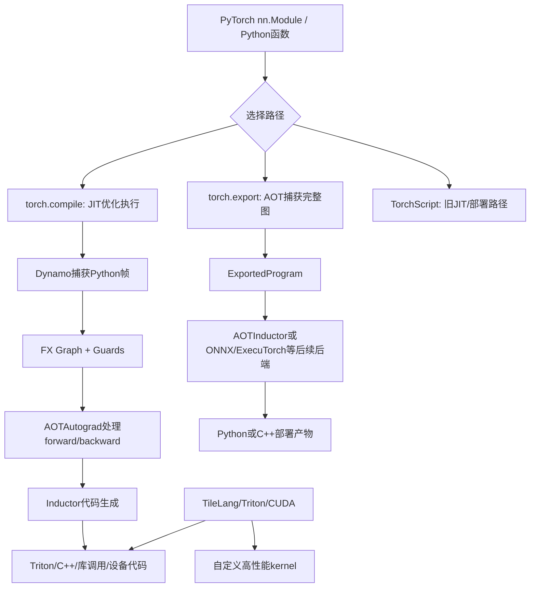
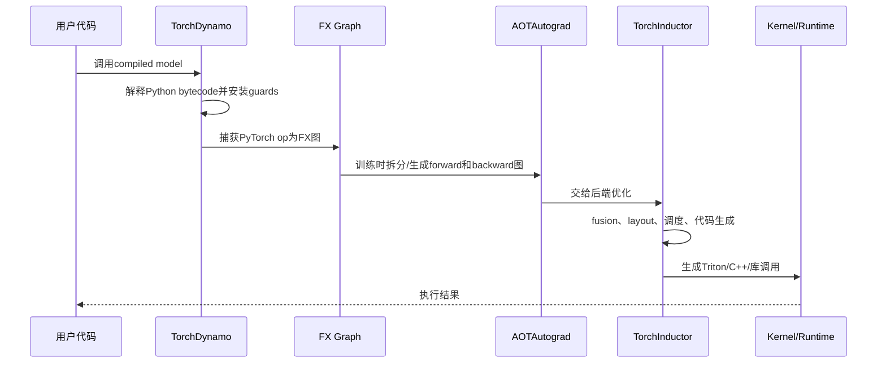
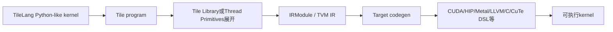

## 1. 先说结论

版本说明：本文参考的是2026-05-18访问的PyTorch 2.12/main文档、TileLang 0.1.9文档、TileLang论文和Triton官方文档。PyTorch编译栈和TileLang都还在快速演进，生产环境要以实际安装版本为准。

最容易混淆的几个词，可以先这样理解：

1. **JIT，Just-In-Time**：运行时才根据真实代码路径、输入shape、dtype、device等信息捕获图并编译。`torch.compile`就是典型JIT式优化入口。
2. **AOT，Ahead-Of-Time**：部署或运行前先把模型捕获、编译、打包成产物。`torch.export`、AOTInductor、`torch.compile(...).aot_compile()`都属于AOT相关路线，但目标不同。
3. **TorchScript**：老一代PyTorch图捕获和部署方案，包含`torch.jit.trace`和`torch.jit.script`。PyTorch 2.9文档已经明确标注TorchScript deprecated，并建议使用`torch.export`。
4. **torch.compile**：PyTorch 2.x的主力性能优化入口。它不是把整个模型变成一个永久文件，而是在运行时通过Dynamo捕获Python帧，生成FX图，再交给后端，默认是Inductor。
5. **AOTAutograd**：`torch.compile`链路里处理训练反向图的关键组件。它的“AOT”不是“离线部署产物”，而是指在编译前把forward和backward一起图化、函数化和优化。
6. **TorchInductor**：`torch.compile`默认后端，负责把图进一步lower成高性能代码。GPU上常会生成Triton kernel或调用模板/库。
7. **TileLang**：面向AI kernel开发的tile-based DSL。它解决的是“某个算子/kernel怎样写得更快、更可控”，而不是自动编译任意PyTorch模型。

一句话放进体系里：

**torch.compile优化的是PyTorch程序图；TileLang写的是底层高性能kernel；JIT/AOT描述的是编译发生在运行时还是运行前；TorchScript是旧方案，torch.export和AOTInductor是新部署方向。**

## 2. 先把层次分清楚

讨论这些概念时，最好先区分三层：

1. **模型/程序层**：`nn.Module.forward`、Python控制流、Autograd、训练循环。
2. **图/编译器层**：Dynamo、FX Graph、AOTAutograd、Inductor、export graph。
3. **kernel/硬件层**：CUDA、Triton、TileLang、CUTLASS、TVM、cuBLAS、自定义算子。

很多误解来自把三层混在一起。例如：

1. `torch.compile`不是Triton，也不是TileLang。它可以在某些路径生成Triton kernel，但入口仍是PyTorch程序。
2. Triton和TileLang不是完整模型编译器。它们更像写高性能kernel的语言/编译器。
3. AOTAutograd里的AOT，不等于AOTInductor里的AOT部署。前者是训练图编译流程里的“提前生成反向图”，后者是把exported model编译成可部署产物。

可以用这张图定位：



## 3. JIT到底是什么

JIT是Just-In-Time，直译是即时编译。

它的核心不是“用了装饰器”，也不是“第一次慢后面快”这么简单，而是：

**编译器等到程序运行起来，看到真实执行路径和真实输入特征后，再生成专门优化过的代码。**

对于PyTorch来说，JIT编译通常要处理这些运行时信息：

1. 输入tensor的shape。
2. dtype，例如`float16`、`bfloat16`、`float32`。
3. device，例如CPU、CUDA、ROCm。
4. stride和memory format。
5. Python分支实际走哪条路径。
6. 模型处于training还是eval。
7. 是否发生了数据依赖控制流。

一个最简单的JIT心理模型：

```text
第一次调用:
Python函数 + 输入样例 -> 捕获图 -> 编译 -> 执行 -> 缓存

后续调用:
检查guard是否满足 -> 满足则复用已编译代码
                  -> 不满足则重新编译或回退eager
```

这里的guard可以理解为“这份编译结果成立的前提”。例如：

```text
x.dtype == torch.float16
x.device == cuda:0
x.shape[0] <= 某个动态范围
某个全局配置没有变化
```

如果后续输入破坏了这些假设，就可能触发recompile。PyTorch的`torch.compile`文档也强调：同一个Python frame可以因为guard failure被编译多次，达到重编译上限后可能回退到eager。

## 4. AOT到底是什么

AOT是Ahead-Of-Time，直译是提前编译。

它的核心是：

**在真正服务请求或部署运行之前，提前完成图捕获、优化、代码生成、打包，运行时尽量只加载和执行产物。**

典型收益：

1. 减少线上冷启动编译延迟。
2. 可以把编译和部署拆开。
3. 更适合C++服务、边缘设备、无Python环境部署。
4. 产物更容易版本化、缓存和分发。

典型代价：

1. 灵活性更低。
2. 对输入shape、dtype、stride、device的约束更强。
3. 需要更完整地处理动态shape和控制流。
4. 编译失败往往不能像`torch.compile`那样局部graph break后继续跑Python。

所以不要简单地说“AOT一定比JIT快”。更准确的说法是：

**AOT把编译成本前移，运行时更稳定；JIT把编译决策放到运行时，灵活性更好，但可能有冷启动和重编译成本。**

## 5. torch.compile是什么

`torch.compile`是PyTorch 2.x的主要性能优化入口。它接收一个Python函数或`nn.Module`，返回一个优化后的callable。

常见用法：

```python
import torch

model = MyModel().cuda()
model = torch.compile(model, mode="max-autotune")

with torch.no_grad():
    y = model(x)
```

或者：

```python
@torch.compile(fullgraph=False, dynamic=None, backend="inductor")
def fn(x, y):
    return torch.sin(x) + torch.cos(y)
```

几个关键参数：

1. `backend="inductor"`：默认后端。Inductor负责优化和代码生成。
2. `fullgraph=False`：默认允许graph break。不能编译的地方回到Python eager执行。
3. `fullgraph=True`：要求整个函数捕获成一个图，遇到graph break直接报错，适合调试和AOT场景。
4. `dynamic=None`：默认在需要时尝试动态shape。`dynamic=True`会更主动生成动态kernel，`False`会更强地特化shape。
5. `mode="reduce-overhead"`：偏向减少Python/CUDA launch overhead，常搭配CUDA Graph，但可能占用更多内存。
6. `mode="max-autotune"`：更积极地autotune matmul/conv等实现，编译更慢，可能运行更快。

`torch.compile`最重要的特点是：

**它不要求你先重写模型。它从普通PyTorch代码出发，尽量捕获可编译区域；遇到暂时处理不了的Python行为，可以graph break。**

这也是它和`torch.export`的关键差别。

## 6. torch.compile内部大致怎么走

一个简化后的`torch.compile`链路如下：



### 6.1 Dynamo

Dynamo是`torch.compile`的前端。它利用CPython的frame evaluation能力，在Python字节码层观察程序执行，把PyTorch tensor计算捕获成FX图。

Dynamo要解决的问题是：

1. Python太灵活，不能假设所有代码都可静态分析。
2. PyTorch eager代码里可能混着普通Python逻辑、列表、字典、全局变量、随机数、I/O。
3. 编译结果必须只在假设成立时复用。

所以Dynamo会生成guards。guards满足时，走已编译图；guards不满足时，重新编译或回退。

### 6.2 FX Graph

FX Graph可以理解为PyTorch operator级别的计算图。它不是最终CUDA代码，而是中间表示。

例如：

```python
def fn(x):
    return torch.relu(x @ x.T + 1)
```

可能被捕获成类似这样的节点：

```text
placeholder x
call_function aten.t
call_function aten.mm
call_function aten.add
call_function aten.relu
output
```

后续优化就可以在图上做fusion、消除冗余、选择layout和生成kernel。

### 6.3 AOTAutograd

训练时不仅有forward，还有backward。PyTorch eager的Autograd通常是在运行forward时动态记录反向所需信息，然后backward时再执行反向逻辑。

AOTAutograd做的事情可以粗略理解为：

1. 提前拿到forward图。
2. 根据Autograd规则生成backward图。
3. 把mutation/view等复杂行为函数化，尽量转成编译器更容易处理的形式。
4. 让Inductor等后端能同时优化forward和backward。

注意这里的“AOT”容易误导。它不是说“把模型提前编译成文件部署”。它是在`torch.compile`运行时编译流程里，提前构造反向图。

### 6.4 Inductor

Inductor是默认后端。它的工作是把FX/Aten图lower成更接近硬件的实现。

它会做：

1. operator fusion，例如把`add + relu + mul`合成一个kernel。
2. layout优化，减少不必要的内存搬运。
3. 选择调用高性能库，或者生成自定义kernel。
4. GPU上常用Triton作为代码生成的重要构件。
5. CPU上生成C++/OpenMP等实现。

所以`torch.compile`里的加速，很多时候来自两个方向：

1. 减少Python解释和op dispatch开销。
2. 减少中间tensor读写，把多个小op融合成更少kernel。

## 7. graph break是什么

graph break就是编译器捕获图时遇到无法放进当前图里的东西，于是把图切开：

```text
可编译图1 -> 回到Python eager执行一段 -> 可编译图2
```

常见原因：

1. 依赖tensor值的Python分支。
2. 打印、文件I/O、网络请求。
3. 不支持的Python对象操作。
4. 某些第三方库调用。
5. 动态shape过于复杂。
6. 自定义C++/CUDA op没有合适的meta/fake tensor支持。

例子：

```python
@torch.compile
def fn(x):
    if x.sum().item() > 0:
        return x + 1
    return x - 1
```

这里`x.sum().item()`把tensor值拿回Python，分支取决于运行时数据。编译器很难把它当作普通静态分支处理，因此容易graph break。

更好的写法是尽量使用tensor表达：

```python
@torch.compile
def fn(x):
    return torch.where(x.sum() > 0, x + 1, x - 1)
```

当然，不是所有graph break都必须消灭。对大模型来说，如果主要计算区域已经编译，少量外围Python逻辑graph break可能可以接受。真正需要关注的是：

1. graph break是否发生在热点路径。
2. 是否导致大量小图，反而增加launch和调度开销。
3. 是否反复recompile。

## 8. TorchScript是什么，为什么现在不优先用

TorchScript是PyTorch早期为“图化、优化、脱离Python运行”设计的系统。主要入口有两个：

1. `torch.jit.trace`
2. `torch.jit.script`

`trace`通过样例输入跑一遍模型，记录实际执行到的tensor op。它适合没有数据依赖控制流的模型。

问题是：如果模型行为依赖输入数据，trace可能只记录样例输入走过的路径。

例如：

```python
class M(torch.nn.Module):
    def forward(self, x):
        if x.sum() > 0:
            return x + 1
        else:
            return x - 1
```

如果用正数输入trace，图里可能只留下`x + 1`那条路径。后面换成负数输入，结果可能错。

`script`则尝试解析一部分Python语法，把它编译成TorchScript IR。它能表达一些控制流，但对Python语言特性的支持有限，写法约束更强。

现在的现实情况是：

1. PyTorch 2.x主推`torch.compile`作为性能优化入口。
2. 新的导出和部署路径主推`torch.export`、AOTInductor、ExecuTorch、ONNX新导出器等。
3. PyTorch 2.9 TorchScript文档已经标注deprecated，并建议使用`torch.export`。

所以新项目一般不应该把TorchScript作为首选，除非你维护的是已有TorchScript部署链路，或者某个下游工具仍强依赖TorchScript格式。

## 9. torch.export是什么

`torch.export`是PyTorch 2时代面向AOT图捕获的核心接口之一。它接收`nn.Module`和样例输入，产出`ExportedProgram`。

典型用法：

```python
import torch
from torch.export import export

class Mod(torch.nn.Module):
    def forward(self, x, y):
        return torch.sin(x) + torch.cos(y)

ep = export(Mod(), args=(torch.randn(10, 10), torch.randn(10, 10)))
print(ep)
```

它和`torch.compile`的差异非常关键：

| 维度 | torch.compile | torch.export |
|---|---|---|
| 主要目标 | 运行时加速PyTorch程序 | 生成可保存、可传给后端的完整图 |
| 编译时机 | JIT，通常首次调用时编译 | AOT，一次性捕获 |
| graph break | 默认允许，回退Python | 通常要求完整图，不可捕获就报错 |
| 灵活性 | 高 | 低一些 |
| 部署 | 主要仍在Python进程内 | 更适合作为部署/转换入口 |
| 产物 | 编译缓存，不是稳定模型格式 | `ExportedProgram`，可保存/加载/后处理 |

`torch.export`不会神奇地支持所有Python。它会把模型中tensor计算规范化为图，并记录shape约束。遇到无法证明正确的动态行为，用户要显式改写代码、标注动态shape，或者使用受支持的控制流算子。

## 10. AOTInductor是什么

AOTInductor是Inductor面向提前编译部署的形态。PyTorch文档的定位很明确：

1. 先用`torch.export.export()`捕获模型为计算图。
2. 再用AOTInductor编译、优化、打包。
3. 产物可以用于Python加载，也可以用于C++环境。

简化流程：

```text
nn.Module
  -> torch.export.export(...)
  -> ExportedProgram
  -> torch._inductor.aoti_compile_and_package(...)
  -> model.pt2
  -> Python/C++ runtime load and run
```

这和普通`torch.compile`最大的区别是：

**普通torch.compile是“运行时遇到模型再编译并缓存”；AOTInductor是“部署前把export后的模型编译成包”。**

适合AOTInductor的场景：

1. C++ server inference。
2. 需要减少线上冷启动。
3. 需要把编译环境和运行环境分开。
4. 输入shape范围相对可控。
5. 需要更强的产物管理。

不适合的场景：

1. 模型Python动态行为很多。
2. 输入shape完全不可预测。
3. 还在频繁调模型结构。
4. 下游运行环境不支持对应产物。

## 11. torch.compile(...).aot_compile()又是什么

PyTorch 2.12文档里还有一个更新的实验能力：`torch.compile(...).aot_compile()`。

它的定位和AOTInductor不同：

1. 它直接作用在`torch.compile`包装后的函数或模块上。
2. 它提前完成trace、Inductor codegen、Triton kernel编译、autotuning等步骤。
3. 保存出来的产物再加载回Python runtime使用。

可以简单区分：

| 方案 | 输入 | 输出 | 主要用途 |
|---|---|---|---|
| `torch.compile` | Python函数/Module | Python callable | 运行时加速 |
| `torch.export` | Module + example inputs | `ExportedProgram` | AOT图捕获、转换入口 |
| AOTInductor | `ExportedProgram` | `.pt2`/shared library等 | Python/C++部署 |
| `torch.compile(...).aot_compile()` | compiled callable + example inputs | 可保存的Python callable产物 | Python内预编译、减少冷启动 |

它仍是实验特性，使用时要接受API变化风险。

## 12. Triton在这里扮演什么角色

Triton是一个Python风格的GPU kernel编程语言和编译器。它让开发者用比CUDA更高层的方式写kernel，同时仍然能控制block级别的数据搬运和计算。

例如Triton常见写法：

```python
import triton
import triton.language as tl

@triton.jit
def add_kernel(x, y, out, n: tl.constexpr, BLOCK: tl.constexpr):
    pid = tl.program_id(0)
    offsets = pid * BLOCK + tl.arange(0, BLOCK)
    mask = offsets < n
    a = tl.load(x + offsets, mask=mask)
    b = tl.load(y + offsets, mask=mask)
    tl.store(out + offsets, a + b, mask=mask)
```

Triton和`torch.compile`的关系：

1. 你可以手写Triton kernel，然后从PyTorch调用。
2. Inductor在GPU后端也会生成Triton代码。
3. 但`torch.compile`不是“Triton装饰器”。它是模型/程序级入口。

## 13. TileLang是什么

TileLang是一个面向高性能AI kernel开发的DSL。TileLang官方文档把它描述为简洁的domain-specific language，用Pythonic语法和基于TVM的编译基础设施来开发高性能GPU/CPU kernel，例如GEMM、Dequant GEMM、FlashAttention、LinearAttention。

TileLang论文的核心观点是：

**AI kernel通常有清晰的数据流模式，例如把tile从DRAM搬到SRAM，在片上存储里计算，再写回；难点在于把这些模式映射到具体硬件时需要大量调度、布局、线程绑定、pipeline和tensorize细节。**

TileLang试图把两件事分开：

1. **dataflow**：这个kernel在数学上做什么，tile如何流动。
2. **schedule/optimization**：线程怎样绑定，内存怎样布局，pipeline怎样安排，tensor core怎样使用。

它提供不同抽象层：

1. Beginner Level：更硬件无关，目标是让用户关注基本逻辑。文档说明这个接口还未完全实现。
2. Developer Level：硬件感知但使用Tile Library，复用预定义高性能模式。
3. Expert Level：暴露thread primitives等低层控制，让专家做细粒度优化。

TileLang的编译流大致是：



## 14. TileLang的编程模型

TileLang名字里的Tile很重要。

GPU高性能算子通常不会“一个元素一个元素”思考，而是按tile组织：

1. 从global memory读取一块`A_tile`和`B_tile`。
2. 放进shared memory。
3. 使用register/fragment保存局部累加。
4. 循环K维，做pipeline。
5. 把结果tile写回global memory。

简化的GEMM数据流：

```text
C[M, N] = A[M, K] @ B[K, N]

for block_m, block_n:
    acc_tile = 0
    for block_k:
        A_tile: global -> shared
        B_tile: global -> shared
        acc_tile += mma(A_tile, B_tile)
    acc_tile -> global C_tile
```

TileLang让这些结构显式出现在代码里，例如：

```python
import tilelang
import tilelang.language as T

@tilelang.jit(out_idx=[-1])
def matmul(M: int, N: int, K: int,
           block_M: int = 128, block_N: int = 128, block_K: int = 32,
           threads: int = 128, num_stages: int = 3,
           dtype: str = "float16", accum_dtype: str = "float32"):
    @T.prim_func
    def kernel(A: T.Tensor((M, K), dtype),
               B: T.Tensor((K, N), dtype),
               C: T.Tensor((M, N), dtype)):
        with T.Kernel(T.ceildiv(N, block_N),
                      T.ceildiv(M, block_M),
                      threads=threads) as (bx, by):
            A_s = T.alloc_shared((block_M, block_K), dtype)
            B_s = T.alloc_shared((block_K, block_N), dtype)
            C_f = T.alloc_fragment((block_M, block_N), accum_dtype)
            T.clear(C_f)

            for ko in T.Pipelined(T.ceildiv(K, block_K), num_stages=num_stages):
                T.copy(A[by * block_M, ko * block_K], A_s)
                T.copy(B[ko * block_K, bx * block_N], B_s)
                T.gemm(A_s, B_s, C_f)

            T.copy(C_f, C[by * block_M, bx * block_N])

    return kernel
```

这段代码的重点不是语法细节，而是它表达了kernel性能最关键的几件事：

1. tile大小：`block_M`、`block_N`、`block_K`。
2. grid组织：`T.Kernel(...)`。
3. shared memory：`T.alloc_shared`。
4. register/fragment累加：`T.alloc_fragment`。
5. pipeline：`T.Pipelined(..., num_stages=...)`。
6. tensor core/GEMM primitive：`T.gemm`。

这比直接写CUDA更抽象，但比纯PyTorch op更贴近硬件。

## 15. TileLang和Triton有什么区别

二者都面向高性能kernel开发，也都采用Python风格接口，但侧重点不同。

| 维度 | Triton | TileLang |
|---|---|---|
| 主要抽象 | program instance + block tensor操作 | tile作为一等对象，显式tile数据流和多层内存 |
| 底层生态 | Triton compiler/MLIR相关栈 | 基于TVM基础设施，并支持多target |
| 常见入口 | `@triton.jit` | `@tilelang.jit`、`@T.prim_func` |
| 优势 | 社区成熟，PyTorch Inductor深度使用 | 对tile、memory hierarchy、pipeline、layout表达更直接 |
| 适用 | 自定义GPU kernel，尤其PyTorch生态 | GEMM/Attention/量化等AI kernel，想显式控制tile和调度 |
| 和torch.compile关系 | Inductor常生成Triton | 可作为自定义kernel补充，非默认torch.compile后端 |

一个实际判断：

1. 想快速写一个PyTorch可调用的自定义GPU kernel，Triton通常更容易找到成熟样例。
2. 想表达复杂tile数据流、shared/register布局、pipeline，并利用TVM式target和autotune能力，TileLang值得看。
3. 想优化整个模型，先试`torch.compile`，不要一上来写kernel。

## 16. TileLang和torch.compile是什么关系

TileLang和`torch.compile`不是替代关系，而是不同层级的工具。

可以这样组合：

```text
PyTorch模型
  -> 大部分算子交给torch.compile/Inductor优化
  -> 某些热点算子性能不够
  -> 用TileLang/Triton/CUDA写自定义kernel
  -> 从PyTorch里调用这个kernel
```

典型场景：

1. 模型里有一个特殊attention变体，Inductor不能生成足够好的kernel。
2. 量化GEMM有特殊数据布局，通用库不匹配。
3. 推理服务里某个fused op占大量时间。
4. 需要利用新硬件特性，通用编译器还没跟上。

这时TileLang的价值是：你不必完全手写CUDA，但仍然能显式安排tile、内存层级、pipeline和autotune空间。

## 17. 为什么深度学习编译这么难

深度学习编译难，不是因为“矩阵乘不会写”，而是因为模型代码同时具有这些特点：

1. Python非常动态。
2. Tensor shape可能动态。
3. 模型里有训练和推理两套行为。
4. Autograd引入反向图、保存中间值、view/mutation等复杂语义。
5. GPU性能高度依赖memory layout、kernel fusion、occupancy、shared memory、register pressure。
6. 一个优化对A100有效，不一定对H100、B200、MI300、CPU有效。
7. 编译时间也是成本，不能为了省1ms运行时间花10分钟编译。

所以现代栈通常不是单一编译器，而是一条链：

```text
Python捕获 -> 图规范化 -> 自动微分图 -> 后端lowering -> kernel生成/库调用 -> runtime缓存
```

每一层都可能失败，也都有自己的调试工具。

## 18. 常见问题和排查方法

### 18.1 torch.compile第一次很慢

正常。第一次调用通常包含捕获图、编译、autotune、kernel编译和缓存。

排查方式：

```bash
TORCH_LOGS=guards,recompiles python run.py
```

关注：

1. 是否反复recompile。
2. 是否每个batch shape都不同。
3. 是否开了`max-autotune`导致编译时间变长。

### 18.2 编译后反而变慢

常见原因：

1. 模型本来就是大GEMM，cuBLAS已经很好，编译收益有限。
2. graph break太多，切成很多小图。
3. 输入shape变化导致频繁recompile。
4. batch太小，编译和runtime包装开销盖过收益。
5. 动态shape导致kernel过于保守。
6. CUDA Graph不适用或额外内存压力变大。

建议先测：

```python
import torch

torch.cuda.synchronize()
start = torch.cuda.Event(enable_timing=True)
end = torch.cuda.Event(enable_timing=True)

for _ in range(10):
    y = model(x)  # warmup

torch.cuda.synchronize()
start.record()
for _ in range(100):
    y = model(x)
end.record()
torch.cuda.synchronize()
print(start.elapsed_time(end) / 100)
```

不要把首次编译时间混进steady-state latency。

### 18.3 torch.export失败

这通常说明模型不能被完整捕获。处理方向：

1. 去掉Python side effect。
2. 用tensor表达替代依赖tensor值的Python分支。
3. 显式标注动态shape。
4. 使用`torch.cond`、`torch.map`等受支持控制流。
5. 先用小模块逐段export。

### 18.4 TorchScript还能不能用

维护旧系统可以继续用，但新系统不建议优先选。

如果目标是Python内加速：优先`torch.compile`。

如果目标是导出和部署：优先研究`torch.export`、AOTInductor、ONNX新导出器、ExecuTorch等。

如果下游框架只吃TorchScript：那是兼容性约束，不是新路线优先级。

### 18.5 什么时候要写TileLang

只有在确认热点落在某个具体算子上，且通用方案不够时再写。

建议顺序：

1. 先profile，确认瓶颈。
2. 先试官方库或成熟算子库。
3. 再试`torch.compile`。
4. 再考虑Triton/TileLang自定义kernel。
5. 最后才手写CUDA/CUTLASS深度定制。

## 19. 选型建议

| 目标 | 优先选择 |
|---|---|
| 普通PyTorch模型想提速 | `torch.compile` |
| 训练时优化forward/backward | `torch.compile` + AOTAutograd链路 |
| Python服务减少推理开销 | `torch.compile(mode="reduce-overhead")`或预热缓存 |
| Python内提前编译减少冷启动 | 关注`torch.compile(...).aot_compile()`，注意实验状态 |
| 导出完整图给后端 | `torch.export` |
| C++部署PyTorch模型 | `torch.export` + AOTInductor |
| 旧移动端/TorchScript链路维护 | TorchScript，但不建议新项目优先 |
| 写特殊GPU kernel | Triton或TileLang |
| 复杂tile/pipeline/attention/量化kernel | TileLang值得评估 |
| 极限硬件控制 | CUDA/CUTLASS/厂商库 |

## 20. 一个完整的心智模型

可以用下面这段话收束：

**PyTorch eager负责易用性，torch.compile负责尽量在不改代码的情况下捕获和优化热点图，Dynamo负责从Python世界进入图世界，AOTAutograd负责把训练反向也变成可编译图，Inductor负责把图lower成高性能实现，Triton/TileLang/CUDA负责kernel层表达和生成，torch.export/AOTInductor负责把图和编译产物推向部署。**

也就是说：

1. JIT/AOT是编译时机。
2. Dynamo/export是图捕获入口。
3. AOTAutograd是自动微分图处理。
4. Inductor是后端编译器。
5. Triton/TileLang/CUDA是kernel层工具。
6. TorchScript是旧的图化和部署路线。

当你看到一个新工具时，先问三个问题：

1. 它工作在模型层、图层，还是kernel层？
2. 它是运行时编译，还是提前产生产物？
3. 它解决的是性能、部署、可移植性，还是手写kernel生产力？

这三个问题基本能避免大部分概念混淆。

## 参考

1. PyTorch文档：[`torch.compile`](https://docs.pytorch.org/docs/2.12/generated/torch.compile.html)
2. PyTorch文档：[`torch.compiler`](https://docs.pytorch.org/docs/main/user_guide/torch_compiler/torch.compiler.html)
3. PyTorch文档：[`torch.export`](https://docs.pytorch.org/docs/main/user_guide/torch_compiler/export.html)
4. PyTorch文档：[AOTInductor: Ahead-Of-Time Compilation for Torch.Export-ed Models](https://docs.pytorch.org/docs/main/user_guide/torch_compiler/torch.compiler_aot_inductor.html)
5. PyTorch文档：[Ahead-of-Time Compilation with torch.compile](https://docs.pytorch.org/docs/2.12/user_guide/torch_compiler/torch.compiler_aot_compile.html)
6. PyTorch文档：[TorchScript](https://docs.pytorch.org/docs/2.9/jit.html)
7. PyTorch文档：[`torch.jit.trace`](https://docs.pytorch.org/docs/stable/generated/torch.jit.trace.html)
8. TileLang文档：[Welcome to Tile Language](https://tilelang.com/)
9. TileLang文档：[The Tile Language: A Brief Introduction](https://tilelang.com/get_started/overview.html)
10. TileLang文档：[Language Basics](https://tilelang.com/programming_guides/language_basics.html)
11. TileLang文档：[Autotuning](https://tilelang.com/programming_guides/autotuning.html)
12. TileLang文档：[Understanding Targets](https://tilelang.com/get_started/targets.html)
13. TileLang论文：[TileLang: A Composable Tiled Programming Model for AI Systems](https://arxiv.org/abs/2504.17577)
14. Triton文档：[Welcome to Triton's documentation](https://triton-lang.org/main/index.html)
15. OpenAI Research：[Introducing Triton: Open-source GPU programming for neural networks](https://openai.com/research/triton)
