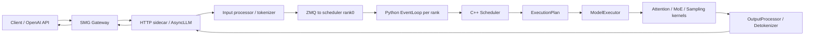
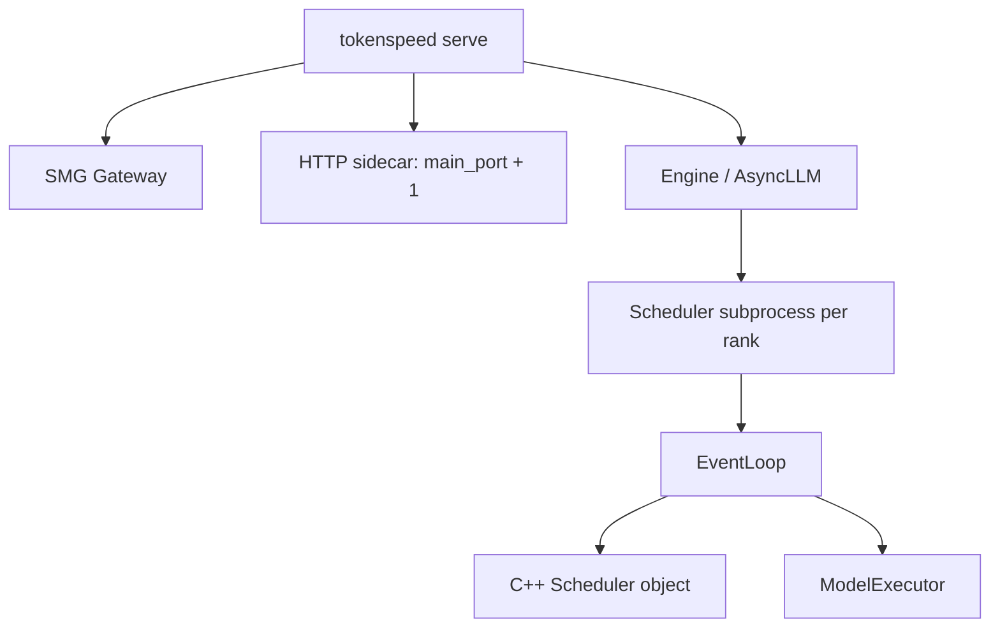
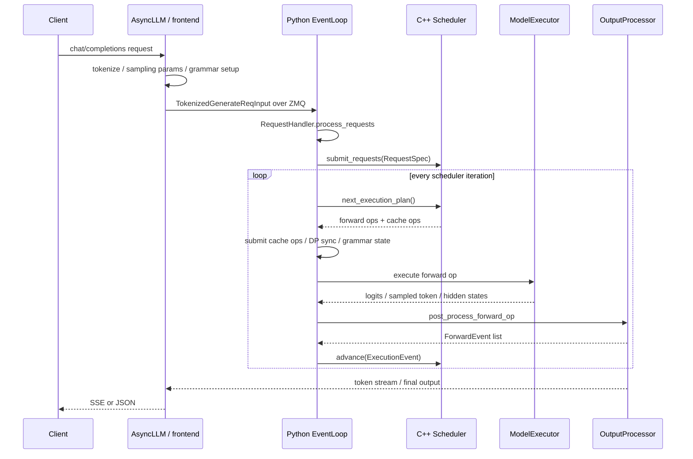
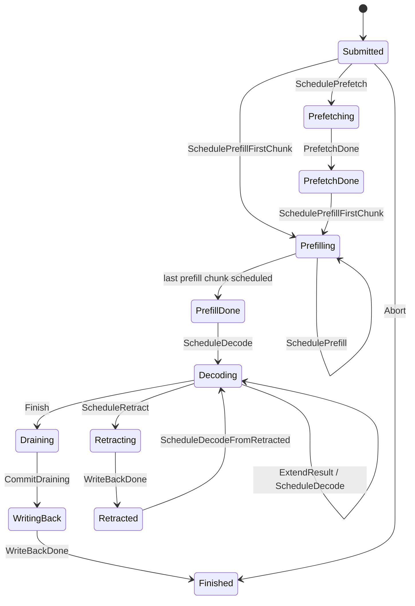
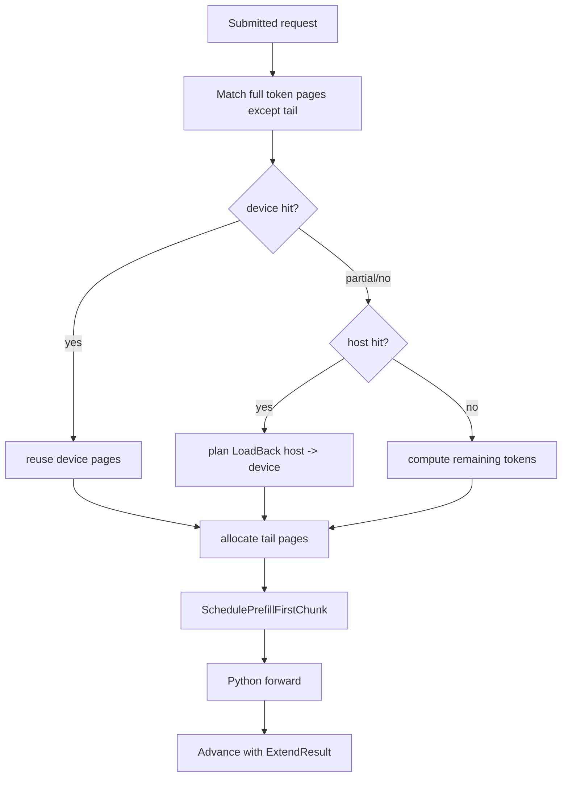
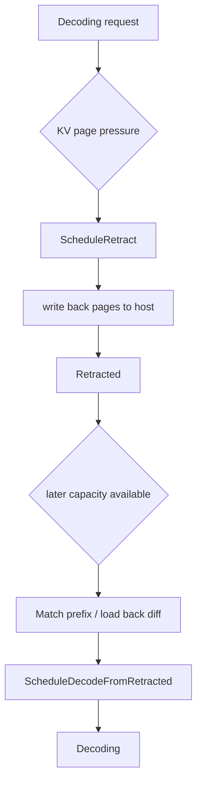
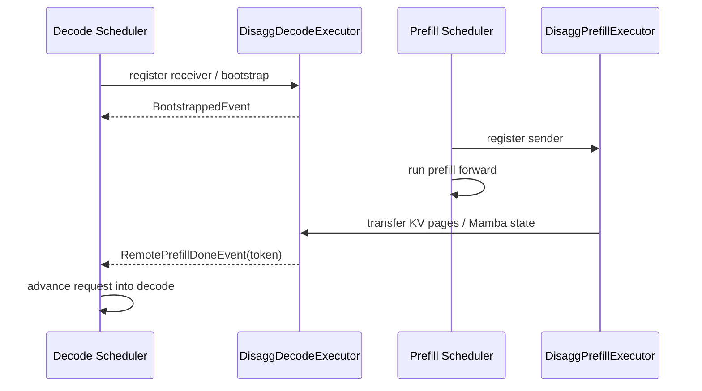
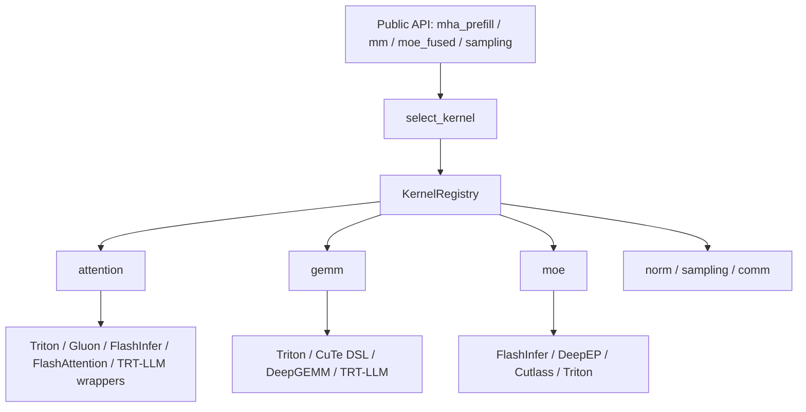

> 本文基于2026-07-10拉取的`lightseekorg/tokenspeed`主分支源码`c2a4cd6`、官方文档、LightSeek发布文以及PyTorch官方博客整理。TokenSpeed还处在快速演进阶段，文中实现细节以该commit为准；尤其是调度、PD分离、MLA kernel和模型recipe后续都可能继续变化。

# 1 先说结论

TokenSpeed不是“又一个OpenAI兼容服务壳子”，它更像是把大模型推理服务拆成几条性能关键路径后重新组合：

- 前端：`tokenspeed serve`启动OpenAI兼容HTTP服务，SMG gateway处理chat/reasoning/tool-call等接口语义，TokenSpeed sidecar提供控制接口和代理。
- Python runtime：负责tokenize、请求状态、grammar、采样、模型forward、CUDA graph、PD KV传输、metrics等执行面工作。
- C++ scheduler：负责请求生命周期、KV page分配、prefix cache、host/device/L3 cache操作、retraction、PD事件、Mamba/paged-cache adjunct，并把下一步工作输出成`ExecutionPlan`。
- Kernel系统：`tokenspeed-kernel`提供统一registry和selection机制，把attention、GEMM、MoE、sampling、communication等kernel按family/mode/format/trait选择；`tokenspeed-mla`单独强化Blackwell上的MLA prefill/decode。
- 并行与大模型适配：attention、dense、MoE可以使用不同TP/DP/EP映射；对Kimi、DeepSeek、GLM、Qwen、GPT-OSS等模型有专门配置和recipe。

它的核心取向很明确：为agentic workload服务。这里的agentic workload不是简单的“长prompt一次性生成长答案”，而是大量并发、短decode步、工具调用/多轮交互、共享系统提示词、长上下文、MoE/MLA模型、严格TTFT和next-token latency的混合场景。TokenSpeed的很多设计，都是为了让这种 workload 下的CPU调度、KV复用、跨GPU通信和小批decode kernel不拖后腿。

可以把TokenSpeed理解成下面这条数据路径：



真正值得看的不是某一个模块，而是这些模块之间的边界：C++ scheduler只给计划，Python event loop执行计划并回报事件；KV缓存既是attention backend要读写的数据结构，也是scheduler要管理的稀缺资源；kernel registry把“选择哪个实现”从模型层代码里拆出去。

# 2 TokenSpeed要解决的问题

LLM推理服务有两个经典阶段：

- prefill：把prompt一次性喂进模型，计算每层KV cache。
- decode：每步生成一个或多个token，读取已有KV cache，再写入新token的KV。

如果只是跑单请求，优化重点很容易落到矩阵乘、attention kernel或CUDA graph。但线上agent服务的瓶颈更复杂：

- 大量请求共享系统提示词、工具说明、few-shot模板或RAG框架，prefix cache命中很重要。
- 请求长短差异很大，prefill长请求会干扰decode短请求，影响tail latency。
- decode每步token数少，但频率极高，CPU调度、Python开销、采样、通信都可能变成瓶颈。
- MoE模型需要expert parallel和all-to-all；MLA模型需要特殊attention kernel和KV布局。
- 工具调用、reasoning parser、grammar约束、speculative decoding都会改变一次forward后的后处理逻辑。
- 长上下文下KV显存是核心资源，只有“能跑”不够，还要能安全复用、驱逐、load back、write back。

所以TokenSpeed的设计重点不是“写一个更快的attention kernel”这么单点，而是把服务拆成几个互相配合的系统：

- C++调度器：降低调度开销，把资源所有权和状态转移变成可检查的控制面。
- 多级KV/prefix cache：device、host、可选L3存储之间流动，支持prefetch、write back和prefix复用。
- Python执行面：保留PyTorch模型生态、模型加载、采样、grammar、PD传输和可扩展后端。
- Kernel registry：把高性能kernel做成可替换、可解释、可benchmark的组件。

# 3 仓库结构

TokenSpeed仓库不是一个单包项目，主要分成几块：

```text
python/
  tokenspeed/runtime/
    entrypoints/          # Engine、HTTP sidecar
    engine/               # AsyncLLM、event_loop、request/output处理
    execution/            # ModelExecutor、ModelRunner、CUDA graph、input buffer
    layers/attention/     # attention config、backend、KV pool
    layers/moe,dense,...  # 模型层和量化层
    cache/                # Python侧cache executor / KVStore接口
    pd/                   # prefill/decode disaggregation KV传输
    distributed/          # TP/DP/EP映射和通信
    models/               # Qwen、DeepSeek、Kimi、GLM、GPT-OSS等模型实现

tokenspeed-scheduler/
  csrc/
    scheduler/            # C++ Scheduler、ExecutionPlan、Request
    fsm/                  # 请求状态机和事件
    resource/             # page allocator、radix tree、hybrid prefix cache

tokenspeed-kernel/
  python/tokenspeed_kernel/
    registry.py           # KernelRegistry / register_kernel
    selection.py          # select_kernel / objective / override
    ops/                  # attention、gemm、moe、sampling、communication等

tokenspeed-mla/
  python/tokenspeed_mla/  # Blackwell MLA prefill/decode实现
```

这也解释了README里列出的四个核心组件：

- Modeling layer：模型层与并行映射。
- Scheduler：C++控制面和Python执行面。
- Kernels：可插拔分层kernel系统。
- Entrypoint：SMG集成的AsyncLLM前端。

# 4 启动路径：从`tokenspeed serve`到事件循环

最小启动命令类似：

```bash
tokenspeed serve openai/gpt-oss-20b \
  --host 0.0.0.0 \
  --port 8000 \
  --tensor-parallel-size 1
```

生产级MoE/MLA模型会显式设置更多参数，例如Kimi K2.5 recipe里会设置长上下文、FP8 KV cache、NVFP4量化、TP/EP、chunked prefill、attention backend、MoE backend、reasoning parser和tool-call parser。

启动后大致有三类进程/组件：



当前源码里有一个细节值得注意：`Engine`的注释仍描述为`TokenizerManager + Scheduler subprocess + DetokenizerManager subprocess`三段式，但实际`_launch_subprocesses`里注释说明detokenizer已经内联到`AsyncLLM`路径，非独立子进程。也就是说，读TokenSpeed时不能只看旧的高层注释，要顺着当前事件循环看。

`python/tokenspeed/runtime/entrypoints/http_server.py`中HTTP sidecar的定位很清楚：

- `/health`、`/generate`、`/v1/chat/completions`等请求代理到SMG gateway。
- `/get_server_info`、`/get_model_info`、`/abort`等控制请求可直接走gRPC到engine。
- streaming响应不能在函数返回前关闭上游session，因此代码里专门让session生命周期跟随stream iterator。

这说明TokenSpeed把“API兼容”和“引擎执行”分开：SMG处理OpenAI兼容、chat模板、tool-call等上层协议；TokenSpeed runtime处理请求进入调度器后的推理执行。

# 5 请求生命周期

一次请求进入runtime后，可以简化成下面的序列：



这里最重要的边界是：

- 前端给scheduler的是`RequestSpec`：request id和token序列。
- scheduler给执行面的是`ExecutionPlan`：本轮要forward哪些请求、prefill多少token、decode多少token、需要哪些cache load/write/prefetch。
- 执行面回给scheduler的是`ExecutionEvent`：某请求产生了token、finish、abort、PD完成、cache操作完成等。

这是一种“event-sourced scheduler”的味道：scheduler不直接运行模型，也不直接读logits；它只根据请求状态、KV资源状态和事件推进下一步计划。

# 6 C++ Scheduler：为什么要单独做控制面

TokenSpeed把调度器做成C++扩展，核心类是`tokenspeed-scheduler/csrc/scheduler/scheduler.{h,cpp}`。它持有：

- `PageAllocator device_allocator_`
- `PageAllocator host_allocator_`
- `KVPrefixCache kv_prefix_cache_`
- `ReqPoolAllocator req_pool_allocator_`
- 可选`HybridPrefixCache`
- 可选Mamba allocator和Mamba host allocator
- `requests_`：request id到`Request`对象
- `cache_op_tracker_`
- KV cache event队列

对外主要方法很少：

```text
SubmitRequests(RequestSpec[])
NextExecutionPlan()
Advance(ExecutionEvent)
DrainKvEvents()
CalcRollingHash(tokens)
WaitingSize / ActiveKvPages / AvailableKvPages ...
```

这种API很克制：Python不会手动拼凑调度状态，而是让C++ scheduler在内部维护请求FSM和资源所有权。

## 6.1 请求状态机

`Request`内部不是用一堆布尔字段，而是用`std::variant`保存状态。源码中常见状态包括：

```text
Submitted
Prefetching
PrefetchDone
Bootstrapping
Prefilling
PrefillDone
Decoding
Draining
WritingBack
Retracting
Retracted
Aborting
Finished
```

状态迁移通过`Request::Apply(Event)`完成。事件对象接收当前状态，返回下一个状态：



这个状态机设计解决的是资源安全问题。KV page、req pool slot、host page、radix tree node lock、Mamba slot等资源都跟状态绑定，而不是散落在Python对象中手动释放。比如：

- `Submitted`没有allocator指针，只保存token container。
- `ForwardState`持有device node ref、本地KV allocator和req pool index。
- `Prefilling`额外持有host node ref，用来pin host pages。
- `Draining`会记录需要write back的device/host page pair。
- `Retracted`表示请求被从活跃decode中撤回，但仍有恢复所需的cache信息。

对高并发推理来说，这比“请求对象里一堆可选字段”可靠得多。

## 6.2 ExecutionPlan

`NextExecutionPlan()`每轮做三件事：

1. 对处于`Draining`的请求生成write-back操作。
2. 清理`Finished`请求，释放HybridPrefixCache里的request资源。
3. 从可调度请求中生成forward op和cache op。

输出的`ExecutionPlan`是operation列表，Python通过pybind看到的是类似：

- `Forward.FlatForwardOp`
- `Cache.FlatWriteBackOperation`
- `Cache.FlatLoadBackOperation`
- `Cache.PrefetchOperation`

执行面拿到计划后不会再自己决定“哪些请求该跑”，而是：

- 提交cache操作给`MemoryExecutor`。
- 从plan里取第一个forward op。
- 调用`ModelExecutor.execute_forward_op_with_log`。
- 把采样结果和finish/abort事件提交回scheduler。

这让调度策略和模型执行解耦。想改prefill/decode调度、prefix cache、retraction，主要动C++ scheduler；想改attention backend、sampling、CUDA graph，主要动Python/GPU执行面。

# 7 Prefill、Decode与混合批

TokenSpeed把一次forward分成几种`ForwardMode`：

```text
EXTEND  # prefill/extend，一批里有prompt token
DECODE  # decode，一批里都是生成步
MIXED   # 同一批同时有extend和decode
IDLE    # DP中某些rank没有实际请求，但要保持collective同步
```

`chunked-prefill-size`是scheduler每轮可以发出的token预算，默认8192。它不是简单等同于vLLM里的`max-num-batched-tokens`：在TokenSpeed文档里，`chunked-prefill-size`控制每轮调度发出的prefill预算，而`max-total-tokens`才是全局token pool大小覆盖项。

为什么要chunked prefill？因为长prompt如果一次性prefill，会占住GPU很久，decode请求的next-token latency会被拉高。Chunked prefill把长prompt切成多轮，让decode请求有机会插入。

当前event loop里有两种循环：

- `event_loop()`：非overlap，先执行本轮forward，再post-process，再advance scheduler。
- `event_loop_overlap()`：先发射当前forward到GPU，再在CPU上post-process上一轮结果，试图覆盖CPU后处理时间。

overlap循环有几个边界：

- prefill disaggregation节点强制走非overlap，因为KV send和embedding drain没有接入overlap循环。
- eager grammar批次需要先提交上一轮结果，否则grammar matcher状态会落后一轮。
- DP场景下即使某rank没有请求，也要做metadata all-gather，并可能执行idle forward保持collective顺序。

这说明TokenSpeed不是盲目“任何时候都overlap”。它优先保证状态一致，再在decode场景吃掉CPU后处理开销。

# 8 KV Cache：TokenSpeed的资源视角

KV cache在TokenSpeed里有两层含义：

- GPU attention backend实际读写的KV buffer。
- scheduler管理的逻辑page和prefix tree资源。

Python侧`create_attn_components()`根据模型attention架构创建：

- attention backend
- token-to-KV pool
- draft attention backend和draft KV pool
- `max_total_num_tokens`
- 可选Mamba pool

随后event loop把C++ scheduler绑定到KV pool：

```text
token_to_kv_pool.bind_paged_cache_scheduler(self.scheduler)
```

这样模型执行时能通过scheduler给出的req pool index、page table、occupied pages等信息访问KV；scheduler则能用page allocator、radix tree、host/device资源状态决定下一步。

## 8.1 Radix prefix cache

`KVPrefixCache`内部有一棵`RadixTree`，每个tree node可挂device资源和host资源。关键操作：

- `Match(tokens)`：沿token page走radix tree，得到device/host命中深度。
- `Insert<Device/Host>`：把新的token page和page id挂到tree node。
- `EnsureCapacityByEvict<Device/Host>`：按LRU等策略驱逐未锁定节点。
- `ReleaseDeviceResourcesPresentOnHost`：如果host已有备份，可释放device资源。
- `CalcRollingHash`：计算page hash，用于KV事件和L3存储查询。

和普通prefix cache相比，TokenSpeed这里不是只问“有多少token命中”，而是区分：

- device上命中：可以直接跳过对应prefill计算。
- host上命中：需要生成load-back操作，把KV从host搬回device。
- L3存储命中：先prefetch到host，再参与后续调度。

简化后的首次prefill逻辑如下：



这里的“except tail”很重要：prefix cache以完整page为单位匹配，最后一个不满page或仍在生成的tail page一般由请求本地KV allocator持有，不能随便作为共享prefix复用。

## 8.2 Host/L3与KVStore

TokenSpeed支持host page和可选L3 storage。`schedulePrefetch()`的条件很保守：

- prefix cache开启；
- L3 storage开启；
- 请求还在`Submitted`；
- storage hit pages超过`prefetch_threshold`。

满足后scheduler分配host pages，生成`PrefetchOperation`，Python侧`MemoryExecutor`再实际搬运数据。

这类设计适合长上下文和重复prefix场景，但也带来额外复杂度：

- device page不足时要驱逐。
- host page不足时也要驱逐。
- 被运行中请求引用的node要通过ref/lock保护。
- write-back、load-back、prefetch都有异步完成事件，需要回到scheduler推进FSM。

所以TokenSpeed把cache op纳入`ExecutionPlan`和`ExecutionEvent`，而不是把它们写成旁路后台任务。

## 8.3 KV cache event

`--kv-events-config`可以打开KV cache mutation事件。当前文档说明这个事件流发布device prefix-cache block store/remove，负载包含block hash、parent hash、token ids和block size等信息。

这类事件有两个用途：

- 外部cache系统可以知道哪些KV block已经在本rank产生或被移除。
- 调试prefix cache命中、驱逐和跨层cache一致性时更容易重放。

源码里`KVPrefixCache::recordDeviceBlockStored`会为节点构建block hash，并避免重复发布同一个device block。

# 9 HybridPrefixCache：不只是Transformer KV

大部分推理引擎谈prefix cache时默认只关注Transformer KV，但TokenSpeed的`HybridPrefixCache`还把Mamba state、paged cache group等adjunct资源绑在同一套前缀树生命周期上。

触发构建`HybridPrefixCache`的条件包括：

- 有Mamba pool且不是decode-only角色。
- 配置了`prefix_cache_adjunct`。
- 配置了paged cache groups。

它要处理的问题是：有些模型不是纯Transformer full attention。例如Qwen3.5/混合GDN类模型可能同时有full attention层和Mamba/linear attention层。前缀复用不能只复用attention KV，还要保证其他状态也对齐。

TokenSpeed在scheduler config里传入：

- `paged_cache_groups`
- `prefix_cache_adjunct`
- `enable_mamba`
- `mamba_cache_chunk_size`
- `mamba_pool_total_chunks`
- `enable_mamba_l2`

这样C++ scheduler在`SchedulePrefillFirstChunk`、`ScheduleDecode`、`ScheduleDecodeFromRetracted`中，能同时判断KV page、Mamba slot、paged cache group是否有容量，必要时做COW或load-back。

这是TokenSpeed和只支持普通KV prefix cache引擎的一个重要差异：它试图把“所有可复用的序列状态”统一到请求状态机和前缀树资源管理里。

# 10 Retraction：显存压力下的请求恢复

当活跃请求太多、KV page不足时，推理引擎通常要么拒绝新请求，要么抢占旧请求。TokenSpeed有`Retracting`和`Retracted`状态，配合write-back和decode-from-retracted。

简化逻辑：



关键点是恢复不是简单“重新prefill一遍”。scheduler会重新用prefix cache匹配已有token pages：

- device上还在的部分直接复用。
- host上有的部分load back。
- 对Mamba state也要找到可恢复节点，否则请求可能被abort。

这种机制适合长上下文高并发，因为重新prefill的代价可能非常大。但它也要求cache状态严格一致，因此FSM和资源所有权非常关键。

# 11 PD分离：Prefill和Decode为什么要拆

Prefill和decode的硬件偏好不同：

- prefill更像大矩阵/大batch吞吐任务。
- decode更像低延迟、小步、频繁调度任务。

PD分离把prefill节点和decode节点拆开，让prefill侧算完prompt KV后，把KV传给decode侧继续生成。TokenSpeed的`disaggregation_mode`支持：

- `null`：不分离。
- `prefill`：prefill节点。
- `decode`：decode节点。
- `encode`：多模态场景里只跑vision tower / encode。

源码里`_dispatch_forward`对PD路径分成四种：

```text
Path 1: no PD
  正常模型forward。

Path 2: decode node + EXTEND
  不跑模型，只触发远端KV接收。

Path 3: prefill node + decode op
  prefill完成后把KV发送到decode侧。

Path 4: prefill node + EXTEND
  正常跑prefill forward，并记录first token / metadata。
```

PD执行器分两类：

- `DisaggPrefillExecutor`：维护`MooncakeKVSender`，负责把prefill KV page和可选Mamba state发给decode侧。
- `DisaggDecodeExecutor`：维护`MooncakeKVReceiver`，接收远端KV，完成后产生`RemotePrefillDoneEvent`。

事件路径大致如下：



这套路径说明TokenSpeed的PD分离不是HTTP层转发，而是scheduler事件、KV page索引、Mooncake传输、output processor状态一起参与。

# 12 ModelExecutor：执行面的中枢

`ModelExecutor`负责把scheduler的forward op变成实际GPU工作。它持有：

- `ModelRunner`
- target attention backend和KV pool
- draft model runner / draft attention backend / draft KV pool
- sampling backend
- `req_to_page` page table
- `InputBuffers`
- `RuntimeStates`
- CUDA graph wrapper / prefill graph
- optional drafter：EAGLE3、MTP、DFLASH
- grammar buffers
- NanGuard

执行一轮forward前，event loop会：

1. `model_executor.update_block_table(forward_op)`更新page table。
2. 准备sampling params和grammar state。
3. DP场景收集全局token数、batch size、forward mode。
4. 调用`execute_forward_op_with_log`。
5. post-process logits、采样、finish reason、logprobs、streaming输出。

`ForwardMode`决定attention backend走decode还是extend：

```text
forward_mode.is_decode() -> forward_decode
otherwise                -> forward_extend
```

这和scheduler的设计对应：scheduler不关心具体attention kernel，只负责告诉执行面本轮有哪些请求、各自prefix长度、输入长度、occupied pages、req pool index等元数据。

# 13 Attention Backend和KV Pool

TokenSpeed把attention架构分为几类：

- MHA
- MLA
- DSA
- Hybrid linear attention / Mamba相关形态

`python/tokenspeed/runtime/layers/attention/registry.py`根据模型config创建：

- attention config，例如`MHAConfig`、`MLAConfig`、`DSAConfig`
- attention backend，例如`mha`、`mla`、`dsa`、`trtllm_mla`、`tokenspeed_mla`
- token-to-KV pool

backend基类要求实现：

- `init_forward_metadata`
- `init_cuda_graph_state`
- `init_forward_metadata_capture_cuda_graph`
- `init_forward_metadata_replay_cuda_graph`
- `forward_decode`
- `forward_extend`

这样模型层只需要调用统一attention接口，backend自己处理：

- decode metadata
- prefill metadata
- CUDA graph replay所需的预分配buffer
- block table / seq_lens / prefix lens
- PD layerwise cache step记录

一个容易忽视的点是，TokenSpeed的attention backend不只是“kernel函数封装”。它还承担了很多服务级元数据管理，例如CUDA graph buffer复用、PD cache step计数、draft模型metadata切片等。

# 14 TokenSpeed-Kernel：registry比单个kernel更重要

`tokenspeed-kernel`的README把设计画成了一个分层系统：



Kernel注册时会声明：

- `family`：attention、gemm、moe等。
- `mode`：decode、prefill、mm、experts等。
- `features`：比如paged、mla。
- `solution`：triton、flashinfer、cutlass等。
- `format_signatures`：输入/权重/输出dtype和layout。
- `capability`：平台能力要求。
- `traits`：head_dim、GQA factor等形状特征。
- `priority`：REFERENCE、PORTABLE、PERFORMANT、SPECIALIZED、PLUGIN几个优先级区间。

选择时`select_kernel`会：

1. 根据family/mode找到候选。
2. 过滤平台能力、format signature和trait。
3. 应用objective，例如latency、throughput、portability、determinism、debug。
4. 可选使用family-specific oracle。
5. 用priority做tie-break。
6. 支持手工override和配置文件override。

这套registry的意义在于：推理系统里kernel选择是动态多维问题。不同GPU架构、batch size、head dim、量化格式、decode/prefill模式、MoE后端都会改变最佳实现。如果把选择逻辑硬编码在模型层，后续会非常难维护。

# 15 TokenSpeed-MLA：为什么单独强化MLA

MLA（Multi-head Latent Attention）常见于DeepSeek、Kimi等新一代模型。它的KV形态和MHA不同，decode/prefill kernel都需要专门优化。TokenSpeed仓库里有独立的`tokenspeed-mla`包，并在runtime里提供`tokenspeed_mla` attention backend。

`tokenspeed-mla` README中列出的核心能力：

- MLA prefill：
  - CuTe DSL JIT ragged varlen FMHA，无需padding。
  - 可选AOT binary backend。
  - FP8 E4M3输入路径、BF16输出、可选LSE、causal/non-causal、PDL。
- MLA decode：
  - CuTe DSL decode kernels，支持FP16/BF16/FP8输入。
  - FP8 decode写BF16输出，提高后续稳定性。
  - split-KV + workspace。
  - 小`q_len * num_heads`场景下把query token group fold进head维度，提高tile利用率。
- MLA K/V pack + FP8 quantize：
  - 用融合Triton kernel替代`cat + cast + cast`。

源码里的`CuteDSLMLABackend`还有一些启动期约束：

- page size必须是32或64。
- `tokenspeed_mla` backend要求`--kv-cache-dtype fp8_e4m3`。
- prefill kernel会预编译常用variant，避免服务中第一次请求触发JIT。

这说明TokenSpeed针对agentic workload的优化不只是“吞吐曲线好看”。Agent流量常见短decode步、高并发、小`q_len`，MLA decode的小shape效率会直接影响next-token latency。

# 16 MoE、量化和并行映射

TokenSpeed支持拆分不同layer family的并行组：

- attention TP/CP/DP
- dense TP/DP
- MoE TP/EP/DP

文档里也强调，`--tensor-parallel-size`是熟悉入口，映射到attention TP；如果需要细粒度控制，可以用：

```bash
--world-size 8 \
--attn-tp-size 4 \
--dense-tp-size 4 \
--moe-tp-size 4 \
--enable-expert-parallel
```

`distributed/mapping.py`里可以看到三类mapping：

- `AttentionLayerMapping`
- `DenseLayerMapping`
- `MoeLayerMapping`

MoE部署常见几种形态：

- TP only：简单，但expert分布不够灵活。
- TP + EP：每个副本内做TP，expert跨rank分布。
- DP + EP：多个decode replica，expert在组内分布。

这对Kimi、GLM、DeepSeek这类大MoE模型很关键。单一TP配置很难同时满足attention、dense和expert层的通信/算力需求。

量化方面，TokenSpeed runtime里有FP8、NVFP4、MXFP4、W8A8 FP8、compressed-tensors等路径。`LinearBase`会根据`quant_config`选择具体quant method，而具体GEMM kernel再走`tokenspeed-kernel`的选择体系。

# 17 Speculative Decoding：EAGLE3、MTP、DFLASH

`ModelExecutor`里`_DRAFTER_MAPPING`支持：

```text
EAGLE3 -> Eagle
MTP    -> Eagle
DFLASH -> DFlash
```

几个实现细节：

- 如果`speculative_algorithm == MTP`且没有显式draft model path，TokenSpeed会默认用同一个checkpoint作为draft来源。
- DFLASH要求`speculative_num_steps = speculative_num_draft_tokens - 1`。
- 当前不支持`speculative_eagle_topk > 1`这种tree spec，只支持chain spec。
- 有draft KV pool时，PD传输也会把draft model KV cache纳入`get_kv_args`。

Speculative decoding和prefix/paged cache、CUDA graph、overlap schedule之间会有复杂交互。文档中DeepSeek V4 recipe也提到：MTP运行在non-overlap scheduler上，且当speculative decoding和paged-cache groups同时启用时会自动禁用overlap scheduling。这是合理的保守选择，因为spec decode会让一次forward产出的token数、accept/reject路径和KV写入位置都更复杂。

# 18 Grammar、Reasoning和Tool Call

Agentic workload通常不只是自由文本生成，还会要求：

- JSON schema或grammar约束。
- reasoning内容解析。
- tool-call payload解析。
- streaming输出中增量detokenize。

TokenSpeed把这些分布在不同层：

- SMG gateway处理chat template、reasoning parser、tool-call parser等接口语义。
- Runtime里的`GrammarManager`和`xgrammar` backend处理约束解码。
- `OutputProcessor`负责post-process、finish reason、logprobs、流式输出、request stats。

event loop里有一个和overlap相关的细节：如果当前batch带grammar，且使用eager grammar buffer，必须先commit上一轮结果，让grammar matcher状态前进，再填本轮mask。否则会用一轮之前的状态采样，采出后再被matcher拒绝。

这类细节体现了推理服务里“正确性”和“性能overlap”的冲突：CPU/GPU overlap不是永远免费的，遇到有状态约束解码时必须让状态推进顺序正确。

# 19 与vLLM / SGLang / TensorRT-LLM的定位差异

粗略比较可以这样看：

| 系统 | 更强的默认印象 | TokenSpeed的差异点 |
| --- | --- | --- |
| vLLM | 易用、PagedAttention、OpenAI兼容、生态成熟 | TokenSpeed也保留熟悉参数，但更强调C++ FSM scheduler、split parallelism和agentic kernel路径 |
| SGLang | 高层编程接口、RadixAttention、结构化/agent工作流 | TokenSpeed借鉴了部分runtime形态，但把scheduler控制面、KV资源类型和kernel registry重新组织 |
| TensorRT-LLM | 高性能、强NVIDIA栈、生产部署 | TokenSpeed目标是接近TRT-LLM性能，同时保持vLLM式易用和Python模型扩展性 |

这不是说TokenSpeed全面替代谁。更准确地说，它在尝试一个折中：

- 比纯Python scheduler更低控制面开销和更强资源安全。
- 比纯静态engine更容易接入新模型、新kernel、新parser和研究型特性。
- 对大MoE/MLA/agentic workload投入更多专门优化。

# 20 性能指标应该怎么看

README和PyTorch博客提到了两个重要方向：

- Qwen3.5-397B-A17B agentic workload达到高TPS记录。
- TokenSpeed-Kernel在设计上强调可注册、可选择、可benchmark的kernel系统。

但看推理性能时要避免几个误区：

- TPS不是唯一指标。Agent服务更关心TTFT、TPOT、tail latency、并发下稳定性。
- 不同模型架构不可直接横比。MLA、MHA、MoE、量化格式、context length都会改变瓶颈。
- Prompt长度和输出长度分布很关键。长prefill短decode和短prefill长decode完全不同。
- Prefix cache命中率会极大改变有效吞吐。
- PD分离、EP、DP sampling、spec decode都会改变端到端延迟结构。
- Kernel microbenchmark不等于服务吞吐，但能解释服务瓶颈在哪里。

TokenSpeed文档里的per-request stats比较实用，字段包括：

- prompt tokens、cache tokens、output tokens
- cache hit rate
- queue ms、prefill ms、TTFT、total ms
- preempt ms、preempt count
- decode TPS
- speculative accept length/rate

如果要评估TokenSpeed，建议至少记录：

```text
模型 / commit / GPU / driver / CUDA / launch command
请求分布：prompt长度、输出长度、并发、共享prefix比例
TTFT p50/p95/p99
TPOT p50/p95/p99
端到端latency p50/p95/p99
吞吐：output TPS、request/s
cache hit rate
prefill/decode batch size分布
GPU利用率、显存、KV page active/cached
spec decode accept rate（如果开启）
```

# 21 一个具体请求例子

假设有三个请求：

```text
R1 = [system 2000 tokens][tool docs 1000 tokens][user A]
R2 = [system 2000 tokens][tool docs 1000 tokens][user B]
R3 = [different prompt]
```

第一次R1到来：

1. scheduler匹配prefix cache，基本无命中。
2. 申请device pages和req pool index。
3. 受`chunked-prefill-size`限制，可能分多轮prefill。
4. prefill完成后进入decode。
5. finish后进入draining，完整page可write back到host并插入prefix tree。

随后R2到来：

1. scheduler对完整token pages做match。
2. `[system][tool docs]`对应的完整pages在device或host命中。
3. device命中部分直接复用，host命中部分生成load-back。
4. 只对`user B`和未满page tail做prefill。
5. TTFT显著降低，prefill算力节省。

R3如果没有共享prefix，则正常prefill。若此时显存紧张，scheduler可能对某些decode请求做retraction，把page写回host，释放device page，后续再恢复。

这个例子里，性能收益不是某一个kernel带来的，而是：

- prefix tree找到共享前缀；
- page allocator能安全复用/驱逐；
- chunked prefill不长时间阻塞decode；
- host/device cache op和forward op在同一计划里协调；
- attention backend能用page table读正确KV。

# 22 使用时应该关注的参数

启动TokenSpeed时，建议先按这个顺序调参：

1. 模型和tokenizer：

```bash
tokenspeed serve <model> \
  --served-model-name <name> \
  --trust-remote-code
```

2. 上下文和KV：

```bash
--max-model-len 262144 \
--kv-cache-dtype fp8 \
--gpu-memory-utilization 0.9
```

3. 调度预算：

```bash
--chunked-prefill-size 8192 \
--max-num-seqs 256 \
--max-total-tokens <optional>
```

4. 并行：

```bash
--tensor-parallel-size 4 \
--enable-expert-parallel
```

或需要拆分时：

```bash
--world-size 8 \
--attn-tp-size 4 \
--dense-tp-size 4 \
--moe-tp-size 4
```

5. backend：

```bash
--attention-backend trtllm_mla \
--moe-backend flashinfer_trtllm \
--sampling-backend flashinfer
```

6. agent能力：

```bash
--reasoning-parser kimi_k25 \
--tool-call-parser kimik2 \
--speculative-algorithm MTP
```

不要一开始就同时改很多参数。TokenSpeed把很多能力都暴露出来，调参空间很大；如果没有固定benchmark和完整launch command，很容易把模型、kernel、并行、cache命中率混在一起误判。

# 23 局限和风险

当前TokenSpeed值得关注，但也要看到它的边界：

- 项目较新，API和内部实现还会变化。
- 文档和代码注释之间有些地方已经不同步，例如detokenizer进程描述。
- 高性能路径依赖特定GPU架构、特定dtype、特定backend和模型结构；不是所有模型都自动受益。
- `tokenspeed_mla`对`fp8_e4m3`、page size等有硬约束。
- PD分离、EPD、多模态embedding传输、Mamba adjunct等路径复杂，部署和排障成本高。
- Kernel registry带来灵活性，但也要求团队有能力解释“当前到底选了哪个kernel”。
- Prefix/L3/host cache会改善命中场景，但低复用随机流量可能只增加管理复杂度。

所以它最适合：

- 大模型服务团队。
- agent流量比例高。
- 使用MoE/MLA/长上下文模型。
- 愿意记录完整benchmark并做kernel/backend调优。
- 需要从vLLM/SGLang易用性和TensorRT-LLM性能之间找折中。

不太适合：

- 小模型低并发服务。
- 没有GPU性能调试能力的简单业务。
- 对稳定LTS API要求高于性能探索的场景。
- 不需要prefix cache、PD、MoE、spec decode等能力的普通部署。

# 24 总结

TokenSpeed的核心价值不是某一条“580 TPS”的新闻，也不是某个单独的MLA kernel，而是它把现代LLM推理服务里的几个难点放到了统一框架里：

- 请求生命周期用C++ FSM管理。
- KV cache作为显式page资源被调度、复用、驱逐、write back、load back。
- Python执行面保留模型生态和动态能力。
- Kernel registry把高性能实现选择标准化。
- 并行映射拆到attention、dense、MoE不同layer family。
- PD分离和spec decode为大模型agent服务预留了复杂但必要的路径。

从架构上看，TokenSpeed代表了一类趋势：推理引擎不再只是“batching + attention kernel”，而是一个围绕KV资源、请求状态、模型结构、kernel选择和分布式通信协同优化的系统。对agentic workload来说，这个方向是合理的，因为真正的瓶颈往往出现在模块边界，而不是单个矩阵乘里。

# 参考

- TokenSpeed GitHub仓库：<https://github.com/lightseekorg/tokenspeed>
- TokenSpeed文档首页：<https://lightseek.org/tokenspeed/>
- Getting Started：<https://lightseek.org/tokenspeed/guides/getting-started>
- Launching a Server：<https://lightseek.org/tokenspeed/guides/launching>
- Server Parameters：<https://lightseek.org/tokenspeed/configuration/server>
- Parallelism：<https://lightseek.org/tokenspeed/serving/parallelism>
- LightSeek发布文：<https://lightseek.org/blog/lightseek-tokenspeed.html>
- PyTorch博客：Qwen3.5-397B-A17B agentic workload性能记录：<https://pytorch.org/blog/up-to-580tps-new-speed-record-of-qwen3-5-397b-a17b-on-gpu-for-agentic-workloads-with-tokenspeed/>
- PyTorch博客：TokenSpeed-Kernel设计与优化：<https://pytorch.org/blog/lightseek-tokenspeed-kernel/>
- 本文参考源码commit：`lightseekorg/tokenspeed@c2a4cd63bc391b3e9c119d47394fcb4e9c14ba4d`
