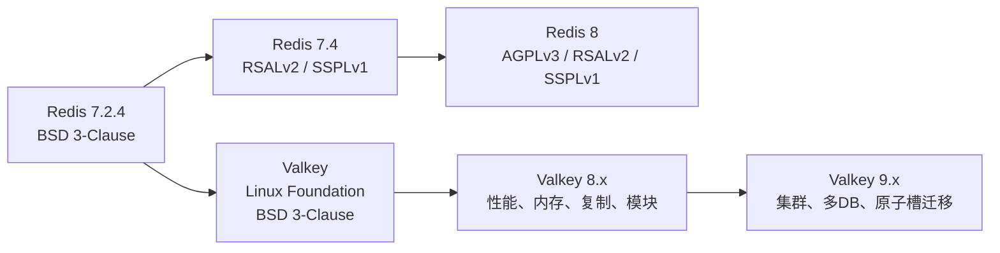
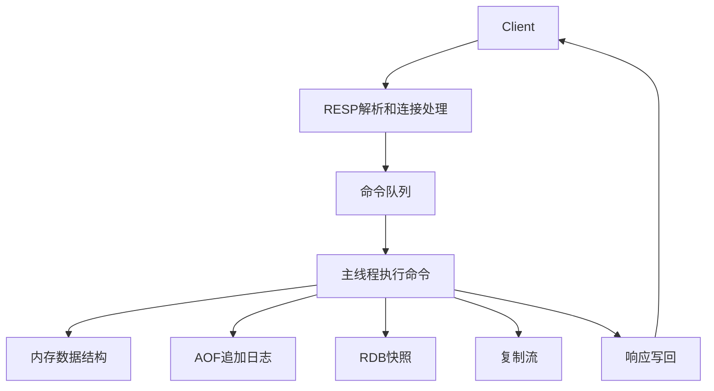
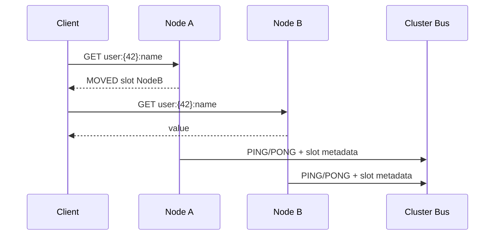
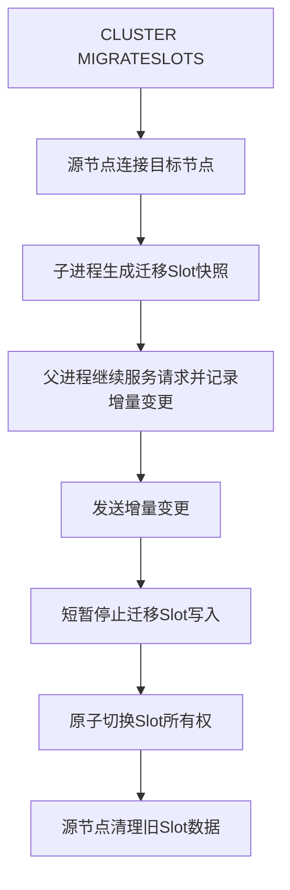

## 版本说明

本文调研时间为2026年5月19日，主要参考Valkey官网文档、Valkey GitHub Release、Linux Foundation公告、Redis官方许可证公告以及Valkey官方技术博客。Valkey是一个仍在快速演进的项目，因此版本相关结论需要以发布页为准。

截至本文调研时，Valkey GitHub Releases中最新稳定版为`9.0.4`，发布日期为2026年5月6日；`9.1.0-rc2`已经发布，但仍标记为Pre-release。`9.0.4`是安全修复版本，修复了若干Use-After-Free和`RESTORE`命令非法内存访问问题，因此生产环境如果已经在9.0分支上，应优先关注这一补丁版本。

## 先说结论

Valkey不是一个“重新实现Redis协议的替代品”，而是Redis 7.2.4在BSD 3-Clause许可证下的社区延续。它的核心价值有三点：

- 许可证和治理：Valkey由Linux Foundation托管，保持BSD 3-Clause开源许可证，技术方向由多家公司参与的维护者和TSC治理，而不是由单一商业公司控制。
- 兼容和迁移：对于Redis OSS 7.2.x及更早版本，迁移到Valkey基本可以看作一次版本升级；对于Redis CE 7.4及之后版本，官方迁移文档明确指出数据文件不兼容，不能简单按同一路径迁移。
- 技术演进：Valkey在8.0之后并没有停留在“Redis 7.2维护分支”，而是在I/O线程、内存效率、复制、集群可靠性、原子槽迁移、多数据库集群、模块生态等方向继续推进。

如果业务只把Redis当普通缓存，Valkey通常是一个低成本替换项。如果业务依赖Redis 8的新内置数据类型、Redis Stack生态或商业支持，则需要具体比较Redis、Valkey、云厂商托管版本和DragonflyDB等替代方案。

## Valkey是什么

Valkey官方定义是一个开源的、BSD许可的内存数据结构存储系统，可以作为数据库、缓存、消息代理和流处理引擎使用。它支持字符串、哈希、列表、集合、有序集合、Bitmap、HyperLogLog、地理空间索引和Stream，也提供复制、Lua脚本、LRU淘汰、事务、持久化、Sentinel高可用和Cluster自动分片。

这一定义与传统Redis用户熟悉的能力基本一致。更准确地说，Valkey继承的是Redis作为“内存数据结构服务器”的路线，而不是只做一个KV缓存：

- 缓存：用`maxmemory`和淘汰策略支撑热点数据缓存。
- 会话和状态：用TTL、Hash、Set保存登录态、限流计数、临时状态。
- 排行榜和计数：用Sorted Set、HyperLogLog实现排名、去重计数。
- 队列和事件：用List、Pub/Sub、Stream实现轻量消息通道。
- 分布式数据层：用Cluster把Key按Slot分散到多个Primary。

因此理解Valkey时，不能只把它看成“Redis改名”。项目真正关心的是：在保持Redis类系统简单、低延迟、协议兼容和内存优先这些基本特征的同时，能否通过开放治理继续演进。

## 为什么会有Valkey

Valkey诞生的直接背景是Redis许可证变化。2024年3月20日，Redis官方宣布从Redis 7.4开始，未来版本不再使用BSD 3-Clause许可证，而改为RSALv2和SSPLv1双重source-available许可证。Redis官方在2025年5月1日又宣布Redis 8加入AGPLv3作为开源许可证选项。

这两个时间点很关键：

- Redis 7.2.4及更早版本仍然是BSD许可证代码。
- Redis 7.4开始曾进入RSALv2/SSPLv1的source-available路线。
- Redis 8开始又加入AGPLv3，重新提供OSI认可的开源许可证选项，但已经不是原来的BSD路线。

Linux Foundation在2024年3月28日宣布成立Valkey社区，项目基于Redis 7.2.4继续开发，并保持BSD 3-Clause许可证。公告中提到，AWS、Google Cloud、Oracle、Ericsson、Snap等公司支持该项目，目标是让社区维护者、贡献者和用户继续在开放许可证和开放治理下协作。

所以Valkey的出现，本质上是一次“最后一个BSD Redis版本的社区续写”。它不仅是代码分叉，也是治理模型分叉：



## 治理模式

Valkey官网Leadership页面说明，项目由Technical Steering Committee管理，TSC由Valkey仓库维护者组成。当前页面列出的TSC成员来自Tencent、AWS、Google Cloud、Percona、Oracle、Ericsson、Alibaba等组织，委员会主席为Madelyn Olson。

这种治理方式的意义在于，它弱化了单一厂商对路线、许可证和合并策略的控制。对于基础设施项目，这一点比短期功能更重要，因为缓存和内存数据库往往处在业务核心链路上，一旦许可证、发行节奏或兼容策略突然变化，迁移成本会被放大。

当然，多方治理也不是没有代价。它通常意味着设计讨论、路线协调和兼容性取舍会更谨慎，短期商业产品化速度可能不如单一公司控制的项目。但对一个被大量基础设施依赖的组件而言，稳定的治理预期本身就是重要能力。

## 基本架构

Valkey的核心仍然可以从四层理解：

- 协议层：客户端通过RESP协议发送命令，服务端解析命令并返回结果。
- 执行层：命令执行保持以主线程为中心，避免复杂的共享状态并发控制。
- 数据结构层：不同命令操作不同对象类型，例如String、Hash、Set、Sorted Set、Stream等。
- 高可用和分布式层：复制、Sentinel和Cluster提供副本、故障切换和水平扩展。

一个简化的数据路径如下：



Valkey和Redis这类系统的一个重要设计取舍是：大部分命令执行仍然由单线程串行完成。这样做有几个好处：

- 单条命令天然原子，不需要在普通命令之间加复杂锁。
- 数据结构实现可以保持简单，模块和命令语义更容易维护。
- 延迟模型容易理解，性能瓶颈也更容易定位。

代价也很明显：单个Primary的写入执行能力最终受单核或少数核心约束。Valkey 8.0之后的性能优化并不是把所有命令执行都改成多线程，而是把网络I/O、响应写回、部分内存释放、预取等工作尽量从主线程挪走，让主线程把更多CPU时间用于真正的命令执行。

## 持久化：RDB、AOF和缓存语义

Valkey持久化选项包括RDB、AOF、RDB+AOF以及完全关闭持久化：

- RDB：周期性生成数据集快照，适合备份和快速恢复，但故障时可能丢失最近几分钟的数据。
- AOF：记录每个写命令，重启时重放日志恢复数据，通常更接近“少丢数据”的目标。
- RDB+AOF：同时开启时，重启会优先使用AOF恢复，因为AOF通常包含更完整的最近写入。
- 无持久化：适合纯缓存，进程重启后允许冷启动。

这里最容易犯的错误是没有区分“缓存”和“状态存储”。如果Valkey只保存可从数据库重建的热点数据，关闭持久化往往可以减少磁盘I/O和恢复复杂度；如果Valkey保存会话、限流窗口、任务进度、Stream消息或其他业务状态，就需要明确RDB/AOF策略，否则重启可能直接变成业务数据丢失。

一个实用判断是：

```text
数据丢了只会导致短时间变慢 -> 可以按缓存处理，考虑关闭持久化
数据丢了会导致用户登出、重复扣费、任务丢失 -> 按状态存储处理，需要持久化和备份
数据丢了会导致不可接受的账务或一致性问题 -> 不应只依赖Valkey，需要外部强持久数据库兜底
```

## 复制和高可用

Valkey复制仍然遵循Primary-Replica模型。Replica从Primary接收复制流，故障时可以通过Sentinel或Cluster机制进行故障检测和提升。

复制链路需要关注两个事实：

- 复制通常是异步的，所以Primary确认写成功不等于所有Replica都已经持久保存。
- Full sync成本取决于数据集大小、网络、磁盘、fork开销和复制缓冲区配置。

Valkey 8.0引入了dual-channel replication相关能力：RDB传输和增量复制可以通过不同通道处理，从而降低全量同步期间主复制流被阻塞的风险。这个方向说明Valkey团队对“大实例复制”和“大集群恢复”的关注不只是理论性能，而是生产运维中真实会遇到的问题。

## Cluster：16384个Slot和客户端路由

Valkey Cluster把Key空间切成16384个Hash Slot，每个Primary负责其中一部分Slot。Key到Slot的基础映射是：

$$
\mathrm{slot} = \mathrm{CRC16}(key) \bmod 16384
$$

如果Key包含Hash Tag，例如`order:{1001}:items`和`user:{1001}:profile`，则只对花括号中的`1001`计算Slot。这个机制用于把多Key操作需要的数据强制放到同一个Slot中。

Cluster的关键点不是“服务端帮客户端隐藏一切分片细节”，而是客户端需要具备Cluster意识：

- 正常情况下，客户端根据Slot缓存直接把请求发到对应节点。
- 如果Slot迁移或拓扑变化，服务端通过`MOVED`或`ASK`重定向提示客户端更新路由或临时重试。
- 节点之间通过Cluster Bus传播成员关系、Slot归属、心跳、故障状态和故障切换信息。

简化流程如下：



Valkey官方在1 Billion RPS技术文章中强调，9.0版本围绕大规模Cluster做了很多稳定性优化，包括故障报告处理、重连风暴控制、Pub/Sub消息头优化、故障切换排序等。在他们的实验中，Valkey 9.0以2000个节点达到超过10亿RPS。这个数字不能直接等价为普通业务部署也能得到同样吞吐，因为测试硬件、命令类型、数据大小、客户端数量和网络环境都很特殊；但它说明Valkey的路线并不是只优化单机缓存，而是在认真推进大规模分布式内存数据层。

## Valkey 8.x：从兼容延续到性能重建

Valkey 8.0是分叉后的第一个主要版本。官方8.0 RC文章提到，其目标是提升性能、可靠性和可观测性，其中最重要的是增强I/O线程系统，让主线程和I/O线程可以并发工作。

传统Redis类架构中，即使开启I/O线程，主线程仍然承担大量连接、读写、调度和执行工作。Valkey 8.0的思路是：

- I/O线程负责读请求、解析命令、写响应、轮询网络事件、释放部分内存。
- 主线程继续负责任务编排和命令执行。
- 尽量保持命令执行单线程，避免把核心数据结构变成重锁并发模型。
- 通过命令批处理和内存预取减少CPU等待内存的时间。

官方技术文章给出的测试中，在AWS C7g.16xlarge、8个I/O线程、3M key、512字节value、650客户端、连续SET命令条件下，吞吐从约360K RPS提升到1.19M RPS，平均延迟从1.792ms降到0.542ms。这个测试不是通用承诺，但它反映了Valkey 8.0的优化方向：尽量压榨现代多核机器上的网络和内存访问效率，而不是简单增加分片数量。

Valkey 8.0还关注内存效率。官方内存效率文章提到，通过Cluster模式下每Slot一个字典、Key嵌入字典Entry等方式，某些工作负载下每节点可多存储最多约20%的Key。对于内存数据库来说，20%的内存开销差异通常不是小优化，因为它直接影响机器数量和成本。

Valkey 8.1继续在Hash Table、观测性、命令日志等方面改进。可以认为8.x完成了从“Redis 7.2兼容继承”到“独立优化路线”的过渡。

## Valkey 9.0：集群运维能力增强

Valkey 9.0是第二个主要版本，重点从单机性能进一步扩展到集群可运维性和新能力。官方9.0介绍文章总结了多个重要方向：

- Atomic Slot Migration：原子槽迁移，改善Cluster扩缩容和重分片体验。
- Numbered Databases in Cluster：Cluster模式支持编号数据库。
- Hash Field Expiration：Hash字段级过期，适合细粒度生命周期管理。
- Pipeline Memory Prefetch：流水线场景下内存预取，官方称可提升最高约40%吞吐。
- Zero-copy Responses：大响应减少内部内存拷贝，官方称最高约20%吞吐提升。
- Multipath TCP：支持MPTCP，官方称可降低部分场景延迟。
- 大集群可靠性：面向2000节点和10亿RPS级别测试做稳定性改进。

其中最值得展开的是Atomic Slot Migration。

## 原子槽迁移

旧的Cluster槽迁移是Key-by-Key过程。迁移一个Slot时，源节点和目标节点进入`MIGRATING`/`IMPORTING`状态，客户端访问迁移中的Key可能收到`ASK`重定向。这个机制可用，但在大Key、多Key操作、扩缩容、网络抖动和长时间迁移场景下会带来明显复杂度。

Valkey 9.0引入的Atomic Slot Migration把迁移过程改成更接近复制的模型：



它的关键思想是“先复制整个Slot，再原子切换所有权”，而不是一批一批移动Key并让客户端在迁移期间不断处理特殊状态。官方Atomic Slot Migration文章给出的收益包括：

- 命令接口更简单，可以一次迁移多个Slot范围。
- 支持取消和失败回滚。
- 大Key处理更可靠。
- 迁移速度最高可比旧方式快约9倍。
- 对客户端影响更小，尤其是多Key操作不再长时间陷入半迁移状态。

使用方式也更直接：

```text
CLUSTER MIGRATESLOTS SLOTSRANGE 0 100 NODE <target-node-id>
CLUSTER GETSLOTMIGRATIONS
CLUSTER CANCELSLOTMIGRATIONS
```

这个功能的实际意义很大。缓存集群扩容听起来简单，但真正困难的是“在线迁移时不要让业务感知到大量重试、超时和尾延迟抖动”。Atomic Slot Migration把复杂性更多放回服务端状态机中，是Valkey 9.0最有代表性的工程改进。

## 多数据库Cluster

Redis/Valkey的编号数据库长期存在，例如默认`db0`、`db1`等。但在Cluster模式下，过去通常只能使用`db0`。Valkey 9.0扩展了Cluster中的编号数据库支持。

官方Numbered Databases文章强调，编号数据库本质上是一种命名空间。它不是多租户隔离边界，也不是权限模型替代品，但可以解决一些工程问题：

- 同一实例或集群中按环境、阶段或业务域临时隔离Key。
- 迁移期间保留旧数据，同时在另一个DB构建新数据。
- 构建复杂Key的新版本，再用更简单的事务替换可见数据。

不过，多数据库也容易被滥用。如果团队把`db0`到`db15`当成“多个逻辑业务库”，又没有清晰命名、监控、配额和清理策略，最后会使容量管理和故障定位更困难。更稳妥的做法是：把编号数据库当成少数明确场景下的命名空间工具，而不是替代集群、ACL或独立实例。

## 模块和Valkey Bundle

Valkey Bundle是官方提供的预打包容器版本，内置一组受支持模块，包括：

- Valkey JSON：原生存储、查询和修改JSON结构。
- Valkey Bloom：Bloom Filter等概率数据结构。
- Valkey Search：索引、过滤、相似性搜索。
- Valkey LDAP：LDAP身份认证。

这说明Valkey也在补齐“Redis Stack式”的高级能力，但采用模块和Bundle的方式交付。对用户来说，这里要区分两种部署：

- 核心Valkey：适合传统缓存、Session、排行榜、Stream、Cluster等场景。
- Valkey Bundle：适合需要JSON、Search、Bloom、LDAP等能力，又希望快速启动的场景。

如果只需要缓存，不应因为Bundle方便就默认引入所有模块。模块意味着更多配置、更多升级面和更多安全审计范围。反过来，如果已经需要全文检索、向量检索或JSON文档能力，把Valkey Bundle作为轻量搜索/缓存一体化方案进行评估是合理的。

## 与Redis的关系

Valkey与Redis的关系可以分成三个层次：

第一，历史代码关系。Valkey来自Redis 7.2.4，所以它天然继承了Redis OSS 7.2及之前的大量行为和命令兼容性。

第二，许可证路线。Valkey坚持BSD 3-Clause。Redis 7.4之后经历RSALv2/SSPLv1，Redis 8又加入AGPLv3。AGPLv3是开源许可证，但它和BSD的使用约束、合规成本、商业集成影响都不同。

第三，功能路线。Redis 8把Redis Stack中的很多能力合入核心，并引入新的数据结构和能力；Valkey则在核心性能、集群、复制、模块和开放治理上形成自己的路线。因此2026年再讨论“Valkey是不是Redis替代品”，答案不再是简单的“完全等价”。更准确的判断是：

- 从Redis OSS 7.2迁移到Valkey，兼容性通常最好。
- 从Redis 8迁移到Valkey，需要检查具体命令、数据文件、模块和客户端行为。
- 新项目选型时，需要同时比较许可证、托管服务、模块能力、运维经验和社区路线。

## 迁移方法

Valkey官方迁移文档给出的兼容矩阵很重要：Redis OSS 2.x到7.2.x可以迁移到Valkey 7.2.x或8.0；Redis CE 7.4不在该文档覆盖的直接迁移范围内，并且数据文件不兼容。

常见迁移路径有三类。

### 物理迁移

通过RDB快照迁移：

```text
1. 暂停或断开Redis写入
2. 生成最新RDB快照
3. 将RDB复制到Valkey数据目录
4. 启动Valkey并加载数据
5. 用INFO KEYSPACE、抽样GET、业务校验确认数据
```

优点是简单、快。缺点是需要停写或接受短暂停机，并且大实例加载RDB需要时间。

### 复制迁移

把Valkey作为Redis的Replica接入，等复制追平后提升Valkey为Primary。这个方式适合降低停机窗口，但需要注意版本兼容、认证配置、网络连通和复制延迟。

### Key级迁移

使用`MIGRATE`或外部工具迁移部分Key。适合只迁移关键数据、做灰度切换或清理历史垃圾数据，但实现更复杂，容易遗漏TTL、类型、ACL和脚本行为。

迁移前建议至少做这些检查：

```text
INFO SERVER
INFO KEYSPACE
INFO MEMORY
INFO PERSISTENCE
INFO REPLICATION
CONFIG GET appendonly
CONFIG GET save
COMMAND DOCS <critical-command>
```

迁移后不要只看进程是否启动，还要校验：

- Key数量和核心Key抽样值。
- TTL是否保留。
- Lua脚本和事务是否行为一致。
- 客户端连接池、超时、重试和Cluster路由是否正常。
- 监控项名称是否从`redis_*`变成`valkey_*`，或者 exporter 是否仍按Redis命名暴露。

## 运行配置建议

对于普通单机缓存，可以从保守配置开始：

```conf
port 6379
bind 127.0.0.1
protected-mode yes
maxmemory 4gb
maxmemory-policy allkeys-lru
appendonly no
save ""
```

对于状态存储，需要明确持久化：

```conf
appendonly yes
appendfsync everysec
save 900 1
save 300 10
save 60 10000
```

对于Cluster节点，需要关注：

```conf
cluster-enabled yes
cluster-config-file nodes.conf
cluster-node-timeout 5000
io-threads 4
maxmemory 50gb
```

这里的数值不是通用答案。`io-threads`需要根据CPU核数、网卡队列、请求大小和pipeline程度测试。`maxmemory`要给fork、AOF rewrite、复制缓冲区和内存碎片留余量。`cluster-node-timeout`过小可能在网络抖动时误判故障，过大则会增加真实故障恢复时间。

## 观测和故障模式

Valkey这类系统常见故障不只是“进程挂了”。更常见的是尾延迟、内存膨胀、复制追不上、慢命令、热Key、Cluster重定向风暴和持久化抖动。

建议重点观测：

- 延迟：平均延迟、P95/P99、`SLOWLOG`或`COMMANDLOG`。
- 内存：`used_memory`、RSS、碎片率、淘汰次数、Key数量。
- 持久化：RDB/AOF状态、rewrite耗时、fsync延迟。
- 复制：复制偏移、lag、full sync次数、复制缓冲区。
- Cluster：Slot覆盖、`MOVED`/`ASK`数量、failover次数、节点握手状态。
- 客户端：连接数、超时、重试、pipeline深度、连接池耗尽。

几个典型问题：

- 热Key：Cluster分片不能解决单个Key过热，需要拆Key、本地缓存、读副本或业务降频。
- 大Key：会放大网络传输、迁移、删除和复制成本，应定期扫描和治理。
- 误用`KEYS`：生产大库上直接`KEYS *`可能阻塞主线程，应使用`SCAN`类命令。
- 持久化误配置：纯缓存开AOF可能浪费资源，状态存储关持久化可能导致事故。
- 多Key跨Slot：Cluster中多Key命令要求Key在同一Slot，应使用Hash Tag提前设计Key命名。

## 什么时候适合用Valkey

适合使用Valkey的场景：

- 原本使用Redis OSS 7.2或更早版本，希望继续走宽松开源许可证路线。
- 需要一个成熟、低延迟、内存优先的数据结构服务器。
- 主要使用String、Hash、Set、Sorted Set、Stream、Pub/Sub、Lua、Cluster等经典能力。
- 希望借助Valkey 8.x/9.x的I/O线程、内存效率和集群运维改进。
- 需要在云厂商托管服务和自建之间保持更好的迁移选择。

不一定适合的场景：

- 需要强事务、复杂查询、多表关系和严格持久化，应该优先考虑关系数据库或专门存储系统。
- 单Key或单分片写入极高，且无法通过业务拆分解决，可能需要重新设计数据模型。
- 依赖Redis 8特有数据结构或Redis Stack具体行为，需要逐项验证Valkey模块是否覆盖。
- 希望数据库自动处理所有分布式一致性问题，Valkey Cluster并不是强一致分布式数据库。
- 对多租户隔离、安全审计、备份恢复有企业级要求，但团队没有运维能力，应优先考虑成熟托管服务。

## 和其他替代方案比较

粗略比较如下：

| 方案 | 优势 | 风险或代价 |
| --- | --- | --- |
| Valkey | BSD许可证、Linux Foundation治理、Redis 7.2兼容路线、持续性能和集群改进 | 与Redis 8路线逐渐分化，部分高级能力依赖模块和Bundle |
| Redis 8 | 官方Redis路线，AGPLv3/RSALv2/SSPLv1三许可证，集成Redis Stack能力 | AGPL合规和商业授权需要评估，与旧BSD路线不同 |
| DragonflyDB | 多线程架构，单机高吞吐，兼容Redis协议 | 与Redis/Valkey内部机制不同，兼容性和运维经验需验证 |
| KeyDB | Redis兼容、多线程方向较早 | 社区活跃度和长期路线需要单独评估 |
| 云厂商托管Valkey/Redis | 运维成本低，备份、监控、故障恢复集成 | 成本、版本节奏、参数暴露和厂商锁定需要评估 |

如果团队已经有Redis运维经验，并且当前使用的是Redis OSS 7.2路线，Valkey通常是最自然的延续。如果团队要做全新选型，应该用自己的工作负载跑基准测试，而不是只看官方RPS数字。

## 一个简单上手例子

使用Docker启动核心Valkey：

```bash
docker run -d --name valkey -p 6379:6379 valkey/valkey:9.0
docker exec -it valkey valkey-cli
```

简单写入：

```text
127.0.0.1:6379> SET user:1 "alice"
OK
127.0.0.1:6379> GET user:1
"alice"
127.0.0.1:6379> HSET profile:1 name alice age 20
(integer) 2
127.0.0.1:6379> HGETALL profile:1
1) "name"
2) "alice"
3) "age"
4) "20"
```

如果需要JSON、Bloom、Search等模块，可以使用Valkey Bundle：

```bash
docker run --name valkey-bundle -d -p 6379:6379 valkey/valkey-bundle
docker exec -it valkey-bundle valkey-cli -3
```

查看模块：

```text
127.0.0.1:6379> INFO modules
```

生产环境不要直接照搬这些命令。至少需要配置认证、绑定地址、持久化策略、内存上限、备份、监控和升级流程。

## 总结

Valkey的意义不只是“Redis改许可证后的替代品”。从2024年的分叉，到8.0的I/O线程和内存效率优化，再到9.0的原子槽迁移、多数据库Cluster和大集群可靠性，Valkey已经形成了自己的技术路线。

我认为它最适合的位置是：作为Redis OSS 7.2路线的开放延续，服务于需要低延迟、内存数据结构、缓存、轻量消息和可水平扩展Cluster的系统。它不是关系数据库替代品，也不是强一致分布式数据库；但在缓存和实时数据结构层，它仍然是目前最值得认真评估的开源项目之一。

选型时应把问题拆开：许可证能否接受，命令和数据文件是否兼容，模块是否覆盖需求，延迟和吞吐是否经过自有压测验证，团队是否具备Cluster和持久化运维能力。只要这些问题回答清楚，Valkey就不是一次情绪化迁移，而是一个可工程化评估的基础设施选项。

## 参考

- [Valkey Documentation: Introduction](https://valkey.io/topics/introduction/)
- [Valkey GitHub Releases](https://github.com/valkey-io/valkey/releases)
- [Linux Foundation Launches Open Source Valkey Community](https://www.linuxfoundation.org/press/linux-foundation-launches-open-source-valkey-community)
- [Valkey Leadership](https://valkey.io/leadership/)
- [Redis Adopts Dual Source-Available Licensing](https://redis.io/blog/redis-adopts-dual-source-available-licensing/)
- [Redis is now available under the AGPLv3 open source license](https://redis.io/blog/agplv3/)
- [Valkey Documentation: Migration from Redis to Valkey](https://valkey.io/topics/migration/)
- [Valkey Documentation: Persistence](https://valkey.io/topics/persistence/)
- [Valkey Documentation: Cluster specification](https://valkey.io/topics/cluster-spec/)
- [Valkey 8.0: Delivering Enhanced Performance and Reliability](https://valkey.io/blog/valkey-8-0-0-rc1/)
- [Unlock 1 Million RPS: Experience Triple the Speed with Valkey](https://valkey.io/blog/unlock-one-million-rps/)
- [Storing more with less: Memory Efficiency in Valkey 8](https://valkey.io/blog/valkey-memory-efficiency-8-0/)
- [Valkey 8.1: Continuing to Deliver Enhanced Performance and Reliability](https://valkey.io/blog/valkey-8-1-0-ga/)
- [Valkey 9.0: innovation, features, and improvements](https://valkey.io/blog/introducing-valkey-9/)
- [Scaling a Valkey Cluster to 1 Billion Request per Second](https://valkey.io/blog/1-billion-rps/)
- [Valkey Documentation: Atomic slot migration](https://valkey.io/topics/atomic-slot-migration)
- [Resharding, Reimagined: Introducing Atomic Slot Migration](https://valkey.io/blog/atomic-slot-migration/)
- [Numbered Databases in Valkey 9.0](https://valkey.io/blog/numbered-databases/)
- [Valkey Bundle Getting Started Guide](https://valkey.io/topics/valkey-bundle/)
- [Valkey GLIDE](https://glide.valkey.io/)
