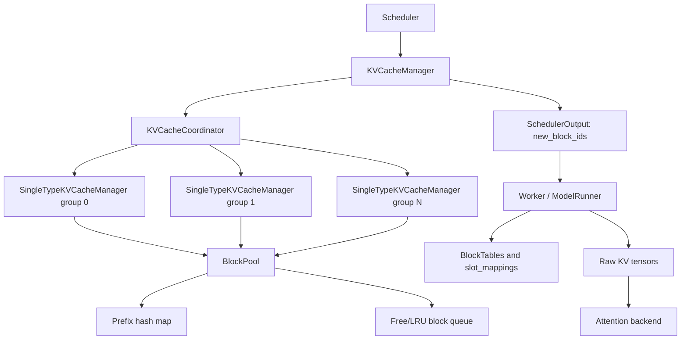
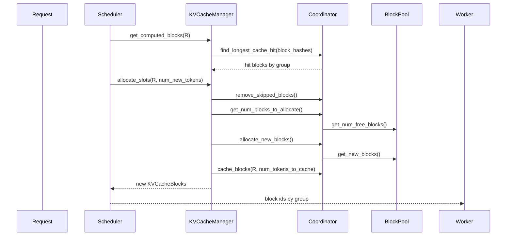

## 1. 先说结论

版本说明：本文以本机源码 `/home/gentle/projects/my_rust/vllm` 的 `v0.19.0` tag 为主，提交是 `2a69949bdadf0e8942b7a1619b229cb475beef20`，提交日期是 2026-04-02。官方 `stable` 文档里的 Hybrid KV Cache Manager 设计页也明确提示这块功能仍在早期阶段，文档基于特定 commit 写成，后续可能变化。所以本文讲的是 **vLLM V1 在 v0.19.0 附近的实现思想**，不是一个跨所有版本不变的接口承诺。

一句话概括：

**vLLM V1 的 KV cache 管理不是“每层一个独立 cache 池”，而是把层按 KV cache 需求分成 KV cache groups；scheduler 只和逻辑 block 打交道，worker 再把这些 block ids 翻译成每个 attention backend 需要的物理张量布局。**

更具体地说：

1. `KVCacheSpec` 描述“某一层每个 block 要多少字节、最多要多少 block”。
2. `KVCacheGroupSpec` 把多层合成一个 group。同一个 group 共享一张 block table。
3. `KVCacheConfig` 描述 worker 要分配哪些原始 KV cache tensor，以及 scheduler 要管理哪些 groups。
4. `KVCacheManager` 是 scheduler 看到的入口，负责 prefix cache 命中、slot 分配、释放和事件。
5. `KVCacheCoordinator` 协调多个 group；单一 group 用 `UnitaryKVCacheCoordinator`，混合注意力用 `HybridKVCacheCoordinator`，关闭 prefix cache 或不支持时用 `KVCacheCoordinatorNoPrefixCache`。
6. `SingleTypeKVCacheManager` 处理某一种 KV cache 类型的窗口规则，例如 full attention 不丢历史，sliding window 会把窗口外 block 替换成 `null_block`。
7. `BlockPool` 是底层全局物理 block 池，维护 ref count、free/LRU 队列、prefix hash 到 block 的映射。
8. KV 的物理布局不是固定一种。FlashAttention、FlashInfer、MLA、DiffKV 等 backend 可以给出不同逻辑 shape 和 stride order；`NHD` / `HND` 是在同一个逻辑 cache 上选择不同物理内存顺序。
9. Hybrid KV manager 的目标是给 full attention、sliding window、chunked local、Mamba 等不同层类型分配不同数量的 block，从而少存窗口外 KV；核心限制是 group 内类型一致、group 间 page size 可统一。
10. FlashMLA 的 KV cache 不是传统 K/V 两份矩阵，而是 MLA latent cache；dense FlashMLA 走 `(num_blocks, block_size, head_size)`，sparse FP8 DS MLA 还会使用 `656 bytes/token` 的特殊存储格式。
11. MTP 的 KV 分两层看：MTP drafter 自己跑 draft attention/KV；target 模型验证 draft tokens 时，这些 speculative tokens 会占用 target KV 的 lookahead slots，拒绝 token 通过 padding slot 避免写入有效 KV。
12. KV connector、P/D disaggregation、offload 会插入同一套 block 分配结果，但可能要求特定布局，例如 NIXL/Mooncake 在非 MLA 场景会要求 `HND` 来改善传输。

先放一张总图：



## 2. KV cache到底在管理什么

Transformer decode 阶段每生成一个 token，都需要读之前 token 的 K/V。最朴素的做法是每个请求维护一段连续 KV buffer。问题是 LLM serving 里的请求长度差异很大，continuous batching 会不断加入、结束、抢占请求，连续 buffer 很容易碎片化。

vLLM 的核心思路是分页：

```text
逻辑 token 序列:
token 0  token 1  ... token 15 | token 16 ... token 31 | ...

逻辑 block:
block 0                         | block 1              | ...

物理 block:
block 0 -> GPU block id 173
block 1 -> GPU block id 42
...
```

attention kernel 不再假设 KV 连续，而是通过 block table 找到每个逻辑 block 对应的物理 block id。一个 token 写入 KV cache 时，worker 通过 `slot_mapping` 算出最终槽位：

```text
slot_id = physical_block_id * block_size + offset_inside_block
```

所以 KV cache manager 真正管理的是：

1. 请求需要多少个逻辑 block。
2. 每个逻辑 block 绑定到哪个物理 block id。
3. 哪些 block 已经完整，可以进入 prefix cache。
4. 哪些 block 仍被运行中请求引用，不能回收。
5. 哪些 block 已经不在窗口里，可以释放或用 `null_block` 占位。
6. 多个 KV cache group 的 block table 如何保持对齐。

## 3. 从KVCacheSpec开始：每层cache的规格

源码入口在 `vllm/v1/kv_cache_interface.py`。最底层抽象是 `KVCacheSpec`：

```python
class KVCacheSpec:
    block_size: int

    @property
    def page_size_bytes(self) -> int:
        ...

    def max_memory_usage_bytes(self, vllm_config):
        ...
```

这里有两个很重要的概念：

1. `block_size` 是一个 block 容纳多少 token。
2. `page_size_bytes` 是一个 block 对这一层要占多少字节。

普通 attention 的 page size 近似是：

$$
\text{page\_size} =
2 \times \text{block\_size}
\times H_{kv}
\times D_{head}
\times \text{dtype\_bytes}
$$

前面的 `2` 对应 K 和 V。如果 K/V head size 不同，`FullAttentionSpec` 会用 `head_size + head_size_v`。MLA 的 cache 结构不同，`MLAAttentionSpec` 会重写 `real_page_size_bytes`。Mamba 不是传统 K/V，而是 SSM/conv state，所以 `MambaSpec` 用一组 `shapes` 和 `dtypes` 来算 page size。

v0.19.0 里常见 spec 包括：

1. `FullAttentionSpec`：完整保留所有历史 token 的 K/V。
2. `SlidingWindowSpec`：只需要保留最近 `sliding_window` 范围内的 K/V。
3. `ChunkedLocalAttentionSpec`：按 attention chunk 管理局部窗口。
4. `MambaSpec`：保存 Mamba state，不是标准 K/V 矩阵。
5. `CrossAttentionSpec`：encoder-decoder 模型的 cross attention cache。
6. `EncoderOnlyAttentionSpec`：encoder-only 层不需要 decoder KV cache，最大用量为 0。
7. `MLAAttentionSpec`：DeepSeek MLA 一类结构的特殊 cache。
8. `UniformTypeKVCacheSpecs`：多个层类型一致但具体 hidden size 等规格不完全相同时，用一个统一类型包装。

attention 层如何生成 spec？普通 decoder attention 在 `Attention.get_kv_cache_spec()` 里判断是否有 `sliding_window`：

```python
if self.sliding_window is not None:
    return SlidingWindowSpec(...)
return FullAttentionSpec(...)
```

这一步发生在 worker 侧扫描模型层时：`vllm/v1/worker/gpu/attn_utils.py` 的 `get_kv_cache_spec()` 会遍历所有 attention layer，收集 `layer_name -> KVCacheSpec`。

## 4. KVCacheGroup：为什么不直接按层管理

如果每一层都有自己的 block table，scheduler 输出会非常大，分配和 prefix cache 查找也会重复。vLLM 把“行为一致”的层合成 KV cache group。

源码里的定义很直接：

```python
class KVCacheGroupSpec:
    layer_names: list[str]
    kv_cache_spec: KVCacheSpec
```

含义是：

1. `layer_names`：这个 group 包含哪些模型层。
2. `kv_cache_spec`：这些层共享的逻辑 cache 规格。

同一个 group 的层共享一张 block table。也就是说，group 内所有层对同一个请求使用同一串 block ids：

```text
group 0: full.0 full.1 full.2 ...
request A block table for group 0: [7, 9, 11, 13]

full.0 读 [7,9,11,13]
full.1 读 [7,9,11,13]
full.2 读 [7,9,11,13]
```

注意，这不表示这些层共享同一份 K/V 数据。每层的 K/V 仍在不同 tensor 切片里；共享的是“第几个逻辑 block 对应哪个物理 block id”的索引结构。

`get_kv_cache_groups()` 的决策大致是：

```text
如果没有 KV cache:
    返回空 groups
如果所有层 spec 完全一致:
    所有层一个 group
否则如果所有层是同一种类型:
    用 UniformTypeKVCacheSpecs 包成一个 group
否则:
    先统一 page size，再按 hybrid 规则拆多个 group
```

这里最关键的是 page size。底层 `BlockPool` 只有一个物理 block 池，如果不同 group 的一个 block 字节数不同，就会引入更复杂的内存碎片管理。因此 vLLM 当前实现尽量把不同 group 的 page size 统一。

## 5. KVCacheConfig：scheduler和worker的共同契约

`KVCacheConfig` 是解析完模型后生成的完整 cache 配置：

```python
class KVCacheConfig:
    num_blocks: int
    kv_cache_tensors: list[KVCacheTensor]
    kv_cache_groups: list[KVCacheGroupSpec]
```

这三个字段分别对应三件事：

1. `num_blocks`：全局有多少个可用物理 block。
2. `kv_cache_groups`：scheduler 需要管理多少个逻辑 group。
3. `kv_cache_tensors`：worker 需要分配哪些实际 GPU tensor，每个 tensor 被哪些层共享。

这就是 vLLM KV cache 管理最容易混淆的地方：

**scheduler 管 group 和 block ids；worker 管 tensor 和 stride。**

举个 hybrid 模型例子：

```text
group 0: 10 个 full attention layers
group 1: 10 个 sliding window layers
group 2: 10 个 sliding window layers
```

worker 不是给 30 层分配 30 个完全独立的大 tensor，而是可能分配 10 个 `KVCacheTensor`。每个 tensor 被 3 个层共享：

```text
KVCacheTensor 0: full.0 + sw.0 + sw.10
KVCacheTensor 1: full.1 + sw.1 + sw.11
...
KVCacheTensor 9: full.9 + sw.9 + sw.19
```

这些层共享同一个原始 buffer，但它们按不同 group 的 block ids 写入不同物理 block 位置。由于 group 间 page size 被统一，一个 `block_id` 对应的物理片段大小一致，才能共用同一个 `BlockPool`。

## 6. BlockPool：真正的物理block池

`vllm/v1/core/block_pool.py` 是 KV cache 物理 block 管理的核心。它维护：

1. `blocks`：所有 `KVCacheBlock` 元数据。
2. `free_block_queue`：空闲 block 队列，也是 prefix cache 的 LRU 淘汰队列。
3. `cached_block_hash_to_block`：从 prefix block hash 查到 cached block。
4. `null_block`：特殊占位 block，用于窗口外 token 或 sparse attention 的空洞。
5. `kv_event_queue`：KV cache event，用于外部观测或 connector 场景。

`KVCacheBlock` 本身只存元数据：

```python
block_id: int
ref_cnt: int
block_hash: BlockHashWithGroupId | None
is_null: bool
```

`ref_cnt` 的含义是：当前有多少请求还引用这个 block。释放请求时，ref count 减到 0 的 block 会回到 `free_block_queue`。如果这个 block 已经带有 `block_hash`，它虽然可被新请求淘汰，但在真正被重新分配前仍可作为 prefix cache 命中对象。

`free_block_queue` 不是普通 deque，而是一个双向链表。原因是 prefix cache 命中时可能要从队列中间把某个 ref count 为 0 的 cached block 拿出来，`remove(block)` 需要 O(1)。

LRU 规则大致是：

1. block 被释放后追加到队尾。
2. 队首更老，更容易被淘汰。
3. 释放一个请求时按反向顺序释放 blocks，使尾部 block 更早被淘汰。

这样做有一个微妙好处：如果一串 prefix blocks 只有后面的 block 被淘汰，前面的短 prefix 仍可能命中。

## 7. Prefix cache：hash里为什么要带group id

prefix cache 的键不是单纯 token hash，而是：

```text
BlockHashWithGroupId = BlockHash + group_id
```

在 `kv_cache_utils.py` 里，`make_block_hash_with_group_id()` 会把 `group_id` 编码到 hash 后面。原因是同一段 token 在不同 KV cache group 里对应不同物理内容和窗口语义。Full attention group 的 block 和 sliding window group 的 block 不能混为一个 cache entry。

block hash 的生成有几个特点：

1. 只 hash 满 block，不 hash 最后不完整 block。
2. 当前 block hash 依赖 parent block hash，所以它表示整个前缀链。
3. 多模态输入、LoRA、cache salt、prompt embeds 会加入 extra keys。
4. CBOR hash 模式下如果没有固定 `PYTHONHASHSEED`，源码会提示可复现性风险。

prefix cache 查找由 `KVCacheManager.get_computed_blocks()` 发起：

```text
request.block_hashes
    -> coordinator.find_longest_cache_hit()
    -> 返回每个 group 的 KVCacheBlock 列表
    -> 返回命中的 token 数
```

有一个工程细节很重要：如果 prompt 全部命中，vLLM 仍要重算最后一个 token 来拿 logits。因此最大命中长度会被限制为 `request.num_tokens - 1`，并且当前 `allocate_slots()` 还要求 `num_computed_tokens` block 对齐。

## 8. Scheduler如何调用KVCacheManager

在 `vllm/v1/core/sched/scheduler.py` 里，KV cache manager 参与一轮调度的核心流程可以简化成：

```text
new_step_starts()

对 WAITING 请求:
    new_computed_blocks, hit_tokens = get_computed_blocks(request)
    查询 KV connector 外部命中
    can_fit_full_sequence(...) 做 admission gate
    allocate_slots(...)

对 RUNNING 请求:
    allocate_slots(request, new decode tokens, lookahead tokens)

生成 SchedulerOutput:
    req_id
    new_block_ids: tuple[list[int], ...]
    resumed/new request 的完整 block ids
    new_block_ids_to_zero
```

`allocate_slots()` 是最值得读的函数。它把 token 区间分成几段：

```text
| already computed | local prefix hit | external hit | new tokens | lookahead |
```

它做三件事：

1. 先让 coordinator 移除不再需要的 skipped blocks，例如 sliding window 左侧的历史 block。
2. 计算还需要分配多少 block，如果空闲数不够就返回 `None`，scheduler 会考虑推迟或抢占。
3. 把 prefix 命中的 blocks 加到请求，再分配新 blocks，最后把已完整的 blocks 写入 prefix cache。

KV connector 场景里还有两个额外参数：

1. `num_external_computed_tokens`：外部 KV store 或远端 prefill worker 已经算好的 token 数。
2. `delay_cache_blocks`：异步加载 KV 时先分配 GPU block，但暂不把它们标记为本地 prefix cache。

这使得 P/D disaggregation 和本地 prefix cache 能走同一个 block 分配接口。

## 9. SingleTypeKVCacheManager：不同注意力类型的差异

`SingleTypeKVCacheManager` 是每个 group 的真实管理者。它维护：

```text
req_to_blocks[request_id] = [KVCacheBlock, KVCacheBlock, ...]
num_cached_block[request_id] = 已经进入 prefix cache 的 block 数
```

共同逻辑包括：

1. `get_num_blocks_to_allocate()`：计算这个请求还差多少 block。
2. `allocate_new_computed_blocks()`：把 prefix cache 命中的 blocks 关联到请求。
3. `allocate_new_blocks()`：从 `BlockPool` 拿新 blocks。
4. `cache_blocks()`：把完整 block 写入 prefix hash map。
5. `free()`：释放请求持有的 blocks。
6. `remove_skipped_blocks()`：释放窗口外 blocks，并用 `null_block` 占位。

差异主要来自两个方法：

1. `find_longest_cache_hit()`：这个 group 如何定义 prefix cache 命中。
2. `get_num_skipped_tokens()`：这个 group 有多少历史 token 对未来计算已不再需要。

### 9.1 FullAttentionManager

full attention 的语义最简单：要计算第 `t` 个 token，就可能 attend 到 `0..t-1` 的全部历史。因此不能因为窗口移动释放早期 blocks。

`find_longest_cache_hit()` 从左到右扫描 block hash：

```text
block0 hit -> block1 hit -> block2 hit -> miss
命中长度 = 3 * block_size
```

如果启用 EAGLE，会丢掉最后一个命中 block，以便重新计算隐藏状态供 draft head 使用。

`get_num_skipped_tokens()` 使用基类默认值 0，也就是不主动丢历史。

### 9.2 SlidingWindowManager

sliding window 的语义是：下一 token 只需要最近 `sliding_window - 1` 个历史 token。假设 `sliding_window = 4`，已经计算 7 个 token：

```text
tokens: 0 1 2 3 4 5 6 7
computed: 0..6
next token: 7
window: 4..7
skipped: 0..3
```

源码里的公式是：

```text
skipped_tokens = max(0, num_computed_tokens - sliding_window + 1)
```

这些 skipped tokens 对 sliding window 层已经没有用，对应 blocks 会被释放，然后在 `req_to_blocks` 里替换成 `null_block`。为什么还要保留占位？因为逻辑 block index 不能乱：

```text
原来: [block0, block1, block2, block3]
释放: [NULL,  NULL,  block2, block3]
```

这样 worker 侧 block table 的逻辑位置仍然对应 token 位置，只是窗口外位置不会被 kernel 访问，或者访问时是 padding/null 语义。

sliding window 的 prefix cache 查找也不同。它不要求从 block0 开始全命中，而是从右往左找足够连续的窗口内 blocks。对窗口外 blocks，它可以直接填 `null_block`，因为那些 KV 不需要存在。

### 9.3 ChunkedLocalAttentionManager

chunked local attention 的窗口按 chunk 边界切分。源码里 `get_num_skipped_tokens()` 是：

```text
skipped_tokens = floor(num_computed_tokens / attention_chunk_size)
                 * attention_chunk_size
```

直觉是：如果已经进入下一个 local attention chunk，前一个 chunk 对当前 chunk 的局部注意力就不再需要。

prefix cache 查找时，窗口左侧直接用 `null_block` 表示已计算但无需读取；窗口内才查 hash。

### 9.4 MambaManager

Mamba 的 cache 不是标准 K/V，而是 state。`MambaSpec.max_memory_usage_bytes()` 会根据 `mamba_cache_mode` 变化：

1. `all`：按 `max_model_len` 分配。
2. `align`：保留当前和上一步 state，再加 speculative blocks。
3. 其他模式：保留当前 state，再加 speculative blocks。

Mamba manager 还需要处理同一 step 内 cache blocks 的更新去重、align mode 的 last state block 等问题。理解这里时不要把它想成 K/V 矩阵分页，而要把它看成“复用 KV manager 这套 block 分配和 prefix hash 框架来管理 state cache”。

## 10. Hybrid KV Cache Manager：它到底hybrid在哪里

Hybrid 模型指同一个模型里有多种注意力/cache 行为，例如：

```text
full attention layers + sliding window layers
full attention layers + chunked local attention layers
full attention layers + Mamba layers
```

如果不做 hybrid 管理，最保守的做法是把 sliding window 层也当 full attention 存，也就是为所有 token 保留 KV。这样计算时仍然可以用 sliding window mask，但 KV 内存没有省下来。

hybrid manager 要解决两个问题：

1. 不同 layer type 需要的 token slots 不同。
2. 不同 layer type 的 prefix cache 命中规则不同。

### 10.1 group如何拆

`_get_kv_cache_groups_uniform_page_size()` 负责生成 hybrid groups。它先按 `KVCacheSpec` 分桶：

```text
full layers -> [full.0, full.1, ...]
sw layers   -> [sw.0, sw.1, ...]
```

然后把每个类型拆成大小一致的小组，让每个 group 的层数一致。这样每个 group 的总 page size 相同：

$$
\text{group page size}
= \text{layers per group}
\times \text{block size}
\times \text{kv hidden bytes per token}
$$

例如 10 个 full 层、20 个 sliding window 层：

```text
group 0: full.0 ... full.9
group 1: sw.0   ... sw.9
group 2: sw.10  ... sw.19
```

每组都是 10 层，所以 page size 一致。对于 Gemma-3-27B 这类比例不整齐的模型，源码用一个启发式：取所有类型中最小的层数作为 group size；如果最大层数没有比最小层数大太多，就用最大层数减少 padding。最后一组不足时会加入 padding layers，并打印可能浪费的 KV cache 比例。

### 10.2 为什么必须统一page size

`BlockPool` 管的是统一大小的物理 block。如果 group 0 的 block 是 1MB，group 1 的 block 是 256KB，单个 free queue 就不知道如何无碎片地复用这些 block。

所以 vLLM 当前的策略是：

1. 如果 page size 已经一致，直接拆组。
2. 如果不一致，尝试通过增大较小 spec 的 `block_size` 来让 page size 对齐。
3. 如果最大 page size 不是较小 page size 的整数倍，就抛 `NotImplementedError`。

这也是为什么文章开头强调 `KVCacheSpec` 里的 `page_size_bytes` 是核心抽象。

### 10.3 Hybrid coordinator如何找prefix cache交集

`HybridKVCacheCoordinator` 会为每个 group 创建一个 `SingleTypeKVCacheManager`。prefix cache 查找时不能简单取 full attention 的命中长度，因为 sliding window group 可能只保存了后缀窗口；也不能只取 sliding window 的结果，因为 full attention 需要从开头连续命中。

源码里的做法是一个收敛过程：

```text
hit_length = max_cache_hit_length

循环:
    对每一种 attention group:
        用当前 hit_length 查这个类型能命中多长
        如果它只能命中更短，就降低 hit_length
    如果 hit_length 不再变短，结束
```

其中 full attention 被排在前面，因为从左到右连续扫描能给出一个紧的上界。最后还会把 full attention 的 blocks 截断到最终命中长度。

这里还有一个重要限制：v0.19.0 的实现比官方文档早期描述更进一步，代码里支持把相同 spec 的多个 groups 放在一起检查，也有 fixed-point 收敛；但注释仍然指出复杂 hybrid + EAGLE 存在“反复丢 block”的问题，DCP/PCP 也暂不支持 hybrid attention。

### 10.4 `--disable-hybrid-kv-cache-manager`会发生什么

如果 `scheduler_config.disable_hybrid_kv_cache_manager` 为 true，`unify_hybrid_kv_cache_specs()` 会尝试把 hybrid specs 转成统一类型。

典型行为是：

```text
FullAttentionSpec + SlidingWindowSpec
    -> 把 SlidingWindowSpec 转成 FullAttentionSpec
       但保留 sliding_window 字段供 model runner 计算时使用
```

结果是：

1. 计算仍然可以按 sliding window 做。
2. KV cache 分配不再按 sliding window 节省内存。
3. 如果无法统一成一种类型，会直接报错。

这适合排查兼容性问题，不适合追求 KV 内存效率。

## 11. 分配、释放、缓存：一个请求的生命周期

假设 `block_size = 16`，一个请求 prompt 80 tokens，生成 3 tokens。没有 prefix cache 时：

```text
prompt 80 tokens -> 5 blocks
decode token 1   -> 仍然 6th block 的第 0 个 offset
decode token 2   -> 仍然 6th block 的第 1 个 offset
...
```

调度时：



请求结束时：

```text
Scheduler.free(request)
    -> KVCacheManager.free()
    -> Coordinator.free()
    -> 每个 SingleTypeKVCacheManager.free()
    -> BlockPool.free_blocks()
```

如果 block 已经有 hash，它回到 free queue 后仍可能作为 prefix cache 命中；如果后来被重新分配，`BlockPool.get_new_blocks()` 会先把旧 hash 从 `cached_block_hash_to_block` 里驱逐，再给新请求使用。

## 12. KVCacheBlocks：为什么是tuple[list]而不是list[list]

`KVCacheManager.allocate_slots()` 返回的是 `KVCacheBlocks`：

```python
class KVCacheBlocks:
    blocks: tuple[Sequence[KVCacheBlock], ...]
```

外层 tuple 的维度是 KV cache group：

```text
blocks[group_id][block_index]
```

源码注释明确说，它没有把 token block 放在外层，是因为现在各 group block 数常常一样，但未来如果不同 group 的 block_size 不同，这个假设会被打破。这个设计提前把“多 group 可能不同长度”作为接口事实暴露出来。

转换给 scheduler/worker 时，会调用：

```text
get_block_ids() -> tuple[list[int], ...]
```

所以 SchedulerOutput 里的 `new_block_ids` 本质也是：

```text
(
  [group0 new block ids],
  [group1 new block ids],
  ...
)
```

## 13. Worker侧：block table和slot mapping

scheduler 只输出 block ids。worker 要把它们变成 attention kernel 能读的结构。V1 GPU worker 有两套相关实现，新路径在 `vllm/v1/worker/gpu/block_table.py`：

```text
BlockTables
    block_tables[group_id][req_index, logical_block_index] = physical_block_id
    slot_mappings[group_id, token_index] = physical_block_id * block_size + offset
```

`compute_slot_mappings()` 的 Triton kernel 对每个 group、每个 request 计算：

```text
block_index = position // block_size
block_offset = position % block_size
block_number = block_table[request, block_index]
slot_id = block_number * block_size + block_offset
```

如果启用了 context parallelism，还要判断这个 token 是否属于当前 rank；不属于就写 `PAD_SLOT_ID = -1`。

worker 构建 attention metadata 时，会为每个 group 分别取：

1. `block_table`
2. `slot_mapping`
3. `seq_lens`
4. `query_start_loc`
5. backend-specific metadata builder

然后同一个 group 内的多个层复用相同 metadata。

## 14. KV的物理布局：NHD、HND和backend shape

KV cache 的“逻辑管理”和“物理布局”是两层不同问题。

KV manager 关心的是：

```text
request -> group -> logical block -> physical block id
```

attention backend 关心的是：

```text
GPU tensor 的 shape、stride、K/V 放在哪个维度、head 和 token 谁更连续
```

worker 分配 KV tensor 的流程在 `attn_utils.py`：

```text
1. torch.zeros(size_in_bytes, dtype=int8)
2. 按 KVCacheSpec 的 dtype view 成 fp16/bf16/fp8 等
3. 按 backend.get_kv_cache_shape() 得到逻辑 shape
4. 按 backend.get_kv_cache_stride_order() 得到物理维度顺序
5. 先 view 成物理 shape，再 permute 回逻辑 shape
```

这意味着返回给 attention layer 的 tensor 看起来是 backend 期望的逻辑 shape，但底层 stride 可以表达不同物理布局。

### 14.1 FlashAttention布局

FlashAttention backend 的逻辑 shape 是：

```text
(2, num_blocks, block_size, num_kv_heads, head_size)
```

第一维 `2` 是 K/V。布局顺序由 `get_kv_cache_stride_order()` 控制：

```text
NHD:
logical/physical roughly: 2, num_blocks, block_size, num_heads, head_size

HND:
physical order moves num_heads before block_size:
2, num_blocks, num_heads, block_size, head_size
```

如果有 cross-layer uniform KV cache，还可能加一个 `num_layers` 维度。源码为 `include_num_layers_dimension=True` 单独返回不同 permutation。

### 14.2 FlashInfer布局

FlashInfer backend 的逻辑 shape 是：

```text
(num_blocks, 2, block_size, num_kv_heads, head_size)
```

它也支持 `NHD` / `HND` stride order。对于某些平台能力，例如 SM100，FlashInfer 会通过 `get_required_kv_cache_layout()` 要求 `HND`。

### 14.3 DiffKV、MLA和Mamba

不是所有 backend 都是传统 K/V 两个同形矩阵：

1. DiffKV 可以把 K 和 V 以 `head_size_k + head_size_v` 形式放进一个 cache tensor。
2. MLA cache 的 page size 和 shape 由 MLA backend 决定，`MLAAttentionSpec` 会用特殊公式估算 page size。
3. Mamba attention backend 管的是 state cache，shape 来自 `MambaSpec.shapes`。

所以不要在上层代码里假设 KV cache 一定是 `[num_blocks, block_size, heads, dim]`。正确抽象是：

```text
KVCacheSpec 决定 page size
AttentionBackend 决定 tensor shape 和 stride
BlockTable/slot_mapping 决定 token 写到哪个 block offset
```

### 14.4 KV connector为什么关心布局

`get_kv_cache_layout()` 的优先级大致是：

```text
代码内部 override
    -> 环境变量 VLLM_KV_CACHE_LAYOUT
    -> connector 要求的 layout
    -> 默认 NHD
```

NIXL 和 Mooncake connector 在非 MLA 场景会返回 `HND`。原因是 P/D disaggregation 或跨节点 KV transfer 更关心连续搬运某些 head/token 维度，`HND` 往往更适合传输路径。这里的 tradeoff 是：layout 同时影响 attention backend 和 connector，异构部署时 producer/consumer 必须匹配，否则远端读到的 KV 语义会错。

## 15. Hybrid布局：逻辑block和物理buffer如何对应

回到 10 full + 20 sliding window 的例子：

```text
KV cache groups:
group 0: full.0 ... full.9
group 1: sw.0   ... sw.9
group 2: sw.10  ... sw.19

KV cache tensors:
tensor 0: full.0 + sw.0 + sw.10
tensor 1: full.1 + sw.1 + sw.11
...
tensor 9: full.9 + sw.9 + sw.19
```

对于同一个请求，scheduler 可能给三个 group 分配不同长度的 block ids：

```text
group 0 full: [0, 1, 2, 3, 4, 5, 6]
group 1 sw:   [7, 8]
group 2 sw:   [9, 10]
```

物理上，每个 `KVCacheTensor` 是一个大 buffer，按统一 page size 切成 block。层 `full.0` 使用 group 0 的 block table，层 `sw.0` 使用 group 1 的 block table，层 `sw.10` 使用 group 2 的 block table。它们在同一个 raw tensor 上 view/permute，但用不同 block ids 定位。

这也是为什么官方文档说“一个逻辑 block 会映射到多个 buffer piece”：逻辑 block id 是全局池里的 id，具体每层的实际 K/V 数据在该层对应 tensor 的同一个 block offset 区域。

## 16. 和KV connector、offload的关系

KV connector 不替代 KVCacheManager。它通常在 scheduler 分配路径旁边工作：

1. scheduler 先查本地 prefix cache。
2. connector 再查外部 KV 命中。
3. `allocate_slots()` 为外部命中的 token 预留 GPU blocks。
4. 如果是异步加载，`delay_cache_blocks=True`，这些 blocks 暂不进入本地 prefix cache。
5. worker forward 前后执行 load/save。
6. connector 回报完成、失败 block、统计信息。
7. scheduler 根据结果继续推进请求或驱逐失败 blocks。

所以 connector 场景里 block ids 仍由 KVCacheManager 发放。外部系统搬运的是“这些 block ids 对应的 KV 数据”。

本地 simple KV offload 也是类似思路：GPU block ids 由 scheduler 管，CPU block pool 管 offload 目标；store/load 元数据把两边 block ids 关联起来。失败时 scheduler 可以调用 `evict_blocks()` 把坏的 GPU block 从 prefix hash map 里清掉。

## 17. 为什么有new_block_ids_to_zero

Mamba 等状态型 cache 可能要求新分配 block 被清零。`KVCacheConfig.needs_kv_cache_zeroing` 会在有 Mamba layers 时为 true。scheduler 每步会调用 `KVCacheManager.take_new_block_ids()` 收集需要清零的 block ids，放进 `SchedulerOutput.new_block_ids_to_zero`。

worker 收到后在 forward 前清零对应物理 block。普通 attention KV 通常会被新 K/V 覆写，不需要每次清零；state cache 如果残留旧值，就可能污染后续计算。

## 18. 常见误区

### 18.1 “一个group共享KV数据”

不准确。group 共享的是 block table 和分配逻辑，不是多层共享同一份 K/V 内容。每层仍有自己的 tensor 切片或 tensor view。

### 18.2 “sliding window不需要prefix cache”

也不准确。sliding window 可以 prefix cache，但命中规则不是“从第一个 block 连续命中即可”。它更关心窗口内后缀 blocks 是否存在；窗口外可以用 `null_block` 表示。

### 18.3 “block id等于token位置”

不准确。block id 是物理池编号，token 位置先映射到逻辑 block index，再通过 block table 查到物理 block id。

### 18.4 “NHD/HND只是命名不同”

不是。它改变物理 stride，影响 attention kernel 的访存模式和 KV connector 的搬运模式。producer 和 consumer layout 不一致时，KV transfer 可能直接语义错误。

### 18.5 “关闭hybrid manager只影响调度，不影响内存”

恰好相反。关闭 hybrid manager 后，sliding window/local attention 可能仍按局部注意力计算，但 KV cache 分配会退化成 full attention 风格，内存节省会消失。

## 19. 调参和排错建议

### 19.1 KV cache不够

常见现象是 scheduler 无法分配 slots，或者启动时报“serving 至少一个 max seq len 请求需要的 KV cache 超过可用内存”。优先检查：

1. `max_model_len` 是否过大。
2. `gpu_memory_utilization` 是否太低。
3. `kv_cache_memory_bytes` 是否手动限制过小。
4. `cache_dtype` 是否可以用 fp8 KV cache。
5. hybrid manager 是否被关闭。
6. sliding window/local attention 模型是否被错误地当 full attention 存。

### 19.2 Prefix cache命中低

可以检查：

1. block size 是否过大，导致少量 token 差异污染整块。
2. prompt 里是否有多模态、LoRA、cache salt、prompt embeds，extra keys 会让 hash 区分更细。
3. 是否所有请求前缀真的一致，block hash 是链式的，前面一块不同会导致后面都不同。
4. EAGLE 是否启用，它会主动丢最后一个命中 block。
5. hybrid 模型里 full 和 sliding/local group 的命中长度是否取交集后变短。

### 19.3 Hybrid模型内存没有下降

检查：

1. 是否设置了 `--disable-hybrid-kv-cache-manager`。
2. 模型层是否真的生成了 `SlidingWindowSpec` 或 `ChunkedLocalAttentionSpec`。
3. page size 是否能统一；不能统一时可能报错或退化。
4. group padding 是否导致浪费，日志里会提示 padding layers 的比例。

### 19.4 KV connector传输异常

重点检查：

1. producer 和 consumer 的 `VLLM_KV_CACHE_LAYOUT` 是否一致。
2. 是否使用 MLA；部分 connector 对 MLA 会回退默认布局。
3. TP/PP/DCP/PCP 配置是否一致。
4. connector 是否支持 all groups block ids；旧接口常只假设单 group。
5. worker 回报的 invalid block ids 是否被 scheduler 驱逐。

## 20. 读源码的推荐路径

如果你想自己跟一遍源码，建议按这个顺序：

1. `vllm/v1/kv_cache_interface.py`：先理解 `KVCacheSpec`、`KVCacheGroupSpec`、`KVCacheConfig`。
2. `vllm/v1/worker/gpu/attn_utils.py`：看 worker 如何从模型层收集 spec，如何分配和 reshape KV tensor。
3. `vllm/v1/core/kv_cache_utils.py`：看 group 生成、page size 对齐、hybrid group 拆分。
4. `vllm/v1/core/block_pool.py`：看 block ref count、free queue、prefix hash map。
5. `vllm/v1/core/single_type_kv_cache_manager.py`：看 full/sliding/local/Mamba 各自的窗口规则。
6. `vllm/v1/core/kv_cache_coordinator.py`：看 unitary/hybrid/no-prefix 三种 coordinator。
7. `vllm/v1/core/kv_cache_manager.py`：看 scheduler 入口 `get_computed_blocks()` 和 `allocate_slots()`。
8. `vllm/v1/core/sched/scheduler.py`：看一轮调度如何把 block ids 放进 `SchedulerOutput`。
9. `vllm/v1/worker/gpu/block_table.py`：看 block table 和 slot mapping 如何生成。
10. `vllm/v1/attention/backends/*.py`：看不同 backend 的 KV cache shape 和 stride order。
11. `vllm/v1/attention/backends/mla/flashmla*.py`：看 FlashMLA dense/sparse 对 KV cache 的特殊要求。
12. `vllm/v1/spec_decode/` 和 `vllm/model_executor/models/*_mtp.py`：看 MTP/spec decode 如何使用 lookahead KV slots。

## 21. FlashMLA的KV cache怎么管理

FlashMLA 需要单独讲，因为它看起来叫 attention backend，但 KV cache 语义已经不是普通 MHA/GQA 的两份 K/V cache。

DeepSeek MLA 的核心是把每个 token 的 K/V 压缩成 latent 表示。`mla_attention.py` 的注释把它拆成：

```text
kv_c: latent/compressed KV
k_pe: decoupled key position embedding
```

对 decode 路径来说，attention 会用一种 data-movement friendly 的 MQA 形式，读取的是 cache 里的 latent 向量，而不是每个 head 展开的完整 K 和 V。源码里的总结是：MLA 用单个 latent vector 表示每个 token 的 KV cache entry。

### 21.1 MLAAttentionSpec：page size不是2倍K/V

普通 attention 的 page size 有一个 `2 * block_size * num_kv_heads * head_size`，因为要存 K 和 V。MLA 不一样。`DeepseekV2Attention.get_kv_cache_spec()` 返回的是 `MLAAttentionSpec`：

```python
return MLAAttentionSpec(
    block_size=...,
    num_kv_heads=1,
    head_size=self.kv_lora_rank + self.qk_rope_head_dim,
    dtype=self.kv_cache_torch_dtype,
    cache_dtype_str=self.kv_cache_dtype,
)
```

`num_kv_heads=1` 很关键。对 KV manager 来说，MLA 更像“一份 per-token latent cache”，而不是每个 KV head 一份 K/V。`MLAAttentionSpec.real_page_size_bytes` 默认近似是：

$$
\text{page\_size} =
\text{block\_size}
\times 1
\times \text{head\_size}
\times \text{dtype\_bytes}
$$

这里没有普通 attention 的 `2 *`。如果 `cache_dtype_str == "fp8_ds_mla"`，v0.19.0 里直接走特殊公式：

```text
page_size = block_size * 656
```

也就是说，对 FP8 DeepSeek MLA sparse cache，每个 token 固定按 656 bytes 估算和布局。

### 21.2 FlashMLA dense：shape来自MLACommonBackend

`FlashMLABackend` 继承 `MLACommonBackend`。dense FlashMLA 没有自己重写 `get_kv_cache_shape()`，所以用公共 MLA shape：

```text
(num_blocks, block_size, head_size)
```

stride order 也是 identity：

```text
(0, 1, 2)
```

如果包含 cross-layer 维度，MLACommonBackend 也返回 identity，并用注释说明 MLA kernels 需要 contiguous per-layer KV cache views。这意味着前面讲的 `NHD/HND` 维度重排主要是普通 attention / FlashAttention / FlashInfer 这类 K/V cache 的问题；dense FlashMLA 的 cache 更接近“一块按 block 和 token 排列的 latent 向量表”。

### 21.3 FlashMLA sparse / fp8_ds_mla：656 bytes/token

`FlashMLASparseBackend.get_kv_cache_shape()` 对 `fp8_ds_mla` 有特殊分支：

```python
if cache_dtype_str == "fp8_ds_mla":
    return (num_blocks, block_size, 656)
else:
    return (num_blocks, block_size, head_size)
```

源码注释解释了 656 bytes/token 的结构：

```text
前 512 bytes: quantized NoPE，512 个 float8_e4m3
中间 16 bytes: 4 个 float32 scale
最后 128 bytes: RoPE part，64 个 bfloat16
```

这和传统 fp8 KV cache 也不一样。传统 fp8 K/V 通常是“把 K/V tensor 的元素换成 fp8，再配 scale”；FlashMLA sparse 的 `fp8_ds_mla` 是为 DeepSeek MLA sparse kernel 定制的 packed token record。KV manager 不理解这 656 bytes 内部语义，它只依赖 `MLAAttentionSpec.page_size_bytes` 和 backend shape 来分配足够大的 block。

### 21.4 FlashMLA和prefix cache / group的关系

从 KV manager 视角，FlashMLA 仍然只是一个 `KVCacheSpec`：

```text
MLAAttentionSpec -> KVCacheGroupSpec -> KVCacheConfig -> BlockPool
```

所以 prefix cache、block hash、ref count、free queue 仍然照常工作。差别在于：

1. page size 比普通 K/V 小，尤其 dense MLA 没有 K/V 两份矩阵。
2. attention backend 读取 cache 的方式完全不同。
3. KV connector 对 MLA 布局通常更谨慎。比如 NIXL/Mooncake 在 `use_mla` 时不会强制返回 `HND`，因为 MLA layout 不按普通 NHD/HND 解释。
4. FlashMLA sparse 的 prefill/decode metadata 更复杂，例如 sparse top-k token、FP8 metadata、prefill workspace，但这些属于 attention metadata，不改变 scheduler 的 block 分配模型。

用一句话说：

**FlashMLA 没有绕过 vLLM KV manager；它只是把“每个 block 的字节含义”和“attention backend 如何解释这些字节”换成了 MLA latent cache。**

## 22. MTP/speculative decoding的KV怎么管理

MTP 也容易混淆，因为它既是模型结构，又是推理时 speculative decoding 的 drafter。vLLM V1 里要分清两类 KV：

1. **draft/MTP 模型自己的 KV**：MTP 模块内部 attention 运行时需要的 KV。
2. **target 模型验证 speculative tokens 的 KV**：主模型一次验证多个 draft tokens 时写入的 KV。

这两类 KV 的生命周期不完全一样。

### 22.1 MTP drafter本身也有attention层和KV

以 `deepseek_mtp.py` 为例，`DeepSeekMultiTokenPredictorLayer` 里包含一个 `DeepseekV2DecoderLayer`：

```text
MTP layer:
    enorm / hnorm / eh_proj
    mtp_block = DeepseekV2DecoderLayer(...)
    shared_head
```

也就是说，MTP drafter 不是纯 MLP head，它内部可以有 attention，因此也需要 KV cache。vLLM 的 EAGLE/MTP speculative path 会初始化 draft attention backend：

```text
SpecDecodeBaseProposer.initialize_attn_backend()
    -> validate_same_kv_cache_group()
    -> 找到 draft layers 所在的 kv_cache_group
    -> 创建 draft AttentionGroup 和 metadata builders
```

这里有一个明确假设：所有 drafting layers 必须属于同一个 KV cache group。源码里的断言是：

```text
All drafting layers should belong to the same kv cache group
```

原因是当前 drafter 路径只想用一套 attention metadata 来跑 draft layers。如果未来 MTP drafter 自身也混合 full/sliding/MLA 多种 group，就需要更复杂的多 metadata 支持。

MTP drafter 生成草稿时，会复用 worker 的 `BlockTables.compute_slot_mappings()` 来得到 draft attention 的 slot mapping。也就是说，drafter 不是随便开一块临时连续 KV；它也走 vLLM 的 block table / slot mapping 抽象。

### 22.2 Target验证时：spec tokens占lookahead slots

主模型验证 speculative tokens 时，scheduler 会在 `allocate_slots()` 里多传 `num_lookahead_tokens`：

```python
new_blocks = self.kv_cache_manager.allocate_slots(
    request,
    num_new_tokens,
    num_lookahead_tokens=self.num_lookahead_tokens,
)
```

`num_lookahead_tokens` 通常来自 `speculative_config.num_speculative_tokens`。直觉是：主模型这一轮不仅要算“已经确认的新 token”，还可能要一次性验证若干 draft tokens，所以 KV cache 需要提前有槽位。

`allocate_slots()` 里有两个数量要分开：

```text
num_tokens_main_model = computed + new
num_tokens_need_slot  = computed + new + lookahead
```

前者是主模型当前真正要提交/计算到的位置，后者是为了 speculative verification 预留的 slot 上界。这样 target forward 可以把 draft tokens 放进去一起算。

文章前面提到 `num_tokens_to_cache` 会用 `request.num_tokens` 截断：

```text
num_tokens_to_cache = min(total_computed_tokens + num_new_tokens,
                          request.num_tokens)
```

这正是为了避免把未最终确认的 draft tokens 当作稳定 prefix cache 提交。KV block 可以先被分配，KV 内容可以被写入，但 prefix cache 的“可复用承诺”只覆盖 finalized tokens。

### 22.3 被拒绝的draft token如何避免污染KV

spec decode 里最关键的安全点是：被拒绝的 token 不能继续作为有效 KV 被后续 attention 读取。

vLLM 做了两层处理。

第一层在 worker/spec decode 工具里。`compute_new_slot_mapping()` 会对 rejected token mask 做：

```python
new_slot_mapping.masked_fill_(is_rejected_token_mask, PADDING_SLOT_ID)
```

`PADDING_SLOT_ID` 是无效槽位。attention/KV update kernel 看到 padding slot，就不会把这些 rejected tokens 存成有效 KV。

第二层在 scheduler 回收语义上。主模型输出后，如果某些 draft tokens 被拒绝，scheduler 会计算：

```text
num_rejected = num_draft_tokens - num_accepted
```

然后回退请求状态：

```text
request.num_computed_tokens -= num_rejected
request.num_output_placeholders -= num_rejected
```

这表示逻辑上这些 rejected tokens 不属于请求的已计算前缀。后续调度再分配/计算时，会从正确位置继续。

所以 MTP/spec decode 的 KV 策略不是“草稿一旦写入就永久保留”，而是：

```text
预留 lookahead slots
-> target 一次验证 draft tokens
-> accepted tokens 成为真实前缀
-> rejected tokens 用 padding slot 阻止写 KV，并回退 computed 计数
```

### 22.4 为什么FlashMLA里有spec decode reshape

FlashMLA dense/sparse backend 里能看到：

```python
q = reshape_query_for_spec_decode(q, num_decodes)
...
return reshape_attn_output_for_spec_decode(attn_out)
```

这是因为 spec decode 的验证阶段，一个 request 可能在同一轮里带多个 query tokens。FlashMLA decode kernel 期望的形状更像：

```text
(num_decodes, speculative_seq_len, num_heads, head_dim)
```

而普通调度输入常是 flatten 后的 token batch。因此 backend 需要在进入 FlashMLA kernel 前把 query reshape 成 spec decode 友好的形状，kernel 输出后再 reshape 回 vLLM 通用的 token-major 输出。

这一步只改变 kernel 输入输出组织，不改变 KV manager 的 block 分配规则。KV manager 仍然只知道：这个请求本轮需要 `new + lookahead` 个 slot。

### 22.5 MTP和KV cache的实践判断

排查 MTP + KV 问题时，可以按下面顺序看：

1. `speculative_config.num_speculative_tokens` 决定 lookahead 上限。
2. scheduler 是否给 RUNNING 请求传了 `num_lookahead_tokens`。
3. draft/MTP layers 是否都在同一个 KV cache group。
4. worker 是否为 drafter 重建了 slot mapping 和 attention metadata。
5. rejected token mask 是否把被拒绝位置写成 `PADDING_SLOT_ID`。
6. scheduler 是否按 rejected 数回退了 `num_computed_tokens`。
7. 如果 backend 是 FlashMLA，确认 spec decode reshape 路径支持当前 query length。

一句话总结：

**MTP 不改变 vLLM KV manager 的基本模型；它把“需要多少未来槽位”变成了动态问题，并要求 rejected draft tokens 不进入有效 KV 和 prefix cache。**

## 23. 小结

vLLM V1 KV cache 管理可以分成三层理解：

1. **逻辑层**：请求、token、block、prefix hash、KV cache groups。
2. **调度层**：`KVCacheManager -> Coordinator -> SingleTypeKVCacheManager -> BlockPool`。
3. **执行层**：worker 根据 block ids 构造 block table、slot mapping，并按 backend shape/stride 访问物理 KV tensor。

KV groups 是这套系统的核心抽象。它让 vLLM 能把“同一请求在不同层类型上需要不同数量 KV block”表达出来。Hybrid KV manager 则是在 groups 之上，把 full attention、sliding window、chunked local、Mamba 等不同 cache 生命周期协调到同一个全局 block pool 里。

最后记住一个判断原则：

**KVCacheSpec 决定一个 block 多大；KVCacheGroup 决定哪些层共享 block table；BlockPool 决定物理 block 生命周期；AttentionBackend 决定实际 tensor 布局。**

把这四个边界分清，vLLM 的 KV cache 源码就不再是一团交织在一起的调度、内存和 kernel 细节，而是一条很清楚的数据路径。

## 参考

1. vLLM official docs: [Hybrid KV Cache Manager](https://docs.vllm.ai/en/stable/design/hybrid_kv_cache_manager/)
2. vLLM source: [`vllm/v1/kv_cache_interface.py`](https://github.com/vllm-project/vllm/blob/v0.19.0/vllm/v1/kv_cache_interface.py)
3. vLLM source: [`vllm/v1/core/kv_cache_utils.py`](https://github.com/vllm-project/vllm/blob/v0.19.0/vllm/v1/core/kv_cache_utils.py)
4. vLLM source: [`vllm/v1/core/kv_cache_manager.py`](https://github.com/vllm-project/vllm/blob/v0.19.0/vllm/v1/core/kv_cache_manager.py)
5. vLLM source: [`vllm/v1/core/kv_cache_coordinator.py`](https://github.com/vllm-project/vllm/blob/v0.19.0/vllm/v1/core/kv_cache_coordinator.py)
6. vLLM source: [`vllm/v1/core/single_type_kv_cache_manager.py`](https://github.com/vllm-project/vllm/blob/v0.19.0/vllm/v1/core/single_type_kv_cache_manager.py)
7. vLLM source: [`vllm/v1/core/block_pool.py`](https://github.com/vllm-project/vllm/blob/v0.19.0/vllm/v1/core/block_pool.py)
8. vLLM source: [`vllm/v1/worker/gpu/attn_utils.py`](https://github.com/vllm-project/vllm/blob/v0.19.0/vllm/v1/worker/gpu/attn_utils.py)
9. vLLM source: [`vllm/v1/worker/gpu/block_table.py`](https://github.com/vllm-project/vllm/blob/v0.19.0/vllm/v1/worker/gpu/block_table.py)
10. vLLM source: [`vllm/v1/attention/backends/flash_attn.py`](https://github.com/vllm-project/vllm/blob/v0.19.0/vllm/v1/attention/backends/flash_attn.py)
11. vLLM source: [`vllm/v1/attention/backends/flashinfer.py`](https://github.com/vllm-project/vllm/blob/v0.19.0/vllm/v1/attention/backends/flashinfer.py)
12. vLLM source: [`vllm/distributed/kv_transfer/kv_connector/utils.py`](https://github.com/vllm-project/vllm/blob/v0.19.0/vllm/distributed/kv_transfer/kv_connector/utils.py)
13. vLLM source: [`vllm/model_executor/layers/attention/mla_attention.py`](https://github.com/vllm-project/vllm/blob/v0.19.0/vllm/model_executor/layers/attention/mla_attention.py)
14. vLLM source: [`vllm/v1/attention/backends/mla/flashmla.py`](https://github.com/vllm-project/vllm/blob/v0.19.0/vllm/v1/attention/backends/mla/flashmla.py)
15. vLLM source: [`vllm/v1/attention/backends/mla/flashmla_sparse.py`](https://github.com/vllm-project/vllm/blob/v0.19.0/vllm/v1/attention/backends/mla/flashmla_sparse.py)
16. vLLM source: [`vllm/model_executor/models/deepseek_mtp.py`](https://github.com/vllm-project/vllm/blob/v0.19.0/vllm/model_executor/models/deepseek_mtp.py)
17. vLLM source: [`vllm/v1/spec_decode/eagle.py`](https://github.com/vllm-project/vllm/blob/v0.19.0/vllm/v1/spec_decode/eagle.py)
18. vLLM source: [`vllm/v1/spec_decode/utils.py`](https://github.com/vllm-project/vllm/blob/v0.19.0/vllm/v1/spec_decode/utils.py)
19. vLLM source: [`vllm/v1/worker/gpu/spec_decode/eagle/speculator.py`](https://github.com/vllm-project/vllm/blob/v0.19.0/vllm/v1/worker/gpu/spec_decode/eagle/speculator.py)
