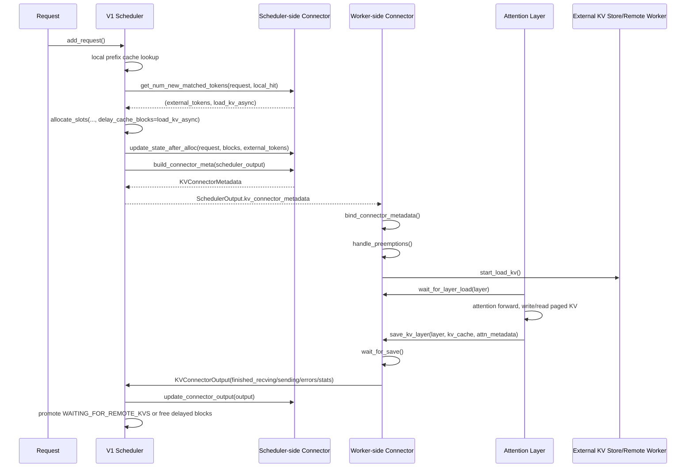

## 1. 先说结论

版本说明：本文参考的是2026-05-13访问的`vllm-project/vllm`官方GitHub tags和源码。远端稳定tag里已经有`v0.20.2`，并且还有`v0.21.0rc1/rc2`预发布tag；因此本文把`v0.20.2`作为“当前最新稳定版”来讲。vLLM的KV connector接口在源码里仍明确标注为experimental，所以生产环境要以你实际安装版本的源码和`vllm serve --help`为准。

一句话概括：

**vLLM V1 KV Connector不是一个单纯的数据搬运函数，而是一组横跨scheduler、worker、attention layer、executor输出聚合的双边协议。scheduler侧决定“哪些外部KV可用、该给哪些block预留位置、要把什么metadata发给worker”；worker侧根据metadata在forward前后执行load/save，并把完成状态、失败block、统计信息回传给scheduler。**

从推理过程看，KV connector主要插在四个位置：

1. 请求第一次进入调度时，scheduler调用`get_num_new_matched_tokens()`查询外部KV命中。
2. scheduler分配GPU KV block后，调用`update_state_after_alloc()`让connector记录load/store计划。
3. scheduler生成`SchedulerOutput`时，调用`build_connector_meta()`把计划封装成metadata，随本轮调度输出发给worker。
4. worker执行模型时，forward前调用`start_load_kv()`，attention层入口/出口调用`wait_for_layer_load()`和`save_kv_layer()`，forward后调用`wait_for_save()`、`get_finished()`和`build_connector_worker_meta()`回报结果。

这套接口同时服务几类场景：

1. **P/D disaggregation**：prefill worker算完KV，decode worker远程读取KV。典型实现是`NixlConnector`、`MooncakeConnector`。
2. **本地或外部KV offload**：把GPU KV cache搬到CPU、文件系统、LMCache等外部存储，再按prefix cache命中读回来。典型实现是`SimpleCPUOffloadConnector`、`OffloadingConnector`、`LMCacheConnectorV1`、`HF3FSKVConnector`。
3. **调试和实验connector**：例如`ExampleConnector`、`DecodeBenchConnector`。
4. **组合connector**：`MultiConnector`可以组合多个connector。

先给最核心的生命周期图：



## 2. KVTransferConfig：打开connector的入口

先看配置入口：`vllm/config/kv_transfer.py`。

`KVTransferConfig`的核心字段在`v0.20.2`里包括：

```python
kv_connector: str | None = None
engine_id: str | None = None
kv_buffer_device: str = ...
kv_buffer_size: float = 1e9
kv_role: KVRole | None = None
kv_rank: int | None = None
kv_parallel_size: int = 1
kv_ip: str = "127.0.0.1"
kv_port: int = 14579
kv_connector_extra_config: dict[str, Any] = field(default_factory=dict)
kv_connector_module_path: str | None = None
enable_permute_local_kv: bool = False
kv_load_failure_policy: Literal["recompute", "fail"] = "fail"
```

逐行解释：

1. `kv_connector`是connector名字，比如`NixlConnector`、`LMCacheConnectorV1`、`SimpleCPUOffloadConnector`。
2. `engine_id`是当前vLLM实例在KV传输协议里的身份。如果用户不传，`__post_init__()`会生成UUID。
3. `kv_buffer_device`描述connector临时buffer放在哪里。NIXL这类connector可能用`cuda`直接注册GPU内存，也可能用`cpu`做host staging buffer。
4. `kv_role`有`kv_producer`、`kv_consumer`、`kv_both`。P/D拆分里prefill侧通常生产KV，decode侧消费KV；offload场景常用`kv_both`。
5. `kv_rank`和`kv_parallel_size`主要服务早期或特定connector的并行实例配置。
6. `kv_ip`、`kv_port`给分布式connector建立side channel或通信组用。
7. `kv_connector_extra_config`是各connector自定义参数的入口。例如CPU offload的容量、NIXL backend、是否启用cross-layer blocks等。
8. `kv_connector_module_path`允许动态加载外部connector。也就是说用户可以不改vLLM源码，只要给模块路径和类名。
9. `kv_load_failure_policy`控制外部KV加载失败后怎么办：`fail`直接失败请求，`recompute`则把失败block对应token退回去重新算。

`__post_init__()`里有两个关键检查：

1. 没有`engine_id`就自动生成。
2. 只要设置了`kv_connector`，就必须设置`kv_role`。

所以最小配置不是只写connector名字，而是至少要能表达：

```python
KVTransferConfig(
    kv_connector="NixlConnector",
    kv_role="kv_both",
)
```

实际部署通常会更多，例如：

```json
{
  "kv_connector": "NixlConnector",
  "kv_role": "kv_both",
  "kv_buffer_device": "cuda",
  "kv_connector_extra_config": {
    "backends": ["UCX"]
  }
}
```

## 3. Factory：名字如何变成connector对象

入口是`vllm/distributed/kv_transfer/kv_connector/factory.py`。

`KVConnectorFactory`做三件事：

1. 维护一个`name -> lazy loader`注册表。
2. 根据`KVTransferConfig.kv_connector`找到类。
3. 分别创建scheduler侧和worker侧connector。

关键逻辑：

```python
connector_cls, compat_sig = cls._get_connector_class_with_compat(kv_transfer_config)
hma_enabled = not config.scheduler_config.disable_hybrid_kv_cache_manager
if hma_enabled and not supports_hma(connector_cls):
    raise ValueError(...)
...
return connector_cls(config, role, kv_cache_config)
```

逐行解释：

1. `_get_connector_class_with_compat()`先看内置注册表。
2. 如果注册表没有，再看`kv_connector_module_path`，动态`importlib.import_module()`加载外部模块。
3. `compat_sig`是兼容旧签名用的。新connector应该实现`__init__(vllm_config, role, kv_cache_config)`。
4. vLLM默认启用Hybrid KV Cache Manager时，connector类必须实现`SupportsHMA`，否则会要求用户设置`--disable-hybrid-kv-cache-manager`。
5. 同一个connector类会被创建两次：scheduler进程里`role=SCHEDULER`，worker进程里`role=WORKER`。接口上强制分离，是为了避免scheduler直接碰GPU KV tensor，也避免worker直接改调度状态。

截至`v0.20.2`，内置注册名包括：

| Connector | 典型用途 |
|---|---|
| `ExampleConnector` | 调试/教学，把KV写到共享存储 |
| `ExampleHiddenStatesConnector` | hidden states传输示例 |
| `P2pNcclConnector` | NCCL P2P风格KV传输 |
| `LMCacheConnectorV1` | 接LMCache |
| `LMCacheMPConnector` | LMCache多进程connector |
| `NixlConnector` | 基于NIXL的P/D远程KV传输 |
| `MultiConnector` | 组合多个connector |
| `MoRIIOConnector` | MoRIIO相关connector |
| `OffloadingConnector` | vLLM native offloading connector |
| `DecodeBenchConnector` | decode benchmark |
| `MooncakeConnector` | Mooncake传输 |
| `FlexKVConnectorV1` | FlexKV |
| `SimpleCPUOffloadConnector` | 简化版CPU KV offload |
| `HF3FSKVConnector` | HF3FS KV connector |

`NixlConnector`在`v0.20.2`里已经从单文件重构为包路径：

```text
vllm.distributed.kv_transfer.kv_connector.v1.nixl
```

内部再分成`connector.py`、`scheduler.py`、`worker.py`、`metadata.py`等文件。

## 4. KVConnectorBase_V1：API逐行拆解

核心抽象在`vllm/distributed/kv_transfer/kv_connector/v1/base.py`。

### 4.1 文件头注释其实就是协议说明

文件开头把接口分成scheduler-side和worker-side。

Scheduler-side：

1. `get_num_new_matched_tokens()`：查询远端或外部KV cache里命中了多少新token。
2. `update_state_after_alloc()`：CacheManager给请求分配block之后，connector记录这些block如何用于load/store。
3. `update_connector_output()`：worker侧回传结果后，scheduler侧connector更新内部状态。
4. `request_finished()`：请求结束时调用，connector决定是否需要延迟释放block。
5. `take_events()`：输出KV cache事件，用于监控/事件发布。

Worker-side：

1. `handle_preemptions()`：block被覆盖前处理正在异步保存的数据。
2. `start_load_kv()`：开始把KV加载进vLLM paged KV buffer。
3. `wait_for_layer_load()`：某一层attention执行前，等待这一层KV加载完成。
4. `save_kv_layer()`：attention层执行后，把这一层KV保存出去。
5. `wait_for_save()`：forward结束时等待保存完成。
6. `get_finished()`：返回哪些请求完成了异步send/recv。
7. `build_connector_worker_meta()`：返回worker侧metadata给scheduler侧connector。

### 4.2 CopyBlocksOp：host staging的复制抽象

`CopyBlocksOp`签名是：

```python
Callable[
    [
        dict[str, torch.Tensor],
        dict[str, torch.Tensor],
        list[int],
        list[int],
        Literal["h2d", "d2h"],
    ],
    None,
]
```

这不是通用tensor copy，而是“按KV block id复制”的函数：

1. 第一个dict是源KV cache tensor集合。
2. 第二个dict是目标KV cache tensor集合。
3. `s_indices`是源block id列表。
4. `d_indices`是目标block id列表。
5. `direction`是host-to-device或device-to-host。

NIXL在不能直接注册设备内存或配置了CPU buffer时，会用这个函数在GPU KV cache和host staging buffer之间搬block。

### 4.3 SupportsHMA：新KV cache manager下的多group支持

`SupportsHMA`只定义一个方法：

```python
request_finished_all_groups(request, block_ids)
```

为什么需要它？

现在vLLM的KV cache不一定只有一种block group。全注意力、sliding window、Mamba/SSM、不同层组可能有不同block布局。旧的`request_finished(request, list[int])`只适合单group。HMA打开时，connector必须能处理：

```python
tuple[list[int], ...]
```

也就是每个KV cache group一组block ids。

Factory里会检查：

```python
hma_enabled = not disable_hybrid_kv_cache_manager
if hma_enabled and not supports_hma(connector_cls):
    raise ValueError(...)
```

因此新connector最好直接继承`SupportsHMA`，实现`request_finished_all_groups()`。

### 4.4 KVConnectorRole：同一个类，两种身份

`KVConnectorRole`只有两个值：

```python
SCHEDULER = 0
WORKER = 1
```

这意味着connector类通常长这样：

```python
if role == KVConnectorRole.SCHEDULER:
    self.scheduler_impl = ...
    self.worker_impl = None
else:
    self.scheduler_impl = None
    self.worker_impl = ...
```

`NixlConnector`就是这种薄门面：scheduler方法转发到`NixlConnectorScheduler`，worker方法转发到`NixlConnectorWorker`。

### 4.5 三类metadata

`base.py`里有三类metadata：

1. `KVConnectorHandshakeMetadata`：out-of-band握手用。例如NIXL worker把agent name、内存region、端口等信息给对端。
2. `KVConnectorMetadata`：scheduler发给worker的本轮执行计划。
3. `KVConnectorWorkerMetadata`：worker回传给scheduler的补充状态。

`KVConnectorWorkerMetadata`要求实现：

```python
aggregate(self, other)
```

因为一个engine step可能有多个worker、多个TP rank、多个DP rank，executor会先聚合worker metadata，再给scheduler侧connector。

### 4.6 初始化：实验接口、必须有KVTransferConfig

`KVConnectorBase_V1.__init__()`做几件事：

1. 打warning：这个API仍是experimental。
2. 保存`_connector_metadata = None`。
3. 保存`_vllm_config`。
4. 从`vllm_config.kv_transfer_config`取`_kv_transfer_config`；如果没有就报错。
5. 保存`_kv_cache_config`。
6. 如果`kv_cache_config`是`None`，打deprecated warning。
7. 保存`_role`。

重点是：**新connector不能假设没有KVTransferConfig也能跑**。只要走`KVConnectorBase_V1`，`kv_transfer_config`就是必需项。

### 4.7 metadata绑定：worker侧每步都要bind/clear

worker侧有三个小方法：

```python
bind_connector_metadata(connector_metadata)
clear_connector_metadata()
_get_connector_metadata()
```

调用关系是：

1. model runner在forward前从`SchedulerOutput`取metadata。
2. 调`bind_connector_metadata()`放到connector内部。
3. connector的`start_load_kv()`、`save_kv_layer()`等方法从`_get_connector_metadata()`读取本轮计划。
4. forward结束后调用`clear_connector_metadata()`，避免下一轮误用旧metadata。

这也是`has_connector_metadata()`存在的原因：attention layer hook会检查当前是否真的绑定了metadata。没有metadata时，hook直接变成no-op。

### 4.8 register_kv_caches与cross-layer blocks

worker初始化KV cache后，会把KV cache tensor注册给connector：

```python
register_kv_caches(kv_caches: dict[str, torch.Tensor])
```

普通布局下，dict key通常是layer name，value是该层KV cache tensor。

另一个接口是：

```python
register_cross_layers_kv_cache(kv_cache, attn_backend)
```

它服务`prefer_cross_layer_blocks=True`的connector。意思是把多层KV放在一个带`num_layers`维度的大tensor里。NIXL在`v0.20.2`里会根据backend、KV cache layout、extra config决定是否偏好cross-layer blocks。

为什么有这个优化？

普通逐层KV cache搬运可能是：

```text
layer0 block7
layer1 block7
layer2 block7
...
```

cross-layer blocks可以把同一个block在多层上的数据放得更连续，减少注册和transfer描述符数量，对远程搬运更友好。

### 4.9 worker侧四个核心方法

#### start_load_kv()

```python
start_load_kv(forward_context, **kwargs)
```

语义：forward开始前，根据metadata启动load。

它不一定阻塞。NIXL会触发非阻塞远程读；SimpleCPUOffload甚至把实际copy延迟到`get_finished()`里提交；ExampleConnector会同步从文件读入KV。

#### wait_for_layer_load()

```python
wait_for_layer_load(layer_name)
```

语义：attention layer真正要读KV前，确保当前层需要的KV已经在paged KV buffer里。

如果connector是全量forward前加载，方法可以是no-op。如果connector做layer-by-layer pipeline，这里就是同步点。

#### save_kv_layer()

```python
save_kv_layer(layer_name, kv_layer, attn_metadata, **kwargs)
```

语义：attention layer结束后，把本层KV保存到外部系统。

注意这里传的是整层paged KV buffer和attention metadata。connector要根据slot mapping、block table、metadata判断哪些token/block属于本轮需要保存。

#### wait_for_save()

```python
wait_for_save()
```

语义：forward退出前确保保存动作不会和后续KV block复用发生数据竞争。

如果connector使用异步store并通过额外ref count保护block，可以不在这里阻塞；但如果没有保护，就必须等待。

### 4.10 get_finished()和错误上报

`get_finished(finished_req_ids)`返回：

```python
(finished_sending, finished_recving)
```

含义：

1. `finished_sending`：这些请求之前的send/save已经完成，scheduler可以释放被connector延迟持有的block。
2. `finished_recving`：这些请求的load/recv已经完成，scheduler可以把`WAITING_FOR_REMOTE_KVS`请求重新放回可调度状态。

另一个关键方法：

```python
get_block_ids_with_load_errors()
```

它返回加载失败的外部KV block id。scheduler收到后会按`kv_load_failure_policy`处理：

1. `fail`：请求失败。
2. `recompute`：撤销这些外部命中的token，重新计算。

### 4.11 scheduler侧三个抽象方法

#### get_num_new_matched_tokens()

```python
get_num_new_matched_tokens(request, num_computed_tokens) -> tuple[int | None, bool]
```

返回两个值：

1. 外部KV cache在`num_computed_tokens`之后还能额外命中多少token。
2. 是否异步加载。

三个细节很重要：

1. 这个方法可能对同一个请求调用多次，所以应该side-effect free。
2. 返回`None`表示connector暂时还无法判断命中长度，scheduler会跳过该请求，后面再问。
3. 如果命中token数是0，第二个返回值必须是`False`。

例如本地prefix cache已经命中64个token，外部CPU cache又能命中128个token，那么返回：

```python
(128, True)
```

如果是同步加载connector，也可以返回：

```python
(128, False)
```

区别在scheduler行为里会看到。

#### update_state_after_alloc()

```python
update_state_after_alloc(request, blocks, num_external_tokens)
```

这个方法在CacheManager分配block之后调用。connector在这里知道：

1. 哪个请求需要load。
2. 外部命中了多少token。
3. 这些token对应的目标GPU block ids是什么。

如果`get_num_new_matched_tokens()`返回异步加载，这个方法可能对同一个请求调用两次：第一次为外部KV预留block；load完成后请求重新调度，第二次为后续新计算token分配block。

#### build_connector_meta()

```python
build_connector_meta(scheduler_output) -> KVConnectorMetadata
```

这个方法把scheduler侧connector内部暂存的load/store计划封装成metadata。注释特别强调两点：

1. 不应该修改`scheduler_output`字段。
2. 调用后会reset connector内部状态。

换句话说，`update_state_after_alloc()`是在逐请求积累计划，`build_connector_meta()`是在本轮调度结束时一次性打包。

### 4.12 request_finished()：谁负责释放block

```python
request_finished(request, block_ids) -> tuple[bool, dict[str, Any] | None]
```

返回值第一项很关键：

1. `False`：scheduler可以现在释放block。
2. `True`：connector接管这些block的生命周期，等未来`get_finished()`返回该request id后scheduler再释放。

第二项是`kv_transfer_params`，会进入请求输出。P/D disaggregation里，prefill侧结束后通常会把远端读取所需的参数返回给上层router或decode侧，例如remote block ids、remote engine id、host、port等。

## 5. Scheduler推理调用链逐行讲解

下面看`vllm/v1/core/sched/scheduler.py`。

### 5.1 Scheduler初始化时创建scheduler-side connector

初始化阶段的关键代码：

```python
if self.vllm_config.kv_transfer_config is not None:
    self.connector = KVConnectorFactory.create_connector(
        config=self.vllm_config,
        role=KVConnectorRole.SCHEDULER,
        kv_cache_config=self.kv_cache_config,
    )
    kv_load_failure_policy = self.vllm_config.kv_transfer_config.kv_load_failure_policy
    self.recompute_kv_load_failures = kv_load_failure_policy == "recompute"
```

逐行解释：

1. 只要`kv_transfer_config`不为`None`，scheduler就创建connector。
2. `role=KVConnectorRole.SCHEDULER`保证创建的是scheduler侧逻辑。
3. `kv_cache_config`传进去，让connector知道block size、group、layout等信息。
4. `kv_load_failure_policy`被转换成布尔值`recompute_kv_load_failures`，后续处理失败block时使用。

注意：这里还禁止encoder-decoder模型使用KV connector，因为相关路径还没有完整支持。

### 5.2 第一次调度请求：先查本地cache，再查外部cache

在waiting队列调度新请求时，核心代码从`request.num_computed_tokens == 0`开始。

第一步：本地prefix cache命中。

```python
new_computed_blocks, num_new_local_computed_tokens = (
    self.kv_cache_manager.get_computed_blocks(request)
)
```

含义：

1. `new_computed_blocks`是本地GPU prefix cache命中的block。
2. `num_new_local_computed_tokens`是这些block对应的token数。

第二步：如果有connector，继续查外部KV cache。

```python
ext_tokens, load_kv_async = (
    self.connector.get_num_new_matched_tokens(
        request, num_new_local_computed_tokens
    )
)
```

这里传入的是“本地已经命中的token数”。connector只需要回答在这个基础之后还能命中多少外部token。

如果`ext_tokens is None`：

```python
request_queue.pop_request()
step_skipped_waiting.prepend_request(request)
continue
```

这表示connector暂时无法回答，比如远程索引查询还没返回。scheduler不阻塞整个step，而是把请求放进skipped waiting，下轮再试。

如果命中成功：

```python
num_external_computed_tokens = ext_tokens
num_computed_tokens = num_new_local_computed_tokens + num_external_computed_tokens
```

也就是说，对scheduler来说：

```text
已经可视为computed的token = 本地prefix cache命中 + 外部KV命中
```

在`v0.20.2`里，prefill统计也在这里记录：

```python
request.prefill_stats.set(
    num_prompt_tokens=request.num_prompt_tokens,
    num_local_cached_tokens=num_new_local_computed_tokens,
    num_external_cached_tokens=num_external_computed_tokens,
)
```

这就是为什么指标里能区分本地cache hit和external KV transfer。

### 5.3 异步load时，本轮不算新token

如果connector返回`load_kv_async=True`：

```python
assert num_external_computed_tokens > 0
num_new_tokens = 0
```

含义：

1. 本轮只发起外部KV加载。
2. 不把该请求放进真正要跑模型计算的batch。
3. 这样可以让远程KV传输和其他请求的GPU compute重叠。

如果不是异步load：

```python
num_new_tokens = request.num_tokens - num_computed_tokens
...
num_new_tokens = min(num_new_tokens, token_budget)
```

也就是直接把外部命中视作已经就绪，然后继续调度剩余token计算。

### 5.4 allocate_slots：给外部KV预留GPU block

无论同步还是异步，scheduler都要给请求分配KV block：

```python
new_blocks = self.kv_cache_manager.allocate_slots(
    request,
    num_new_tokens,
    num_new_computed_tokens=num_new_local_computed_tokens,
    new_computed_blocks=new_computed_blocks,
    num_lookahead_tokens=effective_lookahead_tokens,
    num_external_computed_tokens=num_external_computed_tokens,
    delay_cache_blocks=load_kv_async,
    num_encoder_tokens=num_encoder_tokens,
)
```

逐项解释：

1. `num_new_tokens`：本轮真正要计算的新token数。异步load时是0。
2. `num_new_computed_tokens`：本地prefix cache命中token数。
3. `new_computed_blocks`：本地命中的block对象。
4. `num_external_computed_tokens`：外部KV命中token数。
5. `delay_cache_blocks=load_kv_async`：异步load时，block先分配但不能马上放进prefix cache，因为数据还没到。

这一点非常关键：**外部KV命中不是只改一个计数，还必须为即将读入的KV准备GPU block位置。**

### 5.5 update_state_after_alloc：connector拿到目标block

分配成功后：

```python
self.connector.update_state_after_alloc(
    request,
    self.kv_cache_manager.get_blocks(request_id),
    num_external_computed_tokens,
)
```

这一步把request和分配好的block交给connector。

以NIXL为例，decode侧会在这里记录：

```text
这个请求要从remote_block_ids读KV，
读到本地local_block_ids里。
```

以SimpleCPUOffload为例，会在这里找到CPU cache命中的block，并建立：

```text
CPU block id -> GPU block id
```

的传输对。

### 5.6 异步load请求进入WAITING_FOR_REMOTE_KVS

如果`load_kv_async=True`：

```python
request.status = RequestStatus.WAITING_FOR_REMOTE_KVS
step_skipped_waiting.prepend_request(request)
request.num_computed_tokens = num_computed_tokens
continue
```

逐行解释：

1. 请求状态改成`WAITING_FOR_REMOTE_KVS`，说明不是普通waiting，而是在等外部KV加载。
2. 放入`skipped_waiting`，本轮不进running。
3. `request.num_computed_tokens`提前设置为“本地+外部命中”的数量，但注释强调：在transfer完成前，不会使用这个值继续计算。
4. 如果transfer失败，后面会通过`_update_requests_with_invalid_blocks()`把这个计数往回调。

### 5.7 build_connector_meta：调度输出里携带传输计划

本轮`scheduler_output`构建完成后：

```python
meta = self._build_kv_connector_meta(self.connector, scheduler_output)
scheduler_output.kv_connector_metadata = meta
```

注释写得很清楚，这一步有三个目的：

1. plan KV cache store。
2. 把所有KV cache load/save操作包装成一个opaque object。
3. 清理connector内部状态。

注意这里不是只给异步load用。即使本轮没有远程load，也可能有store计划，例如把刚算完的KV保存到外部cache。

### 5.8 worker回传后，scheduler如何恢复请求

模型执行结束后，scheduler在`_update_from_kv_xfer_finished()`里处理`KVConnectorOutput`。

先让scheduler-side connector处理自己的状态：

```python
if self.connector is not None:
    self.connector.update_connector_output(kv_connector_output)
```

然后处理完成接收的请求：

```python
for req_id in kv_connector_output.finished_recving or ():
    req = self.requests[req_id]
    if req.status == RequestStatus.WAITING_FOR_REMOTE_KVS:
        self.finished_recving_kv_req_ids.add(req_id)
    else:
        assert RequestStatus.is_finished(req.status)
        self._free_blocks(self.requests[req_id])
```

解释：

1. 如果请求仍在等远端KV，就把id加入`finished_recving_kv_req_ids`。
2. 如果请求已经结束，说明用户可能abort了请求但KV load后来才完成，这时释放延迟持有的block。

处理完成发送的请求：

```python
for req_id in kv_connector_output.finished_sending or ():
    self._free_blocks(self.requests[req_id])
```

这对应`request_finished()`返回`True`的情况：请求结束时没有释放block，等send完成后再释放。

### 5.9 WAITING_FOR_REMOTE_KVS如何重新进入调度

下一次调度时，scheduler会尝试提升blocked waiting request：

```python
if request.status == RequestStatus.WAITING_FOR_REMOTE_KVS:
    if request.request_id not in self.finished_recving_kv_req_ids:
        return False
    self._update_waiting_for_remote_kv(request)
    request.status = RequestStatus.WAITING
    return True
```

`_update_waiting_for_remote_kv()`做的事：

1. 如果这个请求在失败集合里，根据当前`num_computed_tokens`缓存成功部分，或者释放block准备重算。
2. 如果没失败，把这些block正式放入prefix cache。
3. 如果是full prompt hit，把`num_computed_tokens`减1，因为最后一个token需要重算才能采样下一个token。
4. 从`finished_recving_kv_req_ids`移除请求。

这解释了一个常见疑问：**为什么远程KV full hit时还要重算最后一个token？**

因为decode要基于最后一个prompt token的输出logits采样下一个token；KV cache只保存attention历史，不等于已经有当前step的采样结果。

### 5.10 加载失败：fail还是recompute

worker侧如果发现外部KV加载失败，会把block id放到：

```python
KVConnectorOutput.invalid_block_ids
```

scheduler先调用`_handle_invalid_blocks()`找受影响请求，然后：

1. `kv_load_failure_policy="fail"`：把请求标成`FINISHED_ERROR`。
2. `kv_load_failure_policy="recompute"`：把受影响token从“已计算”里扣掉，后续重新调度计算。

这就是为什么connector必须只报告“确实加载失败的block id”，否则可能导致错误重算或错误失败。

## 6. Worker推理调用链逐行讲解

worker侧主入口在`vllm/v1/worker/gpu/kv_connector.py`和`gpu/model_runner.py`。

### 6.1 Worker初始化：全局KV transfer group

worker初始化KV cache前会调用：

```python
ensure_kv_transfer_initialized(self.vllm_config, kv_cache_config)
```

这个函数在`kv_transfer_state.py`里：

```python
if vllm_config.kv_transfer_config.is_kv_transfer_instance and _KV_CONNECTOR_AGENT is None:
    _KV_CONNECTOR_AGENT = KVConnectorFactory.create_connector(
        config=vllm_config,
        role=KVConnectorRole.WORKER,
        kv_cache_config=kv_cache_config,
    )
```

逐行解释：

1. 每个worker进程有一个全局`_KV_CONNECTOR_AGENT`。
2. 只有`kv_transfer_config.is_kv_transfer_instance`为真才创建。
3. 这里的role是`WORKER`。

然后`GPUModelRunner`初始化KV cache tensor后调用：

```python
self.kv_connector = get_kv_connector(self.vllm_config, kv_caches_dict)
```

如果没有全局KV transfer group，返回`NO_OP_KV_CONNECTOR`；否则返回`ActiveKVConnector`。

### 6.2 ActiveKVConnector初始化：注册KV cache

`ActiveKVConnector.__init__()`做三件事：

```python
self.kv_connector = get_kv_transfer_group()
self.kv_connector.register_kv_caches(kv_caches_dict)
self.kv_connector.set_host_xfer_buffer_ops(copy_kv_blocks)
```

含义：

1. 拿到全局worker-side connector。
2. 把每层KV cache tensor注册给connector。
3. 把vLLM内置的block copy函数交给connector，供host staging场景使用。

这个注册动作很重要。没有它，connector只知道“block id”，不知道“block id对应哪块tensor内存”。

### 6.3 forward前：bind metadata、处理抢占、启动load

`ActiveKVConnector.pre_forward()`：

```python
kv_connector_metadata = scheduler_output.kv_connector_metadata
self.kv_connector.bind_connector_metadata(kv_connector_metadata)
self.kv_connector.handle_preemptions(kv_connector_metadata)
self.kv_connector.start_load_kv(get_forward_context())
```

逐行解释：

1. 从`scheduler_output`拿本轮metadata。
2. 绑定到worker-side connector内部。
3. 如果本轮有preemption或block即将被覆盖，connector有机会先flush/sync，避免异步store读到被覆盖的数据。
4. 调`start_load_kv()`启动load。

`pre_forward()`对full CUDA graph路径和eager/piecewise路径都要调用。对full graph，vLLM在`run_fullgraph()`之前调用；对eager/piecewise，vLLM在`set_forward_context(...)`上下文中调用。

### 6.4 attention层：decorator插入layer级同步和保存

KV connector真正靠近attention的地方是`maybe_transfer_kv_layer`。

它包在attention入口上：

```python
@maybe_transfer_kv_layer
def unified_attention_with_output(...):
    ...
    self.impl.forward(..., kv_cache, attn_metadata, ...)
```

decorator逻辑：

```python
if not has_kv_transfer_group() or not is_v1_kv_transfer_group():
    return func(*args, **kwargs)
layer_name = _resolve_layer_name(...)
attn_metadata, _, kv_cache, _ = get_attention_context(layer_name)
connector = get_kv_transfer_group()
if attn_metadata is None or not connector.has_connector_metadata():
    return func(*args, **kwargs)
connector.wait_for_layer_load(layer_name)
result = func(*args, **kwargs)
connector.save_kv_layer(layer_name, kv_cache, attn_metadata)
return result
```

逐行解释：

1. 没有KV connector时直接执行attention，零额外行为。
2. 不是V1 connector也直接执行。
3. 解析`layer_name`，因为torch compile/custom op里layer name可能不是普通字符串。
4. 从`forward_context`拿到当前层的`attn_metadata`、attention layer对象、KV cache tensor、slot mapping。
5. 如果当前没有metadata，说明这轮没有connector工作，也直接执行attention。
6. attention前调用`wait_for_layer_load(layer_name)`。
7. 执行原attention。这个过程中会读写paged KV cache。
8. attention后调用`save_kv_layer(layer_name, kv_cache, attn_metadata)`。

这就是layer-by-layer connector能够做pipeline的原因：它可以在layer N计算时异步准备layer N+1的KV，也可以在layer N结束后立即保存layer N的KV。

### 6.5 forward后：等待保存并回传状态

`ActiveKVConnector.post_forward()`：

```python
output = KVConnectorOutput()
if wait_for_save:
    self.kv_connector.wait_for_save()
output.finished_sending, output.finished_recving = (
    self.kv_connector.get_finished(scheduler_output.finished_req_ids)
)
output.invalid_block_ids = self.kv_connector.get_block_ids_with_load_errors()
output.kv_connector_stats = self.kv_connector.get_kv_connector_stats()
output.kv_cache_events = self.kv_connector.get_kv_connector_kv_cache_events()
output.kv_connector_worker_meta = self.kv_connector.build_connector_worker_meta()
self.kv_connector.clear_connector_metadata()
return output
```

逐行解释：

1. 创建空`KVConnectorOutput`。
2. 默认等待保存完成。某些特殊路径会设置`wait_for_save=False`。
3. 获取完成send/recv的请求id。
4. 获取失败block id。
5. 获取connector统计信息。
6. 获取KV cache事件。
7. 获取worker回传metadata。
8. 清理本轮metadata。
9. 把output交给scheduler。

如果本轮没有实际模型计算，比如DP padding后所有rank都是0 token，vLLM会走`no_forward()`：

```python
self.pre_forward(scheduler_output)
kv_connector_output = self.post_forward(scheduler_output, wait_for_save=False)
```

这保证了即使没有GPU compute，也能推进异步KV传输状态。

## 7. KVConnectorOutput：worker如何告诉scheduler发生了什么

`vllm/v1/outputs.py`里的`KVConnectorOutput`字段：

```python
finished_sending: set[str] | None = None
finished_recving: set[str] | None = None
kv_connector_stats: KVConnectorStats | None = None
kv_cache_events: KVConnectorKVEvents | None = None
kv_connector_worker_meta: KVConnectorWorkerMetadata | None = None
invalid_block_ids: set[int] = field(default_factory=set)
expected_finished_count: int = 0
```

逐项解释：

1. `finished_sending`：请求的异步send/save完成。
2. `finished_recving`：请求的异步recv/load完成。
3. `kv_connector_stats`：connector自定义统计，比如NIXL传输延迟、失败次数。
4. `kv_cache_events`：KV cache事件。
5. `kv_connector_worker_meta`：worker到scheduler的自定义metadata，比如SimpleCPUOffload用它回报哪些store event完成。
6. `invalid_block_ids`：加载失败的外部KV block。
7. `expected_finished_count`：对某些connector，完成通知不是简单按world size聚合，这个字段可调整聚合器预期。

`merge()`方法会合并多worker输出：

1. set字段做union。
2. stats调用`aggregate()`。
3. events调用`merge()`。
4. `expected_finished_count`要求所有输出一致。

这解释了为什么自定义stats和worker metadata要实现自己的聚合逻辑：vLLM可能有多个worker同时返回connector输出。

## 8. NixlConnector：P/D disaggregation的典型实现

`v0.20.2`的NIXL connector拆成：

```text
vllm/distributed/kv_transfer/kv_connector/v1/nixl/connector.py
vllm/distributed/kv_transfer/kv_connector/v1/nixl/scheduler.py
vllm/distributed/kv_transfer/kv_connector/v1/nixl/worker.py
vllm/distributed/kv_transfer/kv_connector/v1/nixl/metadata.py
```

### 8.1 connector.py：薄门面

`NixlConnector`继承：

```python
class NixlConnector(KVConnectorBase_V1, SupportsHMA):
```

说明它支持V1 API，也支持HMA多group block。

初始化时：

```python
if role == KVConnectorRole.SCHEDULER:
    self.connector_scheduler = NixlConnectorScheduler(...)
    self.connector_worker = None
elif role == KVConnectorRole.WORKER:
    self.connector_scheduler = None
    self.connector_worker = NixlConnectorWorker(...)
```

后面所有scheduler-side方法都只是转发：

```python
def get_num_new_matched_tokens(...):
    return self.connector_scheduler.get_num_new_matched_tokens(...)
```

worker-side方法也只是转发：

```python
def start_load_kv(...):
    self.connector_worker.start_load_kv(self._connector_metadata)
```

这种写法的好处是：

1. scheduler逻辑不依赖NIXL worker内部状态。
2. worker逻辑不依赖scheduler队列。
3. connector类本身只负责符合vLLM接口。

### 8.2 NIXL如何决定远程prefill命中

`NixlConnectorScheduler.get_num_new_matched_tokens()`：

```python
params = request.kv_transfer_params
if params is not None and params.get("do_remote_prefill"):
    token_ids = request.prompt_token_ids or []
    actual = self._mamba_prefill_token_count(len(token_ids))
    count = actual - num_computed_tokens
    if count > 0:
        return count, True
...
return 0, False
```

逐行解释：

1. NIXL不是自己查一个全局KV索引，而是看请求里是否携带`kv_transfer_params`。
2. `do_remote_prefill=True`表示这个请求要从远端prefill worker拉KV。
3. `actual`通常是prompt长度；Mamba模型有特殊处理，可能要少一个token。
4. `count = actual - num_computed_tokens`表示除本地已命中token外，还要从远端拉多少token。
5. 返回`True`表示异步加载。

所以NIXL的外部命中来源通常不是“缓存系统查到了prefix”，而是上游P/D协议明确告诉decode侧：prefill侧已经算好了这些block，你可以去拉。

### 8.3 update_state_after_alloc：建立远端block到本地block的映射

NIXL scheduler侧在`update_state_after_alloc()`里看`kv_transfer_params`。

如果`do_remote_decode`：

```python
self._reqs_in_batch.add(request.request_id)
```

这表示当前请求在prefill侧参与了batch，后续可能需要让decode侧读取。

如果使用host buffer，并且是remote decode：

```python
self._reqs_need_save[request.request_id] = request
```

表示prefill侧需要把新算出的KV先保存到host buffer，供NIXL传输。

如果是`do_remote_prefill`：

1. 检查`remote_block_ids`是否存在。
2. 检查`remote_engine_id`、`remote_request_id`、`remote_host`、`remote_port`是否存在。
3. 从`KVCacheBlocks`里取本地未hash block ids。
4. 记录：

```python
self._reqs_need_recv[request.request_id] = (request, local_block_ids)
```

最后把：

```python
params["do_remote_prefill"] = False
```

防止同一请求重复触发远程拉取。

### 8.4 build_connector_meta：把recv/save/send计划交给worker

NIXL的`build_connector_meta()`：

```python
meta = NixlConnectorMetadata()
for req_id, (req, block_ids) in self._reqs_need_recv.items():
    meta.add_new_req_to_recv(
        request_id=req_id,
        local_block_ids=block_ids,
        kv_transfer_params=req.kv_transfer_params,
    )
if self.use_host_buffer:
    self._build_save_meta(meta, scheduler_output)
meta.reqs_to_send = self._reqs_need_send
meta.reqs_in_batch = self._reqs_in_batch
meta.reqs_not_processed = self._reqs_not_processed
...
return meta
```

逐行解释：

1. `reqs_to_recv`告诉worker：哪些请求要从远端读KV，读到哪些本地block。
2. `use_host_buffer`时，还要构造save metadata，让worker把本地GPU KV保存到host buffer。
3. `reqs_to_send`记录prefill侧有哪些请求的block要保留，等decode侧读取。
4. `reqs_in_batch`和`reqs_not_processed`用于处理异步调度下请求是否真的进入batch，以及abort场景。
5. 构造完metadata后，清空scheduler侧暂存集合。

### 8.5 request_finished：prefill侧如何把remote参数交出去

NIXL的`request_finished()`在P/D里非常关键。

如果请求没有`kv_transfer_params`，直接：

```python
return False, None
```

如果还带着`do_remote_prefill`，说明请求还没调度就结束或abort了。NIXL会放一个空recv任务，避免远端prefill block泄漏。

如果不是`do_remote_decode`，也直接返回。

如果是remote decode并且请求正常到达长度上限：

```python
delay_free_blocks = any(len(group) > 0 for group in block_ids)
if delay_free_blocks:
    self._reqs_need_send[request.request_id] = expiration_time
    block_ids = self.get_sw_clipped_blocks(block_ids)
return delay_free_blocks, dict(
    do_remote_prefill=True,
    do_remote_decode=False,
    remote_block_ids=block_ids,
    remote_engine_id=self.engine_id,
    remote_request_id=request.request_id,
    remote_host=self.side_channel_host,
    remote_port=self.side_channel_port,
    tp_size=...
)
```

这段逻辑含义：

1. 如果有实际block，就延迟释放，让decode侧有时间读。
2. `_reqs_need_send`记录请求和超时时间。
3. `kv_transfer_params`返回给上层，decode侧拿它发起remote prefill读取。
4. 参数里包含远端block ids、远端engine id、远端request id、host、port、TP size。

这就是P/D disaggregation里KV传输参数从prefill侧流向decode侧的地方。

### 8.6 worker.start_load_kv：真正触发非阻塞NIXL传输

`NixlConnectorWorker.start_load_kv()`：

```python
for req_id, meta in metadata.reqs_to_recv.items():
    meta.local_physical_block_ids = self._logical_to_kernel_block_ids(
        meta.local_block_ids
    )
    remote_engine_id = meta.remote.engine_id
    self._recving_metadata[req_id] = meta
    if remote_engine_id not in self._remote_agents:
        self._background_nixl_handshake(req_id, remote_engine_id, meta)
        continue
    self._read_blocks_for_req(req_id, meta)
```

逐行解释：

1. scheduler给的是逻辑block id，worker要转成kernel/物理block id。
2. 远端block id保留逻辑形式，后续根据远端engine的block size比例展开。
3. `_recving_metadata`保存请求metadata，后续完成、失败、后处理都需要。
4. 如果还没有远端NIXL agent信息，启动后台handshake。
5. 如果已经握手，直接发起异步read。

后面还会处理`_ready_requests`：握手刚完成的请求也会立即开始read。

### 8.7 worker.get_finished：完成通知、postprocess和失败block

NIXL worker的`get_finished()`：

```python
done_sending = self._get_new_notifs()
done_recving = self._pop_done_transfers(self._recving_transfers)
done_recving.update(self._failed_recv_reqs)
...
for req_id in done_recving:
    meta = self._recving_metadata.pop(req_id, None)
    if self.use_host_buffer:
        self.sync_recved_kv_to_device(req_id, meta)
    ...
return done_sending, done_recving
```

逐行解释：

1. `_get_new_notifs()`读取远端发来的“已经读完，可以释放”通知，对应`finished_sending`。
2. `_pop_done_transfers()`轮询NIXL异步read完成，对应`finished_recving`。
3. 失败的recv也要加入`done_recving`，因为scheduler必须被唤醒去处理失败。
4. 如果使用host buffer，完成后还要把host staging里的KV同步回device KV cache。
5. 异构block size或layout场景还要做postprocess。

失败block通过：

```python
get_block_ids_with_load_errors()
```

返回并清空。scheduler据此fail或recompute。

## 9. SimpleCPUOffloadConnector：本地CPU offload的典型实现

`SimpleCPUOffloadConnector`适合理解offload connector，因为它比NIXL少了网络握手。

### 9.1 初始化：scheduler manager和worker handler分离

```python
if role == KVConnectorRole.SCHEDULER:
    self.scheduler_manager = SimpleCPUOffloadScheduler(...)
elif role == KVConnectorRole.WORKER:
    self.worker_handler = SimpleCPUOffloadWorker(...)
```

如果prefix caching没开，它会warning并禁用CPU offload，因为CPU offload复用的是prefix cache block hash机制。

容量来自：

```python
cpu_bytes_to_use
cpu_bytes_to_use_per_rank
```

其中`cpu_bytes_to_use`是server-wide，按world size均分；`cpu_bytes_to_use_per_rank`可以显式覆盖。

### 9.2 get_num_new_matched_tokens：在CPU block pool里查最长命中

`SimpleCPUOffloadScheduler.get_num_new_matched_tokens()`：

```python
skipped = num_computed_tokens // self.block_size
remaining_hashes = request.block_hashes[skipped:]
max_hit_len = request.num_tokens - 1 - num_computed_tokens
_, hit_length = self.cpu_coordinator.find_longest_cache_hit(
    remaining_hashes, max_hit_len
)
if hit_length > 0:
    return hit_length, True
return 0, False
```

逐行解释：

1. 本地GPU prefix cache已经命中的block跳过。
2. 用剩下的block hash去CPU cache里查。
3. `max_hit_len`减1，是因为最后一个token仍要重算用于采样。
4. 命中后返回`True`，表示异步从CPU搬回GPU。

### 9.3 update_state_after_alloc：生成CPU->GPU block copy计划

核心逻辑：

1. 根据`num_external_tokens`算要load多少block。
2. 从CPU block pool找到命中的CPU blocks。
3. 从GPU分配结果中找到对应目标GPU block ids。
4. touch CPU blocks，避免异步load时被淘汰。
5. touch GPU blocks，避免异步load时被释放。
6. 写入`_reqs_to_load[req_id] = LoadRequestState(...)`。

这个connector展示了scheduler侧connector最典型的职责：**不搬数据，只记录“从哪些外部block搬到哪些GPU block”。**

### 9.4 build_connector_meta：store和load一起打包

`build_connector_meta()`先准备store：

```python
store_gpu, store_cpu, store_req_ids = self.prepare_store_specs(scheduler_output)
```

再准备load：

```python
for req_id, load_state in self._reqs_to_load.items():
    load_gpu.extend(load_state.transfer_meta.gpu_block_ids)
    load_cpu.extend(load_state.transfer_meta.cpu_block_ids)
```

最后返回：

```python
SimpleCPUOffloadMetadata(
    load_event=...,
    load_gpu_blocks=...,
    load_cpu_blocks=...,
    store_event=...,
    store_gpu_blocks=...,
    store_cpu_blocks=...,
    need_flush=bool(scheduler_output.preempted_req_ids),
)
```

这里的event id是scheduler和worker之间对齐异步copy完成状态的编号。

### 9.5 worker.get_finished：延迟提交copy以隐藏开销

SimpleCPUOffload worker比较特殊：

```python
start_load_kv(): pass
wait_for_layer_load(): pass
save_kv_layer(): pass
wait_for_save(): pass
```

真正提交copy是在`get_finished()`：

```python
if metadata.load_cpu_blocks:
    self._backend.launch_copy(..., is_store=False, event_idx=metadata.load_event)
if metadata.store_gpu_blocks:
    self._backend.launch_copy(..., is_store=True, event_idx=metadata.store_event)
```

注释说明这么做是为了把CPU侧block copy op开销隐藏到GPU compute之后。然后它轮询CUDA events：

1. load event完成后，返回`finished_recving`请求id。
2. store event完成后，写入`_completed_store_events`。
3. `build_connector_worker_meta()`把完成的store events回传给scheduler。

### 9.6 update_connector_output：scheduler确认store真正完成

SimpleCPUOffload scheduler侧处理worker metadata：

```python
meta = connector_output.kv_connector_worker_meta
for event_idx, count in meta.completed_store_events.items():
    total = self._store_event_pending_counts.get(event_idx, 0) + count
    if total >= self._expected_worker_count:
        self._process_store_event(event_idx)
```

含义：

1. 多worker场景下，一个store event需要等所有相关worker都完成。
2. 完成后把CPU blocks正式插入CPU prefix cache map。
3. 释放之前touch住的CPU/GPU block ref count。

这说明“worker说copy完成”和“scheduler把block纳入cache索引”是两个阶段。

## 10. 同步load与异步load的行为差异

`get_num_new_matched_tokens()`第二个返回值决定scheduler路径。

### 10.1 同步load：本轮继续计算

如果返回：

```python
(external_tokens, False)
```

scheduler会：

1. 把外部命中计入`num_computed_tokens`。
2. 继续计算剩余`num_new_tokens`。
3. 请求进入running batch。
4. worker必须在本轮forward前或attention前确保KV已经可用。

这种模式适合很快的本地加载，或者connector在`start_load_kv()`里同步完成。

### 10.2 异步load：本轮只发起传输

如果返回：

```python
(external_tokens, True)
```

scheduler会：

1. 给外部KV分配目标GPU block。
2. 设置`num_new_tokens = 0`。
3. 请求状态变成`WAITING_FOR_REMOTE_KVS`。
4. 本轮worker只拿metadata发起传输。
5. 传输完成后，下轮再把请求提升回`WAITING`继续调度。

这种模式适合远程KV传输和CPU/GPU异步copy，因为可以和其他请求的计算重叠。

## 11. 自定义connector应该怎么写

最小结构：

```python
class MyConnector(KVConnectorBase_V1, SupportsHMA):
    def __init__(self, vllm_config, role, kv_cache_config):
        super().__init__(vllm_config, role, kv_cache_config)
        if role == KVConnectorRole.SCHEDULER:
            ...
        else:
            ...
```

必须实现的抽象方法：

1. worker侧：`start_load_kv()`、`wait_for_layer_load()`、`save_kv_layer()`、`wait_for_save()`。
2. scheduler侧：`get_num_new_matched_tokens()`、`update_state_after_alloc()`、`build_connector_meta()`。
3. 如果继承`SupportsHMA`：`request_finished_all_groups()`。

强烈建议实现：

1. `register_kv_caches()`：拿到worker侧KV tensor。
2. `get_finished()`：上报异步传输完成。
3. `get_block_ids_with_load_errors()`：上报失败block。
4. `build_connector_worker_meta()`和`KVConnectorWorkerMetadata.aggregate()`：多worker场景同步状态。
5. `shutdown()`：关闭线程、socket、NIXL agent、文件句柄。
6. `requires_piecewise_for_cudagraph()`：如果依赖layer-wise Python hook，避免FULL CUDA graph跳过Python逻辑。

几个常见错误：

1. 在`get_num_new_matched_tokens()`里做有副作用的状态修改。这个方法可能被重复调用，应该尽量只查询。
2. 异步load返回`True`但没有touch或保护目标GPU block，导致block被提前复用。
3. `request_finished()`返回`True`后，忘记在`get_finished()`里返回`finished_sending`，导致block永远不释放。
4. worker侧忘记`clear_connector_metadata()`，下一轮误用旧metadata。
5. 只处理单KV group，在HMA开启时拿错block ids。
6. 失败传输没有填`invalid_block_ids`，scheduler会把错误KV当作可用KV。

## 12. 一个完整请求例子

假设请求prompt长度是1024 tokens，block size是16。

本地GPU prefix cache命中前256 tokens，外部CPU/NIXL命中后512 tokens。

调度过程：

```text
num_new_local_computed_tokens = 256
get_num_new_matched_tokens(request, 256) -> (512, True)
num_computed_tokens = 256 + 512 = 768
load_kv_async = True
num_new_tokens = 0
allocate_slots(..., num_external_computed_tokens=512, delay_cache_blocks=True)
update_state_after_alloc(request, blocks, 512)
request.status = WAITING_FOR_REMOTE_KVS
request.num_computed_tokens = 768
build_connector_meta()
```

worker过程：

```text
bind_connector_metadata(meta)
start_load_kv(): CPU->GPU or remote->local GPU async transfer
post_forward/no_forward:
    get_finished() -> maybe no completion yet
```

后续某一轮：

```text
get_finished() -> finished_recving={req_id}
scheduler._update_from_kv_xfer_finished()
finished_recving_kv_req_ids.add(req_id)
_try_promote_blocked_waiting_request()
_update_waiting_for_remote_kv()
request.status = WAITING
```

再次调度：

```text
request.num_computed_tokens = 768
num_new_tokens = 1024 - 768 = 256
进入running batch继续prefill最后256 tokens
```

如果1024 tokens全部来自外部KV，scheduler会在load完成后把`num_computed_tokens`从1024改成1023，让最后一个token重新计算并产生采样logits。

## 13. 和prefix caching的关系

KV connector和vLLM本地prefix caching不是同一个东西，但它们在调度里被串起来：

```text
local prefix cache hit -> external KV connector hit -> compute remaining tokens
```

本地prefix cache由`KVCacheManager.get_computed_blocks()`处理，外部cache由`connector.get_num_new_matched_tokens()`处理。

外部KV加载完成后，scheduler会调用：

```python
self.kv_cache_manager.cache_blocks(request, request.num_computed_tokens)
```

把加载好的block纳入本地prefix cache体系。这样后续请求可能直接本地命中，不再走外部connector。

但要注意：

1. 异步load尚未完成时，block不能进入prefix cache。
2. load失败时，必须避免把坏block加入cache。
3. full hit仍需重算最后一个token。

## 14. 和CUDA graph的关系

KV connector的layer hook是Python逻辑：

```python
connector.wait_for_layer_load(layer_name)
...
connector.save_kv_layer(layer_name, kv_cache, attn_metadata)
```

如果connector依赖这些hook执行异步同步或保存，而模型forward被FULL CUDA graph捕获，Python hook可能不会在replay时执行，造成数据竞争。

因此`KVConnectorBase_V1`提供：

```python
requires_piecewise_for_cudagraph(extra_config) -> bool
```

connector如果需要layer-wise Python操作，应该返回`True`。vLLM配置检查里会把FULL CUDA graph改成PIECEWISE模式，让图分段执行，中间保留Python hook机会。

## 15. 实用判断：什么时候用哪类connector

| 场景 | 更适合的connector方向 | 原因 |
|---|---|---|
| 单机GPU显存不足，要把冷KV放CPU | `SimpleCPUOffloadConnector`或`OffloadingConnector` | 不需要网络，重点是GPU/CPU block生命周期 |
| P/D disaggregation，跨机器搬KV | `NixlConnector`、`MooncakeConnector` | 需要远端metadata、RDMA/UCX/side channel |
| 已经部署LMCache | `LMCacheConnectorV1` | 复用LMCache的索引、存储和淘汰策略 |
| 多种后端组合 | `MultiConnector` | 一个请求可能同时涉及多类KV后端 |
| 只是学习接口 | `ExampleConnector` | 逻辑简单，但不适合生产 |

使用前要确认四件事：

1. 你的模型类型和KV cache layout是否被该connector支持。
2. HMA是否开启，以及connector是否实现`SupportsHMA`。
3. 传输失败时希望`fail`还是`recompute`。
4. FULL CUDA graph是否会绕过connector需要的Python hook。

## 16. 总结

vLLM V1 KV Connector的核心不是“把tensor复制一下”，而是把KV cache传输变成调度器可理解、worker可执行、attention层可同步、失败可恢复的一套协议。

最重要的主线是：

```text
KVTransferConfig
  -> KVConnectorFactory创建scheduler/worker双边connector
  -> scheduler查询外部命中并分配block
  -> build_connector_meta把计划发给worker
  -> worker在forward前后执行load/save
  -> attention hook做layer级等待和保存
  -> KVConnectorOutput回报完成、失败和统计
  -> scheduler恢复请求或释放延迟block
```

理解这条链路后，再看NIXL、Mooncake、LMCache、CPU offload这些实现，本质区别就清楚了：它们复用同一套vLLM调度协议，只是外部KV在哪里、如何寻址、如何搬运、何时认为完成不同。

## 参考

1. vLLM GitHub tags：<https://github.com/vllm-project/vllm/tags>
2. vLLM `v0.20.2` `KVTransferConfig`源码：<https://github.com/vllm-project/vllm/blob/v0.20.2/vllm/config/kv_transfer.py>
3. vLLM `v0.20.2` `KVConnectorBase_V1`源码：<https://github.com/vllm-project/vllm/blob/v0.20.2/vllm/distributed/kv_transfer/kv_connector/v1/base.py>
4. vLLM `v0.20.2` `KVConnectorFactory`源码：<https://github.com/vllm-project/vllm/blob/v0.20.2/vllm/distributed/kv_transfer/kv_connector/factory.py>
5. vLLM `v0.20.2` V1 Scheduler源码：<https://github.com/vllm-project/vllm/blob/v0.20.2/vllm/v1/core/sched/scheduler.py>
6. vLLM `v0.20.2` GPU worker KV connector源码：<https://github.com/vllm-project/vllm/blob/v0.20.2/vllm/v1/worker/gpu/kv_connector.py>
7. vLLM `v0.20.2` attention KV transfer hook源码：<https://github.com/vllm-project/vllm/blob/v0.20.2/vllm/model_executor/layers/attention/kv_transfer_utils.py>
8. vLLM `v0.20.2` NIXL connector源码：<https://github.com/vllm-project/vllm/tree/v0.20.2/vllm/distributed/kv_transfer/kv_connector/v1/nixl>
9. vLLM `v0.20.2` Simple CPU Offload connector源码：<https://github.com/vllm-project/vllm/blob/v0.20.2/vllm/distributed/kv_transfer/kv_connector/v1/simple_cpu_offload_connector.py>
10. vLLM `v0.20.2` KVConnectorOutput源码：<https://github.com/vllm-project/vllm/blob/v0.20.2/vllm/v1/outputs.py>
