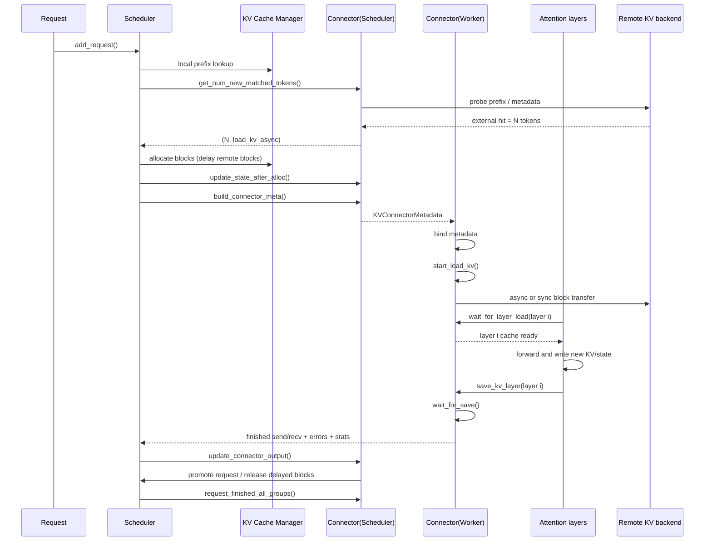
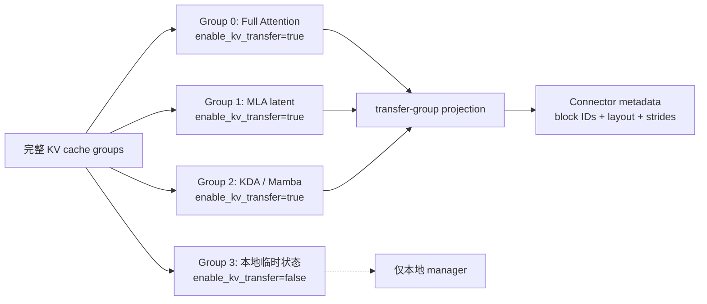

> 版本说明：本文按 2026-09-04 的 vLLM upstream `main` 整理，基线 commit 为 [`ae2d1ca`](https://github.com/vllm-project/vllm/commit/ae2d1ca96fa2a98f92c775acfe8a154748495a27)。本地源码 checkout 是 [`f4b161d7`](https://github.com/vllm-project/vllm/commit/f4b161d7fca438bfe29509984759be1943a5aa88)，用于交叉验证 Kimi K3 的实现和较早的调用路径，不代表当前 main 的全部行为。KV connector API 仍由源码标记为 experimental，生产部署应以实际安装版本为准。

## 1. 先说结论

先把问题说得直接一点：**Kimi K3 的线性注意力（KDA/SSM）和 Gated MLA 让 vLLM 的 KV connector 从“搬运 KV page”变成了“搬运一组带布局和生命周期的状态”。**

当前 connector 至少要同时理解以下事实：

1. scheduler 和 worker 是两个角色。scheduler 决定哪些 token 能从远端命中、为哪些 block 预留空间；worker 才能在 attention 执行时接触 GPU cache tensor。
2. 一个模型可以有多个 KV cache group。full attention、MLA、Mamba/SSM 甚至 sliding-window 层，可能拥有不同的 block 大小和物理布局；connector 只能看到 `enable_kv_transfer=true` 的 transfer groups。
3. KDA 缓存的对象是卷积历史和递归 state，MLA 缓存的是压缩 latent，而普通 attention 缓存的是每个 token 的 K/V。它们不能共用“一个 token 对应一页 K/V”的简化模型。
4. 传输 descriptor 描述的是 `(group, block_id, layout, stride, TP mode)`，不是一个抽象的 token 数。block ID、stride 或 TP split/replicate 只要有一项不一致，收到的 tensor 就可能看似成功、实际语义错位。
5. load/save 是逐层、异步、带依赖的。同步 load 必须在本轮 forward 读取前完成；没有同步依赖的异步 load 可以在 forward launch 后提交；save 则在 `wait_for_save()` 阶段确认不会再覆盖源 block。

因此，K3 之后 connector 的核心工作不再是“把远端数据拷到本地”，而是维护一份跨 scheduler、KV cache manager、attention backend 和传输后端的状态协议。

## 2. Connector 到底解决什么问题

### 2.1 没有 connector 时的边界

vLLM 的 paged KV cache 默认只在当前 engine 内部管理。请求经过 prefill 后，KV 写入本机 GPU block；后续 decode 继续读这些 block。这个模型在单机上很简单，但在以下场景会遇到边界：

- **P/D disaggregation**：prefill worker 产生 KV，decode worker 需要尽快消费，而不是重新计算 prompt。
- **GPU/CPU/NVMe offload**：GPU 空间不足时，把不活跃请求的状态降级到 CPU 或文件系统。
- **跨请求 prefix reuse**：不同请求共享相同前缀，希望命中远端 cache 后只计算 suffix。
- **异构并行**：producer 和 consumer 的 TP、block size、KV layout 可能不同，需要在握手时验证或拆分。

connector 把这些跨边界动作接进调度循环。它负责“何时可以认为状态存在”和“何时可以释放本地 block”，但不负责模型层本身的 attention 数学，也不负责替 scheduler 计算 token。一个实用的分工是：

| 层 | 负责 | 不负责 |
| --- | --- | --- |
| Scheduler | 匹配、分配、请求状态迁移、释放时机 | 直接访问 GPU tensor |
| KV cache manager | group/block 的空间与映射 | 远端网络传输 |
| Connector | 元数据、load/save 生命周期、完成/失败回报 | 改变 attention 结果 |
| Worker/attention | 按层等待、读写 paged cache | 决定远端命中多少 token |
| NIXL/Mooncake/LMCache 等 backend | 实际内存或网络搬运 | 替 vLLM 管理请求队列 |

### 2.2 V1 是双边协议，不是一个函数

`KVConnectorBase_V1` 的文件头已经把接口分成两侧。scheduler-side 的核心调用是：

- `get_num_new_matched_tokens()`：查询远端或外部 cache 新命中了多少 token；同一请求可能被多次询问，因此应当无副作用。
- `update_state_after_alloc()`：KV cache manager 分配临时 block 后，记录 load/store 计划和本地 block 映射。
- `build_connector_meta()`：把本轮计划封装成可序列化 metadata，交给 worker。
- `update_connector_output()`：接收 worker 汇总的完成请求、失败 block 和统计信息。
- `request_finished()` / `request_finished_all_groups()`：请求结束时决定 block 是立即释放，还是由 connector 异步发送完成后再释放。
- `register_finished_partial_tail()`：混合 cache 在最后一个不完整边界上登记尚未形成稳定 block 的尾部。
- `take_events()`：输出 cache hit、传输和失效事件。

worker-side 的核心调用是：

- `bind_connector_metadata()`：在 forward 前绑定 scheduler 发来的 metadata。
- `start_load_kv()`：启动本轮所有 load，可能是同步，也可能只提交异步任务。
- `wait_for_layer_load(layer_name)`：某个 attention 层真正读取 cache 前，等待该层数据可见。
- `save_kv_layer()`：该层 forward 后提交保存，允许和后续层计算重叠。
- `wait_for_save()`：forward 结束时确认所有 save 已经不再读取源 block。
- `get_finished()`：返回已完成的 send/receive request ID。
- `get_block_ids_with_load_errors()`：报告同步或异步 load 失败的 block。

这种拆分有两个硬约束：scheduler 不碰 GPU cache tensor，worker 不直接修改调度队列。`KVConnectorFactory` 会用同一个 class 分别构造 `KVConnectorRole.SCHEDULER` 和 `KVConnectorRole.WORKER` 实例，从代码结构上强制这个边界。

## 3. 一次请求的完整生命周期

下面用一个“远端 prefix 命中 + 本地 suffix 继续生成”的请求说明调用顺序。注意，图中的 connector 是两个进程里的两个对象，外部 store/remote worker 只是后端。



最容易漏掉的是 `update_state_after_alloc()` 和 `request_finished_all_groups()`：前者把逻辑命中变成实际 block 映射，后者决定这些 block 什么时候能被覆盖。只实现“传输函数”而不实现这两个状态转换，通常会出现重复发送、过早复用或请求永远卡在 `WAITING_FOR_REMOTE_KVS`。

### 3.1 配置和 Factory

入口是 `KVTransferConfig`。常见字段可以按四类理解：

```python
KVTransferConfig(
    kv_connector="NixlConnector",
    kv_role="kv_both",              # producer / consumer / both
    kv_buffer_device="cuda",
    kv_connector_extra_config={
        "backends": ["UCX"],
    },
)
```

- 身份：`engine_id`、`kv_rank`、`kv_parallel_size`。
- 通道：`kv_ip`、`kv_port`、connector 自定义配置。
- 缓冲：`kv_buffer_device`、`kv_buffer_size`，以及 host staging buffer。
- 策略：`kv_load_failure_policy`（`fail` 或 `recompute`）、是否允许本地 KV permute。

Factory 先查内置 lazy registry，再按 `kv_connector_module_path` 动态导入外部 class。启用 Hybrid KV Cache Manager（HMA）时，还会检查 class 是否实现 `SupportsHMA`。当前内置生态包括 NIXL、Mooncake、LMCache、Offloading、SimpleCPUOffload、HF3FS、MoRIIO、FlexKV 和 `MultiConnector` 等；名字和模块路径随版本变化，不能把某个版本的注册表当成长期稳定 API。

## 4. HMA：为什么 connector 现在要面对多个 KV cache group

### 4.1 从单 group 到 transfer-group 投影

旧的直觉是：一个请求有一张 block table，`request_finished(request, list[int])` 传一组 block ID。混合注意力打破了这个假设：不同层可能使用不同的 cache spec，page size、token 粒度和 state 数量都不同。

当前 `KVCacheConfig` 维护了：

- `transfer_group_ids`：真正允许外部传输的 group。
- `transfer_groups`：按传输视角排列的 group 描述。
- `transfer_group_index_by_layer`：从 layer 找到传输 group 的索引。
- `select_transfer_block_ids()`：从完整 block table 中选出 connector 可见的部分。

`KVCacheGroupSpec` 的 `enable_kv_transfer: bool = True` 是关键开关。它允许某个 group 继续由本地 manager 管理，但不暴露给远端 connector。于是 connector 看到的是一个稳定的“传输投影”，不是 `kv_cache_groups` 的原样列表。



这张图的重点是：**group 编号和 descriptor 数量在 scheduler 与 worker 两侧必须一致。** 如果 scheduler 把 4 个 group 的 block table 直接序列化，而 worker 只注册了 3 个可传输 group，后续 descriptor 可能不会立刻报错，却会把 MLA 的 block ID 当成 Mamba state slot 使用。

### 4.2 一个具体的错位例子

假设一个 K3 请求有三个传输 group：

| transfer group | block size | 请求长度 130 时的逻辑 block |
| --- | ---: | ---: |
| Full Attention | 16 token | 9（最后一个为 2 token） |
| MLA latent | 32 token | 5（最后一个为 2 token） |
| KDA state | 1 state slot | 2（checkpoint + 当前 state） |

如果 producer 端把 Full/MLA/KDA 都算在 descriptor 数量里，而 consumer 端错误地过滤掉 MLA，consumer 看到的第二组 block ID 会被解释成 KDA。传输字节数可能恰好相同，但 state 的 stride 完全不同，结果是下一次 decode 读取到“合法地址里的错误历史”。这类问题比越界更难排查，所以 HMA 的 group 投影和握手校验必须在 metadata 层完成。

## 5. 四种缓存对象：不要再用一个 KV page 解释全部模型

| 类型 | 实际缓存内容 | 复用边界 | 释放/回滚特点 |
| --- | --- | --- | --- |
| Full Attention | 每个 token 的 K/V page | prefix block 边界 | suffix 追加后可继续复用，尾块可部分填充 |
| MLA | 每 token 的压缩 KV latent，通常没有独立 V cache | latent page / `storage_block_size` | 受 MLA layout、TP replicate 语义约束 |
| KDA / Mamba | 卷积历史 + recurrent state | state slot、对齐边界 | 不能按 token 任意拼接，要区分 checkpoint 和 speculative slot |
| speculative/draft | 尚未被主模型接受的临时状态 | draft step / scratch slot | 被拒绝时回滚或覆盖，不能当稳定 prefix 发布 |

### 5.1 Full Attention 的 page

标准 paged attention 以 block 为分配单位。对 block size $B$、序列长度 $T$，逻辑 block 数近似为：

$$
N_{block}=\left\lceil\frac{T}{B}\right\rceil
$$

最后一个 block 可以只有部分 token，但其物理 page 通常按完整大小分配。connector 传输时仍要携带实际有效长度，避免把未写入的尾部当成可复用 prefix。

### 5.2 MLA：缓存 latent，而不是 K/V 对

K3 的 Gated MLA 使用 `MLAAttentionSpec`。它的几个字段直接反映物理语义：

- `num_kv_heads=1`：每个 token 的 KV 不按普通 GQA head 数复制。
- `head_size_v=0`：没有独立的 V cache，缓存主体是压缩 latent。
- `tokens_per_state`、`storage_block_size`：逻辑 token 数和物理存储 page 可以不同。
- `non_causal_multi_token_decode`：某些 decode backend 需要显式标记非因果多 token 路径。

因此 MLA 在 NIXL 中通常使用 `REPLICATE` 语义：不同 TP rank 需要看到同一份 latent，而不是像普通 full attention 那样沿 KV head 维度切分。把 MLA 当作“num_kv_heads=1 的普通 page”仍然不够，因为其 stride、压缩比例和 kernel block granularity 可能不同。

### 5.3 KDA/Mamba：状态 slot 才是复用单位

`MambaSpec` 用 `shapes` 和 `dtypes` 描述一页状态包含哪些 tensor。常见组成包括：

1. causal convolution 最近若干步的历史输入；
2. 每个 head 的 recurrent state；
3. 根据 backend 需要的额外门控或 metadata。

它的 `page_size_bytes` 是所有 `(shape, dtype)` 乘积之和，而不是“token 数 × K/V 元素”。`mamba_cache_mode` 决定状态数量：

- `all`：按序列 block 保留多个状态，便于完整 prefix cache；
- `none`：只保留当前 decode 所需的最小状态；
- `align`：让状态在 prefix 边界对齐，同时保留有限的 speculative/checkpoint slot。

### 5.4 `align` 模式为什么引入 checkpoint

在 `align` 模式，Mamba 的 block table 行按完整序列位置索引，但内存里只保留少数活动 state。当前实现的最大内存估算包含：

```text
2 + num_speculative_blocks + num_prefill_checkpoint_blocks
```

其中两个基础 slot 通常对应可恢复的对齐状态；speculative slot 是可回滚工作区；prefill checkpoint slot 则允许长 prefill 在内部边界留下可命中的状态。提交 [9eb9d9d](https://github.com/vllm-project/vllm/commit/9eb9d9d3953959695108600c8ed33d36bc6a1e5f) 引入内部 prefill checkpoint，目标是降低长前缀命中时的 TTFT。

这带来一个 connector 约束：**不能把“当前最后一个 state”简单当作整个 prefix 的代表。** connector 必须知道 slot 对应的序列位置、是否是 checkpoint、是否仍可能被 speculative 回滚；只有稳定 slot 才能发布给远端。

## 6. Layout：descriptor 是物理引用，不是逻辑 token 数

### 6.1 统一 layout 模型

近来的 layout 重构（例如提交 [8bdc70e](https://github.com/vllm-project/vllm/commit/8bdc70ec7b379279ec0152343239c2d50aced687)）把 cache tensor 的物理信息集中表达为 `KVCacheTensor` 和解析后的 `KVCacheLayout`。connector 需要关心：

- `layer_stride`：从一层跳到下一层的字节/元素跨度；
- `block_stride`：同一层不同 block 的跨度；
- `offset`：某个 region 在 packed page 中的起始位置；
- `page_size_bytes` 与 `page_size_padded`：逻辑内容和对齐后的物理大小；
- `state_content_bytes`、`num_head_slots`、`tokens_per_state`：不同 spec 的内容解释。

允许的物理组织包括 layer-outer、block-outer、packed group 和 mixed page size。MLA 的 latent 区域和 Mamba 的 state 区域甚至可能共处一个 unified page，但仍以不同 offset/stride 注册给传输后端。

### 6.2 NIXL 的 region 和 TP 语义

NIXL worker 会把内存拆成多个 region：full attention、MLA 和 SSM。这样做不是为了好看，而是因为每个 region 的并行语义不同：

- **Full Attention**：常按 KV head 维度 `SPLIT`，TP rank 只传自己拥有的 heads。
- **MLA**：latent 通常 `REPLICATE`，每个 rank 需要完整 latent，不按普通 head ratio 切。
- **Mamba/SSM**：根据 state 是否 TP replicated 决定 split 或 replicate；卷积子投影和 recurrent state 的大小也不同。

代码中还会执行 `_conv_decomp`，把 Mamba 的卷积历史从统一描述里拆出；full-attention descriptor 和 SSM descriptor 使用不同的编号空间。Mamba block 不能照搬 attention 的 kernel block ratio 去切，因为一个 state page 可能对应多个 token 的卷积历史，而不是一个连续的 head-major K/V 区域。

### 6.3 异构 TP 和 block size 的握手校验

在 producer/consumer 建立 NIXL agent handshake 时，会检查：

1. 远端 block size 是否与本地一致，或能否按 `block_size_ratio` 在远端粒度传输；
2. full attention 的 head 数按 TP ratio 是否匹配；
3. MLA/replicated region 的 block 数是否只允许按 block size 变化；
4. Mamba hybrid 的 `physical_blocks_per_logical_kv_block` 是否一致；
5. NHD/HND layout 是否支持当前的 head split，必要时是否显式开启 `enable_permute_local_kv`。

典型的伪代码可以写成：

```python
for region in regions:
    if region.mode == "REPLICATE":
        assert local_len // block_size_ratio == remote_len
    else:  # SPLIT
        assert remote_len == local_len * remote_heads // local_heads

if has_mamba and prefix_caching:
    assert local_physical_per_logical == remote_physical_per_logical
```

这些 assert 是性能和正确性的共同边界。放宽它们并不会“自动支持异构”，只会把错误推迟到 kernel 读取阶段。

## 7. 当前异步时序：load 和 save 不是对称的

### 7.1 为什么要区分同步 load

同步 load 的含义是：本轮 forward 会立即读取这些 block，数据依赖不能被隐藏。当前实现通过 `SchedulerOutput.has_sync_kv_loads` 区分两类任务：

- 有同步 load：在 forward 前启动并等待必要层，保证读写无竞争。
- 只有独立异步 load：可以等 forward launch 后再提交，把 CPU 侧 descriptor 构建和 copy submission 隐藏到 GPU compute 后面。

对应的核心改动见提交 [2aac565](https://github.com/vllm-project/vllm/commit/2aac565cae880087d752e90f1a08dcd9b369f9a0)。这不是简单的“把 start_load_kv 延后”，而是把依赖关系编码进 scheduler output 和 worker runner。

### 7.2 save 的安全点

`save_kv_layer()` 可以在每层 forward 后排队，`wait_for_save()` 在 forward context 退出时阻塞。原因是 scheduler 可能很快把完成请求的 block 重新分配给别的请求；如果异步 send 仍在读取旧 block，就会发生静默数据损坏。

生产 connector 还要回答两个问题：

1. `requires_kv_delivery` 是否为真？P/D hand-off 未完成时，producer 请求被抢占，应当重新计算还是允许 best-effort 丢弃？
2. load 失败如何处理？`kv_load_failure_policy=fail` 直接结束请求；`recompute` 把失败 block 对应 token 标记为未来 cache miss 并重新计算。

### 7.3 CUDA graph 和 piecewise 的限制

逐层 `wait_for_layer_load()`、动态 descriptor 和异步事件会改变 forward 的外部时序。connector 如果声明 `requires_piecewise_for_cudagraph`，意味着这段路径不能随意塞进完整 CUDA graph replay；需要把可变的 load/save 阶段放在 piecewise capture 边界之外。否则第一次 replay 记录的 block 地址可能被后续请求复用。

## 8. 请求结束、partial tail 和 divergent hit

### 8.1 释放不是一个瞬间事件

请求结束时，scheduler 可能拿到两种结果：

- connector 返回 `False`：没有异步发送责任，block 可以立即回收到 block pool；
- connector 返回 `True`：connector 接管释放责任，直到 worker 的 `get_finished()` 返回该 request ID 后才能复用。

HMA 下 `request_finished_all_groups()` 收到的是 `tuple[list[int], ...]`，每个元素对应一个 transfer group。只有所有 group 的状态都达到可发布边界，才能把请求当作完整 prefix 发送。

### 8.2 partial tail

Full attention 的最后一个 page 可以只有几个 token；KDA 的最后一个状态则可能还没有跨过对齐边界。`register_finished_partial_tail()` 允许 connector 在 request finish 时登记这段尾部，下一次命中时把它当作“可继续计算的前缀”，而不是错误地当成完整稳定 page。

### 8.3 divergent local hybrid hits

混合模型中，full-attention group 可能已经命中更深的 prefix，而 KDA group 只在较早 checkpoint。支持 `supports_divergent_local_hybrid_hits` 的 connector 可以补齐落后的 recurrent state；不支持时必须把命中长度收敛到所有必要 group 的共同边界。否则 attention 看到 token 120，SSM 却只恢复到 token 96，结果不会总是崩溃，而是产生难以复现的质量偏差。

## 9. NIXL 之外的 connector 怎么选

| Connector | 更适合 | 需要特别注意 |
| --- | --- | --- |
| `NixlConnector` / pull/push 变体 | P/D、RDMA/UCX、多机 GPU 直连 | handshake、TP split、layout 和 region descriptor 必须严格一致 |
| `MooncakeConnector` / store | 统一 KV store、跨节点共享缓存 | store 的 block 粒度、异步完成回报和 K3 state layout 要对齐 |
| `OffloadingConnector` | vLLM native CPU/offload、单机容量扩展 | host staging、异步覆盖、失败后重算策略 |
| `LMCacheConnectorV1` | 接入 LMCache 生态、跨进程复用 | 外部缓存的 key、版本和 eviction 语义由 LMCache 管理 |
| `SimpleCPUOffloadConnector` | 教学、低复杂度 CPU offload | 不适合验证复杂 hybrid/异构 TP 传输能力 |
| `MultiConnector` | 同时写入多个后端或分层缓存 | 任一子 connector 的 HMA/完成语义都会影响整体释放时机 |

选型时先回答三个问题，而不是先看 benchmark 峰值：

1. 传输对象是普通 attention page，还是包含 MLA/KDA 的多 group 状态？
2. producer 和 consumer 的 TP、block size、layout 是否固定且同构？
3. cache 丢失是可接受的未来 miss，还是必须可靠 hand-off 的正确性路径？

## 10. 常见故障模式

### 故障一：把所有 group 都传出去

症状是 descriptor 数量对不上，或者请求 finish 后某些本地 state 被意外释放。根因是把 `kv_cache_groups` 当作 `transfer_groups` 使用。修复方式是让 scheduler 和 worker 都从 `KVCacheConfig.transfer_group_ids` 派生 metadata，并在启动时打印 group 顺序和 spec 摘要。

### 故障二：把 KDA state 当成 token page

症状是 prefix hit 长度看起来正确，但下一轮 decode 质量漂移。根因是只传了 recurrent state，漏掉 Conv4 历史，或者把 speculative slot 当成稳定 checkpoint。修复方式是按 `MambaSpec.shapes/dtypes` 注册完整 state，并在 `align` 模式携带 slot 位置语义。

### 故障三：MLA 按 head split

症状是异构 TP 下收到的 latent 大小不一致，或某些 rank 的 attention 输出异常。MLA 通常需要 `REPLICATE`，不能直接复用 full attention 的 head-sharded 代码路径。

### 故障四：异步 save 期间复用 block

症状是偶发、不可复现的 cache 污染。根因是 connector 返回了“可立即释放”，但后台 send 仍引用 GPU block。必须让 `wait_for_save()`、`get_finished()` 和 `request_finished_all_groups()` 的责任链闭合。

### 故障五：把同步 load 延后到 forward 之后

症状是 kernel 读到旧 block 或零值。独立异步 load 可以 forward launch 后提交，但本轮 forward 立即依赖的同步 load 必须在读取前 ready；两者不能混为一个队列。

### 故障六：producer/consumer 版本漂移

症状是握手通过但运行时出现 block length、layout 或 region 数量断言。connector API 是实验性接口，尤其要锁定 `KVCacheSpec` 字段、HMA group 投影和 NIXL metadata 版本；升级 vLLM 时重新检查源码，而不是只复用旧配置文件。

## 11. 实际落地建议

### 11.1 开发一个新 connector 的最小顺序

1. 先实现 scheduler-side 的命中查询和 block 映射，明确返回的是逻辑 token 还是每个 group 的 block。
2. 再实现 worker-side 的 metadata binding、逐层 load/save 和完成聚合。
3. 对 HMA 直接实现 `SupportsHMA`，让 `request_finished_all_groups()` 成为唯一释放入口。
4. 在注册阶段记录每个 group 的 `KVCacheSpec`、layout、page bytes、TP mode；握手时拒绝不兼容，而不是隐式转换。
5. 给同步 load、纯异步 load、save、load failure、preemption、partial tail 各写一个最小测试。

### 11.2 监控什么指标

只看总带宽不够，至少记录：

- local hit、external hit、recompute token 数；
- 每个 group 的 load/save bytes 和完成延迟；
- 同步 load 等待时间与 forward overlap；
- pending send 持有 block 的时间；
- load failure block 数及最终重算比例；
- KDA checkpoint 命中率、partial tail 长度；
- MLA/SSM region 的 descriptor 数和 TP split/replicate 模式。

如果 TTFT 下降但 GPU 利用率同时下降，常见原因是 CPU descriptor 构建或 host staging 变成新瓶颈；如果 cache hit 率上升但质量下降，优先检查 group 对齐和 KDA slot，而不是继续调网络带宽。

## 12. 总结

Kimi K3 带来的变化可以浓缩成三句话：

1. **缓存对象变多了**：Full Attention、MLA latent、KDA recurrent state 和 speculative/checkpoint slot 有不同的形状和复用边界。
2. **缓存视图变严格了**：HMA 让 connector 使用 transfer-group 投影，layout/stride/TP mode 成为 descriptor 的一部分。
3. **生命周期变长了**：异步 load/save、partial tail、可靠 hand-off 和失败重算共同决定 block 什么时候真的安全。

所以现在介绍 vLLM connector，不能只列出 NIXL、Mooncake 或 LMCache 的名字，也不能只画一条 GPU 到远端的箭头。真正需要理解的是：scheduler 何时承诺命中，worker 何时保证数据可见，attention layer 读写哪一块物理状态，以及 connector 何时可以把这份状态交给下一个请求。

## 参考

- [vLLM upstream main（2026-09-04，`ae2d1ca`）](https://github.com/vllm-project/vllm/commit/ae2d1ca96fa2a98f92c775acfe8a154748495a27)
- [`KVConnectorBase_V1`](https://github.com/vllm-project/vllm/blob/ae2d1ca96fa2a98f92c775acfe8a154748495a27/vllm/distributed/kv_transfer/kv_connector/v1/base.py)
- [`KVConnectorFactory`](https://github.com/vllm-project/vllm/blob/ae2d1ca96fa2a98f92c775acfe8a154748495a27/vllm/distributed/kv_transfer/kv_connector/factory.py)
- [`KVCacheSpec`、`MLAAttentionSpec`、`MambaSpec`](https://github.com/vllm-project/vllm/blob/ae2d1ca96fa2a98f92c775acfe8a154748495a27/vllm/v1/kv_cache_interface.py)
- [Kimi K3 KDA 实现（本地交叉验证 commit `f4b161d7`）](https://github.com/vllm-project/vllm/blob/f4b161d7fca438bfe29509984759be1943a5aa88/vllm/models/kimi_k3/nvidia/kda.py)
- [Kimi K3 MLA 实现（本地交叉验证 commit `f4b161d7`）](https://github.com/vllm-project/vllm/blob/f4b161d7fca438bfe29509984759be1943a5aa88/vllm/models/kimi_k3/nvidia/mla.py)
- [HMA transfer-group 与 `enable_kv_transfer` 变更](https://github.com/vllm-project/vllm/commit/d85708f7a4362334eb58cff1fdf5265b49cac310)
- [KV layout / `KVCacheTensor` 变更](https://github.com/vllm-project/vllm/commit/8bdc70ec7b379279ec0152343239c2d50aced687)
- [Mamba prefill checkpoint 变更](https://github.com/vllm-project/vllm/commit/9eb9d9d3953959695108600c8ed33d36bc6a1e5f)
- [异步 KV load 时序变更](https://github.com/vllm-project/vllm/commit/2aac565cae880087d752e90f1a08dcd9b369f9a0)
- [vLLM 既有 KV Connector API 文章](/vllm-kv-connector-api/)
- [Kimi K3 模型架构详解](/kimi-k3-architecture-deep-dive/)
