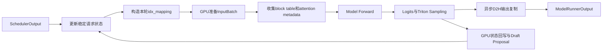
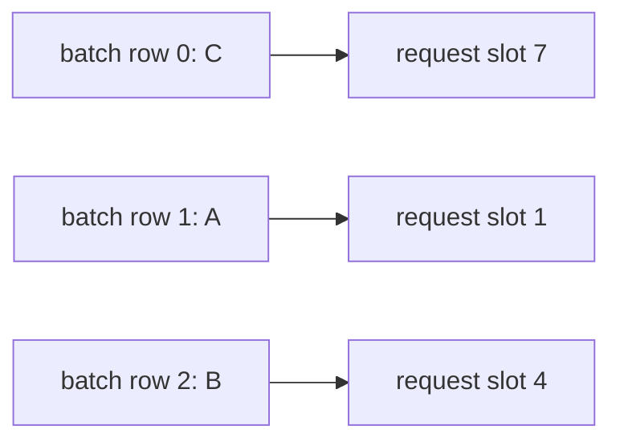
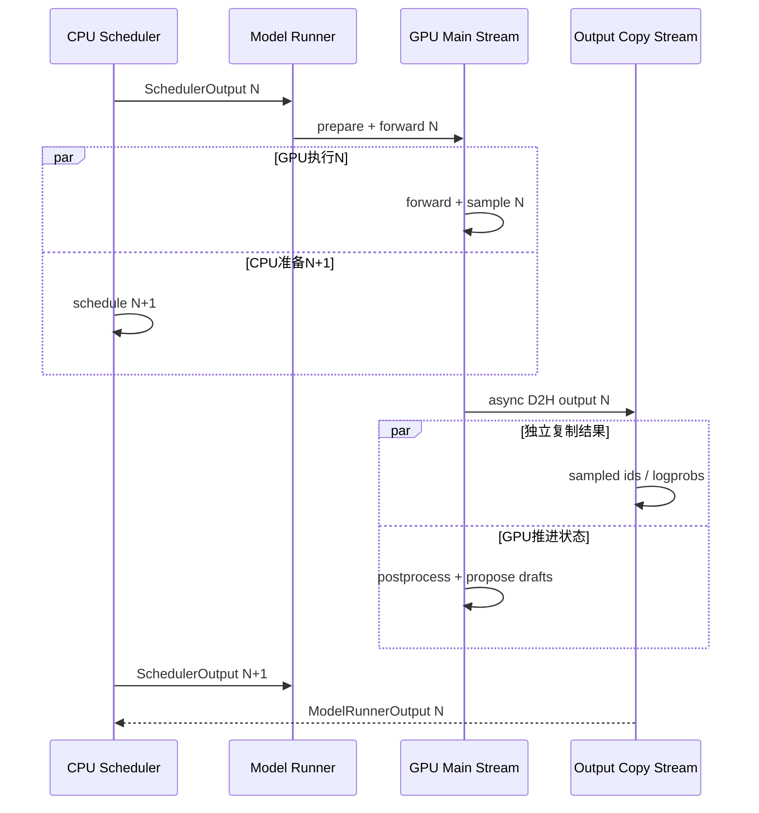

> 版本说明：本文以2026-07-13拉取的`vllm-project/vllm`主分支源码`4c81772`为当前实现基线，以MRV2首次公开时的`v0.18.0`源码`bcf2be9`和2026-03-24官方博客为历史基线。MRV2仍在快速演进，文中的源码链接均固定到commit。官方性能数字来自发布博客，本文没有在本地复测GB200结果。

# 1 先说结论

Model Runner V2，简称MRV2，不是vLLM V2 engine之后又换了一套对外API。它重写的是worker内部真正把`SchedulerOutput`变成一次GPU执行、再把结果变成`ModelRunnerOutput`的执行核心。

它最关键的变化不是把一个6720行文件拆成很多小文件，而是重新划分了状态所有权：

1. 每个活跃请求在整个生命周期内占用一个稳定的request-state slot，不再让持久状态跟随每一步batch顺序搬家。
2. 每一步只构造`batch row -> request slot`的`idx_mapping`，Triton kernel据此在GPU上准备`input_ids`、`positions`、`seq_lens`等输入。
3. speculative decoding产生的接受/拒绝结果继续留在GPU，下一步输入准备直接消费它，不必先同步回CPU再重建输入。
4. sampling不再围绕完整softmax概率矩阵组织，而是用Triton实现Gumbel-Max、按需logprobs和分块prompt logprobs。
5. 模型特有逻辑放到`ModelState`，公共runner只保留请求状态、输入、forward、采样和输出这条主路径。
6. 输出通过独立CUDA stream异步复制到CPU，复制启动后主stream可以继续做状态回写和下一轮draft proposal。

从当前源码看，MRV2已经不只是手动环境变量打开的早期实验路径。若用户没有显式设置`VLLM_USE_V2_MODEL_RUNNER`，当前配置会对普通非MoE generate模型以及少数白名单MoE架构自动选择V2；Triton不可用或配置含不兼容功能时则回落到V1。显式设置`VLLM_USE_V2_MODEL_RUNNER=1`仍可强制选择，但不兼容配置会直接校验失败。

一句话概括它的设计：

**把长期存在的请求状态固定下来，把每步变化的执行布局变成一层廉价映射，再让GPU沿着映射完成准备、采样和状态推进。**

# 2 Model runner在vLLM里处于什么位置

本文只聚焦model runner内部。scheduler和KV connector的完整机制可分别参考已有文章：[vLLM最新版调度系统与Continuous Batching详解](/20260508/vllm-scheduler-and-continuous-batching/)和[vLLM最新KV Connector API与推理调用链逐行解析](/20260513/vllm-kv-connector-api/)。

对model runner来说，上游scheduler已经决定了：

- 本轮有哪些新请求、缓存请求和结束请求。
- 每个请求本轮计算多少token。
- 分配了哪些KV block。
- 是否带draft token、encoder input或grammar结果。

runner负责把这些离散决策落实为GPU张量和一次模型执行：



当前MRV2把一次生成执行拆成两个主要阶段：

- `GPUModelRunner.execute_model()`：更新请求状态、准备输入和attention metadata、执行模型forward，保存`ExecuteModelState`。
- `GPUModelRunner.sample_tokens()`：消费hidden states，计算logits与采样结果，启动异步输出复制，回写请求状态，并按需执行speculator。

这种拆分也适配pipeline parallel：非最后一个PP rank返回`IntermediateTensors`，最后一个rank才做sampling；采样结果再广播给其他rank更新各自的持久状态。

# 3 为什么V1 runner需要重写

## 3.1 Persistent batching解决了重建成本，又引入了布局耦合

continuous batching的相邻两步通常很相似。假设第N步batch里是A、B、C，第N+1步可能只是B结束、D加入，变成A、C、D。如果每步从Python对象重新拼完整token表、block table、sampling参数和位置张量，CPU开销会随并发和步数反复出现。

V1因此使用persistent batching：保留上一轮状态，只增量修改变化部分。

问题是V1的持久状态同时被当作本轮模型输入布局。请求顺序一变，状态行、block table行、sampling行也要跟着交换或压紧。结果是“长期状态”和“临时执行顺序”互相绑死：

- 删除中间请求需要移动其他请求。
- 新请求插入位置影响多组张量布局。
- speculative decoding让一个请求对应多个logits行，布局更复杂。
- async scheduling下，第N步GPU还在读状态，第N+1步CPU已经想修改它。

MRV2保留persistent batching的增量收益，但切断两种布局之间的等号。

## 3.2 CPU bookkeeping逐渐成为小模型和高端GPU的瓶颈

模型越小、GPU越快，单步forward越短，Python循环、NumPy操作、小tensor copy和同步的占比就越高。发布博客故意用`Qwen3-0.6B + 1xGB200`放大host-side overhead，而不是用大模型把CPU问题藏在长时间GEMM之后。

因此MRV2的GPU-native不是“所有东西都放显存”。它做的是更细的选择：

- 大而稀疏访问的`all_token_ids`可以使用UVA，避免按`max_num_reqs * max_model_len`常驻占用数GB显存。
- 每轮热点输入、request标量状态和mapping放在设备可直接访问的位置。
- 小批量CPU更新先stage，再合并写入device/UVA backing。
- 能由GPU上一步结果驱动的下一步准备，不再绕回CPU。

## 3.3 Async scheduling在V1里是后加能力

异步调度希望CPU准备第N+1步时，GPU正在执行第N步。若runner内部某个功能突然读取GPU标量到Python、调用隐式同步操作，流水线就会被截断。

V1是在已有同步路径上逐步加入async，很多功能需要特殊分支才能共存。MRV2反过来把“不允许无意CPU-GPU同步”当作基础约束，再往上实现spec decode、structured output和模型差异。

# 4 当前源码模块地图

首发`v0.18.0`中，旧runner文件`vllm/v1/worker/gpu_model_runner.py`有6720行，MRV2主文件`vllm/v1/worker/gpu/model_runner.py`有1228行。到当前`main@4c81772`，MRV2主文件增长到1632行，但主要职责仍分散在独立模块：

```text
vllm/v1/worker/gpu/
  model_runner.py                 # 公共执行主路径
  states.py                       # 稳定RequestState slot
  input_batch.py                  # GPU输入准备与step后更新kernel
  block_table.py                  # 持久block table与本轮gather
  attn_utils.py                   # attention backend/group初始化
  async_utils.py                  # 独立stream的异步D2H输出
  model_states/
    interface.py                  # ModelState边界
    default.py                    # 普通decoder-only模型
    encoder_decoder.py            # Whisper等cross-attention模型
    mamba_hybrid.py               # Mamba/attention混合模型
  sample/
    sampler.py                    # sampling编排
    states.py                     # temperature/top-k/top-p等持久参数
    gumbel.py                     # Triton Gumbel-Max
    logprob.py                    # 按需token/top-k logprobs
    prompt_logprob.py             # prompt logprobs分块
    penalties.py                  # repetition/frequency/presence penalty
    logit_bias.py                 # 每请求logit bias
  spec_decode/
    speculator.py                 # draft接口与共享逻辑
    rejection_sampler.py          # 验证入口
    eagle/, mtp/, dflash/,
    dspark/, autoregressive/      # 当前不同draft实现
```

模块拆分本身不是最终目标。真正重要的是每个模块只拥有一种变化频率的状态：

- `RequestState`：跨step长期存在，按稳定slot索引。
- `InputBatch`：只描述当前step，按batch row组织。
- `ModelState`：跨step存在，但只处理模型架构特有状态。
- sampler states：跨step存在，按稳定request slot保存参数。
- attention metadata：当前step临时构建，交给attention backend消费。

# 5 核心设计：稳定request slot与idx_mapping

## 5.1 RequestState如何分配稳定位置

当前`RequestState`维护三组最基础的索引：

```python
self.req_id_to_index: dict[str, int] = {}
self.index_to_req_id: dict[int, str] = {}
self.free_indices = list(range(max_num_reqs))
```

新请求通过`free_indices.pop()`拿一个空闲slot。请求结束时只删除映射并把slot放回free list，不需要把其他请求压紧。

每个slot对应的状态包括：

- `all_token_ids[slot, :]`
- `prompt_len[slot]`和`prefill_len[slot]`
- `total_len[slot]`
- `num_computed_tokens[slot]`
- `last_sampled_tokens[slot]`
- `draft_tokens[slot, :]`
- `max_seq_len[slot]`

这里`prompt_len`和`prefill_len`被刻意区分。请求发生preemption后恢复时，重新送入runner的prefill token可能包含一部分历史输出，因此`prefill_len >= prompt_len`。prompt logprobs和frequency penalty必须知道哪些token属于原始prompt，不能只看当前prefill长度。

## 5.2 batch row不再等于request slot

假设活跃请求的稳定slot如下：

```text
slot 1 -> request A
slot 4 -> request B
slot 7 -> request C
```

某一步scheduler决定执行顺序是C、A、B，则本轮batch布局和持久布局为：



对应：

```python
idx_mapping = [7, 1, 4]
```

下一步B完成、D占用slot 6，执行顺序变成A、D、C，只需要：

```python
idx_mapping = [1, 6, 7]
```

A和C的持久状态没有移动。block table、采样参数、token history也仍在各自slot。

这层间接索引看似多了一次gather，却换掉了大量重排与备份状态。对GPU来说，按一个小的int32 mapping读取稳定表是自然操作；对CPU来说，也不必维护“谁被交换到哪里”的复杂不变量。

## 5.3 speculative decoding为什么需要expanded_idx_mapping

普通decode每个请求通常只产生一行待采样logits，`idx_mapping`与logits行数相同。

spec decode不同。若请求A验证3个draft token，请求B验证1个draft token，再加每请求的bonus token，logits布局可能是：

```text
logits row:        0  1  2  3 | 4  5
belongs to req:    A  A  A  A | B  B
request slot:      7  7  7  7 | 2  2
```

此时：

```python
idx_mapping          = [7, 2]
expanded_idx_mapping = [7, 7, 7, 7, 2, 2]
```

temperature、penalty、logit bias、seed等参数仍按request slot存一份。sampling kernel用`expanded_idx_mapping`为每个logits row找到所属请求，无需在Python里把参数扩成与logits同样多的行。这就是官方博客所说的“用indirection而不是扩展request state”。

# 6 GPU-native input preparation到底做了什么

## 6.1 CPU只准备小型调度描述

`prepare_inputs()`仍有CPU工作，但它处理的是scheduler本来就在CPU上的小型描述：

1. 根据本轮`num_scheduled_tokens`得到请求顺序。
2. 构造`num_scheduled_tokens`的NumPy数组。
3. 从`req_id_to_index`生成小型`idx_mapping_np`。
4. 计算每请求draft token数量和prefix sum。
5. 选择CUDA graph padding后的形状。

它不再用Python逐token拼模型输入。真正与token数量成比例的准备放到Triton kernel。

## 6.2 prepare_prefill_inputs

prefill请求需要从稳定token history中取出本轮区间。kernel对每个batch row执行：

1. 用`idx_mapping[batch_idx]`找到request slot。
2. 读取该slot的`num_computed_tokens`。
3. 从`query_start_loc`得到本请求在扁平batch中的输出区间。
4. 从`all_token_ids[slot, num_computed_tokens:...]`复制到连续`input_ids`。

可以抽象成：

$$
\mathrm{input\_ids}[q_i:q_{i+1}]
=
\mathrm{all\_token\_ids}[s_i, c_i:c_i+n_i]
$$

其中$s_i$是`idx_mapping[i]`，$c_i$是已计算token数，$n_i$是本轮调度token数，$q_i$来自`query_start_loc`。

## 6.3 prepare_pos_seq_lens

同一套映射还用于生成：

- `positions`：从`num_computed_tokens`开始的连续位置。
- `seq_lens`：本轮之后每个请求的有效序列长度。
- CUDA graph未使用行的零填充。

这些张量直接写入预分配GPU buffer，避免每步创建大量短命tensor。

## 6.4 sampled token和draft token直接在GPU上合并

decode输入不是从CPU token list重新读取。`combine_sampled_and_draft_tokens()`直接读取：

- 上一步`last_sampled_tokens[slot]`
- 当前`draft_tokens[slot, :]`
- 本轮`query_start_loc`
- 本轮`seq_lens`

然后把最后采样token和draft token写进本轮`input_ids`。spec rejection的结果也能在GPU上决定哪些token继续进入下一步。

这条路径避免了典型同步陷阱：

```text
GPU rejection result
  -> copy scalar/list to CPU
  -> Python rebuild next input
  -> H2D copy
  -> next forward
```

MRV2走的是：

```text
GPU rejection result
  -> GPU input-preparation kernel
  -> next forward
```

## 6.5 block table也是稳定表加本轮gather

KV block table按request slot持久保存。scheduler给缓存请求追加新block时，runner只更新对应slot；本轮attention执行前，再根据`idx_mapping`收集当前请求行：

```text
persistent block table[request slot, block column]
                     |
                     | gather(idx_mapping)
                     v
step block table[batch row, block column]
```

`compute_slot_mappings()`再结合position计算每个输入token应写入哪个KV cache slot。于是两种“slot”必须区分：

- request slot：持久请求状态的行号。
- KV slot mapping：某个token在paged KV cache中的物理写入位置。

它们名称相近，但属于完全不同的索引空间。

# 7 一次execute_model调用链

当前`GPUModelRunner.execute_model()`的真实主路径可以压缩成下面12步：

1. `update_pp_decode_requests()`：非最后PP rank消费之前广播的采样输出。
2. `finish_requests()`和`free_states()`：释放结束或preempt请求的稳定slot及模型特有状态。
3. `add_requests()`：给新请求分配slot，写入`RequestState`、`ModelState`、block table和sampler state。
4. `update_requests()`：更新缓存请求的computed token和新增KV block。
5. `block_tables.apply_staged_writes()`：合并提交block table变化。
6. `dispatch_cg_and_sync_dp()`：根据本轮形状、DP和LoRA选择eager、piecewise graph或full graph。
7. `prepare_inputs()`：构造`InputBatch`与GPU输入。
8. `prepare_attn()`：gather block table，计算slot mapping。
9. `model_state.preprocess_state()`：给Mamba hybrid等模型执行forward前状态处理。
10. `model_state.prepare_attn()`：由模型状态和attention backend共同构造metadata。
11. `model_state.prepare_inputs()`：补充模型特有输入，普通路径通常只覆盖position变体。
12. 在`set_forward_context()`内运行full graph、piecewise graph或eager model forward。

forward之后，最后PP rank把hidden states和本轮metadata保存到`ExecuteModelState`。真正采样发生在`sample_tokens()`：

1. `sample()`选择最后token对应hidden state并计算logits。
2. sampler应用grammar、penalty、logit bias、temperature、top-k/top-p/min-p等规则。
3. rejection sampler验证draft token，得到`num_sampled`与`num_rejected`。
4. prompt logprobs worker按需处理prefill hidden states。
5. 创建`AsyncOutput`，立刻在独立stream启动采样结果D2H复制。
6. `postprocess_sampled()`在GPU上更新token history、长度和接受/拒绝状态。
7. speculator按需生成下一轮draft token。
8. KV connector执行post-forward回调。
9. CPU真正需要结果时调用`AsyncOutput.get_output()`等待copy event并组装兼容格式。

# 8 async-first如何消除同步点

## 8.1 第N步GPU与第N+1步CPU重叠

异步调度的基本流水线是：



要让这张图成立，runner内部不能随意把GPU tensor转成Python标量或list。否则CPU会等待main stream完成，N/N+1重叠被打断。

## 8.2 AsyncOutput的stream协议

`AsyncOutput`持有GPU tensor引用、main stream、copy stream和一个blocking CUDA event。初始化时：

1. 切换到`copy_stream`。
2. `copy_stream.wait_stream(main_stream)`，保证采样结果已产生。
3. 非阻塞复制sampled IDs、logprobs、NaN计数和prompt logprobs。
4. 在copy stream记录event。

只有`get_output()`真正需要CPU数组时才`copy_event.synchronize()`。

代码还特意先构造`AsyncOutput`、记录复制依赖，再调用`postprocess_sampled()`。这样D2H copy只等待采样结果，不必等待后续状态回写和speculator proposal。

## 8.3 spec decode的零同步含义

“零同步”不等于系统永远没有event和等待。它指性能关键的step衔接不需要CPU读取GPU结果后才能决定下一步输入。

spec decode中，GPU已经知道：

- 哪些draft token被接受。
- 第一个拒绝发生在哪里。
- 每请求实际采样了几个token。
- 下一步应该从什么position继续。

MRV2的post-update和input-preparation kernel直接消费这些张量。CPU得到输出是为了scheduler和用户响应，不再是生成下一步GPU输入的前置条件。

# 9 Triton-native sampler

## 9.1 sampling pipeline不是一个kernel

当前`Sampler`按需组合多个步骤：

1. grammar mask。
2. allowed token IDs。
3. bad words。
4. logit bias。
5. repetition、frequency、presence penalties。
6. temperature。
7. top-k、top-p、min-p。
8. greedy、FlashInfer sampling或Gumbel-Max。
9. sampled token及请求的logprobs。

每类sampling parameter按稳定request slot保存。`idx_mapping_np`用于CPU侧快速判断“本batch是否有人启用该功能”，`expanded_idx_mapping`用于GPU kernel为每个logits row加载正确参数。

这很重要，因为最常见路径应该跳过没用的工作。例如整个batch没有bad words，就不启动bad-words kernel；没有logit bias，就不触碰对应稀疏状态。

## 9.2 Gumbel-Max为什么不需要显式softmax

若希望从分类分布$p_i$采样，可以对每个类别加入Gumbel噪声：

$$
g_i = -\log(-\log u_i), \quad u_i \sim \mathrm{Uniform}(0,1)
$$

然后选择：

$$
y = \arg\max_i(\log p_i + g_i)
$$

模型logits记为$z_i$，由于：

$$
\log p_i = z_i - \log\sum_j e^{z_j}
$$

后面的log-sum-exp对所有$i$相同，不影响argmax，因此可以直接：

$$
y = \arg\max_i(z_i / T + g_i)
$$

这意味着采样不必先物化完整softmax概率矩阵。Triton kernel分块遍历vocab，为每个元素生成Gumbel noise并求局部argmax，再在block结果间做最终argmax。

## 9.3 stateless RNG怎样保持每请求确定性

kernel不是维护一个随执行顺序变化的全局随机状态，而是从request slot对应seed和token position推导Gumbel seed。当前实现还可以根据配置使用FP32或FP64随机路径。

这样做的价值是：

- batch重排不改变某请求的随机序列。
- speculative decoding一请求多logits行时仍能定位各token位置。
- CUDA graph和异步执行不需要围绕一个可变generator对象同步。

## 9.4 top-k logprobs为什么先找ID再算值

传统写法容易先生成`[batch, vocab]`完整log-softmax，再从中取top-k。这会额外物化一个与logits同尺寸的tensor。

MRV2的路径是：

1. `torch.topk(logits, k)`只拿候选token IDs。
2. Triton kernel逐行计算max与log-sum-exp归一化常数。
3. 只为sampled token、top-k候选或用户指定token ID写出logprob。

归一化仍然要扫描整个vocab，因为精确logprob的分母依赖所有logits；节省的是完整输出矩阵，而不是数学上省掉分母。

## 9.5 prompt logprobs为什么还要chunk

prefill可能一次有成千上万hidden states。若全部经过LM head并同时保留完整logits，峰值内存可达到：

$$
O(T \times V)
$$

其中$T$是prompt token数，$V$是vocab大小。

当前`compute_prompt_logprobs_with_chunking()`按1024个token切块：每块计算logits、立即提取所需logprobs，再释放中间logits。请求本身若被chunked prefill拆成多step，`PromptLogprobsWorker`还会跨step暂存片段，直到prompt结束再合并输出。

因此这里有两层chunk：

- scheduler层的chunked prefill：一个长prompt跨多个engine step。
- sampler内部chunk：一个step的hidden states再按1024行送入LM head，控制峰值logits内存。

# 10 ModelState：把模型差异移出公共runner

## 10.1 接口边界

当前`ModelState`主要提供：

- `add_request()`、`remove_request()`、`apply_staged_writes()`：模型特有持久状态生命周期。
- `preprocess_state()`、`postprocess_state()`：forward前后状态迁移。
- `get_mm_embeddings()`、`gather_mm_embeddings()`：多模态/encoder结果。
- `prepare_inputs()`：覆盖或补充model forward参数。
- `prepare_attn()`：生成模型特有attention metadata。
- `prepare_dummy_inputs()`：profile和CUDA graph capture输入。
- `custom_sampler()`：模型需要时替换或包装默认sampler。

公共runner只知道“在这个阶段调用hook”，不需要知道Whisper的cross-attention、Mamba的recurrent state或某个模型的特殊position布局。

## 10.2 当前如何选择ModelState

`init_model_state()`按下面顺序选择：

1. 模型自己提供`get_model_state_cls()`时，使用模型定义的状态类。
2. 模型包含`CrossAttention`时，使用`EncoderDecoderModelState`。
3. `model_config.is_hybrid`时，使用`MambaHybridModelState`。
4. 其他模型使用`DefaultModelState`。

相比首发时主要展示的默认状态和Whisper状态，当前实现证明这个抽象确实承接了新复杂度，而不只是为了拆文件创建的空接口。

## 10.3 Mamba hybrid为什么是检验抽象的好例子

Transformer attention的长期状态主要是paged KV cache；Mamba类层还需要recurrent/conv state，且prefix cache block边界上的状态迁移规则不同。

当前`MambaHybridModelState`可以在公共forward前执行align-mode state pre-copy，在forward后根据接受token数量推进状态，并向不同attention group补充metadata。公共`GPUModelRunner`只保留两次hook调用，不需要嵌入Mamba条件树。

这就是“模块化”的实际标准：新增状态模型时，主要复杂度落入它自己的模块，而不是让公共热路径继续增长分支。

# 11 性能数据应该怎样读

官方博客给出两组结果。

## 11.1 Qwen3-0.6B吞吐

条件：

- 模型：`Qwen3-0.6B`
- 硬件：`1xGB200`
- 对比：MRV1与MRV2
- 结果：约16K提升到25K output tok/s，即`+56.2%`

这个实验刻意用小模型和强GPU，使host-side input preparation与bookkeeping占比较高。它证明MRV2能显著降低这类瓶颈，但不能推出70B模型、老GPU或低并发场景也会提升56%。大模型若主要受GEMM、attention或通信限制，runner bookkeeping占比会小很多。

## 11.2 GLM-4.7-FP8 speculative decoding TPOT

条件：

- 模型：`GLM-4.7-FP8`
- 硬件：`4xGB200`
- speculative decoding：`MTP=1`
- 指标：跨请求率的平均TPOT
- 结果：MRV2降低`6.3%`

这组结果验证的是async/spec decode组合消除同步点后的单步延迟收益。TPOT下降6.3%和吞吐提升56.2%不是同一种测试，也不能相互替代。

## 11.3 正确的复测方式

若要在自己的服务上判断MRV2价值，至少固定：

- 同一vLLM commit与相同kernel依赖。
- 相同模型、量化、TP/PP/DP配置。
- 相同prompt/output长度分布和并发。
- 相同CUDA graph、prefix cache和spec decode设置。
- 同时观察throughput、TTFT、TPOT、P95/P99，而不是只看平均值。
- 用profiler确认CPU input preparation或同步确实是瓶颈。

若GPU已经被大模型计算和通信完全占满，MRV2的代码结构收益仍然存在，但吞吐数字未必显著。

# 12 从v0.18.0到当前main发生了什么

## 12.1 首发状态

在官方博客对应的v0.18.0中，MRV2通过下面的环境变量启用：

```bash
export VLLM_USE_V2_MODEL_RUNNER=1
```

对外Python API和`vllm serve`接口不变。当时官方明确列出尚不支持：

- linear attention模型，如Qwen3.5、Nemotron 3 Super。
- Eagle/Eagle3/MTP之外的spec decode方法。
- EPLB和DBO。
- logits processors。
- LoRA。

这份列表只能描述v0.18.0，不能直接当作当前结论。

## 12.2 当前选择逻辑

当前`VllmConfig.use_v2_model_runner`的语义已经变化：

1. 环境变量显式设置时服从用户选择。
2. DSpark、某些DFlash组合和diffusion模型会强制V2。
3. 普通非MoE generate模型默认属于V2候选。
4. DeepSeekV2、Qwen2MoE、GraniteMoE、LongcatFlashNgram等架构在默认白名单。
5. Triton不可用或检测到不兼容能力时，自动候选路径回落V1。
6. 用户显式强制V2但存在不兼容能力时，`_validate_v2_model_runner()`抛错，不静默降级。

当前仍由源码校验的不兼容项包括部分spec方法、DBO、elastic EP、custom logits processor、prompt embeds、部分logprobs mode、EC transfer等。这个列表会继续变化，部署时应以实际commit的`_get_v2_model_runner_unsupported_features()`为准。

## 12.3 已经进入当前MRV2的能力

从源码目录和主路径可以确认，当前MRV2已经包含：

- LoRA激活和多模态LoRA处理。
- EPLB forward前后hook。
- encoder-decoder与Mamba hybrid `ModelState`。
- EAGLE、MTP、DFlash、DSpark、autoregressive等更多speculator模块。
- pipeline parallel采样结果广播。
- KV connector pre/post-forward集成。
- dynamic/full/piecewise CUDA graph相关路径。

“文件从1228行增长到1632行”不代表架构退化。更有意义的检查是：新增能力是否主要进入独立模块，公共runner是否仍是一条可顺序阅读的执行主线。以当前代码看，这个边界仍然成立，但主runner已经再次增长，后续仍需警惕公共路径重新吸收模型特例。

# 13 什么时候值得关注MRV2

MRV2尤其适合关注这些场景：

- 小模型、高端GPU、CPU bookkeeping占比高。
- 高并发短decode，单步host overhead明显。
- async scheduling与speculative decoding组合。
- prompt logprobs或复杂sampling参数导致显存压力。
- 需要给新模型接入特殊attention、position、多模态或recurrent state。

不要只因为“V2”就强制打开。生产上应先让当前vLLM自动选择，并检查启动日志中的`Using V2 Model Runner`。只有需要对照实验或排查fallback时，再显式设置：

```bash
# 强制V2，存在不兼容能力时启动失败
export VLLM_USE_V2_MODEL_RUNNER=1

# 明确退回V1做A/B对照
export VLLM_USE_V2_MODEL_RUNNER=0
```

如果关注的是大模型算子、跨卡通信或KV容量，MRV2可能不是主要优化旋钮。先profile，再判断瓶颈属于runner bookkeeping、模型kernel、attention、通信还是scheduler。

# 14 总结

MRV2的技术主线可以收束为三层解耦：

1. **状态与布局解耦**：request state固定在稳定slot，本轮batch用`idx_mapping`投影。
2. **GPU与CPU职责解耦**：CPU给调度描述，GPU完成与token规模相关的准备、采样和状态推进。
3. **公共路径与模型差异解耦**：`GPUModelRunner`编排通用阶段，`ModelState`承接模型特有状态和metadata。

这三层解耦共同带来async-first。它不是额外加一个异步线程，而是让GPU结果能直接驱动下一步GPU输入，让CPU输出复制与GPU后处理并行，并减少任何功能引入隐式同步的机会。

因此，MRV2既是性能工程，也是状态模型重构。56.2%吞吐提升和6.3% TPOT下降是特定测试下的结果；更长期的价值是vLLM继续加入spec decode、混合状态模型、多模态和不同attention backend时，不必把所有复杂度重新塞回一个数千行runner。

# 15 参考

1. [Model Runner V2: A Modular and Faster Core for vLLM](https://vllm.ai/blog/2026-03-24-mrv2)
2. [vLLM MRV2官方博客Markdown源文件](https://github.com/vllm-project/vllm-project.github.io/blob/main/_posts/2026-03-24-mrv2.md)
3. [当前GPUModelRunner主路径，main@4c81772](https://github.com/vllm-project/vllm/blob/4c81772e8bdf9e37ab2b8adfd80e4308b618fa92/vllm/v1/worker/gpu/model_runner.py)
4. [当前RequestState，main@4c81772](https://github.com/vllm-project/vllm/blob/4c81772e8bdf9e37ab2b8adfd80e4308b618fa92/vllm/v1/worker/gpu/states.py)
5. [当前GPU input preparation kernels，main@4c81772](https://github.com/vllm-project/vllm/blob/4c81772e8bdf9e37ab2b8adfd80e4308b618fa92/vllm/v1/worker/gpu/input_batch.py)
6. [当前ModelState接口，main@4c81772](https://github.com/vllm-project/vllm/blob/4c81772e8bdf9e37ab2b8adfd80e4308b618fa92/vllm/v1/worker/gpu/model_states/interface.py)
7. [当前ModelState选择逻辑，main@4c81772](https://github.com/vllm-project/vllm/blob/4c81772e8bdf9e37ab2b8adfd80e4308b618fa92/vllm/v1/worker/gpu/model_states/__init__.py)
8. [当前Triton Gumbel sampler，main@4c81772](https://github.com/vllm-project/vllm/blob/4c81772e8bdf9e37ab2b8adfd80e4308b618fa92/vllm/v1/worker/gpu/sample/gumbel.py)
9. [当前logprobs实现，main@4c81772](https://github.com/vllm-project/vllm/blob/4c81772e8bdf9e37ab2b8adfd80e4308b618fa92/vllm/v1/worker/gpu/sample/logprob.py)
10. [当前异步输出复制，main@4c81772](https://github.com/vllm-project/vllm/blob/4c81772e8bdf9e37ab2b8adfd80e4308b618fa92/vllm/v1/worker/gpu/async_utils.py)
11. [当前V2选择与能力校验，main@4c81772](https://github.com/vllm-project/vllm/blob/4c81772e8bdf9e37ab2b8adfd80e4308b618fa92/vllm/config/vllm.py)
12. [MRV2首发版本GPUModelRunner，v0.18.0@bcf2be9](https://github.com/vllm-project/vllm/blob/bcf2be96120005e9aea171927f85055a6a5c0cf6/vllm/v1/worker/gpu/model_runner.py)
13. [MRV2官方设计文档](https://docs.google.com/document/d/1gFqtDkcoqhy9j-X0ndshzbhapX1uNey1-wBENwGPI80/edit?usp=sharing)
