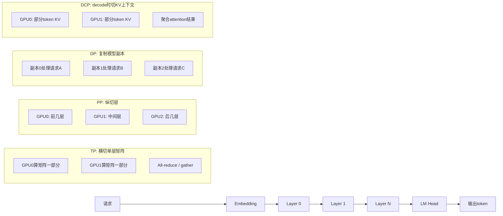

## 1. 先说结论

版本说明：本文参考的是2026-05-08访问的vLLM官方`latest`文档。vLLM文档页面明确提示`latest`是developer preview文档，不等同于latest stable release；因此DCP、PCP、EP等参数和行为最好以你实际安装的vLLM版本为准。生产环境建议同时查对应版本文档或直接用`vllm serve --help`确认参数是否存在。

vLLM里的“并行”不是一个概念，而是一组不同层面的手段。初学者最容易混淆的是：有些并行是在**拆一个模型**，有些并行是在**复制多个模型实例**，有些并行是在**拆KV cache**，还有些并行只对MoE专家层有意义。

可以先用一句话区分：

1. **TP，Tensor Parallel**：把同一层里的矩阵计算拆到多张GPU上。
2. **PP，Pipeline Parallel**：把模型不同层拆到不同GPU上。
3. **DP，Data Parallel**：复制多份模型，每份处理不同请求。
4. **EP，Expert Parallel**：MoE模型里，把不同expert放到不同GPU上。
5. **DCP，Decode Context Parallel**：decode阶段，把KV cache沿上下文长度维度切开，主要解决长上下文KV cache重复和显存问题。
6. **PCP，Prefill Context Parallel**：prefill阶段，把长prompt按token切开并行计算，主要解决长上下文TTFT问题。vLLM文档里仍把它描述为活跃发展中的方向。

再说MLA。

MLA，全称Multi-head Latent Attention。它不是vLLM发明的并行方式，而是DeepSeek-V2/V3/R1这类模型里的注意力结构。它的核心是：**不要给每个head都缓存完整K和V，而是缓存一个压缩后的latent KV表示。**

这会显著降低KV cache大小。但它和TP组合时会出现一个很容易误解的问题：

**MLA减少了KV cache总量，但在vLLM的TP部署里，如果模型对外看起来只有1个kv-head，那么TP开大后，每张GPU可能保存同一份KV cache。**

例如DeepSeek-R1启用MLA时，vLLM文档说它有1个kv-head。此时：

1. `--tensor-parallel-size 8` 会让8张GPU都参与模型计算。
2. 但KV head只有1个，没法沿head维度切成8份。
3. 结果是8张GPU各自持有一份相同KV cache，也就是8倍重复。
4. 加上 `--decode-context-parallel-size 8` 可以把KV cache沿token维度切开，去掉这部分重复。

所以一个非常实用的判断是：

**TP主要拆权重和计算；DCP主要拆decode阶段的KV cache。MLA模型如果kv-head很少，TP不能自动解决KV cache重复，通常要考虑DCP。**

## 2. 推理到底在算什么

先把LLM推理分成两个阶段：

1. prefill
2. decode

### 2.1 Prefill

prefill就是处理用户输入的prompt。

假设用户输入了一个长度为$T$的prompt：

$$
x_1, x_2, \ldots, x_T
$$

模型需要一次性计算这些token在每一层的hidden states，并为每一层生成KV cache。

在普通Transformer里，每一层attention大致会生成：

$$
Q = XW_Q,\quad K = XW_K,\quad V = XW_V
$$

然后计算：

$$
\mathrm{Attention}(Q, K, V) =
\mathrm{softmax}\left(\frac{QK^T}{\sqrt{d}}\right)V
$$

prefill阶段的特点是：

1. 一次处理很多query token。
2. attention计算量大。
3. 对长prompt来说，TTFT很容易被prefill拖慢。
4. prefill结束后，会留下每层的KV cache，供decode复用。

### 2.2 Decode

decode就是一个token一个token生成。

生成第$T+1$个token时，模型只需要为这个新token计算一个新的query：

$$
q_{T+1}
$$

但它需要和前面所有token的KV cache做attention：

$$
K_{1:T},\quad V_{1:T}
$$

生成第$T+2$个token时，又要读：

$$
K_{1:T+1},\quad V_{1:T+1}
$$

所以decode阶段的特点是：

1. 每步新计算的query很少，通常每个请求只新增1个token。
2. 每步都要读取越来越长的KV cache。
3. 长上下文下，decode经常变成memory bandwidth bound。
4. KV cache越大，可同时服务的请求越少。

这就是为什么vLLM的context parallel要分成prefill和decode两类。prefill主要想降低TTFT；decode主要想减少KV cache显存占用、提高batch size和吞吐。

## 3. KV Cache为什么这么重要

如果没有KV cache，每生成一个新token，都要重新计算整个历史上下文的K和V。这样会非常慢。

KV cache的作用是：历史token的K/V只算一次，之后保存起来。

假设模型有：

1. $L$层
2. $H_{kv}$个KV heads
3. 每个head维度为$d$
4. 上下文长度为$T$
5. dtype大小为$b$ bytes

普通KV cache大小大致是：

$$
\mathrm{KVCacheBytes}
= 2 \times L \times T \times H_{kv} \times d \times b
$$

这里的$2$来自K和V两份缓存。

举个简化例子：

1. $L = 80$
2. $H_{kv} = 8$
3. $d = 128$
4. $T = 128K$
5. dtype是FP16，所以$b = 2$

那么单请求KV cache约为：

$$
2 \times 80 \times 131072 \times 8 \times 128 \times 2
\approx 42.9 \mathrm{GB}
$$

这只是一个请求。如果batch里有多个长上下文请求，KV cache会很快吃满显存。

vLLM的PagedAttention解决的是“如何更高效地管理这些KV块”，减少碎片和浪费；而TP、DCP、MLA这些东西，解决的是“这些KV到底放在哪里、存多少、是否重复”的问题。

## 4. 一张图理解不同并行

可以把一个请求经过模型的过程想成这样：



这张图不是执行顺序图，而是帮你记住“切分方向”：TP切层内部，PP切层序列，DP复制副本，DCP切decode阶段的KV上下文。

```text
输入tokens
  -> embedding
  -> layer 0
  -> layer 1
  -> ...
  -> layer N-1
  -> lm head
  -> 输出token
```

不同并行方式切的位置不同。

### 4.1 TP：横着切每一层

TP把同一层里的矩阵切开。

例如一个线性层：

$$
Y = XW
$$

如果$W$太大，可以把$W$按列或按行切到多张GPU上：

$$
W = [W_0, W_1]
$$

GPU 0算：

$$
Y_0 = XW_0
$$

GPU 1算：

$$
Y_1 = XW_1
$$

最后再把结果拼起来或做reduce。

直观理解：

```text
同一层
┌───────────────────────────────┐
│             W                 │
├───────────────┬───────────────┤
│ GPU 0算一半    │ GPU 1算一半    │
└───────────────┴───────────────┘
```

TP适合：

1. 单层权重太大，一张GPU放不下。
2. 单卡算力不够，想让多卡共同算一个请求。
3. 单节点多GPU，尤其是NVLink互联比较好的机器。

TP的代价：

1. 每层都需要通信。
2. GPU之间带宽差会影响性能。
3. TP越大，不一定越快，因为通信开销会上升。

vLLM里常见参数：

```bash
vllm serve $MODEL --tensor-parallel-size 8
```

意思是一个模型副本使用8张GPU做tensor parallel。

### 4.2 PP：竖着切模型层

PP把不同层放到不同GPU上。

例如模型有80层，4张GPU：

```text
GPU 0: layer 0  - layer 19
GPU 1: layer 20 - layer 39
GPU 2: layer 40 - layer 59
GPU 3: layer 60 - layer 79
```

直观理解：

```text
tokens -> GPU0 -> GPU1 -> GPU2 -> GPU3 -> logits
```

PP适合：

1. 模型总权重太大，TP仍然不够放。
2. 多节点部署，节点间带宽不适合频繁TP通信。
3. 想减少单层内的通信量。

PP的代价：

1. 请求必须按层顺序流过多个stage。
2. batch太小时容易产生pipeline bubble。
3. decode阶段每步token都要经过所有stage，延迟会叠加。

vLLM里常见参数：

```bash
vllm serve $MODEL --pipeline-parallel-size 2
```

也可以和TP组合：

```bash
vllm serve $MODEL --tensor-parallel-size 4 --pipeline-parallel-size 2
```

这通常意味着总共需要：

$$
4 \times 2 = 8
$$

张GPU来放一个模型副本。

### 4.3 DP：复制多个模型副本

DP不是把一个请求拆开，而是复制多个模型副本，让不同副本处理不同请求。

例如8张GPU，如果模型单卡能放下，可以这样：

```text
GPU 0: 模型副本0，处理请求A
GPU 1: 模型副本1，处理请求B
GPU 2: 模型副本2，处理请求C
...
GPU 7: 模型副本7，处理请求H
```

这就是DP。

如果每个模型副本需要2张GPU做TP，也可以：

```text
DP rank 0: GPU 0-1, TP=2
DP rank 1: GPU 2-3, TP=2
DP rank 2: GPU 4-5, TP=2
DP rank 3: GPU 6-7, TP=2
```

此时：

$$
\mathrm{total\ GPUs} = \mathrm{DP} \times \mathrm{TP}
$$

vLLM命令：

```bash
vllm serve $MODEL --data-parallel-size 4 --tensor-parallel-size 2
```

DP适合：

1. 模型副本已经能放下。
2. 请求很多，吞吐瓶颈是并发不够。
3. 希望多个engine独立调度请求。

DP的特点：

1. 每个DP rank有自己的KV cache。
2. 一个请求只属于某个DP rank，不会自动跨DP rank共享KV cache。
3. 负载均衡很重要，尤其是有prefix cache时，请求路由会影响命中率。

vLLM官方文档也强调，DP部署里每个DP engine有独立KV cache；在线服务时可以根据队列状态和KV cache状态做更智能的负载均衡。

### 4.4 EP：只对MoE专家层特殊

EP是Expert Parallel，主要用于MoE模型，例如DeepSeek、Mixtral、Kimi-K2这类有experts的模型。

普通dense模型每层参数都会参与计算；MoE模型里有很多expert，但每个token通常只路由到少数几个expert。

例如一层有8个expert，每个token只用其中2个：

```text
token 1 -> expert 0, expert 3
token 2 -> expert 1, expert 7
token 3 -> expert 0, expert 5
```

EP就是把expert分到不同GPU：

```text
GPU 0: expert 0, 1
GPU 1: expert 2, 3
GPU 2: expert 4, 5
GPU 3: expert 6, 7
```

EP适合：

1. MoE模型expert参数很大。
2. 每个token只激活少数expert。
3. 想利用expert天然稀疏性。

EP的代价：

1. token需要根据路由结果在GPU之间all-to-all通信。
2. expert负载可能不均衡。
3. 要配合负载均衡策略和合适的all2all backend。

vLLM参数：

```bash
vllm serve $MODEL --enable-expert-parallel
```

对非MoE模型，EP基本没有意义。

### 4.5 DCP：decode阶段切KV cache

DCP是Decode Context Parallel。它不是普通意义上的模型并行，而是专门处理decode阶段KV cache的并行方式。

decode阶段每步只有少量query token，但要读很长的KV cache。

普通TP会先尝试按KV head切KV cache。假设模型有$H_{kv}$个KV heads，TP大小为$P$：

1. 如果$P \le H_{kv}$，可以让每张GPU负责一部分KV heads。
2. 如果$P > H_{kv}$，KV head不够切，部分GPU就会存重复KV cache。

vLLM文档里的表达是：当继续增大TP size时，因为$H$由模型结构决定且有限，KV cache会重复，重复倍数大致是：

$$
\frac{\mathrm{tp\_size}}{H}
$$

这里$H$是KV head数量。

DCP要解决的就是这个问题。它把KV cache进一步沿上下文长度$T$切开。

普通按head切：

```text
KV cache = [head 0][head 1][head 2][head 3]
```

DCP按token维度切：

```text
KV cache = token 0..999    -> GPU group 0
           token 1000..1999 -> GPU group 1
           token 2000..2999 -> GPU group 2
           ...
```

vLLM里参数：

```bash
vllm serve $MODEL --tensor-parallel-size 8 --decode-context-parallel-size 8
```

注意一个关键点：**DCP不会增加GPU总数，它复用TP group里的GPU。**

例如：

```bash
--tensor-parallel-size 8 --decode-context-parallel-size 8
```

仍然是8张GPU，不是64张GPU。

vLLM官方文档要求：

$$
\mathrm{tp\_size} \bmod \mathrm{dcp\_size} = 0
$$

也就是说TP大小要能被DCP大小整除。

同时，DCP通常是为了解决KV head不够切导致的重复，所以实践上还要看重复倍数：

$$
1 \le \mathrm{dcp\_size} \le \frac{\mathrm{tp\_size}}{H_{kv}}
$$

如果$dcp\_size$超过这个范围，理论上还能继续切KV，但decode阶段query token很少，非attention层也不知道如何有效使用多出来的DCP rank。vLLM文档为了简单，把DCP上界限制在这个重复倍数附近。

## 5. TP、PP、DP、EP、DCP怎么组合

先看几个常见组合。

### 5.1 只用TP

命令：

```bash
vllm serve $MODEL --tensor-parallel-size 8
```

含义：

1. 一个模型副本。
2. 这个副本横向切到8张GPU。
3. 所有请求共享这个模型副本的调度器和KV cache池。

适合：

1. 模型单卡放不下。
2. 单节点8卡部署。
3. 通信带宽较好。

问题：

1. 如果KV heads少，KV cache可能重复。
2. 如果是MLA模型，尤其要注意这一点。

### 5.2 TP + DCP

命令：

```bash
vllm serve $MODEL --tensor-parallel-size 8 --decode-context-parallel-size 8
```

含义：

1. 仍然是一个模型副本。
2. 权重和计算用TP切。
3. decode阶段KV cache再用DCP沿上下文维度切。

适合：

1. 长上下文。
2. MLA/GQA模型KV heads少。
3. `--tensor-parallel-size`大于KV head数，出现KV重复。

代价：

1. DCP会引入额外通信。
2. DCP越大，KV重复越少，但通信越多。
3. 对短上下文、短输出，收益可能不明显。

### 5.3 DP + TP

命令：

```bash
vllm serve $MODEL --data-parallel-size 4 --tensor-parallel-size 2
```

含义：

1. 有4个模型副本。
2. 每个副本用2张GPU做TP。
3. 总共需要8张GPU。

适合：

1. 请求很多。
2. 单个副本TP=2已经够用。
3. 希望增加吞吐，而不是继续扩大单个模型副本。

要注意：

1. 每个DP rank有独立KV cache。
2. prefix cache不会自动跨DP rank共享。
3. 请求路由很重要。

例如两个请求有相同长前缀：

```text
请求A: system prompt + 文档X + 问题1
请求B: system prompt + 文档X + 问题2
```

如果A进入DP rank 0，B进入DP rank 1，那么它们不能直接共享同一个rank里的prefix cache。除非外部有KV transfer/offloading层，否则两个rank会各自计算和保存自己的KV。

### 5.4 DP + TP + DCP

命令：

```bash
vllm serve $MODEL \
  --data-parallel-size 2 \
  --tensor-parallel-size 8 \
  --decode-context-parallel-size 8
```

含义：

1. 有2个模型副本。
2. 每个副本用8张GPU做TP。
3. 每个副本内部再用DCP减少decode KV重复。
4. 总共需要$2 \times 8 = 16$张GPU。

适合：

1. 大模型。
2. 长上下文。
3. 并发也高。
4. 每个模型副本内部有KV重复问题。

### 5.5 DP + EP

对MoE模型，有时会让attention层走DP，让expert层走EP。

直观理解：

1. attention部分每个DP rank自己算。
2. expert部分把token发到对应expert所在GPU。
3. expert层需要跨rank同步和通信。

vLLM官方文档提到，对于DeepSeek这类使用MLA的MoE模型，让attention层用DP、expert层用EP或TP，有时是有优势的。

命令大致类似：

```bash
vllm serve deepseek-ai/DeepSeek-V3-0324 \
  --data-parallel-size 8 \
  --enable-expert-parallel
```

实际生产部署还需要结合节点数量、all2all backend、expert placement等参数。

## 6. MLA是什么

MLA是Multi-head Latent Attention。

先从普通MHA讲起。

### 6.1 MHA：每个head都有自己的K/V

普通Multi-head Attention里，每个head有自己的Q/K/V。

假设有$H$个heads：

$$
Q_h = XW^Q_h,\quad K_h = XW^K_h,\quad V_h = XW^V_h
$$

每个head都算：

$$
O_h = \mathrm{Attention}(Q_h, K_h, V_h)
$$

然后拼起来。

decode时，历史token的$K_h,V_h$都要缓存。

所以MHA的KV cache随head数量线性增长：

$$
\mathrm{KVCache} \propto H \times T
$$

优点是表达能力强；缺点是KV cache很大。

### 6.2 MQA：所有query heads共享一份K/V

MQA是Multi-query Attention。

它让多个query heads共享同一组K/V。

可以理解为：

```text
Q有很多head
K/V只有1组
```

这样KV cache会小很多。

但共享得太狠，可能影响模型能力。

### 6.3 GQA：一组query heads共享一组K/V

GQA是Grouped-query Attention。

它介于MHA和MQA之间：

```text
多个query heads分成几组
每组共享一组K/V
```

例如：

```text
32个query heads
8个kv heads
每4个query heads共享1个kv head
```

这样KV cache比MHA小，但比MQA表达能力更强。

很多现代模型使用GQA。

### 6.4 MLA：缓存latent，不直接缓存完整K/V

MLA更进一步。

它不是简单减少KV head数量，而是把K/V压缩成一个latent表示。

可以粗略理解为：

$$
c_t^{KV} = x_t W^{DKV}
$$

其中$c_t^{KV}$是token $t$的压缩latent KV。

真正计算attention时，再从latent里恢复或投影出需要的K/V相关表示：

$$
K_t \approx c_t^{KV} W^{UK},\quad V_t \approx c_t^{KV} W^{UV}
$$

这里不要太纠结“约等于”的细节。对初学者来说，抓住核心就够了：

**普通attention缓存完整K/V；MLA缓存压缩后的latent KV。**

所以MLA能显著减少KV cache占用。

DeepSeek-V2论文里就把MLA作为降低推理成本的重要结构；DeepSeek-V3/R1也沿用了类似方向。

## 7. MLA为什么对decode特别重要

decode阶段每生成一个token，都要读历史KV cache。

如果上下文长度是$T$，每步decode要读的KV大致和$T$成正比：

$$
\mathrm{ReadBytesPerStep} \propto T \times \mathrm{KVSizePerToken}
$$

长上下文下，GPU算力可能不是瓶颈，显存带宽才是瓶颈。

MLA把每个token需要缓存的内容变小，于是：

1. 同样显存可以放更长上下文。
2. 同样显存可以放更多并发请求。
3. decode每步读取的数据更少。
4. 长上下文吞吐更容易提升。

这就是为什么MLA经常和大上下文、大MoE模型一起出现。

## 8. MLA + TP为什么会出现相同KV cache

这是本文最重要的部分。

先看普通GQA模型。

假设：

$$
H_{kv} = 8,\quad \mathrm{TP}=8
$$

那么每张GPU可以负责1个KV head：

```text
GPU 0: kv head 0
GPU 1: kv head 1
...
GPU 7: kv head 7
```

每张GPU保存不同的一份KV cache，没有重复。

再看：

$$
H_{kv} = 4,\quad \mathrm{TP}=8
$$

KV head只有4个，但TP有8张GPU。head维度不够切了。

结果可能变成：

```text
GPU 0,4: kv head 0
GPU 1,5: kv head 1
GPU 2,6: kv head 2
GPU 3,7: kv head 3
```

这就是2倍重复。

重复倍数大致是：

$$
\frac{\mathrm{TP}}{H_{kv}}
$$

再看MLA模型。

vLLM官方文档明确写了一个case：DeepSeek-R1启用MLA时有1个kv-head。

如果：

$$
H_{kv} = 1,\quad \mathrm{TP}=8
$$

那么head维度完全没法切。

每张GPU都会需要同一份latent KV cache：

```text
GPU 0: latent KV for tokens 0..T
GPU 1: latent KV for tokens 0..T
GPU 2: latent KV for tokens 0..T
...
GPU 7: latent KV for tokens 0..T
```

这就是8份相同KV cache。

这听起来很反直觉：MLA不是减少KV cache吗？为什么还会浪费？

答案是：

**MLA减少的是单份KV cache的大小；TP造成的问题是这份较小KV cache被复制了多份。**

如果原来单份KV cache是100GB，MLA可能把它变成10GB。但如果TP=8导致复制8份，总量又变成：

$$
10\mathrm{GB} \times 8 = 80\mathrm{GB}
$$

它仍然比100GB小，但没有发挥完整收益。如果用DCP去掉重复，才能接近真正的10GB级别。

## 9. DCP如何解决MLA + TP的KV重复

DCP不沿KV head切，而是沿token维度切。

对于DeepSeek-R1这种MLA、$H_{kv}=1$的情况：

```text
不加DCP，TP=8:

GPU 0: tokens 0..T 的完整latent KV
GPU 1: tokens 0..T 的完整latent KV
...
GPU 7: tokens 0..T 的完整latent KV
```

加DCP=8后：

```text
GPU 0: token 0,8,16,24,... 的latent KV
GPU 1: token 1,9,17,25,... 的latent KV
...
GPU 7: token 7,15,23,31,... 的latent KV
```

实际实现里vLLM使用interleaving策略，不一定是连续大段切分。它可以按token级或block级交错存储。这样做的好处是decode过程中新增token也能自然落到对应DCP rank上。

从显存看：

$$
\mathrm{KVCachePerGPU}
\approx
\frac{\mathrm{FullKVCache}}{\mathrm{DCP}}
$$

对$H_{kv}=1,\ \mathrm{TP}=8,\ \mathrm{DCP}=8$：

1. 不加DCP：每张GPU一份完整KV。
2. 加DCP：每张GPU约存$1/8$的KV。

这就是vLLM文档建议DeepSeek-R1在`-tp 8`时考虑加`-dcp 8`的原因。

## 10. 用具体例子算一遍

假设某个MLA模型的单份latent KV cache在一个请求上是8GB。

### 10.1 TP=1

```bash
vllm serve $MODEL --tensor-parallel-size 1
```

KV cache：

```text
GPU 0: 8GB
```

总KV：

$$
8\mathrm{GB}
$$

### 10.2 TP=8，不加DCP

```bash
vllm serve $MODEL --tensor-parallel-size 8
```

如果MLA对外只有1个kv-head，那么：

```text
GPU 0: 8GB
GPU 1: 8GB
GPU 2: 8GB
GPU 3: 8GB
GPU 4: 8GB
GPU 5: 8GB
GPU 6: 8GB
GPU 7: 8GB
```

总KV：

$$
8 \times 8\mathrm{GB} = 64\mathrm{GB}
$$

每张GPU也要承担8GB KV cache，不能因为有8张GPU就把单卡KV降到1GB。

### 10.3 TP=8，DCP=8

```bash
vllm serve $MODEL \
  --tensor-parallel-size 8 \
  --decode-context-parallel-size 8
```

KV cache：

```text
GPU 0: 1GB
GPU 1: 1GB
GPU 2: 1GB
GPU 3: 1GB
GPU 4: 1GB
GPU 5: 1GB
GPU 6: 1GB
GPU 7: 1GB
```

总KV：

$$
8\mathrm{GB}
$$

这才真正去掉了TP带来的重复。

### 10.4 TP=8，DCP=4

```bash
vllm serve $MODEL \
  --tensor-parallel-size 8 \
  --decode-context-parallel-size 4
```

KV cache大致会变成：

```text
GPU 0: 2GB
GPU 1: 2GB
...
GPU 7: 2GB
```

总KV：

$$
16\mathrm{GB}
$$

仍有2倍重复，但比64GB好多了。通信开销也比DCP=8小。

这就是DCP的取舍：

1. DCP越大，KV重复越少。
2. DCP越大，通信越多。
3. 不一定永远选最大，要看显存瓶颈还是通信瓶颈。

## 11. 常见误区

### 11.1 “TP=8，所以KV cache自动变成1/8”

不一定。

TP能不能切KV cache，要看KV head数量。

如果：

$$
H_{kv} \ge \mathrm{TP}
$$

通常比较容易按head切。

如果：

$$
H_{kv} < \mathrm{TP}
$$

就会出现重复。

MLA模型里vLLM看到的$H_{kv}$可能很小，DeepSeek-R1 case里就是1。因此TP=8不会自动把KV切成8份。

### 11.2 “MLA已经压缩KV cache，所以不需要DCP”

不一定。

MLA压缩的是**单份KV cache**。

DCP解决的是**多GPU TP下KV cache重复**。

它们解决的问题不同，可以叠加。

### 11.3 “DCP会增加GPU数量”

不会。

vLLM文档明确说DCP size不增加启动GPU数量，它复用TP group里的GPU。

例如：

```bash
--tensor-parallel-size 8 --decode-context-parallel-size 8
```

还是8张GPU。

### 11.4 “DP和TP都是多卡，所以差不多”

不一样。

TP是一个请求跨多卡算。

DP是多个模型副本分别处理不同请求。

如果模型单卡放不下，DP帮不了你，因为每个DP rank仍然要完整放一份模型。你需要TP或PP。

如果模型已经能放下，但请求很多，继续增大TP可能不如增加DP副本。

### 11.5 “DP副本之间会共享prefix cache”

默认不会。

每个DP engine有自己的KV cache。请求A在rank 0生成的prefix cache，不会自动被rank 1拿来用。

如果业务里大量请求共享长前缀，负载均衡要尽量把相同前缀打到同一个DP rank，或者引入KV cache transfer/offloading层。

### 11.6 “PP能提高单请求decode速度”

不一定。

PP主要解决模型太大、层放不下的问题。decode每步仍然要顺序经过每个pipeline stage。batch小的时候，pipeline bubble会很明显。

## 12. 不同并行方式的优劣和性能对比

这一节专门横向比较。前面讲的是每种并行“是什么”，这里讲“什么时候用、为什么用、用了会变快还是变慢”。

先给一个总表。

| 并行方式 | 主要切分对象 | 主要解决什么 | 对显存的影响 | 对TTFT的影响 | 对TPOT的影响 | 主要通信 | 最适合场景 |
|---|---|---|---|---|---|---|---|
| TP | 单层矩阵、attention/MLP计算 | 单卡放不下、单请求算力不够 | 降低单卡权重显存；KV是否降低取决于KV head | 通常降低prefill时间，但通信过大时收益下降 | 可能降低decode计算时间，但KV重复会拖后腿 | 每层all-reduce/all-gather | 单节点多GPU、大dense模型 |
| PP | 模型层 | 模型太深/太大，单个TP group放不下 | 降低单卡权重显存；KV按层分布 | batch足够大时可接受；小batch有pipeline bubble | decode每步要过所有stage，延迟可能变高 | stage之间传hidden states | 超大模型、多节点部署 |
| DP | 模型副本 | 请求并发高、吞吐不够 | 每个副本一份权重和KV，总显存线性增加 | 单请求TTFT不变，但排队时间下降 | 单请求TPOT不变，但整体吞吐上升 | 主要是请求路由，模型内无跨副本通信 | 模型副本能放下、在线高并发 |
| EP | MoE experts | MoE expert参数太大 | expert参数分散到多卡 | 取决于expert通信和负载均衡 | 取决于all-to-all和expert热点 | token all-to-all | MoE模型，尤其DeepSeek/Mixtral类 |
| DCP | decode阶段KV cache的上下文维度 | TP下KV cache重复、长上下文显存高 | 显著降低单卡KV cache重复 | 对prefill帮助有限 | 长上下文decode更稳，但增加通信 | attention结果聚合 | MLA/GQA、KV head少、长上下文 |
| PCP | prefill阶段上下文token维度 | 超长prompt prefill慢 | 可降低单卡activation压力 | 目标是降低长prompt TTFT | 对decode帮助有限 | attention相关通信 | 超长prompt、prefill瓶颈 |

最简单的直觉是：

1. **TP/PP/EP主要解决模型权重和计算怎么放。**
2. **DP主要解决请求怎么分。**
3. **DCP/PCP主要解决长上下文怎么切。**
4. **MLA不是并行方式，它改变KV cache形态；DCP才是处理MLA + TP下KV重复的并行手段。**

### 12.1 TP的优劣

TP的优点：

1. 对大多数dense模型最直接。
2. 可以把单层大矩阵切开，降低单卡权重显存。
3. prefill阶段通常收益明显，因为prefill矩阵乘和attention计算量大，多卡一起算容易吃满算力。
4. 单节点8卡NVLink环境下，TP通常是最自然的起点。

TP的缺点：

1. 每层都有通信，通信开销高。
2. TP越大，通信频率和同步成本越明显。
3. 多节点TP通常比单节点TP更难跑快，因为跨节点带宽和延迟差很多。
4. 对KV cache不一定友好，尤其KV heads少时会重复。

TP对性能的影响可以粗略理解成：

$$
\mathrm{Time}_{TP}
\approx
\frac{\mathrm{Compute}}{\mathrm{TP}}
+ \mathrm{Communication}(\mathrm{TP})
$$

如果模型很大、计算很多，那么第一项下降明显，TP有收益。

如果模型不大、batch小、上下文短，通信项可能占主导，TP开大反而变慢。

适合用TP的情况：

1. 模型单卡放不下。
2. 单请求prefill很重。
3. 单节点多GPU互联好。
4. dense模型或attention/MLP都比较重。

不适合盲目加TP的情况：

1. 小模型。
2. 短prompt、短输出。
3. 跨节点网络一般。
4. KV head很少但没有开DCP。

例子：

```bash
# 70B dense模型，单卡放不下，8卡单节点
vllm serve $MODEL --tensor-parallel-size 8
```

这通常合理。

但如果是7B模型，一张卡已经能跑，强行TP=8可能因为通信变慢，还不如DP=8复制8份。

### 12.2 PP的优劣

PP的优点：

1. 可以把不同层放到不同GPU，降低单卡权重显存。
2. 比TP更适合跨节点，因为stage之间只传hidden states，不需要每层内部频繁all-reduce。
3. 对超大模型很有用，尤其TP已经不够放的时候。

PP的缺点：

1. 有pipeline bubble。
2. batch小的时候GPU容易等上一个stage或下一个stage。
3. decode阶段天然不太舒服，因为每生成一个token都要顺序穿过所有stage。
4. stage切分不均匀时，会被最慢stage拖住。

PP的性能瓶颈可以直观理解成：

$$
\mathrm{Latency}_{PP}
\approx
\sum_{s=1}^{S} \mathrm{StageTime}_s
+ \mathrm{Bubble}
$$

吞吐则更接近由最慢stage决定：

$$
\mathrm{Throughput}_{PP}
\approx
\frac{1}{\max_s \mathrm{StageTime}_s}
$$

所以PP最怕两件事：

1. stage不均衡。
2. batch太小，bubble太大。

适合用PP的情况：

1. 模型太大，TP放不下。
2. 多节点部署，跨节点TP通信太贵。
3. batch较大，能填满pipeline。

不适合优先用PP的情况：

1. 单节点TP已经能解决。
2. 强低延迟、单请求decode。
3. 请求很零散，batch凑不起来。

例子：

```bash
# 2节点，每节点8卡。节点内TP=8，节点间PP=2
vllm serve $MODEL \
  --tensor-parallel-size 8 \
  --pipeline-parallel-size 2
```

这种组合的意思是：每个pipeline stage内部用8卡TP，两个stage分别放不同层。总GPU是：

$$
8 \times 2 = 16
$$

### 12.3 DP的优劣

DP的优点：

1. 最简单稳定。
2. 每个副本独立处理请求，模型内部不需要跨副本通信。
3. 扩吞吐很直接，副本数越多，可同时处理的请求越多。
4. 对短请求、高并发服务很友好。

DP的缺点：

1. 每个副本都要一份完整权重。
2. 每个副本都有独立KV cache。
3. prefix cache默认不跨副本共享。
4. 负载均衡会影响延迟和cache命中。

DP影响的不是单个请求的计算路径，而是排队和并发。

如果单个请求在一个副本上的时间是：

$$
T_{req}
$$

那么DP不会把这个请求变成：

$$
\frac{T_{req}}{\mathrm{DP}}
$$

DP做的是让多个请求并行进入不同副本。它主要降低的是排队时间，提高的是系统吞吐。

适合用DP的情况：

1. 模型副本已经能放下。
2. 在线请求很多。
3. 单请求延迟可以接受，但排队严重。
4. 多租户、多业务流量。

不适合只用DP的情况：

1. 模型单副本放不下。
2. 每个请求都是超长上下文，KV cache占用很高。
3. 大量请求共享长前缀但路由打散，prefix cache收益会下降。

例子：

```bash
# 8卡部署小模型，每卡一个副本
vllm serve $MODEL --data-parallel-size 8
```

这对高并发短请求通常比TP=8更合理。

如果模型需要2卡才能放下：

```bash
vllm serve $MODEL \
  --data-parallel-size 4 \
  --tensor-parallel-size 2
```

这就是4个副本，每个副本2卡。

### 12.4 EP的优劣

EP只对MoE模型有意义。

EP的优点：

1. expert参数可以分散存放。
2. MoE每个token只激活少数expert，理论上能省计算。
3. 对DeepSeek这类大MoE模型，EP经常是必要选项。

EP的缺点：

1. 需要all-to-all通信，把token发到对应expert。
2. 如果路由不均衡，某些expert/GPU会成为热点。
3. batch太小时，expert并行度不一定充分。
4. 部署复杂度明显高于dense模型TP/DP。

MoE层的性能大致看三部分：

$$
\mathrm{MoETime}
\approx
\mathrm{RouterTime}
+ \mathrm{AllToAllTime}
+ \mathrm{ExpertComputeTime}
$$

其中最容易出问题的是all-to-all和expert负载不均衡。

适合用EP的情况：

1. MoE模型。
2. expert参数很多。
3. GPU间all-to-all带宽足够。
4. batch足够大，能摊平expert负载。

不适合的情况：

1. dense模型。
2. 小MoE模型，expert本来就能放下。
3. 网络差，all-to-all很慢。

例子：

```bash
vllm serve $MODEL --enable-expert-parallel
```

对DeepSeek类MoE模型，真实生产里还会结合DP、TP和all2all backend调优。

### 12.5 DCP的优劣

DCP的优点：

1. 直接减少decode阶段KV cache重复。
2. 对MLA/GQA这类KV heads少的模型特别有价值。
3. 对长上下文请求，可以显著降低单卡KV显存。
4. 不增加GPU数量，只复用TP group里的GPU。

DCP的缺点：

1. 增加attention阶段通信。
2. 主要帮助decode，对prefill帮助有限。
3. 短上下文下可能收益不明显。
4. DCP size不是越大越好，要看KV重复倍数和通信开销。

DCP的核心收益来自减少KV重复。

假设TP下KV重复倍数是：

$$
R = \frac{\mathrm{TP}}{H_{kv}}
$$

如果不加DCP，每张GPU可能存一整份重复KV。

如果加DCP：

$$
\mathrm{KVPerGPU}
\approx
\frac{\mathrm{FullKV}}{\mathrm{DCP}}
$$

但通信也会增加，所以DCP的真实收益取决于：

1. KV cache是否显存瓶颈。
2. 上下文是否足够长。
3. decode是否memory bandwidth bound。
4. GPU互联是否足够好。

适合用DCP的情况：

1. MLA模型。
2. $H_{kv}$很小。
3. TP很大。
4. 长上下文。
5. 显存被KV cache卡住。

不适合优先用DCP的情况：

1. 短上下文。
2. KV cache不是瓶颈。
3. TP没有造成KV重复。
4. GPU通信很差。

例子：

```bash
# DeepSeek-R1类MLA模型，TP=8时KV head只有1个
vllm serve $MODEL \
  --tensor-parallel-size 8 \
  --decode-context-parallel-size 8
```

这类场景DCP通常比单纯TP=8更合理。

### 12.6 PCP的优劣

PCP是Prefill Context Parallel。

DCP切decode阶段KV cache，PCP切prefill阶段长上下文。

PCP的优点：

1. 目标是降低超长prompt的TTFT。
2. 可以把长prompt的attention计算分到多卡。
3. 对128K、256K这类长上下文prefill更有意义。

PCP的缺点：

1. 主要帮助prefill，不直接解决decode KV cache显存。
2. attention通信复杂。
3. 实现和模型/backend相关，版本可用性要确认。
4. 对短prompt没有必要。

适合用PCP的情况：

1. prompt很长。
2. TTFT是主要瓶颈。
3. 请求输出不长，prefill占端到端大头。
4. vLLM版本和模型backend支持。

不适合优先用PCP的情况：

1. decode输出很长，瓶颈在TPOT。
2. prompt较短。
3. 显存主要被decode KV cache卡住，这时DCP更直接。

### 12.7 性能对比：几个典型场景

#### 场景一：7B模型，短prompt，高并发

特点：

1. 模型单卡能放下。
2. prompt短。
3. 输出也不长。
4. 请求很多。

优先选择：

```text
DP > TP
```

原因很简单：单请求不需要多卡一起算，强行TP会引入通信。复制多个副本处理更多请求，通常更划算。

推荐：

```bash
vllm serve $MODEL --data-parallel-size 8
```

#### 场景二：70B dense模型，单节点8卡

特点：

1. 单卡放不下。
2. dense模型，没有expert。
3. 单节点GPU互联好。

优先选择：

```text
TP
```

推荐：

```bash
vllm serve $MODEL --tensor-parallel-size 8
```

如果KV head数量足够，TP对KV cache也比较自然。如果KV head少，再考虑DCP。

#### 场景三：DeepSeek-R1类MLA模型，长上下文

特点：

1. MLA减少单份KV cache。
2. vLLM里可能只有1个kv-head。
3. TP=8时KV cache可能8倍重复。
4. 长上下文下KV cache是显存瓶颈。

优先选择：

```text
TP + DCP
```

推荐：

```bash
vllm serve $MODEL \
  --tensor-parallel-size 8 \
  --decode-context-parallel-size 8
```

如果通信压力太大，可以试DCP=4。

#### 场景四：两节点超大模型

特点：

1. 单节点8卡还放不下。
2. 跨节点网络比节点内慢。

优先选择：

```text
节点内TP，节点间PP或DP
```

如果是一个超大模型副本：

```bash
--tensor-parallel-size 8
--pipeline-parallel-size 2
```

如果每个节点能放一个副本，吞吐优先：

```bash
--tensor-parallel-size 8
--data-parallel-size 2
```

区别是：

1. PP是一个模型副本跨两节点。
2. DP是两个独立模型副本。

#### 场景五：MoE模型，expert很多

特点：

1. expert参数巨大。
2. 每个token只激活少数expert。
3. expert放置和all-to-all影响很大。

优先选择：

```text
EP + DP/TP
```

推荐从：

```bash
--enable-expert-parallel
```

开始，再根据模型大小和集群拓扑叠加TP/DP。

### 12.8 一个更直接的选型表

| 你的问题 | 优先考虑 | 不优先考虑 |
|---|---|---|
| 模型单卡放不下 | TP、PP | 只用DP |
| 请求很多但模型单卡能放下 | DP | 大TP |
| 单节点8卡大dense模型 | TP | PP |
| 多节点超大模型 | TP + PP | 跨节点大TP |
| MoE expert太大 | EP | 普通dense式TP-only |
| 长上下文decode显存爆 | DCP、KV量化、降低max_model_len | 只加DP |
| MLA + TP下KV重复 | DCP | 继续增大TP |
| TTFT高，prompt很长 | PCP、chunked prefill、prefix cache | 只优化decode |
| TPOT高，输出长 | DCP、KV优化、batch调度 | 只优化prefill |
| prefix cache命中很重要 | DP路由亲和、KV transfer | 随机负载均衡 |

### 12.9 最容易犯错的性能判断

第一，把“单请求变快”和“系统吞吐变高”混在一起。

TP可能让单请求prefill更快；DP通常不会让单个请求更快，但能让更多请求同时跑。

第二，只看权重显存，不看KV cache。

长上下文服务里，KV cache可能比权重更难处理。尤其是MLA + TP，如果KV重复没有去掉，显存会被吃掉，batch size上不去，吞吐也上不去。

第三，以为通信免费。

TP、PP、EP、DCP都引入通信，只是通信模式不同：

1. TP：每层同步，频繁。
2. PP：stage之间传hidden states，频率较低但有pipeline延迟。
3. EP：expert all-to-all，容易受网络和负载均衡影响。
4. DCP：attention上下文并行通信，长上下文下收益和代价都明显。

第四，忽略请求形态。

同一个部署，对不同请求形态可能表现完全不同：

1. 短prompt短输出：DP通常好。
2. 长prompt短输出：prefill优化更重要。
3. 短prompt长输出：decode和KV读取更重要。
4. 长prompt长输出：prefill、decode、KV cache都要管。

## 13. 该怎么选并行方式

可以按这个顺序想。

### 12.1 先问：模型单卡能不能放下

如果单卡能放下：

1. 请求少：先用单卡，简单可靠。
2. 请求多：优先考虑DP，多复制几个副本。
3. 长上下文KV占用高：考虑KV cache dtype、DCP、offloading、prefix cache等。

如果单卡放不下：

1. 单节点多卡：先考虑TP。
2. 多节点且模型非常大：考虑TP + PP。
3. MoE模型：考虑EP。

### 12.2 再问：瓶颈是prefill还是decode

如果TTFT高，主要是prefill慢：

1. chunked prefill
2. prefix cache
3. prefill context parallel
4. 更高TP
5. prompt裁剪或RAG侧优化

如果TPOT高，主要是decode慢：

1. 增大batch利用率
2. 减少KV cache读取量
3. DCP减少KV重复
4. FP8 KV cache
5. MLA/GQA这类模型结构

### 12.3 再问：KV cache是不是显存瓶颈

如果显存里主要是权重：

1. TP/PP/量化更重要。

如果显存里主要是KV cache：

1. 降低`max_model_len`
2. 调整`gpu_memory_utilization`
3. KV cache quantization
4. prefix cache
5. DCP
6. KV offloading

长上下文服务里，KV cache经常是第一大变量。

### 12.4 对MLA模型的建议

如果是DeepSeek-R1/V3这类MLA模型：

1. 先确认vLLM里实际KV head数量。
2. 如果$H_{kv}=1$且TP很大，默认要怀疑KV cache重复。
3. 单节点8卡常见组合可以先试：

```bash
vllm serve deepseek-ai/DeepSeek-R1 \
  --tensor-parallel-size 8 \
  --decode-context-parallel-size 8
```

4. 如果通信开销太大，可以试：

```bash
--decode-context-parallel-size 4
```

5. 看显存、吞吐、TPOT、TTFT综合取舍。

## 14. 一个8卡部署例子

假设有一台8卡H100，想部署一个DeepSeek类MLA模型。

### 13.1 目标A：先跑起来

```bash
vllm serve $MODEL --tensor-parallel-size 8
```

优点：

1. 简单。
2. 权重能切到8卡。
3. 模型容易跑起来。

缺点：

1. MLA下KV cache可能8倍重复。
2. 长上下文并发可能上不去。

### 13.2 目标B：长上下文更省KV

```bash
vllm serve $MODEL \
  --tensor-parallel-size 8 \
  --decode-context-parallel-size 8
```

优点：

1. 去掉MLA KV cache重复。
2. 可容纳更多长上下文请求。
3. decode阶段更适合长上下文。

缺点：

1. 通信增加。
2. 短上下文场景不一定更快。

### 13.3 目标C：吞吐优先，模型较小

如果模型2卡就能放下：

```bash
vllm serve $MODEL \
  --data-parallel-size 4 \
  --tensor-parallel-size 2
```

优点：

1. 4个副本并行处理请求。
2. 高并发吞吐可能更好。

缺点：

1. 每个DP rank有独立KV cache。
2. 相同前缀请求如果打散到不同rank，prefix cache收益会下降。

### 13.4 目标D：MoE专家层太大

如果是MoE模型，考虑：

```bash
vllm serve $MODEL \
  --data-parallel-size 8 \
  --enable-expert-parallel
```

或者更复杂地组合TP、DP、EP。这个要根据模型结构和集群网络细调。

## 15. 一个16卡部署例子

假设两台机器，每台8卡，要部署很大的MLA MoE模型。

一种思路是：

```text
每个模型副本占8卡：
  TP=8
  DCP=8

两个节点各一个副本：
  DP=2
```

也就是：

```bash
--data-parallel-size 2
--tensor-parallel-size 8
--decode-context-parallel-size 8
```

总GPU：

$$
2 \times 8 = 16
$$

这种组合的含义：

1. 每个节点内部用TP=8切模型。
2. 每个节点内部用DCP=8减少MLA KV重复。
3. 两个节点之间用DP扩吞吐。
4. 尽量避免跨节点TP通信。

如果跨节点网络很强，也可以考虑更大的TP或PP。但初始方案通常应尽量让高频通信留在单节点内部。

## 16. 看指标判断是否选错

### 15.1 显存很满，但GPU利用率不高

可能原因：

1. KV cache占用太大，batch size上不去。
2. MLA + TP导致KV重复。
3. `max_model_len`设置过大。

可以尝试：

1. DCP
2. KV cache quantization
3. 降低`max_model_len`
4. 调整`gpu_memory_utilization`

### 15.2 TPOT随上下文变长明显变差

可能原因：

1. decode读KV cache成为瓶颈。
2. 长上下文下显存带宽不够。
3. KV cache重复导致有效batch下降。

可以尝试：

1. DCP
2. FP8 KV cache
3. 更适合长上下文的模型结构
4. prefix cache和请求路由优化

### 15.3 TTFT很高

可能原因：

1. prefill太长。
2. prompt本身太大。
3. prefill阶段没有被充分并行。

可以尝试：

1. prefix cache
2. chunked prefill
3. prefill context parallel
4. RAG减少输入token

### 15.4 加大TP后吞吐反而下降

可能原因：

1. 通信开销超过计算收益。
2. 多卡互联慢。
3. 小模型或短上下文不适合大TP。

可以尝试：

1. 减小TP，增加DP。
2. 单节点内TP，跨节点DP。
3. 检查NCCL和网络拓扑。

## 17. 参数速查

### 16.1 Tensor Parallel

```bash
--tensor-parallel-size 8
```

作用：

1. 横向切每层矩阵。
2. 一个模型副本跨8张GPU。

### 16.2 Pipeline Parallel

```bash
--pipeline-parallel-size 2
```

作用：

1. 纵向切模型层。
2. 不同层放不同stage。

### 16.3 Data Parallel

```bash
--data-parallel-size 4
```

作用：

1. 复制4个模型副本。
2. 不同请求分发到不同副本。

### 16.4 Expert Parallel

```bash
--enable-expert-parallel
```

作用：

1. MoE expert分布到不同GPU。
2. 只对MoE模型有意义。

### 16.5 Decode Context Parallel

```bash
--decode-context-parallel-size 8
```

作用：

1. decode阶段按上下文长度切KV cache。
2. 减少TP下KV cache重复。
3. 对MLA/GQA长上下文尤其重要。

约束：

$$
\mathrm{tensor\_parallel\_size}
\ \%\ 
\mathrm{decode\_context\_parallel\_size}
= 0
$$

### 16.6 Prefill Context Parallel

```bash
--prefill-context-parallel-size 2
```

作用：

1. prefill阶段按token切长prompt。
2. 目标是降低长prompt TTFT。

注意：官方文档里PCP相关能力仍在发展中，具体可用性要看vLLM版本、模型和backend。

## 18. 最后总结

vLLM推理并行可以按三个问题理解。

第一个问题：**模型怎么放？**

1. 单卡放得下：可以不用TP/PP。
2. 单卡放不下：用TP或PP。
3. MoE expert太大：考虑EP。

第二个问题：**请求怎么分？**

1. 一个模型副本处理所有请求：TP/PP内部调度。
2. 多个模型副本处理不同请求：DP。
3. DP副本之间KV cache默认独立。

第三个问题：**KV cache怎么存？**

1. 普通TP先按KV head切。
2. KV head不够切时会重复。
3. MLA模型虽然单份KV更小，但kv-head很少，TP下更容易出现重复。
4. DCP沿上下文长度切KV cache，用来减少decode阶段的KV重复。

一句话概括：

**TP负责把模型算起来，DP负责把请求吞下去，EP负责把MoE专家摊开，DCP负责把长上下文KV cache重复砍掉；MLA负责让单份KV cache变小，但MLA + 大TP时仍然要小心相同KV cache被复制多份。**

## 19. 参考

1. vLLM官方文档：Parallelism and Scaling，https://docs.vllm.ai/en/latest/serving/parallelism_scaling.html
2. vLLM官方文档：Context Parallel Deployment，https://docs.vllm.ai/en/latest/serving/context_parallel_deployment/
3. vLLM官方文档：Data Parallel Deployment，https://docs.vllm.ai/en/latest/serving/data_parallel_deployment.html
4. vLLM官方文档：Engine Arguments，https://docs.vllm.ai/en/latest/configuration/engine_args/
5. DeepSeek-V2论文页：DeepSeek-V2: A Strong, Economical, and Efficient Mixture-of-Experts Language Model，https://huggingface.co/papers/2405.04434
6. Hardware-Centric Analysis of DeepSeek's Multi-Head Latent Attention，https://arxiv.org/abs/2506.02523
