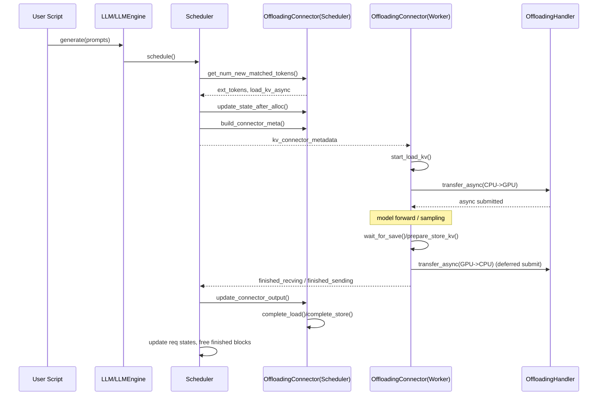

#### 初始化

vllmConfig.\_\_post_init\_\_()会初始化KVTransferConfig，然后在scheduler/worker侧根据kv_connector类型实例化对应的connector（KVConnectorFactory.create_connector）

对于offloading connector，首先初始化spec（OffloadingSpecFactory.create_spec）,spec会包含gpu_block_size、offloaded_block_size、OfflaodingManager信息，Manager又包含替换策略(lru/arc)等信息，然后用spec去初始化OffloadingConnectorScheduler/OffloadingConnectorWorker

#### 流程

1.  scheduler调度部分，首先调度running队列，然后调度waiting队列。对于num_computed_tokens==0的请求，进行prefix cache hit，如果hit了外部kv cache，则触发异步加载（load_kv_async=True），状态置为WAITING_FOR_REMOTE_KVS，然后调用connector.update_state_after_alloc，记录reqs_to_load。然后生成SchedulerOutput，再传给connector并build_connector_meta，记录reqs_to_load和reqs_to_store

2.  worker部分，先提交上一步延迟提交的store，再提交这一步的load，start load kv，forward结束后再wait for save，把本步的store变成待提交任务，最后汇总

流程图：

