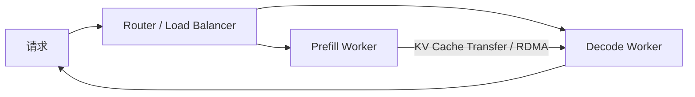
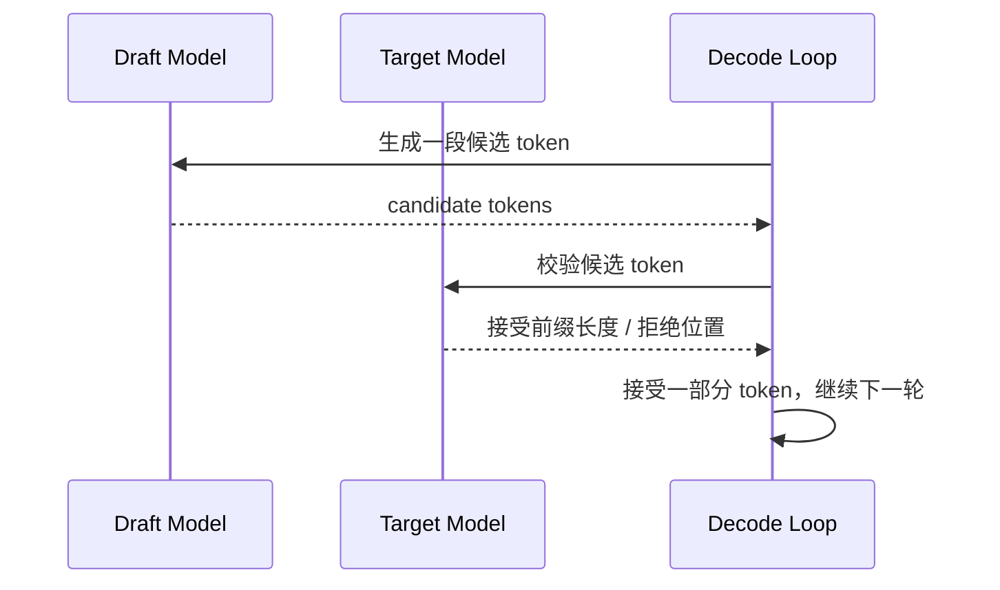
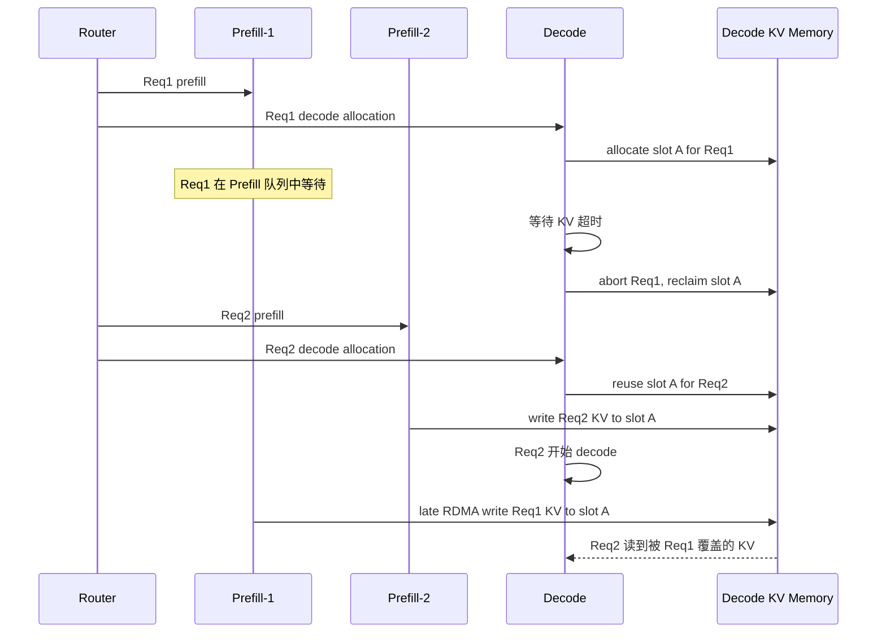
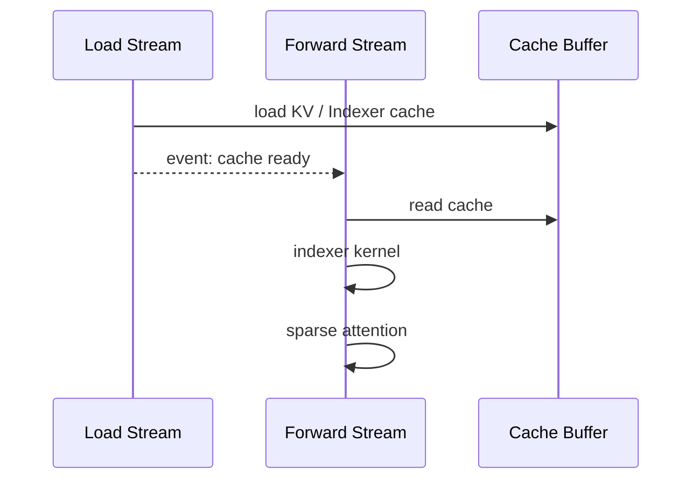
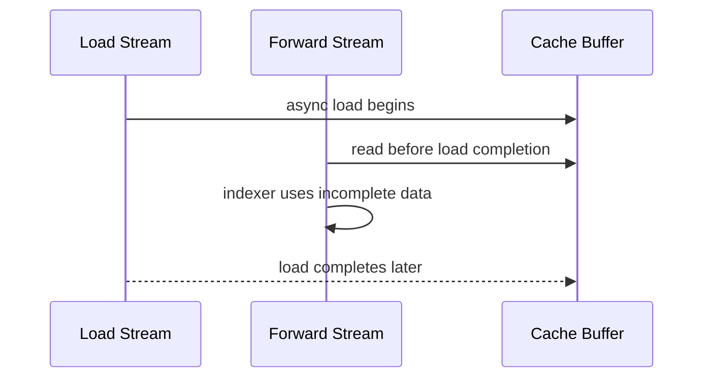
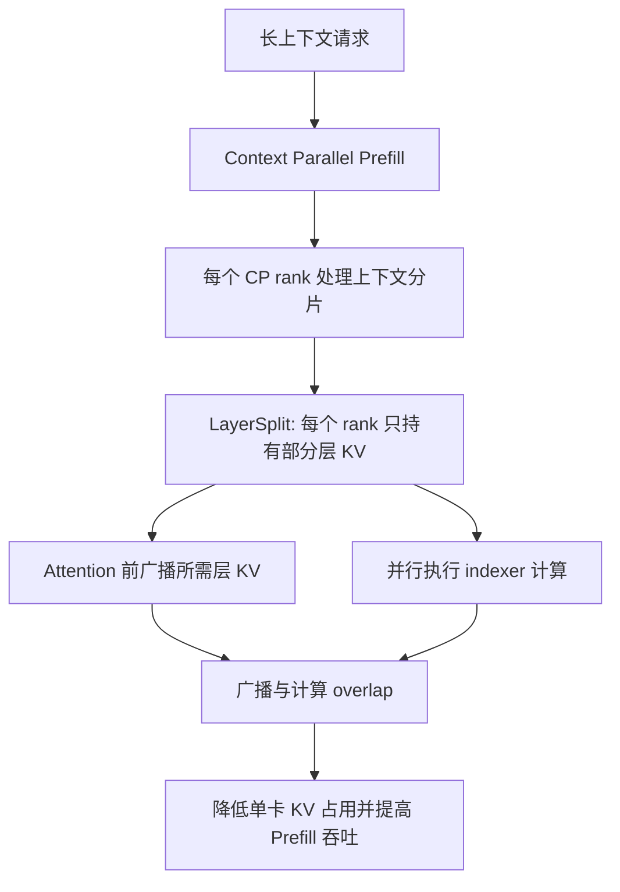
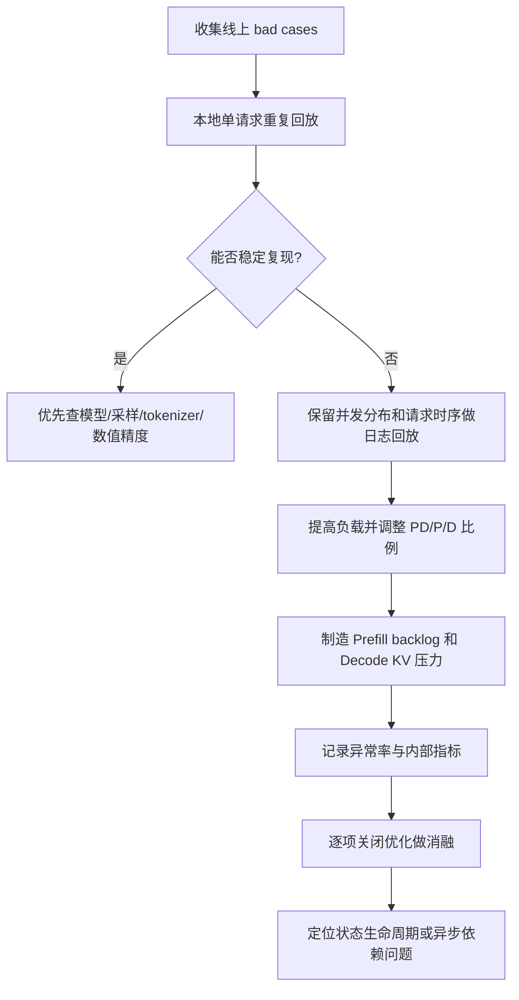

> 版本说明：本文写于 2026-06-29，主要解析 Z.ai 在 2026-04-30 发布的《Scaling Pain：超大规模 Coding Agent 推理实践》。原文披露的是 GLM-5 系列在高并发、长上下文 Coding Agent 线上负载中遇到的异常输出排查过程，包括 PD 分离下的 KV Cache 复用竞态、HiCache 加载时序缺失，以及 LayerSplit 优化。本文不是逐段翻译，而是从推理系统状态一致性、观测指标和工程设计角度做机制拆解。

## 1. 先说结论

这篇文章最重要的信息不是“GLM-5 曾经出现乱码、复读、生僻字”，而是：

**在超大规模 Coding Agent 推理中，输出质量已经不再只是模型问题，也可能是推理系统状态一致性问题。**

原文里几个关键现象放在一起看很有代表性：

1. 异常只在高并发、长上下文、Prefill/Decode 分离、KV Cache 压力较高时出现。
2. 同一批 bad case 离线重复推理数百次无法复现，说明它不像是模型对某些输入的稳定错误。
3. 当复现环境提高负载、模拟 Prefill 堆积和 Decode 侧 KV Cache 压力后，异常才以每万请求约 3-5 次的概率出现。
4. 异常形式包括乱码、复读、生僻字，看起来像模型“降智”，实际根因是底层竞态导致目标模型读到了错误或未就绪的 KV Cache。
5. 修复 PD 分离下的 KV 复用竞态后，异常率从约 0.1% 降到 0.03% 以下；修复 HiCache load-use ordering 后，对应时序问题引发的异常消失。

如果只记一句话：

**长上下文 Agent Serving 的核心挑战，是让每个 token 生成时看到的 KV Cache、scheduler 状态、跨节点传输状态、异步 stream 状态，都精确对应同一个逻辑请求。任何一次错配，都可能表现成模型质量问题。**

这也是“Scaling Pain”的真实含义：规模上去以后，原来概率很低、压测很难碰到、单机复现不存在的竞态，会被线上请求量和复杂负载放大成用户可感知的问题。

## 2. 原文讲了什么

原文围绕三条线展开：

1. **异常识别**：如何发现乱码、复读、生僻字不是模型本身的稳定错误，而是与系统压力相关。
2. **两个 BugFix**：一个来自 PD 分离架构下的 KV Cache 复用竞态，另一个来自 HiCache 异步加载缺少显式同步。
3. **一个优化**：LayerSplit，用按层切分 KV Cache 的方式缓解 Prefill 侧显存压力，提高长上下文高命中场景的吞吐。

可以把这篇文章理解成一份线上事故复盘，但它比普通事故复盘更有价值，因为它触及了 LLM Serving 系统里一个很容易被低估的问题：

```text
模型输出异常
  不一定来自采样参数
  不一定来自量化误差
  不一定来自模型能力不足
  也可能来自 KV Cache 状态被错误复用、覆盖、提前读取
```

在传统 Web 服务里，“状态错了”常常表现为返回错用户数据、读到旧版本、重复扣费。LLM 推理服务里的状态错了，表面上可能更隐蔽：模型继续吐 token，但 token 分布已经被污染，最终表现为乱码、复读、怪字或语义崩坏。

## 3. 先补背景：为什么 Coding Agent 会把推理系统逼到边界

Coding Agent 和普通聊天最大的差异，不只是“模型更强”，而是请求形态完全不同。

普通对话请求常见特征是：

1. Prompt 相对短。
2. 单次生成可以独立处理。
3. 上下文复用有价值，但不是每个请求都巨大。
4. Prefill 压力和 Decode 压力相对容易平衡。

Coding Agent 请求则不同：

1. 上下文很长，系统提示词、仓库文件、diff、工具调用历史、错误日志会不断塞进 prompt。
2. 多轮链路长，一个用户任务可能拆成几十次甚至上百次模型调用。
3. 前缀复用率高，因为同一个仓库、同一段工具说明、同一批文件会被反复使用。
4. 请求到达和输出长度更不稳定，线上调度更容易出现局部拥塞。
5. Prefill 成本极高，长上下文下 TTFT 往往被 Prefill 排队和计算主导。

原文提到，Coding Agent 负载的输入长度平均超过 70K tokens，并且线上每天承受数亿次 Coding Agent 调用。这个规模下，许多小概率问题都会被放大。

举一个数量级例子：

```text
如果某个竞态在高压场景下概率是 0.03%
每天 100,000,000 次请求
理论上每天仍可能有 30,000 次请求暴露异常
```

所以在大规模推理里，“低概率”不能自动等于“不重要”。关键要看请求量、用户可见性、异常是否会破坏信任，以及是否能被自动检测和恢复。

## 4. Prefill、Decode、KV Cache 与 PD 分离

理解原文需要先把推理阶段拆开。

对 decoder-only Transformer 来说，请求大致分两段：

1. **Prefill**：处理输入 prompt，一次性计算所有 prompt token 的 KV Cache。
2. **Decode**：逐 token 生成，每一步读取历史 KV Cache，再追加新 token 的 KV。

KV Cache 的作用是避免每生成一个 token 都重新计算所有历史 token 的 Key/Value。长上下文下，KV Cache 很大，生命周期也很复杂。

一个简化公式是：

$$
\mathrm{KVSize} \approx 2 \times L \times T \times H_{kv} \times B
$$

其中：

1. $2$ 表示 Key 和 Value。
2. $L$ 是层数。
3. $T$ 是 token 数。
4. $H_{kv}$ 是 KV hidden size。
5. $B$ 是单个元素字节数。

当 $T$ 从 4K 增加到 70K、120K 时，KV Cache 不再是一个简单的临时 buffer，而会变成调度、复用、迁移、回收都很复杂的系统资源。

PD 分离，即 Prefill/Decode disaggregation，通常是把 Prefill 和 Decode 放到不同 worker 或不同节点上：



这样做的原因是 Prefill 和 Decode 的资源画像不同：

1. Prefill 更像大 batch、大矩阵乘，吞吐导向。
2. Decode 更像小步迭代、延迟敏感。
3. 把两类负载分开，有利于独立扩缩容、减少互相干扰。

但 PD 分离带来的代价是：

1. 请求生命周期跨越多个节点。
2. KV Cache 需要跨节点传输。
3. Decode 侧的显存 slot 可能比 Prefill 侧更早释放。
4. Abort、timeout、retry、RDMA completion、cache reuse 之间必须有严格协议。

这正是第一个 Bug 的背景。

## 5. 异常为什么难复现

原文的排查过程非常典型：

1. 线上监控和用户反馈发现三类异常：乱码、复读、生僻字。
2. 本地回放用户 bad case，多次重复请求，无法复现。
3. 保留线上并发分布和请求时序，做脱敏后的全量回放，仍然不能稳定复现。
4. 调整 PD 分离比例，提高系统负载，模拟高峰期 Prefill backlog 和 Decode 侧 KV 压力后，异常开始出现。

这里可以抽象出一个判断：

```text
如果异常对输入内容稳定复现
  更可能是模型、prompt、tokenizer、采样参数或确定性计算问题

如果异常对输入内容不稳定，但随并发、压力、队列、显存复用改变
  更可能是调度、状态管理、异步执行、内存生命周期问题
```

这类问题难复现有几个原因：

1. **触发条件是组合条件**：长上下文、高并发、特定 PD 比例、Prefill 排队、Decode 侧 KV 压力、Abort 时机、RDMA 写入未完成等条件必须叠加。
2. **错误窗口很短**：真正出错的是某个 KV slot 从旧请求切换到新请求的短时间窗口。
3. **症状滞后**：内存被覆盖发生在 KV 写入时，但用户可见异常可能在几十或几百个 decode step 后出现。
4. **输出非结构化**：乱码和生僻字不像 HTTP 500 那样容易打点统计。
5. **重试会掩盖问题**：如果线上有自动 retry，用户最终可能拿到正常答案，但底层异常仍然存在。

所以这类排查不能只靠“拿 bad prompt 离线跑一遍”。更可靠的方法是还原线上调度压力、请求时序、资源分配、cache 命中和 abort 行为。

## 6. 用投机采样指标做异常检测

原文最有意思的一个点，是他们把 Speculative Decoding 的指标用于输出异常检测。

投机采样本来是性能优化：



它的核心假设是：draft model 与 target model 对下一个 token 的分布有足够一致性。只要 target model 接受 draft 的候选 token，就能一次推进多个 token，从而减少 target model 调用次数。

原文观察到两个异常信号：

1. **乱码和生僻字**：通常伴随极低的 `spec_accept_length`，也就是目标模型几乎不接受草稿模型候选 token。
2. **复读**：通常伴随很高的 `spec_accept_rate`，暗示注意力状态可能退化到一种高置信重复循环。

他们进一步给出了在线策略：

1. 当生成长度超过 128 token 后，如果 `spec_accept_length` 持续低于 1.4，则中止当前生成并重试。
2. 如果 `spec_accept_rate` 超过 0.96，也中止当前生成并交给负载均衡器重试。

这件事的意义不只是“找到了两个阈值”，而是说明推理系统可以从已有性能指标中挖出质量信号。

可以把它理解成：

```text
正常情况下：
  draft KV state 与 target KV state 大体一致
  target 对 draft 候选有合理接受率

异常情况下：
  target 读到的 KV state 被污染或错配
  draft 与 target 的分布关系突然失真
  spec decoding 接受模式出现极端值
```

这里有一个很重要的工程启发：**不要把性能指标和质量指标完全割裂。** 对 LLM Serving 来说，某些性能指标的异常形态可能正好暴露了状态一致性问题。

当然，这种检测也有边界：

1. 它依赖系统启用了投机采样。
2. 阈值可能和模型、draft 模型质量、采样参数、任务类型有关。
3. 它更像异常缓解和排查工具，不是根因修复。
4. 极端任务本身也可能导致低接受率或高接受率，需要结合误报成本做策略。

## 7. BugFix #1：PD 分离下的 KV Cache 复用竞态

第一个 Bug 可以概括成一句话：

**Decode 侧以为旧请求已经结束，于是回收并复用了 KV Cache slot；但 Prefill 侧旧请求的 RDMA 写入还没有结束，最终旧请求数据覆盖了新请求的 KV Cache。**

原文里的时序可以抽象成下面这样：



这个 Bug 的本质是生命周期协议不完整。

Decode 侧做了两件看似合理的事：

1. Req1 超时，触发 Abort。
2. 为了控制显存占用，回收 Req1 的 KV slot 并分配给 Req2。

Prefill 侧也做了一件看似合理的事：

1. 继续执行已经排队或已经发起的 Prefill/RDMA 写入。

问题在于，系统缺少一个跨节点的“可安全回收”协议。Decode 的 abort 并不等于：

1. Prefill 已停止。
2. Prefill 已知道 abort。
3. 已发起 RDMA write 已完成。
4. 未来不会再有旧请求写入该地址。

在分布式系统里，这相当于把内存 slot 的 ownership 转移提前了。

正确协议应该更像：

```text
Decode: 我要 abort Req1，并准备回收 slot A
Prefill: 我确认 Req1 没有未完成写入，或所有写入都已完成
Decode: 收到确认后，slot A 才能进入 free list
Decode: slot A 可以重新分配给 Req2
```

原文修复方案正是建立这个时序约束：

1. Decode 触发 Abort 后通知 Prefill。
2. Prefill 只有在 RDMA 写入尚未开始，或所有已提交写入都完成后，才返回可释放信号。
3. Decode 收到确认后才允许回收并复用对应 KV slot。

可以把它理解成 KV Cache 版本的 RCU/epoch 问题：释放一个资源前，要证明所有旧读写者都已经离开对应 critical section。

### 7.1 为什么这个 Bug 会表现成乱码、复读、生僻字

KV Cache 被覆盖后，模型并不会一定崩溃。GPU 仍然读到合法地址，tensor shape 也可能完全正确，kernel 也能正常执行。问题是语义错了：

```text
Req2 的第 20 层、第 50000 个 token 的 K/V
  被 Req1 的某个 token 的 K/V 覆盖
```

Attention 仍然能算，但 attention 的历史记忆已经混入另一个请求。模型看到的上下文变成一种不可解释的拼接状态：

1. 当前 token embedding 属于 Req2。
2. 部分历史 KV 属于 Req2。
3. 部分历史 KV 可能属于 Req1。
4. 不同层、不同 block 的污染程度还可能不同。

这种错误不会稳定对应某个 prompt，所以它不容易离线复现。它也未必产生 NaN 或 CUDA error，所以常规健康检查看不出来。最终最明显的症状就是输出分布异常。

### 7.2 这个问题对系统设计的启示

如果一个推理系统支持 PD 分离、KV transfer、timeout abort、retry、显存 slot 复用，那么至少需要明确这些状态：

| 状态 | 含义 |
|---|---|
| Allocated | Decode 侧为请求分配了 KV slot |
| PrefillQueued | Prefill 请求已经入队，但可能未开始计算 |
| WriteIssued | Prefill 已经发起 KV 写入 |
| WriteCompleted | 已发起写入已经完成 |
| AbortRequested | Decode 或上游要求终止请求 |
| AbortObserved | Prefill 已观察到 abort |
| SafeToReclaim | 不存在旧请求对该 slot 的未来写入 |
| Reusable | slot 可以进入 free list 并分配给新请求 |

真正危险的是把 `AbortRequested` 当成 `SafeToReclaim`。这在单进程同步代码里可能不明显，在跨节点异步 RDMA 场景下会成为严重竞态。

## 8. BugFix #2：HiCache 加载时序缺失

第二个 Bug 属于另一类状态一致性问题：

**计算 stream 在数据 load stream 完成之前就读取了 cache，导致 read-before-ready。**

HiCache 是 hierarchical KV caching，也就是把 KV Cache 从单纯 GPU 显存扩展到 CPU 内存、磁盘或远端存储等层级。它的目标是提高长上下文和高前缀复用场景下的 cache 命中率，减少重复 Prefill。

SGLang 官方文档对 HiCache 的定位是：在传统 RadixAttention 基础上加入多级 KV caching，用 GPU、host memory 和外部后端缓解缓存容量瓶颈。

为了性能，HiCache 不可能所有事情都串行执行。常见设计是：

1. Load Stream 负责从 CPU 或其他层级把 KV/Indexer cache 搬回 GPU。
2. Forward Stream 负责执行 indexer 计算和 attention。
3. 两条 stream 尽量 overlap，以隐藏数据搬运开销。

理想时序是：



原始问题是缺少 `cache ready` 这个显式依赖。于是实际可能变成：



这就是 read-before-ready。

从 CUDA stream 角度看，两个 stream 之间默认没有全序关系。你在 Load Stream 上发起 memcpy 或 kernel，不代表 Forward Stream 上后续 kernel 会自动等待它完成。除非显式使用 event、counter、barrier 或框架内的同步原语，否则“代码顺序”不等于“GPU 执行顺序”。

原文提到，修复是在 Indexer 算子启动前加入与 Load Stream 的同步点，确保对应层级的 Indexer Cache 已完成加载。这个修复已经提交到 SGLang 社区的 PR #22811。

该 PR 的变更也能印证这个方向：它在 NSA/DSA attention 相关路径里，为 HiCache L2 场景加入了对 `layer_transfer_counter.wait_until(...)` 的等待，避免 index buffer 在数据传输完成前被使用。

### 8.1 为什么 HiCache 更容易暴露时序问题

GPU-only cache 的时序相对简单：KV 通常在同一个执行路径里产生并使用。HiCache 引入更多异步边界：

1. GPU 与 CPU 之间的数据搬运。
2. CPU、磁盘、远端后端之间的层级选择。
3. cache hit/miss 后的不同路径。
4. prefetch、swap-in、write-back 的异步执行。
5. 多 rank 或多 stream 下的依赖传播。

这些优化都很必要，但每引入一个异步边界，就要补一个明确的可见性和完成性协议。

工程上最危险的写法是：

```text
发起 load
假设稍后 compute 时 load 已经完成
```

更稳妥的写法是：

```text
发起 load
记录 load completion event / counter
compute 前等待对应层、对应 cache block、对应版本的 event
```

注意这里等待的粒度也很重要。粗粒度全局同步容易牺牲性能，细粒度同步容易实现复杂。高性能推理系统的难点就在于：**既要 overlap，又要证明 use-before-ready 不会发生。**

## 9. LayerSplit：把 KV Cache 按层切分

两个 Bug 修完后，原文回到性能瓶颈本身：Prefill 侧压力太大。

长上下文 Coding Agent 场景里，Prefill 往往主导 TTFT。为了提高 Prefill 吞吐，线上会使用 Context Parallelism，也就是把长上下文维度切给多个 rank 协同计算。

但原文指出，现有 SGLang 开源实现存在 KV Cache 冗余存储问题：每张 GPU 可能保存全部层的 KV Cache，导致单卡 KV 容量成为 GPU 利用率瓶颈。

LayerSplit 的核心思路是：

**每张 GPU 不再保存所有层的 KV Cache，而是只保存部分层的 KV Cache。**

可以粗略理解成：

```text
原始方式：
  GPU0: layer 0..N 的 KV
  GPU1: layer 0..N 的 KV
  GPU2: layer 0..N 的 KV
  GPU3: layer 0..N 的 KV

LayerSplit：
  GPU0: layer 0..k 的 KV
  GPU1: layer k..2k 的 KV
  GPU2: layer 2k..3k 的 KV
  GPU3: layer 3k..N 的 KV
```

这样能显著降低单卡 KV Cache 占用。代价是计算某一层 attention 时，持有该层 KV 的 rank 需要把 cache 广播给其他相关 rank。

原文的关键优化是 overlap：

1. 持有某层 KV Cache 的 rank 在 attention 前广播 cache。
2. KV Cache 广播与 indexer 计算重叠。
3. 最终主要额外开销变成 Indexer Cache 广播。
4. Indexer Cache 规模约为 KV Cache 的 1/8，因此通信成本相对可控。

一个简化流程：



原文给出的结果是：在 90% cache hit rate、请求长度 40K 到 120K 的条件下，LayerSplit 为 GLM-5.1 带来 10% 到 132% 的吞吐提升，且上下文越长收益越明显。

这个结果符合直觉：

1. 上下文短时，KV 容量压力不一定是主瓶颈，引入通信的收益有限。
2. 上下文越长，KV 占用越大，单卡容量越容易限制 batch 和吞吐。
3. 高 cache hit 让复用价值更高，减少冗余存储更容易转化为吞吐收益。
4. 如果通信能被 indexer 计算隐藏，LayerSplit 的额外成本就更可控。

## 10. LayerSplit 的取舍

LayerSplit 不是无条件收益。它适合的是“KV 容量压力明显、长上下文、高 prefix hit、CP 已经是主要 Prefill 策略”的场景。

它的收益来自：

1. 降低每张 GPU 持有的 KV Cache 层数。
2. 释放显存后可以容纳更多 cache 或更大 batch。
3. 降低 Prefill 侧因 KV 容量不足导致的调度限制。
4. 长上下文下收益随 KV 占用放大。

它的成本来自：

1. 多 rank 间需要额外广播。
2. 需要保证广播数据与计算层、token 范围、cache 版本一致。
3. overlap 做不好时，通信会进入 critical path。
4. 错误的同步或版本管理会引入新的状态一致性风险。

因此实际落地时，至少要观察这些指标：

| 指标 | 关注点 |
|---|---|
| TTFT | Prefill 排队和计算是否下降 |
| Prefill throughput | 单位时间完成多少 prompt token |
| GPU memory utilization | KV 容量是否仍是瓶颈 |
| CP communication time | KV/Indexer 广播是否进入关键路径 |
| cache hit rate | 命中率低时 LayerSplit 收益会变弱 |
| anomaly rate | 新的异步广播和复用路径是否引入正确性问题 |

一个容易误判的地方是只看吞吐，不看质量异常。原文前半部分已经说明，推理系统优化如果破坏状态一致性，最后会以输出质量问题的形式还回来。

## 11. 这篇文章真正暴露的系统边界

把两个 Bug 和一个优化放在一起看，会发现它们都指向同一个主题：

**LLM 推理系统正在从“执行模型计算”变成“管理分布式模型状态”。**

这个状态包括：

1. 请求生命周期状态。
2. KV Cache block 的 ownership。
3. Prefill 和 Decode 的跨节点协议。
4. RDMA write completion。
5. GPU stream 上 load 与 compute 的依赖。
6. HiCache 多级存储里的 cache block readiness。
7. Context Parallel ranks 之间的广播版本。
8. Abort、retry、timeout 对所有下游状态的传播。

传统推理 benchmark 常常关注：

1. tokens/s。
2. TTFT。
3. TPOT。
4. GPU utilization。
5. p50/p99 latency。

这些仍然重要，但在大规模 Agent Serving 下还不够。还需要系统级正确性指标：

1. KV slot 被复用前是否不存在未完成旧写入。
2. 每次 attention 读取的 KV 是否属于当前请求、当前版本、当前 layer。
3. 每个异步 load 是否在 use 前完成。
4. Abort 是否传播到所有会继续写状态的组件。
5. Retry 是否会和旧请求残留状态冲突。
6. Prefix cache 命中是否能证明语义等价，而不只是 hash 命中。

换句话说，推理系统需要的不只是性能 profiler，还需要状态一致性审计。

## 12. 可以抽象出的工程原则

### 12.1 Abort 不是完成

Abort 只是一个意图，不是一个事实。

```text
Abort requested != compute stopped
Abort requested != DMA stopped
Abort requested != remote worker observed abort
Abort requested != memory reusable
```

任何会释放资源的路径，都应该等待一个明确的完成条件。

### 12.2 Free list 前必须有安全点

KV Cache slot 进入 free list 之前，系统要能回答：

1. 是否还有旧请求会写这个 slot？
2. 是否还有旧请求的 RDMA write in-flight？
3. 是否还有旧请求的 CUDA kernel 持有指针？
4. 是否还有异步 callback 会在未来访问它？
5. 是否有版本号或 generation counter 防止 ABA 问题？

如果回答不了，就不应该复用。

### 12.3 Stream overlap 必须配套显式依赖

Load Stream 和 Forward Stream 重叠是性能优化，但跨 stream 默认没有依赖。每个 read-before-ready 风险点都需要明确同步。

常见工具包括：

1. CUDA event。
2. stream wait event。
3. per-layer counter。
4. per-block readiness bitmap。
5. graph capture 中显式依赖边。
6. 框架层面的 async handle。

不要依赖“这段代码通常来得及”。

### 12.4 质量监控要接入推理内部信号

只看用户最终输出，很难定位底层系统问题。原文利用 `spec_accept_length` 和 `spec_accept_rate` 是一个很好的例子。

类似可以考虑的内部信号还有：

1. prefix cache hit/miss pattern 是否异常。
2. 每层 attention score 分布是否突变。
3. KV block checksum 或 lightweight fingerprint。
4. retry 前后的输出差异。
5. decode entropy 是否异常坍缩。
6. draft/target divergence 是否突然变大。

这些指标未必都适合线上常开，但在灰度、压测、回放和消融实验中非常有价值。

### 12.5 高性能优化要同时设计回滚与降级

当系统检测到可能的状态异常时，原文采取了中止生成并交给负载均衡器重试的策略。这是一种实用的 fail-safe。

更完整的策略可以包括：

1. 对异常请求禁用某些高风险优化后重试。
2. 对可疑 worker 做局部摘除或降低流量。
3. 对高异常率模型版本或配置自动回滚。
4. 在压力过高时收紧 abort/reuse 策略，牺牲部分吞吐换正确性。
5. 对特定租户或任务类型启用更保守的 cache 复用策略。

大规模系统里，正确性问题不能只靠“修完 Bug”。还要有检测、隔离、降级和恢复闭环。

## 13. 和常见“模型降智”问题的区别

线上用户看到乱码、复读、生僻字时，很容易归因到模型质量下降。实际上至少有几类不同根因：

| 类别 | 特征 | 常见排查方向 |
|---|---|---|
| 模型能力问题 | 对相似输入稳定失败 | 数据、训练、对齐、prompt |
| 采样配置问题 | 与 temperature、top_p、penalty 强相关 | decoding 参数 |
| 数值精度问题 | 与量化、低精度 kernel、特定 shape 相关 | 精度回归、kernel diff |
| Tokenizer/文本后处理问题 | 特定字符、编码、stop words 异常 | tokenizer 和 detokenizer |
| 推理状态问题 | 与压力、并发、cache、abort、调度相关 | KV 生命周期、异步同步、复现压测 |

Z.ai 这篇文章属于最后一类。它提醒我们：当系统越来越复杂时，“模型输出”已经是模型、runtime、scheduler、memory manager、network transfer、cache layer 共同作用的结果。

## 14. 如何复现和验证这类问题

如果要在自己的推理系统里排查类似问题，建议不要只做单 prompt 回放，而是设计压力复现实验。

一个更接近原文思路的流程：



验证修复时，最好覆盖这些场景：

1. Prefill 排队时间很长，Decode 超时 abort。
2. Abort 后立即有新请求复用同一类 KV slot。
3. RDMA write 延迟或乱序完成。
4. HiCache swap-in 与 forward 高度 overlap。
5. Prefix hit rate 很高，cache block 大量复用。
6. 高并发下重复运行足够请求量，至少达到能观察原异常概率的规模。

此外，建议为 KV Cache 加一些 debug-only 检查：

1. KV slot generation id。
2. request id 到 KV block 的映射日志。
3. RDMA write issue/complete trace。
4. load stream event 与 compute stream wait trace。
5. cache block ready bit。
6. abort propagation latency。

这些检查不一定适合生产常开，但对复现竞态很有帮助。

## 15. 对推理系统开发者的实践清单

如果你的系统也在做长上下文、PD 分离、KV offload、prefix cache 或 speculative decoding，可以用下面的问题自查。

### 15.1 KV 生命周期

1. KV block 分配、pin、unpin、free 是否有明确状态机？
2. free 前是否等待所有旧请求读写完成？
3. 是否有 generation counter 防止旧异步任务写入新请求 block？
4. Abort 是否能传递到所有 Prefill、transfer、cache backend？
5. Retry 是否会复用旧请求残留状态？

### 15.2 跨节点传输

1. RDMA write completion 是否被纳入资源回收条件？
2. 远端写入地址是否可能在 completion 前被复用？
3. 网络超时和请求超时是否是两个不同状态？
4. Prefill 侧是否能返回 safe-to-reclaim，而不是只接收 best-effort abort？

### 15.3 多 stream 执行

1. load stream 与 compute stream 是否有显式依赖？
2. 每个 layer/cache level 的 readiness 是否独立追踪？
3. overlap 是否经过 race stress test？
4. CUDA graph、event、counter 在异常路径上是否仍然生效？

### 15.4 观测与恢复

1. 是否有输出异常的自动检测指标？
2. 是否能把异常关联到 worker、cache backend、PD pair、特定优化开关？
3. 是否能按请求追踪 KV block 生命周期？
4. 是否有自动 retry、降级或摘除机制？
5. 是否能在灰度阶段比较异常率，而不只是比较吞吐和延迟？

## 16. 我的理解：Scaling Pain 是“隐含假设失效”

这篇文章里的两个 Bug 本质上都是隐含假设失效。

第一个隐含假设：

```text
Decode 侧 abort 后，旧请求不会再写对应 KV slot。
```

在线上 PD 分离和 RDMA 异步写入下，这个假设不成立。

第二个隐含假设：

```text
Load Stream 发起加载后，Forward Stream 使用时数据已经准备好。
```

在多 stream overlap 下，这个假设也不成立。

LayerSplit 则是另一个方向：原来的隐含假设是“每张 GPU 保存所有层 KV 虽然浪费，但足够简单”。当上下文长度、cache hit rate 和 Prefill 压力继续增长时，这个假设变得昂贵，于是系统需要更复杂的分层/分片策略。

规模化的过程，就是不断把隐含假设变成显式协议：

```text
隐含顺序  -> 显式同步
隐含所有权 -> 显式状态机
隐含完成  -> completion signal
隐含正常  -> 质量与内部指标监控
隐含可复用 -> safe-to-reclaim 协议
```

这也是为什么 Serving Infra 越来越像分布式存储系统和高性能 runtime 的结合体。它不只是把模型跑快，还要保证每次生成读到的状态就是它应该读到的状态。

## 17. 总结

Z.ai 这篇《Scaling Pain》值得反复看，因为它把大规模 Coding Agent 推理中最难的一类问题讲清楚了：**输出质量异常可能来自推理系统内部状态错配，而不是模型本身。**

几个核心 takeaway：

1. 长上下文、高并发、PD 分离、KV offload 会把小概率竞态放大成线上质量问题。
2. Speculative Decoding 的接受指标可以作为异常检测信号，用于发现 KV 状态错配。
3. PD 分离下，Abort 不等于 KV slot 可复用；必须等待 Prefill/RDMA 写入进入 safe-to-reclaim 状态。
4. HiCache 这类多级缓存优化必须显式处理 load-use ordering，否则 overlap 会变成 read-before-ready。
5. LayerSplit 通过按层切分 KV Cache 缓解 Prefill 侧显存压力，在长上下文高命中场景中收益明显，但也带来新的通信和同步复杂度。
6. 未来 LLM Serving 的竞争不只是模型吞吐，而是性能、成本、状态正确性和可观测性的综合能力。

如果把 Scaling Law 看成模型能力增长的外部驱动力，那么 Scaling Pain 就是系统工程必须补上的内部账。模型越强、上下文越长、Agent 调用越密集，推理基础设施越需要像数据库和分布式系统一样严肃地处理一致性问题。

## 参考

1. Z.ai, [Scaling Pain of Coding Agent Serving: Lessons from Debugging GLM-5 at Scale](https://z.ai/blog/scaling-pain), 2026-04-30.
2. SGLang Pull Request, [Fix for the low-probability garbled output issue in the GLM-5 series models #22811](https://github.com/sgl-project/sglang/pull/22811).
3. SGLang Documentation, [HiCache System Design and Optimization](https://docs.sglang.io/docs/advanced_features/hicache_design).
4. SGLang Documentation, [SGLang HiCache Best Practices](https://docs.sglang.io/docs/advanced_features/hicache_best_practices).
5. LMSYS Blog, [SGLang HiCache: Fast Hierarchical KV Caching with Your Favorite Storage Backend](https://www.lmsys.org/blog/2025-09-10-sglang-hicache/).
